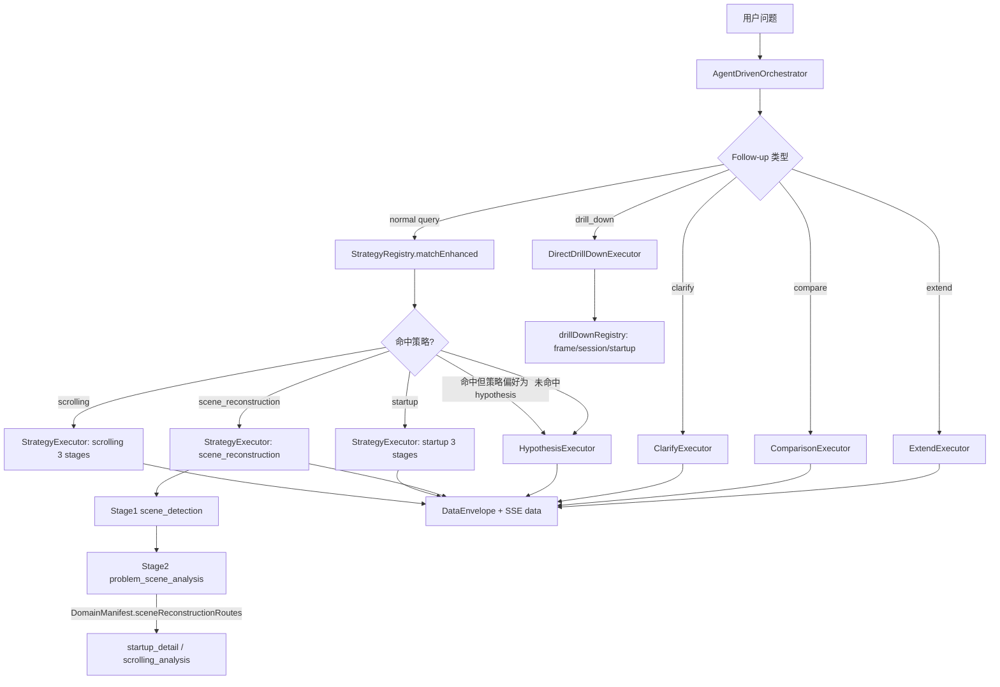

# SmartPerfetto 架构（目标驱动 Agent 版）

本文档描述 SmartPerfetto 在当前代码中的真实架构（以 `backend/src/agent/` 为主），目标是让系统从“pipeline + LLM 胶水”升级为“目标驱动的 Agent”：围绕用户目标形成 **假设空间 → 实验 → 证据 → 结论 → 下一步** 的闭环，并且多轮对话下不会遗忘已做过的事。

> 更新日期：2026-02-10（与 `backend/src/agent/` 当前实现对齐）
> 重要约束：所有 memory/状态必须 **严格 trace-scoped**（同一 `(sessionId, traceId)`），禁止跨 trace 泄漏。

---

## 0. 设计目标（为什么要改）

- **目标驱动**：先明确用户想回答的核心问题（Goal），再围绕可检验的机制假设（Hypotheses）规划实验（Experiments）。
- **证据优先**：每个结论都能回溯到可引用证据（skills 的表格/摘要、Finding、Evidence digest），而不是“语言模型感觉如此”。
- **矛盾与不确定性**：显式呈现证据冲突、反例与缺口，并选择最有信息增益的下一步实验。
- **多轮对话不遗忘**：每轮都把“已做过的实验/结论/证据摘要/用户偏好”以紧凑方式注入到 LLM（同一 trace）。
- **自主但可控**：当预置 skill 不够用时，允许动态生成/验证/修复 SQL；同时有 circuit breaker、预算、干预点保证安全与可控成本。

---

## 1. 端到端数据流（大图）

```
┌────────────────────────────────────────────────────────────────────────────┐
│ Frontend (Perfetto UI Plugin)                                               │
│ - 聊天面板 / SQL 结果表 / 时间戳跳转 / Focus 交互 / Intervention 面板         │
└───────────────┬────────────────────────────────────────────────────────────┘
                │ HTTP + SSE
                ▼
┌────────────────────────────────────────────────────────────────────────────┐
│ Backend (Node.js/Express)                                                   │
│ routes/agentRoutes.ts                                                       │
│ └── runAgentDrivenAnalysis() + AgentDrivenOrchestrator.analyze()           │
│                                                                            │
│  ┌──────────────────────────────────────────────────────────────────────┐  │
│  │ AgentDrivenOrchestrator (Thin Coordinator)                            │  │
│  │ - trace-scoped SessionContext / TraceAgentState / EntityStore          │  │
│  │ - Follow-up + Drill-down resolve + Incremental scope                   │  │
│  │ - FocusStore + InterventionController + AnalysisPlan                   │  │
│  │ - Executor 路由 + Conclusion 生成                                      │  │
│  └──────────────────────────────────────────────────────────────────────┘  │
│          │                             │                                    │
│          │ Task Graph / Direct Skill   │ Trace SQL RPC                      │
│          ▼                             ▼                                    │
│  ┌──────────────────────────────┐   ┌─────────────────────────────────┐     │
│  │ Domain Agents + DirectSkill   │   │ trace_processor_shell           │     │
│  │ - Think/Act/Reflect           │   │ - Perfetto SQL engine           │     │
│  │ - Skills as tools             │   └─────────────────────────────────┘     │
│  │ - 动态 SQL 生成/验证/修复     │                                           │
│  └───────────────┬──────────────┘                                           │
│                  ▼                                                          │
│  ┌──────────────────────────────────────────────────────────────────────┐  │
│  │ Skill Engine + Data Contract                                          │  │
│  │ - atomic/composite/iterator/diagnostic                               │  │
│  │ - DataEnvelope (v2) + schema-driven columns                           │  │
│  │ - EmittedEnvelopeRegistry 去重 + SSE data 事件输出                    │  │
│  └──────────────────────────────────────────────────────────────────────┘  │
└────────────────────────────────────────────────────────────────────────────┘
```

---

### 1.1 领域策略分流（Scrolling 与 Startup）

当前版本中，`scrolling/startup/scene_reconstruction` 均走 staged strategy；同时存在 follow-up 专用执行器（clarify/compare/extend/drill-down），并支持“命中策略但按 manifest 偏好回退 hypothesis loop”。



已确认的代码事实：
- `backend/src/agent/strategies/registry.ts` 当前注册 `scrolling`、`startup`、`scene_reconstruction_quick`、`scene_reconstruction`。
- `backend/src/agent/strategies/startupStrategy.ts` 定义了 `startup_overview -> launch_event_overview -> launch_event_detail` 三阶段，并在 Stage2 直达 `startup_detail`。
- `backend/src/agent/strategies/sceneReconstructionStrategy.ts` 的二阶段 task 由 `DomainManifest.sceneReconstructionRoutes` 动态构建（默认 startup/detail + non-startup/scrolling）。
- `backend/src/agent/config/drillDownRegistry.ts` 提供统一 `entity -> skill` 映射，`backend/src/agent/core/executors/directDrillDownExecutor.ts` 与 `backend/src/agent/core/drillDownResolver.ts` 复用。
- `backend/src/agent/config/domainManifest.ts` 控制策略执行偏好（`prefer_strategy` / `prefer_hypothesis`）与分析计划证据清单映射。

---

## 2. 核心模块（按职责分层）

### 2.1 Orchestrator：薄协调层（Thin Coordinator）

代码：`backend/src/agent/core/agentDrivenOrchestrator.ts`

- **只做协调，不做重逻辑**：初始化基础设施（MessageBus / Registry / CircuitBreaker 等），决定“怎么跑”，不做“具体怎么分析”。
- **多轮上下文入口**：通过 `sessionContextManager.getOrCreate(sessionId, traceId)` 获取 `EnhancedSessionContext`（严格 trace-scoped）。
- **状态与交互基础设施**：内置 `FocusStore`、`InterventionController`、`IncrementalAnalyzer`，并记录 `focus_updated` / intervention 事件。
- **偏好/预算映射**：
  - `config.maxRounds`：硬安全上限（防跑飞）
  - `config.softMaxRounds`：偏好预算（来自 `TraceAgentState.preferences.maxExperimentsPerTurn`），只在“结果已足够”时触发收敛
- **策略决策**：
  - `StrategyRegistry.matchEnhanced` 支持 keyword-first + LLM fallback
  - 通过 `DomainManifest.strategyExecutionPolicies` 决定命中策略后是否仍偏好 hypothesis loop
  - `blockedStrategyIds` 支持入口级策略禁用
- **执行器选择**：
  - `HypothesisExecutor`：目标驱动、可自适应循环（默认模式）
  - `StrategyExecutor`：匹配到策略时可走确定性 pipeline（仍保留，便于稳定产出）
  - Follow-up 特例：`ClarifyExecutor` / `ComparisonExecutor` / `ExtendExecutor` / `DirectDrillDownExecutor`
- **数据输出治理**：每轮创建 session-scoped `EmittedEnvelopeRegistry`，对 `DataEnvelope` 做去重后再发 SSE。
- **结论生成**：`generateConclusion(...)` 强制输出 `结论/证据链/不确定性/下一步` 四段（洞见优先）。

### 2.2 Executors：三类执行路径

#### A) HypothesisExecutor（Hypothesis + Experiments）

代码：`backend/src/agent/core/executors/hypothesisExecutor.ts`

循环结构（每轮默认 1 个实验/任务）：
1. `planTaskGraph(...)`：基于假设与信息缺口规划“最小信息增益”任务（实验）
2. `executeTaskGraph(...)`：下发给 Domain Agents 执行（skills 或动态 SQL）
3. `ingestEvidenceFromResponses(...)`：把 tool 输出压缩成可引用 evidence digest（TraceAgentState）
4. `synthesizeFeedback(...)`：综合更新 findings / hypotheses / gaps
5. `IterationStrategyPlanner.planNextIteration(...)`：决定 continue / deep_dive / pivot / conclude

预算模型：
- `maxRounds` 为硬上限；
- `softMaxRounds` 为偏好：到达后 **仅当** 置信度/发现足够时收敛，否则继续（最多到硬上限）。

#### B) StrategyExecutor（Deterministic Pipeline）

代码：`backend/src/agent/core/executors/strategyExecutor.ts`

- 仍按 strategy stages 执行（例如滚动 3 阶段：概览 → 会话 → 帧级）
- `maxRounds` 仅作为“硬安全 stage 上限”，不再等价于用户偏好预算
- 重要：也会把 `historyContext` 注入到 agent tasks，保证 pipeline 阶段不会“失忆”。
- 关键增强：
  - 支持 follow-up 预构建区间，跳过 discovery stage
  - `session_overview` 的帧表可延迟发射并绑定 `frame_analysis` 结果形成 expandableData
  - 汇总 `frameMechanismRecord` 并生成 jank cause summary（供结论引用）

#### C) Follow-up 专用执行器（Conversation / Drill-down）

代码：`backend/src/agent/core/executors/clarifyExecutor.ts`、`comparisonExecutor.ts`、`extendExecutor.ts`、`directDrillDownExecutor.ts`

- `ClarifyExecutor`：只解释已有证据，不新增 SQL 开销。
- `ComparisonExecutor`：统一口径后对比多个实体/区间。
- `ExtendExecutor`：基于 `EntityStore` 与 `FocusStore` 扩展未覆盖实体。
- `DirectDrillDownExecutor`：显式目标（frame/session/startup）直达 skill，并复用 `drillDownRegistry` + enrichment。

### 2.3 Conclusion Scene 模板链路（新）

代码：`backend/src/agent/core/sceneTemplateStore.ts`、`sceneTemplateValidator.ts`、`sceneRouter.ts`、`scenePolicy.ts`

- 模板来源是“内置 fallback + base YAML + override YAML”三层合并。
- 默认配置路径：`backend/skills/config/conclusion_scene_templates.base.yaml` 与 `backend/skills/config/conclusion_scene_templates.yaml`。
- 环境变量支持覆盖：
  - `SMARTPERFETTO_CONCLUSION_SCENE_TEMPLATE_PATH`（单文件）
  - `SMARTPERFETTO_CONCLUSION_SCENE_TEMPLATE_BASE_PATH`
  - `SMARTPERFETTO_CONCLUSION_SCENE_TEMPLATE_OVERRIDE_PATH`
- `sceneTemplateValidator` 做 schema/字段告警；`sceneRouter` 基于 intent+findings 选模板；`scenePolicy` 产出最终提示词片段。

---

## 3. 多轮对话与 Memory（短期 + 长期，且必须 trace-scoped）

### 3.1 EnhancedSessionContext（会话上下文）

代码：`backend/src/agent/context/enhancedSessionContext.ts`

持有：
- `turns`：每轮对话（query、intent、结论、findings）
- `EntityStore`：可 drill-down 的实体（frame/session）与“是否已分析”标记
- `workingMemory`：从结论中**确定性抽取**的语义摘要（降低“只看 last N turns”导致机械化）
- `TraceAgentState`：目标驱动 agent 的 durable 状态（见下）

关键 API：
- `generatePromptContext(maxTokens)`：生成紧凑上下文（目标/偏好、最近实验、证据摘要、最近 3 轮摘要等）
- `ingestEvidenceFromResponses(responses)`：把 tool 输出压缩成 evidence digest（可用于“证据链”）

### 3.2 TraceAgentState（目标驱动 durable state）

代码：`backend/src/agent/state/traceAgentState.ts`

用于让系统从“流水线结果”变成“可推理的 agent state”：
- `goal`：用户目标（可被 intent 逐步归一化）
- `preferences`：偏好（默认：中文、hypothesis+exp、结论+证据链、soft 实验预算）
- `experiments`：执行记录（每轮做了什么实验、是否成功、产出哪些证据）
- `evidence`：可引用证据摘要（digest + provenance）
- `contradictions`：矛盾/冲突（当前是脚手架，逐步增强）

**严格 scoping**：
- `migrateTraceAgentState` 会校验 `(sessionId, traceId)`，不接受跨 trace 的 snapshot。

### 3.3 “每一轮都要给 LLM 的东西”在哪里注入

- 任务规划：`planTaskGraph(..., hints.historyContext)`
- agent 执行：`BaseAgent.formatTaskContext()` 会把 `additionalData.historyContext` 注入提示词
- pipeline 任务：`StrategyExecutor` 同样注入 `historyContext`
- 结论生成：`generateConclusion(..., options.historyContext)`

这保证同一 trace 下，LLM 始终知道：
- 用户目标 / 偏好 / 预算倾向
- 已做过的实验与得到的证据摘要
- 已确认的 findings 与可引用实体（frame_id/session_id）

---

## 4. Skills（在新架构下需要怎样的“工具化”）

代码：`backend/src/services/skillEngine/*` 与 `backend/skills/**/*.skill.yaml`

### 4.1 Skills 的核心要求

- **稳定可复用**：输入/前置条件明确（`prerequisites.modules/tables`），缺表要可解释地跳过
- **证据可引用**：display 分层（overview/list/deep），diagnostic 规则携带证据字段
- **摘要可消费**：用 `synthesize:`（数据驱动）产出“洞见摘要”，减少 LLM 看大表的机械化复述

### 4.2 YAML 编写要点（推荐）

- `display.columns` 使用完整列定义（name/label/type/format），便于 UI 与 Evidence digest 提取 KPI。
- 在关键步骤加上：
  - `synthesize: { role: overview | list | clusters | conclusion, fields, insights }`
- diagnostic 规则尽量带 `evidence_fields`，否则会从 condition 自动提取数据源（best-effort）。

### 4.3 Skill Engine 支撑点（已实现）

- iterator 支持显式 `display.columns` 并能从 `item` 与嵌套的 `result` 中提取字段
- iterator 支持 `filter:`（best-effort），并记录 per-item 失败，便于 agent 做 SQL/参数修复
- `synthesize:` 支持对象配置（role/fields/insights/clusterBy/groupBy），并生成确定性的“洞见摘要” DisplayResult

---

## 5. 自主能力与安全边界

### 5.1 动态 SQL（生成/验证/修复）

代码：`backend/src/agent/agents/base/baseAgent.ts` + `backend/src/agent/tools/sqlGenerator.ts` + `backend/src/agent/tools/sqlValidator.ts`

- 当预置 skills 返回空/失败且目标明确时，Agent 可进入动态 SQL upgrade：
  - 生成 SQL → 静态验证（风险/表依赖）→ 执行 → 若失败尝试修复（有限次数）
- 安全点：
  - 有最大重试次数
  - validator 可拒绝高风险 SQL（策略可继续增强）

### 5.2 ADB 协作（默认只读）

代码：`backend/src/services/adb/*`

- 默认关闭或只读（取决于 mode 与 trace↔device 匹配）
- tool prompt 中明确约束：除非 full，否则不允许改变设备状态

### 5.3 CircuitBreaker + Intervention

- CircuitBreaker：防止某个 agent 连续失败拖垮全局
- InterventionController：在低置信度/歧义/超时等情况下请求用户选择方向（可扩展）

---

## 6. 对外可观测性（SSE 事件）

关键事件（部分）：
- `progress`：阶段/轮次进度（含 `analysis_plan`、`trace_config`、`task_scope_filtered` 等 phase）
- `data`：统一 DataEnvelope 数据流（表格/摘要/图表），用于前端 schema-driven 渲染
- `stage_transition`：strategy stage 切换（含 skip reason）
- `finding`：实时 findings 推送
- `degraded`：模块降级（fallback）
- `strategy_selected/strategy_fallback`：策略选择与回退原因
- `focus_updated`：用户/系统关注点更新（用于增量分析）
- `intervention_required/intervention_resolved/intervention_timeout`：用户干预闭环
- `analysis_completed`：最终结果（含 conclusion contract）
- `sql_generated/sql_validation_failed`：动态 SQL 路径观测点

---

## 7. 扩展指南（如何继续增强“像专家”）

- **矛盾检测**：把“证据冲突”从隐式变显式（写入 `TraceAgentState.contradictions`），让结论必须解释冲突。
- **实验选择策略**：把每个 skill 标注“能产出哪些证据”（capabilities），让 planner 在假设空间里做信息增益最大化。
- **用户偏好闭环**：偏好（输出视图、预算、关注点）进入 `TraceAgentState.preferences`，并在每轮 prompt 中显式呈现。
- **长期记忆**：目前严格 trace-scoped；若要跨 trace，需要显式用户授权 + 设计隔离（不建议默认开启）。

---

## 8. 深度文档（与代码对齐）

更详细的拆解与设计复盘在 `docs/architecture-analysis/`：
- `docs/architecture-analysis/README.md`
- `docs/architecture-analysis/01-agent-driven-orchestrator.md`
- `docs/architecture-analysis/02-multi-round-conversation.md`
- `docs/architecture-analysis/03-memory-state-management.md`
- `docs/architecture-analysis/04-strategy-system.md`
- `docs/architecture-analysis/05-domain-agents.md`
- `docs/architecture-analysis/06-scrolling-startup-optimization.md`
- `docs/architecture-analysis/07-domain-extensibility-refactor.md`
