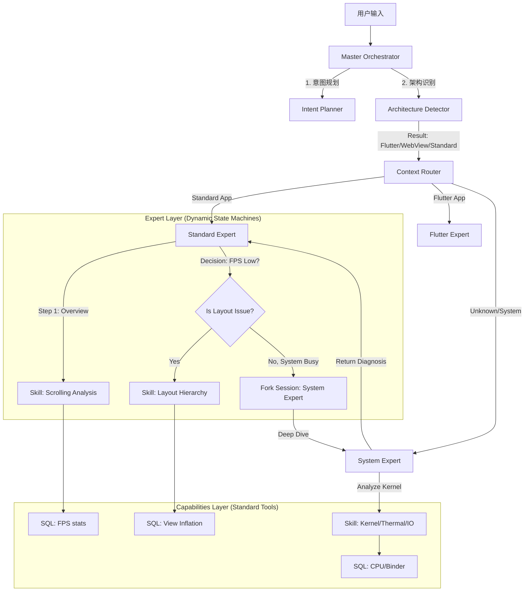

# SmartPerfetto 智能 Agent 设计文档

> 本文档持续迭代，记录 Agent 系统从"指令执行器"到"智能分析专家"的演进设计。

## 目录

- [1. 核心问题与目标](#1-核心问题与目标)
- [2. 专家工作流程与决策树](#2-专家工作流程与决策树)
- [3. 分析所需数据层次](#3-分析所需数据层次)
- [4. 智能判断的期望行为](#4-智能判断的期望行为)
- [5. 多轮对话模式](#5-多轮对话模式)
- [6. 调度分析](#6-调度分析)
- [7. 渲染架构识别](#7-渲染架构识别)
- [8. 深层分析能力](#8-深层分析能力)
- [9. 测试负载类型](#9-测试负载类型)
- [10. 目标架构](#10-目标架构)
- [11. 待完善内容](#11-待完善内容)

---

## 1. 核心问题与目标

### 1.1 当前 Agent 的问题

- **指令驱动 vs 意图驱动**：当前 Agent 是"你说分析滑动，我就执行滑动分析 Skill"，而不是理解用户真正想解决的问题
- **单轮执行 vs 多轮探索**：缺乏像真正专家那样的"假设-验证-深入"循环
- **结果呈现 vs 问题定位**：给了一堆数据，但没有告诉用户"问题在哪、为什么、怎么解"

### 1.2 核心场景

| 场景 | 关注点 | 目标 |
|------|--------|------|
| **启动场景** | 启动速度 | 定位启动慢的阶段和根因 |
| **滑动场景** | 帧率 (FPS) | 定位掉帧原因，区分 App/系统问题 |

### 1.3 分析的核心问题

Agent 需要能够判断：
1. **是系统问题还是 App 问题？**
2. **具体是哪个组件的问题？**
   - UI Render (RenderThread)
   - VSync
   - System Server
   - Input
   - SurfaceFlinger
3. **调度层面的问题：**
   - 内核能力给得够不够
   - 有没有 CPU Boost
   - 系统厂商是否做了优化

---

## 2. 专家工作流程与决策树

### 2.1 滑动卡顿分析决策树

```
                              │
                              ▼
                    ┌─────────────────┐
                    │ 1. 先看整体 FPS │
                    │   确认确实有问题 │
                    └────────┬────────┘
                             │
              ┌──────────────┴──────────────┐
              │                             │
              ▼                             ▼
    ┌─────────────────┐          ┌─────────────────┐
    │  FPS 整体偏低    │          │  FPS 有突刺/掉帧 │
    │  (持续 40-50fps) │          │  (偶发卡顿)      │
    └────────┬────────┘          └────────┬────────┘
             │                            │
             ▼                            ▼
    ┌─────────────────┐          ┌─────────────────┐
    │ 2. 看 SurfaceFlinger │      │ 2. 定位具体卡顿帧 │
    │    VSYNC 是否正常   │      │    找到那一帧     │
    └────────┬────────┘          └────────┬────────┘
             │                            │
      ┌──────┴──────┐              ┌──────┴──────┐
      │             │              │             │
      ▼             ▼              ▼             ▼
 ┌────────┐   ┌────────┐    ┌────────┐    ┌────────┐
 │SF 异常 │   │SF 正常 │    │App 帧  │    │系统帧  │
 │系统问题│   │看 App  │    │耗时长  │    │耗时长  │
 └───┬────┘   └───┬────┘    └───┬────┘    └───┬────┘
     │            │             │             │
     ▼            ▼             ▼             ▼
  深入 SF      深入 App      深入 App      深入系统
```

### 2.2 专家的"第一眼"顺序

| 顺序 | 看什么 | 为什么 | 判断标准 |
|------|--------|--------|----------|
| 1 | **SurfaceFlinger 主线程** | 它是所有 UI 合成的总调度 | 如果 SF 本身卡，所有 App 都会受影响 |
| 2 | **VSYNC 信号** | 确认硬件层面是否正常 | VSYNC-app 和 VSYNC-sf 的间隔应该稳定 |
| 3 | **目标 App 的 RenderThread** | 这是 App 渲染的核心 | 看每帧的 `DrawFrame` 耗时 |
| 4 | **目标 App 的主线程** | 可能阻塞了 RenderThread | 看是否有长时间的 `doFrame` 或 Binder 调用 |
| 5 | **Input 事件** | 触控响应链路 | 从 InputReader → InputDispatcher → App 的延迟 |

### 2.3 决策分支的关键线索

**往系统方向查的信号：**
- SF 主线程有长耗时任务
- VSYNC 信号不稳定或丢失
- 多个 App 同时出现卡顿
- system_server 的 Binder 调用阻塞
- HWC (Hardware Composer) 报错或超时

**往 App 方向查的信号：**
- 只有目标 App 卡，其他 App 流畅
- App 的 RenderThread 耗时明显超标（>16ms）
- App 主线程有 ANR 级别的阻塞
- Choreographer 的 doFrame 回调中有耗时操作

---

## 3. 分析所需数据层次

### 3.1 滑动卡顿分析所需数据

```
┌─────────────────────────────────────────────────────────────────┐
│                    滑动分析必需数据层次                          │
├─────────────────────────────────────────────────────────────────┤
│                                                                  │
│  Layer 1: 整体概况                                               │
│  ├── 滑动会话识别（开始时间、结束时间、类型）                     │
│  ├── 平均 FPS / 最低 FPS / FPS 方差                              │
│  ├── 总帧数 / 卡顿帧数 / 卡顿率                                   │
│  └── Jank 类型分布（App Deadline Missed / SF Stuffing 等）       │
│                                                                  │
│  Layer 2: 帧级别数据                                             │
│  ├── 每帧的关键时间戳                                            │
│  │   ├── vsync_app (App 收到 VSYNC)                              │
│  │   ├── vsync_sf (SF 收到 VSYNC)                                │
│  │   ├── app_draw_start / app_draw_end                           │
│  │   ├── sf_compose_start / sf_compose_end                       │
│  │   └── present_time (实际上屏时间)                             │
│  ├── 每帧的耗时分解                                              │
│  │   ├── App 绘制耗时 = app_draw_end - app_draw_start            │
│  │   ├── SF 合成耗时 = sf_compose_end - sf_compose_start         │
│  │   └── 总延迟 = present_time - vsync_app                       │
│  └── 帧的状态标记（正常 / Jank / Dropped）                       │
│                                                                  │
│  Layer 3: 根因定位数据                                           │
│  ├── 卡顿帧的详细 Slice                                          │
│  │   ├── RenderThread 的 DrawFrame 内部调用                      │
│  │   ├── MainThread 的 Choreographer#doFrame 内部调用            │
│  │   ├── Binder 调用详情（调用了谁、耗时多少）                   │
│  │   └── Lock Contention（锁竞争）                               │
│  ├── CPU 调度信息                                                │
│  │   ├── 关键线程的 CPU 占用                                     │
│  │   ├── Runnable 时间（等待 CPU 的时间）                        │
│  │   └── 运行在哪个 CPU 核心                                     │
│  └── 内存/IO 相关                                                │
│      ├── 是否有 GC 暂停                                          │
│      ├── 是否有 Page Fault                                       │
│      └── 是否有 IO Wait                                          │
│                                                                  │
│  Layer 4: 系统级上下文                                           │
│  ├── CPU 频率曲线                                                │
│  ├── GPU 频率和负载                                              │
│  ├── 温度状态（是否降频）                                        │
│  ├── 后台任务干扰                                                │
│  └── 系统服务状态（system_server 负载）                          │
│                                                                  │
└─────────────────────────────────────────────────────────────────┘
```

### 3.2 判断"App 问题还是系统问题"的关键指标

| 判断维度 | App 问题的特征 | 系统问题的特征 |
|----------|----------------|----------------|
| **SF 状态** | SF 正常，及时合成 | SF 主线程阻塞或延迟 |
| **VSYNC** | VSYNC 正常分发 | VSYNC 信号异常或丢失 |
| **其他 App** | 其他 App 流畅 | 多个 App 同时卡 |
| **RenderThread** | 耗时超标 (>16ms) | 耗时正常但帧延迟 |
| **Binder** | App→System 调用慢是系统问题 | system_server 整体慢 |
| **CPU 调度** | App 线程 Runnable 时间长 | 系统整体 CPU 负载高 |

### 3.3 启动分析所需数据

```
┌─────────────────────────────────────────────────────────────────┐
│                    启动分析必需数据                              │
├─────────────────────────────────────────────────────────────────┤
│                                                                  │
│  阶段划分 (以冷启动为例):                                        │
│                                                                  │
│  ┌────────────┬────────────┬────────────┬────────────┐          │
│  │   Click    │   Process  │   Activity │   First    │          │
│  │   Event    │   Start    │   Create   │   Frame    │          │
│  │            │            │            │   Drawn    │          │
│  └─────┬──────┴─────┬──────┴─────┬──────┴─────┬──────┘          │
│        │            │            │            │                  │
│        ├── T1 ──────┤            │            │                  │
│        │ Input→AMS  │            │            │                  │
│        │ (系统响应) │            │            │                  │
│        │            ├── T2 ──────┤            │                  │
│        │            │ Fork+Init  │            │                  │
│        │            │ (进程创建) │            │                  │
│        │            │            ├── T3 ──────┤                  │
│        │            │            │ onCreate   │                  │
│        │            │            │ (App 初始化)│                  │
│        │            │            │            ├── T4 ────        │
│        │            │            │            │ 首帧渲染          │
│                                                                  │
│  关键指标:                                                       │
│  ├── TTID (Time To Initial Display): T1 + T2 + T3               │
│  ├── TTFD (Time To First Draw): TTID + T4                       │
│  └── 各阶段耗时占比                                              │
│                                                                  │
│  需要的 Slice:                                                   │
│  ├── ActivityManagerService.startActivity                        │
│  ├── Process.start / Zygote.fork                                │
│  ├── ActivityThread.handleBindApplication                        │
│  ├── Application.onCreate                                        │
│  ├── Activity.onCreate / onStart / onResume                      │
│  ├── Choreographer#doFrame (首帧)                                │
│  └── RenderThread#DrawFrame (首帧)                               │
│                                                                  │
└─────────────────────────────────────────────────────────────────┘
```

---

## 4. 智能判断的期望行为

### 4.1 场景 1：用户说"滑动有点卡"

**当前 Agent 行为：**
```
执行 scrolling_analysis Skill → 返回 FPS 数据表格
```

**期望的专家行为：**
```
1. 先识别 trace 中的所有滑动会话
2. 计算每个会话的 FPS 和卡顿率
3. 自动定位"问题最严重"的会话
4. 对该会话进行初步根因分析：
   - 是 App 帧耗时问题？还是 SF 合成问题？
   - 如果是 App 问题，是 RenderThread 还是 MainThread？
5. 给出初步结论 + 建议下一步分析方向

输出示例：
"我分析了 trace 中的 3 个滑动会话：
 - 会话 1 (0.5s-2.3s): FPS 58, 流畅 ✓
 - 会话 2 (3.1s-5.8s): FPS 42, 卡顿率 23% ⚠️
 - 会话 3 (7.2s-8.9s): FPS 55, 基本流畅

会话 2 存在明显卡顿，我进一步分析发现：
 - SurfaceFlinger 合成正常，排除系统问题
 - App RenderThread 平均耗时 22ms，超过 16ms 阈值
 - 主要耗时在 View#draw() 调用

初步判断：这是 App 的 UI 渲染问题，可能是布局过深或过度绘制。
需要我深入分析具体是哪些 View 导致的吗？"
```

### 4.2 场景 2：Agent 发现某个滑动会话的 FPS 只有 40

**当前 Agent 行为：**
```
报告"FPS 40，低于阈值"
```

**期望的专家行为：**
```
FPS 40 意味着每帧平均 25ms，超标 9ms。需要找出这 9ms 花在哪里了。

自动执行的分析：
1. 检查 SurfaceFlinger：
   - SF 合成耗时是否正常？（通常应 < 4ms）
   - VSYNC-sf 到 present 的延迟？

2. 检查 App 渲染：
   - RenderThread DrawFrame 耗时分布
   - 找出耗时 > 16ms 的帧

3. 对超时帧进行根因分类：
   - Measure/Layout 阶段超时？→ 布局问题
   - Draw 阶段超时？→ 过度绘制或复杂绘制
   - Sync 阶段超时？→ Bitmap 上传或资源加载
   - GPU 阶段超时？→ GPU 负载过高

4. 检查是否有外部因素：
   - Binder 调用阻塞？
   - GC 暂停？
   - 主线程阻塞导致 Choreographer 延迟？

输出示例：
"会话 2 的 FPS 只有 40，我分析了 87 帧中的 20 帧卡顿帧：

根因分布：
 - 12 帧 (60%): RenderThread Draw 阶段超时，平均 28ms
 - 5 帧 (25%): MainThread doFrame 延迟，Binder 调用 system_server
 - 3 帧 (15%): GC 暂停导致

主要问题在 Draw 阶段，进一步发现：
 - RecyclerView#onDraw 调用频繁
 - 每帧绑定 8-12 个 ViewHolder

建议：检查 RecyclerView 的 Item 布局复杂度，或考虑使用 ViewHolder 缓存优化。"
```

### 4.3 场景 3：用户问"为什么这一帧卡了 50ms"

**当前 Agent 行为：**
```
可能无法回答，或返回整个会话的数据
```

**期望的专家行为：**
```
定位到具体这一帧，展开完整的调用栈分析：

1. 找到这一帧的精确时间范围
2. 提取这一帧内所有关键 Slice：
   - Choreographer#doFrame 的各个回调
   - RenderThread 的 DrawFrame 各阶段
   - 所有 Binder 调用
   - 任何锁等待或 IO 操作

3. 构建时间线视图：
   ┌─────────────────────────────────────────────────────────┐
   │ Frame Timeline (50ms total)                             │
   ├─────────────────────────────────────────────────────────┤
   │ MainThread:                                             │
   │ ├─ doFrame (0-35ms) ─────────────────────────────┤      │
   │ │  ├─ input callbacks (0-2ms)                    │      │
   │ │  ├─ animation callbacks (2-5ms)                │      │
   │ │  ├─ traversal (5-35ms) ◀── 问题在这里!         │      │
   │ │  │   ├─ measure (5-12ms)                       │      │
   │ │  │   ├─ layout (12-18ms)                       │      │
   │ │  │   └─ draw (18-35ms) ◀── 17ms，超标!         │      │
   │                                                         │
   │ RenderThread:                                           │
   │ ├─ DrawFrame (35-50ms) ───────────────────────────┤     │
   │ │  ├─ syncFrameState (35-38ms)                   │      │
   │ │  ├─ draw (38-48ms)                             │      │
   │ │  └─ swapBuffers (48-50ms)                      │      │
   └─────────────────────────────────────────────────────────┘

4. 给出根因结论：
   "这一帧卡了 50ms，根因分析：
    - MainThread 的 traversal 阶段耗时 30ms（正常应 < 8ms）
    - 主要时间花在 draw 阶段（17ms）
    - 具体是 CustomView#onDraw 中调用了多次 Canvas.bindbindbindPath
    - 建议：缓存 Path 对象，或使用 Hardware Layer"
```

---

## 5. 多轮对话模式

### 5.1 推荐模式：自主深挖 + 关键点请示

```
┌─────────────────────────────────────────────────────────────────┐
│                    智能对话模式                                  │
└─────────────────────────────────────────────────────────────────┘

用户输入: "分析这个 trace 的滑动问题"
                    │
                    ▼
           ┌───────────────────┐
           │ Agent 自主执行:    │
           │ 1. 识别滑动会话    │
           │ 2. 计算 FPS/卡顿率 │
           │ 3. 初步根因分析    │
           └─────────┬─────────┘
                     │
                     ▼
           ┌───────────────────┐
           │ 返回概要 + 关键发现│
           │ + 建议的下一步    │
           └─────────┬─────────┘
                     │
        ┌────────────┼────────────┐
        │            │            │
        ▼            ▼            ▼
   ┌─────────┐ ┌─────────┐ ┌─────────┐
   │用户选择 │ │用户追问 │ │用户满意 │
   │深入选项 │ │具体问题 │ │结束对话 │
   └────┬────┘ └────┬────┘ └─────────┘
        │           │
        ▼           ▼
   继续深入     回答问题
   自主分析     并关联上下文
```

### 5.2 关键设计原则

1. **第一轮给出"足够有价值"的信息**
   - 不只是数据，要有结论
   - 告诉用户"我发现了什么问题"
   - 提供"下一步建议"

2. **保持上下文连贯**
   - 用户追问时，知道之前分析了什么
   - 可以引用之前的发现："刚才提到的会话 2..."

3. **判断何时请示用户**
   - 有多个可能的分析方向时
   - 分析结果不确定时
   - 需要用户提供额外信息时（比如"这是哪个页面的滑动？"）

4. **支持用户主导**
   - 用户可以随时打断，指定方向
   - 用户可以问具体问题，Agent 要能回答

---

## 6. 调度分析

### 6.1 判断"调度给得够不够"的关键指标

```
┌─────────────────────────────────────────────────────────────────┐
│                    调度分析关键指标                              │
└─────────────────────────────────────────────────────────────────┘

1. CPU 频率维度：
   ├── 关键线程运行时的 CPU 频率
   │   - RenderThread 运行时大核频率是否拉满？
   │   - 卡顿帧期间 CPU 频率是否偏低？
   ├── 频率变化响应时间
   │   - 从低频到高频的爬升速度
   │   - 是否有 CPU Boost 介入
   └── 温度限制
       - 是否因为过热导致降频

2. 调度延迟维度：
   ├── Runnable 时间
   │   - 线程等待 CPU 的时间
   │   - 正常应 < 1ms，超过 5ms 就有问题
   ├── 核心绑定
   │   - 关键线程是否运行在大核？
   │   - 是否频繁在大小核之间迁移？
   └── 优先级
       - 线程的调度优先级是否正确？
       - 是否被低优先级任务抢占？

3. 系统负载维度：
   ├── 整体 CPU 占用率
   │   - 是否所有核心都满载？
   ├── 后台任务干扰
   │   - 是否有后台 Service 在占用 CPU？
   │   - 是否有 GC 或 Compile 任务？
   └── IRQ / Softirq
       - 是否有大量中断处理占用 CPU？
```

### 6.2 "系统厂商优化"的体现

```
常见的厂商优化（在 trace 中的体现）：

1. 触控优化：
   - Input Boost: 触摸时立即拉高 CPU 频率
   - 在 trace 中体现为：input 事件后 CPU 频率立即跳升

2. 渲染优化：
   - Frame Boost: 检测到掉帧后拉高频率
   - SF Priority: SurfaceFlinger 绑定大核
   - 在 trace 中体现为：SF 线程固定在 CPU 4-7

3. 游戏模式：
   - Game Mode: 更激进的调度策略
   - 在 trace 中体现为：特定包名的进程有更高优先级

4. DVFS 策略：
   - 不同厂商的调频算法不同
   - 在 trace 中体现为：频率变化曲线的特征
```

### 6.3 调度分析的触发时机

```
问题定位流程：

  发现卡顿
      │
      ▼
  检查 App 渲染逻辑 ─────────── App 有明显问题 ─────▶ App 问题
      │
      │ App 逻辑正常
      ▼
  检查 SurfaceFlinger ────────── SF 有问题 ─────────▶ 系统问题
      │
      │ SF 正常
      ▼
  检查 Binder 调用 ───────────── Binder 阻塞 ───────▶ 系统服务问题
      │
      │ Binder 正常
      ▼
  ┌─────────────────────────────────────────────────────────────┐
  │ 检查调度 ◀──── 当上面都正常，但还是卡，就要看调度了         │
  │                                                              │
  │  - Runnable 时间长？→ CPU 资源不够                           │
  │  - CPU 频率低？→ 调频策略问题                                │
  │  - 大小核迁移？→ 调度器问题                                  │
  │  - 后台任务干扰？→ 优先级/cgroup 问题                        │
  └─────────────────────────────────────────────────────────────┘

简单说：调度分析是"排除法"的最后一环。
当 App 代码、系统服务都没问题，但性能还是差，就要怀疑是不是"底层资源没给够"。
```

---

## 7. 渲染架构识别

> **核心洞察**：当前 Agent 假设所有滑动都是"标准 RecyclerView + RenderThread"模式，但实际 Android 应用有多种渲染架构，每种架构的分析策略完全不同。

### 7.1 Android 渲染架构全景

```
┌─────────────────────────────────────────────────────────────────┐
│                    Android 渲染架构全景                          │
├─────────────────────────────────────────────────────────────────┤
│                                                                  │
│  ┌─────────────────────────────────────────────────────────────┐│
│  │ 1. 标准硬件渲染 (Default)                                    ││
│  │    UI Thread (Choreographer + measure/layout/draw)           ││
│  │         ↓ DisplayList                                        ││
│  │    RenderThread (GPU rendering)                              ││
│  │         ↓                                                    ││
│  │    SurfaceFlinger → Display                                  ││
│  └─────────────────────────────────────────────────────────────┘│
│                                                                  │
│  ┌─────────────────────────────────────────────────────────────┐│
│  │ 2. 软件渲染 (hardwareAccelerated=false)                      ││
│  │    UI Thread ONLY (所有绘制在主线程)                         ││
│  │         ↓ Bitmap                                             ││
│  │    SurfaceFlinger → Display                                  ││
│  │    【无 RenderThread】                                       ││
│  └─────────────────────────────────────────────────────────────┘│
│                                                                  │
│  ┌─────────────────────────────────────────────────────────────┐│
│  │ 3. 纯 RenderThread (SurfaceView)                             ││
│  │    UI Thread (触摸事件 ONLY)                                 ││
│  │    Custom Render Thread (独立线程绑制)                       ││
│  │         ↓                                                    ││
│  │    独立 Surface → SurfaceFlinger → Display                   ││
│  └─────────────────────────────────────────────────────────────┘│
│                                                                  │
│  ┌─────────────────────────────────────────────────────────────┐│
│  │ 4. OpenGL 渲染 (GLSurfaceView)                               ││
│  │    UI Thread (触摸/生命周期)                                 ││
│  │    GL Thread (OpenGL ES 渲染)                                ││
│  │         ↓ EGL SwapBuffers                                    ││
│  │    独立 Surface → SurfaceFlinger → Display                   ││
│  └─────────────────────────────────────────────────────────────┘│
│                                                                  │
│  ┌─────────────────────────────────────────────────────────────┐│
│  │ 5. 双 Window (Overlay)                                       ││
│  │    Main Window: UI Thread + RenderThread                     ││
│  │    Overlay Window: UI Thread + RenderThread                  ││
│  │    【2× doFrame, 2× RenderThread.drawFrame】                 ││
│  └─────────────────────────────────────────────────────────────┘│
│                                                                  │
│  ┌─────────────────────────────────────────────────────────────┐│
│  │ 6. 混合渲染 (视频 + 列表)                                    ││
│  │    SurfaceView (视频/动画) + RecyclerView (列表)             ││
│  │    独立 Surface │ 标准渲染管线                               ││
│  │    【需要分别分析两个管线】                                  ││
│  └─────────────────────────────────────────────────────────────┘│
│                                                                  │
│  ┌─────────────────────────────────────────────────────────────┐│
│  │ 7. Jetpack Compose                                           ││
│  │    UI Thread (Composition + Layout + Draw)                   ││
│  │         ↓ DisplayList                                        ││
│  │    RenderThread (与标准类似，但 Slice 命名不同)              ││
│  └─────────────────────────────────────────────────────────────┘│
│                                                                  │
│  ┌─────────────────────────────────────────────────────────────┐│
│  │ 8. Flutter                                                   ││
│  │    Platform Thread (Android 主线程，处理平台事件)            ││
│  │    UI Thread (Dart isolate，Widget build + layout)           ││
│  │    Raster Thread (Skia/Impeller 渲染)                        ││
│  │         ↓                                                    ││
│  │    FlutterSurfaceView → SurfaceFlinger → Display             ││
│  │    【完全独立的渲染引擎，不走 Android View 系统】            ││
│  └─────────────────────────────────────────────────────────────┘│
│                                                                  │
│  ┌─────────────────────────────────────────────────────────────┐│
│  │ 9. WebView / Chrome (Chromium 渲染)                          ││
│  │    Browser Process (主进程，协调)                            ││
│  │    Renderer Process (Blink 渲染引擎)                         ││
│  │    ├── Main Thread (JS 执行 + DOM + Style + Layout)          ││
│  │    ├── Compositor Thread (Layer 合成)                        ││
│  │    └── Raster Thread (Tile 光栅化)                           ││
│  │    GPU Process (GPU 加速合成)                                ││
│  │         ↓                                                    ││
│  │    SurfaceView → SurfaceFlinger → Display                    ││
│  │    【多进程架构，独立于 Android 渲染管线】                   ││
│  └─────────────────────────────────────────────────────────────┘│
│                                                                  │
└─────────────────────────────────────────────────────────────────┘
```

### 7.2 渲染架构识别方法

Agent 需要在分析前**自动识别**当前 trace 的渲染架构：

| 识别信号 | 判断结论 |
|----------|----------|
| 有 `RenderThread` + `DrawFrame` | 标准硬件渲染 |
| 无 `RenderThread`，只有主线程绑制 | 软件渲染 |
| 有 `SurfaceView` 相关 Slice | SurfaceView 独立渲染 |
| 有 `GLThread` 或 `eglSwapBuffers` | OpenGL 渲染 |
| 有多个 Window 的 `doFrame` | 双/多 Window |
| 有 `Compose` 相关 Slice | Jetpack Compose |
| `doFrame` 中有 `Recomposition` | Compose 重组 |
| 有 `flutter` 进程/线程，`ui.window` Slice | Flutter |
| 有 `1.ui`, `1.raster` 线程 | Flutter (线程命名) |
| 有 `CrRendererMain`, `Compositor` 线程 | WebView/Chrome |
| 有 `viz::` 或 `cc::` 开头的 Slice | Chromium 渲染 |

### 7.3 不同架构的分析策略差异

| 渲染架构 | 关注点 | 卡顿根因常见位置 |
|----------|--------|------------------|
| **标准硬件渲染** | UI Thread + RenderThread 配合 | measure/layout 过深、draw 复杂、GPU 过载 |
| **软件渲染** | UI Thread 耗时 | CPU 绑制性能、onDraw 效率 |
| **纯 RenderThread** | 自定义渲染线程 | 渲染算法效率、线程同步 |
| **OpenGL** | GL Thread + GPU | Shader 编译、纹理上传、draw call 数量 |
| **双 Window** | 两个管线的协调 | 帧同步、资源竞争 |
| **混合渲染** | 多管线各自表现 | 分别分析，找最慢的管线 |
| **Compose** | Recomposition 频率 | 不必要的重组、State 读取位置 |
| **Flutter** | UI Thread + Raster Thread | Widget rebuild 过多、Dart GC、Skia/Impeller 渲染 |
| **WebView/Chrome** | JS 执行 + Compositor + Raster | JS 长任务、Layout Thrashing、Paint/Raster 过载 |

### 7.4 特殊场景：抖音风格全屏视频

```
┌─────────────────────────────────────────────────────────────────┐
│                    抖音风格渲染特征                              │
├─────────────────────────────────────────────────────────────────┤
│                                                                  │
│  渲染架构：                                                      │
│  ├── ExoPlayer SurfaceView (视频解码 + 渲染)                    │
│  ├── 自定义 Scroller (VerticalVideoScroller)                    │
│  └── 原生 View 叠加 (互动按钮、信息区)                          │
│                                                                  │
│  分析重点：                                                      │
│  ├── 视频解码延迟 (MediaCodec)                                  │
│  ├── 页面切换动画流畅度 (Scroller 物理模型)                     │
│  ├── 预加载策略 (下一个视频是否提前准备)                        │
│  └── 首帧耗时 (视频 seek 到 0 的时间)                           │
│                                                                  │
│  常见问题：                                                      │
│  ├── 切换时黑屏 → 视频解码器初始化慢                            │
│  ├── 滑动卡顿 → Scroller 动画被主线程阻塞                       │
│  └── 音画不同步 → ExoPlayer 时钟同步问题                        │
│                                                                  │
└─────────────────────────────────────────────────────────────────┘
```

### 7.5 特殊场景：Flutter 应用

> **重要**：Flutter 不同版本的渲染引擎有重大差异，分析时需要先识别版本。

```
┌─────────────────────────────────────────────────────────────────┐
│                    Flutter 版本演进与渲染差异                    │
├─────────────────────────────────────────────────────────────────┤
│                                                                  │
│  版本       │ iOS 渲染引擎      │ Android 渲染引擎              │
│  ──────────┼──────────────────┼────────────────────────────────│
│  < 3.27    │ Skia (默认)       │ Skia (默认)                    │
│            │ Impeller (可选)   │ Impeller (预览)                │
│  ──────────┼──────────────────┼────────────────────────────────│
│  3.27      │ Impeller (默认)   │ Impeller (默认，Android 10+)   │
│            │ Skia (可回退)     │ Skia (可回退)                  │
│  ──────────┼──────────────────┼────────────────────────────────│
│  3.29+     │ Impeller (唯一)   │ Impeller (默认)                │
│            │ 【Skia 已移除】   │ OpenGLES (低版本 Android)      │
│                                                                  │
│  关键里程碑：                                                    │
│  ├── Flutter 3.27 (2024.12): Impeller 成为 Android 默认         │
│  ├── Flutter 3.29 (2025.02): iOS 完全移除 Skia，只保留 Impeller │
│  └── Flutter 3.29+: Dart 代码直接在主线程执行（重大架构变化）   │
│                                                                  │
└─────────────────────────────────────────────────────────────────┘
```

#### Skia vs Impeller 核心差异

```
┌─────────────────────────────────────────────────────────────────┐
│                    Skia vs Impeller 对比                         │
├─────────────────────────────────────────────────────────────────┤
│                                                                  │
│  维度           │ Skia                │ Impeller                 │
│  ──────────────┼─────────────────────┼──────────────────────────│
│  Shader 编译   │ JIT (运行时)        │ AOT (构建时预编译)       │
│  首帧卡顿      │ 常见                │ 基本消除                 │
│  GPU 后端      │ OpenGL ES           │ Metal (iOS) / Vulkan (Android)│
│  渲染模式      │ 立即模式            │ 分块渲染 (~256×256 tiles)│
│  帧耗时(120Hz) │ ~7.71ms (67% 达标)  │ ~6.57ms (92% 达标)       │
│  卡顿率        │ ~12%                │ ~1.5%                    │
│                                                                  │
│  Trace 差异：                                                    │
│  ├── Skia: 可能出现 `SkGpuDevice`、`GrGLGpu` 相关 Slice         │
│  └── Impeller: 出现 `impeller::`、`EntityPass` 相关 Slice       │
│                                                                  │
└─────────────────────────────────────────────────────────────────┘
```

#### Flutter 3.29+ 架构变化（重要）

```
┌─────────────────────────────────────────────────────────────────┐
│                    Flutter 3.29+ 线程模型变化                    │
├─────────────────────────────────────────────────────────────────┤
│                                                                  │
│  【旧模型 (< 3.29)】                                             │
│  ┌─────────────────────────────────────────────────────────────┐│
│  │ Platform Thread (Android 主线程)                             ││
│  │     ↕ 消息传递                                               ││
│  │ UI Thread (独立的 Dart isolate)                              ││
│  │     ↓                                                        ││
│  │ Raster Thread                                                ││
│  └─────────────────────────────────────────────────────────────┘│
│                                                                  │
│  【新模型 (3.29+)】                                              │
│  ┌─────────────────────────────────────────────────────────────┐│
│  │ Main Thread = Platform Thread + UI Thread (合并！)           ││
│  │     ↓ Dart 代码直接在主线程执行                              ││
│  │ Raster Thread                                                ││
│  │                                                              ││
│  │ 优势：消除线程切换开销，平台交互更流畅                       ││
│  │ 影响：Trace 中不再有独立的 UI Thread                         ││
│  └─────────────────────────────────────────────────────────────┘│
│                                                                  │
│  分析时注意：                                                    │
│  ├── 3.29+ 的 Trace 主线程会同时包含 Dart 执行和平台事件        │
│  ├── 不要误判为"主线程过载"                                    │
│  └── 需要区分 Dart 代码耗时 vs 平台代码耗时                     │
│                                                                  │
└─────────────────────────────────────────────────────────────────┘
```

#### Flutter 渲染分析要点

```
┌─────────────────────────────────────────────────────────────────┐
│                    Flutter 性能分析要点                          │
├─────────────────────────────────────────────────────────────────┤
│                                                                  │
│  线程模型 (3.29 之前)：                                          │
│  ├── Platform Thread (Android 主线程)                           │
│  │   └── 处理平台事件、Plugin 调用、与 Android 交互             │
│  ├── UI Thread (Dart isolate)                                   │
│  │   └── Widget build、Layout、创建 Layer Tree                  │
│  ├── Raster Thread                                              │
│  │   └── Skia / Impeller 光栅化                                 │
│  └── IO Thread                                                  │
│      └── 图片解码、资源加载                                     │
│                                                                  │
│  Trace 中的关键 Slice：                                         │
│  ├── `Framework::BeginFrame` - 帧开始                           │
│  ├── `PipelineOwner::flushLayout` - 布局                        │
│  ├── `PipelineOwner::flushPaint` - 绘制                         │
│  ├── `Rasterizer::Draw` - 光栅化                                │
│  └── `SceneBuilder::build` - 构建场景                           │
│                                                                  │
│  常见问题及根因：                                                │
│  ├── Widget rebuild 过多 → 没有正确使用 const / Key             │
│  ├── Dart GC 暂停 → 创建了过多临时对象                          │
│  ├── Raster 卡顿 (Skia) → Shader 首次编译                       │
│  ├── Raster 卡顿 (Impeller) → 图片过大、复杂滤镜                │
│  └── Platform Channel 阻塞 → 与 Android 交互过于频繁            │
│                                                                  │
│  Android 特定问题：                                              │
│  ├── MediaTek/PowerVR 芯片默认用 OpenGLES (不是 Vulkan)         │
│  ├── 老设备可能出现 Vulkan 闪烁问题                             │
│  └── 模拟器使用 GLES 后端                                       │
│                                                                  │
└─────────────────────────────────────────────────────────────────┘
```

### 7.6 特殊场景：WebView / Chrome

> **重要**：WebView 是一个很大的概念，底层有多种实现方式，分析时需要先识别具体类型。

#### WebView 实现类型矩阵

```
┌─────────────────────────────────────────────────────────────────┐
│                    WebView 实现类型                              │
├─────────────────────────────────────────────────────────────────┤
│                                                                  │
│  类型               │ 底层 Engine    │ Surface 类型  │ 常见场景  │
│  ─────────────────┼───────────────┼──────────────┼───────────│
│  Chrome 浏览器     │ Chromium      │ SurfaceView  │ 独立浏览器 │
│  ─────────────────┼───────────────┼──────────────┼───────────│
│  国内厂商 WebView  │ Chromium      │ TextureView  │ 内嵌 H5   │
│  (UC/QQ/X5 等)    │ (定制版)      │              │           │
│  ─────────────────┼───────────────┼──────────────┼───────────│
│  原生 WebView     │ WebViewFactory│ SurfaceView  │ 系统默认  │
│  (Android System) │ → Chromium    │              │           │
│  ─────────────────┼───────────────┼──────────────┼───────────│
│  新版 WebView     │ Chromium      │ SurfaceControl│ Android 10+│
│  (最新架构)       │               │              │           │
│                                                                  │
└─────────────────────────────────────────────────────────────────┘
```

#### 不同 Surface 类型的渲染差异

```
┌─────────────────────────────────────────────────────────────────┐
│                    Surface 类型渲染差异                          │
├─────────────────────────────────────────────────────────────────┤
│                                                                  │
│  【SurfaceView 模式】(Chrome 浏览器、原生 WebView)               │
│  ┌─────────────────────────────────────────────────────────────┐│
│  │ 特点：                                                       ││
│  │ ├── 独立 Surface，独立 Z-order                               ││
│  │ ├── 不参与 View hierarchy 的绘制                             ││
│  │ ├── 直接提交给 SurfaceFlinger                                ││
│  │ └── 性能最好，但与原生 View 层级关系受限                     ││
│  │                                                              ││
│  │ Trace 特征：                                                 ││
│  │ ├── 有独立的 Surface 提交                                    ││
│  │ └── 不在 App 的 RenderThread 中绘制                          ││
│  └─────────────────────────────────────────────────────────────┘│
│                                                                  │
│  【TextureView 模式】(国内厂商常用：UC/QQ/X5 内核)               │
│  ┌─────────────────────────────────────────────────────────────┐│
│  │ 特点：                                                       ││
│  │ ├── WebView 内容绘制到 SurfaceTexture                        ││
│  │ ├── 作为纹理参与 View hierarchy 绘制                         ││
│  │ ├── 可以与原生 View 自由组合（动画、透明度等）               ││
│  │ └── 有额外的 GPU 纹理拷贝开销                                ││
│  │                                                              ││
│  │ Trace 特征：                                                 ││
│  │ ├── WebView 内容出现在 App 的 RenderThread 中                ││
│  │ ├── 有 `SurfaceTexture::updateTexImage` 调用                 ││
│  │ └── 可能看到纹理上传开销                                     ││
│  │                                                              ││
│  │ 常见性能问题：                                               ││
│  │ ├── 纹理拷贝导致额外延迟                                     ││
│  │ ├── 与原生 View 的 VSync 同步问题                            ││
│  │ └── 高分辨率下内存/GPU 压力大                                ││
│  └─────────────────────────────────────────────────────────────┘│
│                                                                  │
│  【SurfaceControl 模式】(Android 10+ 新架构)                     │
│  ┌─────────────────────────────────────────────────────────────┐│
│  │ 特点：                                                       ││
│  │ ├── 结合 SurfaceView 的性能和 TextureView 的灵活性           ││
│  │ ├── 使用 ASurfaceControl API                                 ││
│  │ ├── 支持 HDR、更好的同步                                     ││
│  │ └── 是未来的方向                                             ││
│  │                                                              ││
│  │ Trace 特征：                                                 ││
│  │ ├── 有 `SurfaceControl` 相关 Slice                           ││
│  │ └── Transaction 提交方式不同                                 ││
│  └─────────────────────────────────────────────────────────────┘│
│                                                                  │
└─────────────────────────────────────────────────────────────────┘
```

#### WebView 底层 Engine 差异

```
┌─────────────────────────────────────────────────────────────────┐
│                    WebView Engine 类型                           │
├─────────────────────────────────────────────────────────────────┤
│                                                                  │
│  【Google Chromium】(标准)                                       │
│  ├── Chrome 浏览器直接使用                                      │
│  ├── Android System WebView (com.google.android.webview)        │
│  └── 版本跟随 Chrome 更新                                       │
│                                                                  │
│  【国内厂商定制内核】                                            │
│  ├── 腾讯 X5 内核 (QQ浏览器、微信)                              │
│  │   ├── 基于 Chromium，有定制优化                              │
│  │   ├── 可能有不同的 Trace 命名                                │
│  │   └── 视频播放等有特殊处理                                   │
│  ├── UC 内核 (阿里系 App)                                       │
│  │   ├── U4 内核，深度定制                                      │
│  │   └── 有自己的性能优化策略                                   │
│  └── 其他厂商内核                                               │
│      ├── 华为、小米等可能有系统级定制                           │
│      └── Trace 中可能出现厂商特有 Slice                         │
│                                                                  │
│  识别方法：                                                      │
│  ├── 看进程名：`com.google.android.webview` vs 其他             │
│  ├── 看 User-Agent：可能包含 X5、UC 等标识                      │
│  └── 看 Trace Slice 命名：可能有厂商前缀                        │
│                                                                  │
└─────────────────────────────────────────────────────────────────┘
```

#### Chromium 多进程架构（通用）

```
┌─────────────────────────────────────────────────────────────────┐
│                    Chromium 多进程渲染架构                       │
├─────────────────────────────────────────────────────────────────┤
│                                                                  │
│  ┌─────────────────────────────────────────────────────────────┐│
│  │ Browser Process (协调进程)                                   ││
│  │ ├── UI Thread: 处理用户输入                                  ││
│  │ └── IO Thread: 网络请求                                      ││
│  └─────────────────────────────────────────────────────────────┘│
│                         ↓ IPC (Mojo)                             │
│  ┌─────────────────────────────────────────────────────────────┐│
│  │ Renderer Process (渲染进程)                                  ││
│  │ ├── Main Thread (Blink 引擎)                                 ││
│  │ │   ├── JS 执行 (V8)                                         ││
│  │ │   ├── DOM 操作                                             ││
│  │ │   ├── Style 计算                                           ││
│  │ │   └── Layout 布局                                          ││
│  │ ├── Compositor Thread (CC)                                   ││
│  │ │   ├── Layer 管理                                           ││
│  │ │   ├── 动画驱动                                             ││
│  │ │   └── 滚动处理                                             ││
│  │ └── Raster Worker Threads                                    ││
│  │     └── Tile 光栅化 (多线程并行)                             ││
│  └─────────────────────────────────────────────────────────────┘│
│                         ↓ GPU Command Buffer                     │
│  ┌─────────────────────────────────────────────────────────────┐│
│  │ GPU Process / Viz (合成)                                     ││
│  │ ├── 接收各 Renderer 的 CompositorFrame                       ││
│  │ ├── Display Compositor 合成                                  ││
│  │ └── 输出到 Surface                                           ││
│  └─────────────────────────────────────────────────────────────┘│
│                                                                  │
│  注意：WebView 嵌入 App 时，可能共享进程或独立进程              │
│  - 共享进程：与 App 竞争资源，Trace 在同一进程                  │
│  - 独立进程：性能隔离好，但 IPC 开销增加                        │
│                                                                  │
└─────────────────────────────────────────────────────────────────┘
```

#### WebView 性能分析要点

```
┌─────────────────────────────────────────────────────────────────┐
│                    WebView 性能分析要点                          │
├─────────────────────────────────────────────────────────────────┤
│                                                                  │
│  Trace 中的关键 Slice：                                         │
│  ├── `blink::Document::updateStyleAndLayout` - 样式+布局        │
│  ├── `v8::Script::Run` - JS 执行                                │
│  ├── `cc::LayerTreeHost::UpdateLayers` - Layer 更新             │
│  ├── `viz::Display::DrawAndSwap` - 合成输出                     │
│  ├── `ThreadProxy::BeginMainFrame` - 主帧开始                   │
│  └── `RasterTask::Run` - Tile 光栅化                            │
│                                                                  │
│  常见问题及根因：                                                │
│  ├── JS 长任务 (>50ms)                                          │
│  │   └── 阻塞主线程，导致响应延迟                               │
│  ├── Layout Thrashing                                           │
│  │   └── 强制同步布局 (读 offsetHeight → 写 style → 读...)     │
│  ├── Paint 过载                                                 │
│  │   └── 复杂 CSS 效果、大面积重绘                              │
│  ├── Raster 过载                                                │
│  │   └── 图片过大、图层过多、Tile 过多                          │
│  ├── IPC 延迟                                                   │
│  │   └── Browser ↔ Renderer 进程间通信慢                        │
│  └── TextureView 特有问题                                       │
│      └── 纹理拷贝开销、VSync 同步问题                           │
│                                                                  │
│  Surface 类型判断：                                              │
│  ├── SurfaceView: 看独立 Surface 提交                           │
│  ├── TextureView: 看 `SurfaceTexture::updateTexImage`           │
│  └── SurfaceControl: 看 `ASurfaceControl` 相关调用              │
│                                                                  │
└─────────────────────────────────────────────────────────────────┘
```

### 7.7 厂商系统优化的影响

> **重要提示**：不同厂商对 Android 系统做了大量优化，导致 trace 表现可能与 AOSP 不同。

```
┌─────────────────────────────────────────────────────────────────┐
│                    厂商系统优化影响                              │
├─────────────────────────────────────────────────────────────────┤
│                                                                  │
│  芯片厂商优化：                                                  │
│  ├── Qualcomm (高通)                                            │
│  │   ├── Adreno GPU 特有的渲染优化                              │
│  │   ├── Snapdragon Game Studio 相关的游戏模式                  │
│  │   └── 自定义的 DVFS/调度策略                                 │
│  └── MediaTek (MTK)                                             │
│      ├── 不同的 GPU 驱动行为                                    │
│      └── 特有的性能调优接口                                     │
│                                                                  │
│  手机厂商优化：                                                  │
│  ├── OPPO / vivo                                                │
│  │   ├── 自研的 Hyper Boost 等性能模式                          │
│  │   ├── 修改过的 SF / HWC 行为                                 │
│  │   └── 自定义的 Trace 点                                      │
│  ├── 小米                                                       │
│  │   ├── MIUI 的系统级优化                                      │
│  │   ├── Game Turbo 游戏加速                                    │
│  │   └── 后台任务管理策略                                       │
│  └── 华为                                                       │
│      ├── 方舟编译器优化                                         │
│      ├── GPU Turbo 技术                                         │
│      └── 确定时延引擎                                           │
│                                                                  │
│  对分析的影响：                                                  │
│  ├── Trace 中可能出现厂商自定义的 Slice                         │
│  ├── 某些行为与 AOSP 文档描述不一致                             │
│  ├── 性能调优策略因厂商而异                                     │
│  └── 需要识别是"厂商优化生效"还是"系统问题"                    │
│                                                                  │
│  【待完善：需要收集各厂商特有 Trace 特征的知识库】              │
│                                                                  │
└─────────────────────────────────────────────────────────────────┘
```

---

## 8. 深层分析能力

> **核心观点**：Perfetto 只是"表象"，真正的性能分析需要深入到 Running 状态、指令级、CPU 微架构级别。

### 8.1 分析深度金字塔

```
┌─────────────────────────────────────────────────────────────────┐
│                    分析深度金字塔                                │
├─────────────────────────────────────────────────────────────────┤
│                                                                  │
│                         ▲                                        │
│                        /░\                                       │
│                       /░░░\    Level 4: CPU 微架构               │
│                      /░░░░░\   (CPI, 缓存命中率, 分支预测)       │
│                     ─────────                                    │
│                    /░░░░░░░░░\                                   │
│                   /░░░░░░░░░░░\  Level 3: 指令级分析             │
│                  /░░░░░░░░░░░░░\ (SIMD, 流水线, IPC)             │
│                 ─────────────────                                │
│                /░░░░░░░░░░░░░░░░░\                               │
│               /░░░░░░░░░░░░░░░░░░░\  Level 2: Running 深入       │
│              /░░░░░░░░░░░░░░░░░░░░░\ (函数热点, 调用栈)          │
│             ─────────────────────────                            │
│            /▓▓▓▓▓▓▓▓▓▓▓▓▓▓▓▓▓▓▓▓▓▓▓▓▓\                          │
│           /▓▓▓▓▓▓▓▓▓▓▓▓▓▓▓▓▓▓▓▓▓▓▓▓▓▓▓\  Level 1: Perfetto 表象 │
│          /▓▓▓▓▓▓▓▓▓▓▓▓▓▓▓▓▓▓▓▓▓▓▓▓▓▓▓▓▓\ (FPS, Slice 耗时)      │
│         ─────────────────────────────────                        │
│                                                                  │
│         ▓▓▓ = 当前 Agent 能力    ░░░ = 需要扩展的能力            │
│                                                                  │
└─────────────────────────────────────────────────────────────────┘
```

### 8.2 Level 1: Perfetto 表象分析（当前能力）

```
可以回答的问题：
├── 整体 FPS 是多少？
├── 哪些帧卡了？卡了多久？
├── 卡顿发生在哪个阶段？(measure/layout/draw/render)
├── 有没有 Binder 调用？耗时多少？
└── CPU 频率、调度状态如何？

局限性：
├── 只知道"慢了"，不知道"为什么慢"
├── 看到 Running 状态，不知道在运行什么代码
└── 无法判断是算法问题还是硬件瓶颈
```

### 8.3 Level 2: Running 状态深入分析

```
当看到一段 Running 状态时，需要回答：
├── 这段时间在执行什么代码？
│   └── 需要：采样调用栈 (Simpleperf callstack)
├── 热点函数是什么？
│   └── 需要：函数级 CPU 时间分布
├── 是 CPU 密集还是等待资源？
│   └── 需要：区分 on-cpu vs off-cpu 时间
└── 调用路径是什么？
    └── 需要：完整的调用栈火焰图

数据来源：
├── Perfetto 的 callstack 采样 (如果 trace 包含)
├── Simpleperf 的 CPU profiling 数据
└── 手动插入的 Trace.beginSection() 埋点
```

### 8.4 Level 3: 指令级分析

```
┌─────────────────────────────────────────────────────────────────┐
│                    指令级分析维度                                │
├─────────────────────────────────────────────────────────────────┤
│                                                                  │
│  1. SIMD 向量化                                                  │
│     ├── 循环是否被向量化？                                       │
│     ├── NEON 指令使用率                                          │
│     └── 向量化失败的原因 (数据依赖、对齐问题)                    │
│                                                                  │
│  2. 分支预测                                                     │
│     ├── 分支预测命中率                                           │
│     ├── 错误预测导致的流水线刷新                                 │
│     └── 热点分支的 taken/not-taken 比例                          │
│                                                                  │
│  3. 指令流水线                                                   │
│     ├── IPC (Instructions Per Cycle)                             │
│     │   - 理想值接近 CPU 发射宽度 (4-8)                          │
│     │   - 低 IPC 说明有 stall                                    │
│     ├── 流水线 stall 原因                                        │
│     │   - 数据依赖 (RAW hazard)                                  │
│     │   - 结构冲突 (执行单元不够)                                │
│     │   - 控制冲突 (分支预测失败)                                │
│     └── 指令 mix (整数/浮点/访存比例)                            │
│                                                                  │
│  数据来源：                                                      │
│  ├── ARM PMU (Performance Monitoring Unit) 计数器               │
│  ├── Simpleperf stat 命令                                       │
│  └── Linux perf 工具                                            │
│                                                                  │
└─────────────────────────────────────────────────────────────────┘
```

### 8.5 Level 4: CPU 微架构分析

```
┌─────────────────────────────────────────────────────────────────┐
│                    CPU 微架构分析维度                            │
├─────────────────────────────────────────────────────────────────┤
│                                                                  │
│  1. 缓存层次                                                     │
│     ┌─────────┬─────────┬─────────┬─────────┐                   │
│     │ L1 Cache│ L2 Cache│ L3/DSU  │  DRAM   │                   │
│     │  ~1ns   │  ~3ns   │  ~10ns  │ ~100ns  │                   │
│     └─────────┴─────────┴─────────┴─────────┘                   │
│     ├── L1D/L1I 命中率 (目标 > 95%)                             │
│     ├── L2 命中率 (目标 > 90%)                                  │
│     ├── L3/DSU 命中率 (多核共享)                                │
│     └── Cache Line 冲突 (false sharing)                         │
│                                                                  │
│  2. 内存带宽                                                     │
│     ├── 读带宽 / 写带宽                                         │
│     ├── 带宽利用率 vs 理论峰值                                   │
│     └── 内存访问模式 (顺序 vs 随机)                             │
│                                                                  │
│  3. TLB (Translation Lookaside Buffer)                          │
│     ├── TLB 命中率                                              │
│     ├── Page Walk 开销                                          │
│     └── 大页 (Huge Pages) 使用情况                              │
│                                                                  │
│  4. Store/Load Buffer                                            │
│     ├── Store buffer 满导致的 stall                             │
│     ├── Load-to-use 延迟                                        │
│     └── 内存序 (Memory Ordering) 开销                           │
│                                                                  │
│  5. ARM 特定                                                     │
│     ├── big.LITTLE 调度效率                                     │
│     │   - 大核 (Cortex-X/A7x): 高性能任务                       │
│     │   - 小核 (Cortex-A5x): 低功耗任务                         │
│     ├── DSU (DynamIQ Shared Unit) 一致性开销                    │
│     ├── SVE/SVE2 向量扩展使用                                   │
│     └── MTE (Memory Tagging Extension) 开销                     │
│                                                                  │
│  数据来源：                                                      │
│  ├── ARM PMU 硬件计数器                                         │
│  ├── /proc/cpuinfo, /sys/devices/system/cpu/                    │
│  ├── Simpleperf stat -e cache-references,cache-misses           │
│  └── 厂商提供的性能分析工具 (Qualcomm Snapdragon Profiler 等)   │
│                                                                  │
└─────────────────────────────────────────────────────────────────┘
```

### 8.6 深层分析的触发时机

```
何时需要深入到 Level 2+：

┌─────────────────────────────────────────────────────────────────┐
│  Perfetto 发现：                                                 │
│  "RenderThread 的 DrawFrame 耗时 30ms，其中 draw 阶段 25ms"      │
│                                                                  │
│  Level 1 能告诉你：draw 阶段慢了                                 │
│  Level 1 不能告诉你：为什么 draw 慢                              │
│                                                                  │
│  需要 Level 2 回答：                                             │
│  ├── draw 里面在执行什么代码？                                   │
│  ├── 是 Canvas.bindPath() 调用太多？                             │
│  ├── 还是 Bitmap 解码太慢？                                      │
│  └── 还是锁竞争导致等待？                                        │
│                                                                  │
│  如果 Level 2 发现是 Canvas bindbindBindbindPath() 热点，需要 Level 3：     │
│  ├── Path 计算是否被 SIMD 优化？                                 │
│  ├── 循环是否展开？                                              │
│  └── 分支预测是否失败？                                          │
│                                                                  │
│  如果 Level 3 发现 IPC 很低，需要 Level 4：                       │
│  ├── 是 cache miss 导致的？                                      │
│  ├── 还是内存带宽不够？                                          │
│  └── 还是 CPU 频率没拉上来？                                     │
│                                                                  │
└─────────────────────────────────────────────────────────────────┘
```

### 8.7 Agent 深层分析能力扩展方向

| 层级 | 当前状态 | 扩展方向 |
|------|----------|----------|
| **Level 1** | ✅ 已支持 | 继续完善 Skill |
| **Level 2** | ⚠️ 部分支持 | 集成 Simpleperf 数据、支持 callstack 分析 |
| **Level 3** | ❌ 不支持 | 解析 PMU 计数器、IPC 分析 |
| **Level 4** | ❌ 不支持 | Cache 分析、ARM 微架构感知 |

---

## 9. 测试负载类型

> 基于 HighPerformanceFriendsCircle Demo App 的负载设计，用于科学地测试不同负载下的性能表现。

### 9.1 11 种负载类型定义

```
┌─────────────────────────────────────────────────────────────────┐
│                    负载类型矩阵                                  │
├─────────────────────────────────────────────────────────────────┤
│                                                                  │
│  ID │ 类型名称              │ 描述                    │ 强度    │
│  ───┼───────────────────────┼─────────────────────────┼─────────│
│  0  │ MINIMAL               │ 无负载                  │ 0       │
│  1  │ LIGHT (In-Frame)      │ 帧内轻度计算            │ 250     │
│  2  │ MEDIUM (In-Frame)     │ 帧内中度计算            │ 750     │
│  3  │ HEAVY (In-Frame)      │ 帧内重度计算            │ 1250    │
│  4  │ LIGHT_BETWEEN_FRAMES  │ 帧间轻度任务            │ 1000    │
│  5  │ MEDIUM_BETWEEN_FRAMES │ 帧间中度任务            │ 1500    │
│  6  │ HEAVY_BETWEEN_FRAMES  │ 帧间重度任务            │ 1750    │
│  7  │ LIGHT_MIXED           │ 轻度帧内+帧间           │ 2000    │
│  8  │ MEDIUM_MIXED          │ 中度帧内+帧间           │ 3000    │
│  9  │ HEAVY_MIXED           │ 重度帧内+帧间           │ 4500    │
│  10 │ LONG_FRAME            │ 超长帧 (20× HEAVY)      │ 4500    │
│                                                                  │
│  强度递进：1.5x 倍数科学递增                                     │
│                                                                  │
└─────────────────────────────────────────────────────────────────┘
```

### 9.2 负载触发机制

```
┌─────────────────────────────────────────────────────────────────┐
│                    负载触发时机                                  │
├─────────────────────────────────────────────────────────────────┤
│                                                                  │
│  In-Frame Load (帧内负载)：                                      │
│  ├── 触发时机：onBindViewHolder / onDraw                        │
│  ├── 影响：直接增加帧渲染时间                                   │
│  └── 模拟场景：复杂 Item 渲染、图片处理                         │
│                                                                  │
│  Between-Frame Load (帧间负载)：                                 │
│  ├── 触发时机：两帧之间，伪随机间隔 (3-5帧)                     │
│  ├── 影响：占用主线程，可能延迟下一帧                           │
│  └── 模拟场景：后台数据处理、网络回调                           │
│                                                                  │
│  Mixed Load (混合负载)：                                         │
│  ├── 触发时机：doFrame 回调 + 帧间                              │
│  ├── 影响：全方位压力                                           │
│  └── 模拟场景：真实复杂 App                                     │
│                                                                  │
│  Long Frame (超长帧)：                                           │
│  ├── 触发时机：伪随机，每 2000ms 触发 2-3 次                    │
│  ├── 影响：模拟严重卡顿                                         │
│  └── 模拟场景：GC 暂停、JIT 编译                                │
│                                                                  │
└─────────────────────────────────────────────────────────────────┘
```

### 9.3 负载内容

```
负载实际执行的操作：
├── 数学计算 (Math.sin, Math.cos, Math.sqrt)
├── 矩阵运算 (3×3, 5×5 矩阵乘法)
├── 排序算法 (快排、堆排序)
├── Fibonacci 计算
├── 字符串处理
└── 简单图形操作

特点：
├── 使用固定种子的伪随机，保证可重复性
├── 包含编译器优化阻止 (volatile, black-hole)
└── 依赖链防止指令重排
```

### 9.4 Agent 如何利用负载类型

```
当 Agent 分析 trace 时，如果能识别负载类型：

场景：用户使用 Demo App 的 HEAVY_MIXED 负载进行测试

Agent 应该能够：
1. 识别这是"混合重负载"测试
2. 预期会看到：
   - 帧内：onBindViewHolder 中有 ~1250 强度的计算
   - 帧间：有 ~1750 强度的后台任务
3. 分析时区分：
   - 哪些卡顿是"预期的负载"导致
   - 哪些是"系统/框架"问题
4. 给出针对性建议：
   - "在 HEAVY_MIXED 负载下，系统表现符合预期"
   - 或 "即使在 LIGHT 负载下也有卡顿，说明有非负载问题"
```

### 9.5 Demo App 模块覆盖矩阵

| 模块 | 渲染架构 | 支持负载 | 测试目的 |
|------|----------|----------|----------|
| scrolling-aosp-performance | 标准 RecyclerView | 11种 | 基准性能 |
| scrolling-aosp-softwarerender | 软件渲染 | 11种 | CPU 瓶颈 |
| scrolling-aosp-purerenderthread | 纯 RenderThread | 11种 | 渲染线程性能 |
| scrolling-aosp-renderstress | RenderThread 压测 | 11种 | GPU 瓶颈 |
| scrolling-aosp-dualwindow | 双 Window | 11种 | 多窗口开销 |
| scrolling-aosp-mixedrender | 混合渲染 | 11种 | 多管线协调 |
| scrolling-compose | Jetpack Compose | 11种 | Compose 性能 |
| scrolling-surface-map | SurfaceView | 11种 | 独立 Surface |
| scrolling-gl-map | GLSurfaceView | 11种 | OpenGL 性能 |
| scrolling-aosp-douyin | 视频翻页 | - | 视频场景 |
| scrolling-aosp-ebook | 电子书 | - | 翻页动画 |
| launch-* | 启动测试 | 3级 | 启动性能 |

---

## 10. 目标架构 (V3: Agent-Driven Scale)

> 本章节定义了基于 "MasterOrchestrator + Expert Agent + Skills (YAML)" 的最终架构。

### 10.1 核心理念：从指令执行到专家协作

- **Old (V2)**: Intent Router -> Execute Skill -> Return Data. (机械，线性)
- **New (V3)**: Master Orchestrator -> Expert Agent (Dynamic Reasoning) -> Use Tools (Skills) -> Session Forking (Deep Dive). (智能，网状)



### 10.2 关键组件定义

#### A. Architecture Detector (GK: Gate Keeper)
在任何深度分析开始前，必须运行的"第一道关卡"。
- **输入**: Trace Header, Process List, Thread Names.
- **输出**: `{ type: 'STANDARD' | 'FLUTTER' | 'WEBVIEW' | 'GL', version: '3.29+' }`.
- **作用**: 决定后续加载哪一套 Skills (e.g., Load `scrolling_flutter.yaml` instead of `scrolling_standard.yaml`).

#### B. Expert Agents (The Brain)
Expert Agents 是 TypeScript 编写的**状态机 (State Machines)**，它们封装了分析逻辑，拥有"思考"能力。
- **Launch Expert**: 负责启动分析。
    - *能力*: 识别 Cold/Warm/Hot，自动下钻到 Binder/Lock/IO。
- **Interaction Expert**: 负责滑动/点击分析。
    - *能力*: 区分 Input/Render/Composition 延迟，调用 Architecture Detector 适配不同架构。
- **System Expert**: 负责纯系统级瓶颈。
    - *能力*: 分析 CPU 调度、IO await、Thermal throttling、Memory reclamation。

#### C. Skills as Tools (The Hands)
现有的 YAML Skills (`backend/skills/*.yaml`) 是 Expert Agents 的 **SOP (Standard Operating Procedures)**。
- **角色转变**: Skill 不再直接面向用户，而是作为 Expert Agent 的"原子能力"。
- **设计原则**: Skill 应保持"无状态" (Stateless) 和 "原子化" (Atomic)。复杂的跨多步推理应由 Expert Agent (TS) 处理，而不是写在 YAML 里。

### 10.3 Session Forking & Context Isolation (高级特性)

为了解决"App 分析与系统分析深度不一致"的问题，引入 **Session Forking** 机制。

**场景**:
用户抱怨 "App 滑动卡顿"。Expert 发现 RenderThread 正常，但 `epoll_wait` 异常长。

**流程**:
1.  **Main Session**: 专注于 App 层 (UI Thread, RenderThread)。发现无法解释的延迟。
2.  **Fork Action**: `SystemExpert.fork(time_range, 'Deep Kernel Analysis')`.
3.  **Child Session (System)**:
    - **Context**: 包含所有 CPUs, kernel threads, irq, kworker。
    - **Actions**: 运行 `io_pressure`, `sched_wakeup_latency` 等高开销 SQL。
    - **Result**: "发现 kworker/u0:3 频繁抢占 RenderThread，且 IO iowait > 40%."
4.  **Merge**: Child Session 将结论简化为一条 Insight 返回给 Main Session。
5.  **Final Output**: "App 卡顿主要由系统后台 IO 压力导致 (kworker 抢占)，建议检查后台下载任务。"

### 10.4 专家能力矩阵 (Capability Matrix)

| Expert Agent | Primary Skills (YAML) | Secondary Skills (Dynamic) | Decision Logic |
| :--- | :--- | :--- | :--- |
| **LaunchExpert** | `startup_analysis` | `binder_analysis`, `lock_contention`, `gc_analysis` | Slow Phase -> Check Thread State -> Check Binder/Lock -> Conclusion |
| **InteractionExpert** | `scrolling_analysis`, `click_response` | `jank_frame_detail`, `input_latency`, `sf_analysis` | Scroll -> Detect Jank -> Classify (App/Sys) -> Drill Down |
| **SystemExpert** | `cpu_analysis`, `memory_analysis` | `io_pressure` (New), `thermal_throttling` (New), `kernel_wakelock` | Global Stats -> Identify Bottleneck (CPU/IO/Mem) -> Find Culprit Process |

---

## 11. 实施路线建议 (Implementation Strategy)

### Phase 1: Foundation
1.  **Architecture Detector**: 实现基础的架构识别逻辑 (TS)。
2.  **SOP Digitalization**: 确保核心场景 (Launch, Scroll) 的 YAML Skill 覆盖 L1/L2 数据层。

### Phase 2: Orchestration
1.  **LaunchExpert (TS)**: 作为 Pilot，实现"状态机驱动 YAML"的模式。
2.  **Session Forking**: 在 Backend 实现 Session 分叉与结果合并的基础设施。

### Phase 3: Deep Dive
1.  **System Skills**: 开发 `io_pressure.skill` 和 `thermal.skill`。
2.  **SystemExpert**: 集成 Session Forking，实现自动化的系统级根因诊断。

---

## 12. 待完善内容

> 此部分用于记录需要补充和完善的内容

### 11.1 待补充的分析场景

- [ ] 启动场景的详细决策树
- [ ] 内存问题分析流程
- [ ] ANR 问题分析流程
- [ ] 功耗问题分析流程

### 11.2 待完善的技术细节

- [ ] 具体的 SQL 查询设计
- [ ] Skill YAML 结构设计
- [ ] 前端交互设计
- [ ] 多轮对话状态管理方案

### 11.3 待讨论的问题

- [ ] (在此添加需要讨论的问题)

---

## 修订历史

| 日期 | 版本 | 修改内容 |
|------|------|----------|
| 2026-01-16 | v0.1 | 初始版本，基于专家视角回答五个核心问题 |
| 2026-01-16 | v0.2 | 新增：渲染架构识别(7)、深层分析能力(8)、测试负载类型(9) |
| 2026-01-16 | v0.3 | 补充：Flutter、WebView/Chrome 渲染架构；厂商系统优化影响 |
| 2026-01-16 | v0.4 | 详细记录 Flutter 版本演进 (3.27/3.29)、Skia vs Impeller 差异、线程模型变化 |
| 2026-01-16 | v0.5 | 完善 WebView：4 种实现类型 (SurfaceView/TextureView/SurfaceControl)、国内厂商内核 (X5/UC) |

## 参考资料

- **Demo App**: `/Users/chris/Code/HighPerformanceFriendsCircle/` - 性能测试 Demo 应用
- **SmartPerfetto**: `/Users/chris/Code/SmartPerfetto/SmartPerfetto/` - AI 分析平台
