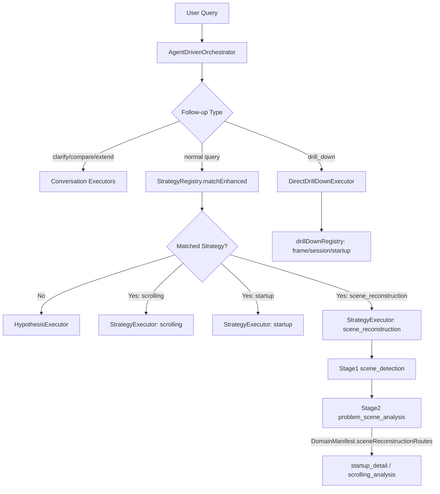

# Scrolling / Startup 分析链路梳理与 Startup 持续优化计划（与代码对齐）

> 更新日期：2026-02-10
> 适用范围：`backend/src/agent/`、`backend/src/agent/strategies/`、`backend/skills/composite/`

---

## 0. 结论

本轮改造后，startup 已经从“能力存在但编排弱”升级为与 scrolling 同级的确定性链路：

1. `startupStrategy` 已接入主路由（`startup_overview -> launch_event_overview -> launch_event_detail`）。
2. `scene_reconstruction` 二阶段已改为 manifest 路由驱动（默认 startup -> `startup_detail`，其他场景 -> `scrolling_analysis`）。
3. drill-down 的 `entity -> skill` 映射已抽到共享 registry，`startup_id` 可在 resolver/executor 两条链路一致处理。

仍需持续优化的重点是：阈值口径统一、startup 实体持久化覆盖范围、以及更系统化的质量回归门禁。

---

## 1. 当前执行总览（入口到执行器）

### 1.1 入口与路由

- HTTP 入口：`backend/src/routes/agentRoutes.ts` (`/api/agent/analyze`)
- 主协调器：`backend/src/agent/core/agentDrivenOrchestrator.ts`
- 策略注册：`backend/src/agent/strategies/registry.ts`

### 1.2 执行分流图（当前真实）

### 1.3 已注册策略

`createStrategyRegistry()` 当前注册 4 条策略：

- `scrolling`
- `startup`
- `scene_reconstruction_quick`
- `scene_reconstruction`

---

## 2. Scrolling 分析流程梳理（当前基线）

> 代码：`backend/src/agent/strategies/scrollingStrategy.ts`

### 2.1 三阶段流程

| 阶段 | Stage 名称 | 执行模式 | 核心输出 | 早停条件 |
|---|---|---|---|---|
| Stage 0 | `overview` | `agent` (`frame_agent`) | `scroll_sessions` + `session_jank` | 无 jank session |
| Stage 1 | `session_overview` | `agent` (`frame_agent`, per_interval) | `get_app_jank_frames` 帧列表 | 无可分析帧 |
| Stage 2 | `frame_analysis` | `direct_skill` (`jank_frame_detail`) | 帧级根因与诊断 | 通常不早停 |

### 2.2 关键实现点

1. Stage0 到 Stage1 的 interval 按 jank 严重度排序（`maxVsyncMissed > jankFrameCount > duration`）。
2. Stage1 到 Stage2 从 `get_app_jank_frames` 提取单帧 interval，并附带完整 metadata（`frameId/sessionId/mainStartTs/renderStartTs/...`）。
3. Stage2 走 `direct_skill` 热路径，逐帧分析稳定且低 LLM 开销。
4. `StrategyExecutor` 支持 deferred expandable table，将 L2 帧表与 L4 结果绑定后统一发射。

---

## 3. Startup 分析流程梳理（当前现状）

### 3.1 路径 A：直接启动分析 query（冷/温/热）

> 典型 query：“分析冷启动慢原因”

执行路径：

1. `StrategyRegistry.matchEnhanced` 命中 `startupStrategy`。
2. 进入 `StrategyExecutor(startup)`。
3. Stage0 `startup_overview`：`direct_skill: startup_analysis`（`analysis_mode=overview`, `enable_startup_details=false`）。
4. Stage1 `launch_event_overview`：按 startup interval 再执行轻量 `startup_analysis` 做事件归一化。
5. Stage2 `launch_event_detail`：逐事件执行 `startup_detail` 深挖根因。

### 3.2 路径 B：场景还原 query（发生了什么/整体分析）

> 代码：`backend/src/agent/strategies/sceneReconstructionStrategy.ts`

执行路径：

1. Stage1 `scene_detection` 通过 `scene_reconstruction` 提取 `app_launches/user_gestures/top_app_changes/...`。
2. Stage2 `problem_scene_analysis` 按 `DomainManifest.sceneReconstructionRoutes` 路由：
   - startup route（`sceneTypeGroups=['startup']`）-> `startup_detail`
   - non-startup route（`sceneTypeGroups=['all']` + `excludeSceneTypes`）-> `scrolling_analysis`

### 3.3 路径 C：startup drill-down follow-up

> 代码：`backend/src/agent/core/executors/directDrillDownExecutor.ts`

执行路径：

1. `intentUnderstanding` / `followUpHandler` 识别 `startup_id` 与 startup 实体引用。
2. 通过 `drillDownRegistry` 判定实体类型为 `startup` 并映射到 `startup_detail`。
3. 若区间缺失时间戳，执行 enrichment SQL（`android_startups` + `android_startup_time_to_display`）补全。
4. 直接调用 `startup_detail` 返回事件级证据。

### 3.4 冷/温/热口径现状

当前仍是“双口径并存”状态：

1. 路由阈值（scene/startup strategy）：`cold>1000ms`、`warm>600ms`、`hot>200ms`。
2. `startup_analysis` 评级阈值：冷启动 `<500/<1000/<2000`，温启动 `<200/<500`，热启动 `<100/<200`。

这不会阻塞链路执行，但会影响“路由判定”和“结论文案”的边界一致性。

---

## 4. 已完成优化清单（代码级）

1. `startupStrategy` 新增并注册。
   - 文件：`backend/src/agent/strategies/startupStrategy.ts`
   - 注册：`backend/src/agent/strategies/registry.ts`

2. scene reconstruction 二阶段分流（manifest 化）。
   - 路由配置：`backend/src/agent/config/domainManifest.ts`
   - 路由匹配：`matchesSceneReconstructionRoute(...)`
   - 过滤能力：`StageTaskTemplate.intervalFilter` + `StrategyExecutor.filterIntervalsForTemplate`
   - 策略接入：`backend/src/agent/strategies/sceneReconstructionStrategy.ts`

3. startup drill-down 实体直达（registry 收敛）。
   - 实体类型扩展：`backend/src/agent/types.ts`
   - 意图/follow-up 解析：`backend/src/agent/core/intentUnderstanding.ts`、`backend/src/agent/core/followUpHandler.ts`
   - 共享映射：`backend/src/agent/config/drillDownRegistry.ts`
   - 执行/解析：`backend/src/agent/core/executors/directDrillDownExecutor.ts`、`backend/src/agent/core/drillDownResolver.ts`

4. `startup_analysis` 轻量模式扩展。
   - 新参数：`analysis_mode`、`enable_startup_details`、`startup_id/startup_type/start_ts/end_ts`
   - 文件：`backend/skills/composite/startup_analysis.skill.yaml`

---

## 5. Startup 持续优化计划（详细）

### 5.1 Phase A：统一冷/温/热阈值配置（优先级 P0）

目标：把路由阈值和结论阈值收敛到单一配置源，避免边界冲突。

1. 新增统一配置（例如 `backend/src/config/startupThresholds.ts`）。
2. `startupStrategy` 与 `sceneReconstructionStrategy` 使用同一阈值源。
3. `startup_analysis` 评级文案读取同一阈值（或通过 skill 参数注入）。
4. 增加阈值一致性测试（策略+skill 快照/断言）。

### 5.2 Phase B：startup 实体持久化与增量分析覆盖（优先级 P1）

目标：让 extend/compare 场景能复用 startup 实体状态，而不仅是本轮 drill-down。

1. 在 EntityStore 层补充 startup 实体结构与 analyzed 标记。
2. 从 strategy responses / extracted intervals 捕获 startup 实体并回写。
3. 将 startup 纳入 `IncrementalAnalyzer` 的已分析实体集合。
4. 验证多轮链路：“先概览 -> 再 drill-down -> 再 extend”不重复分析已覆盖 startup。

### 5.3 Phase C：startup_detail 输入降耦（优先级 P1）

目标：将“只给 startup_id”作为 skill 原生能力，而不是主要依赖 executor enrichment。

1. `startup_detail` 支持仅 `startup_id` 入参自动回查基础字段。
2. 保持全量参数模式兼容 strategy 的显式映射。
3. 为 `startup_detail` 增加 startup_id-only 的 skill-eval 覆盖。

### 5.4 Phase D：质量门禁与性能基线（优先级 P1）

目标：把 startup 链路回归风险前置到 CI 级别。

1. 固化 3 类 benchmark trace（冷慢/温慢/热慢）。
2. 记录并追踪：首轮耗时、LLM 次数、SQL 次数、findings 稳定性。
3. 新增回归门禁：
   - 功能门禁：startup query 命中 `startupStrategy`。
   - 语义门禁：scene startup interval 必须走 `startup_detail`。
   - 交互门禁：`startup_id` drill-down 必须可补全时间戳并成功执行。

---

## 6. 验收标准（DoD）

### 6.1 功能正确性

1. 直接 startup query 稳定命中 `startupStrategy`。
2. scene_reconstruction 中 startup scene 不再走 `scrolling_analysis`。
3. startup drill-down 通过 `startup_id` 可稳定直达 `startup_detail`。

### 6.2 结果质量

1. 冷/温/热结论包含事件级证据（`startup_id`, `dur_ms`, `ttid_ms`, `ttfd_ms`）。
2. 结论链路中的阈值解释与路由阈值保持一致。

### 6.3 稳定性与性能

1. 同等 trace 下，startup 首次分析耗时较旧路径持平或下降。
2. 重复执行同类 query，finding 结构稳定（字段/层级一致）。
