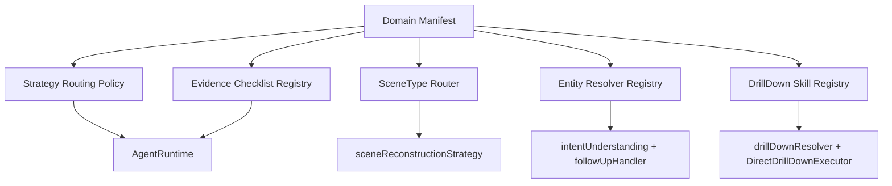

# 领域可扩展性架构重构计划（Domain Extensibility Refactor）

> 更新日期：2026-02-10
> 目标：避免新增分析场景（内存、跳转速度、交互等）时出现多处硬编码修改，建立可配置、可注册、可灰度的扩展架构。

---

## 1. 问题定义（当前扩展痛点）

当前架构已具备较强能力，但在“新增领域”时存在以下耦合：

1. Orchestrator 路由偏好依赖策略 ID 白名单（`scrolling/startup/scene_reconstruction`）。
2. scene reconstruction 二阶段仍是固定分流规则（startup vs non-startup）。
3. 实体扩展需同时修改 `types/intent/followUp/drillDown/entityCapture` 多个模块。
4. drill-down 解析链路存在“双实现”（`drillDownResolver` 与 `DirectDrillDownExecutor`）的能力不一致风险。
5. 分析计划证据 checklist 仍是代码常量，新增领域需要改核心逻辑。

这些点会导致新增“memory、navigation latency、interaction latency”时改动面大、回归成本高。

---

## 2. 重构目标

1. **配置驱动**：将领域策略、路由偏好、证据映射、scene 路由从核心代码中剥离到 manifest。
2. **注册驱动**：实体引用解析、follow-up 参数映射、drill-down skill 映射走统一 registry。
3. **一致性**：drill-down 解析链路单一事实来源，避免 resolver/executor 分叉。
4. **渐进式上线**：每阶段可独立落地并可回滚，避免一次性大改。

---

## 3. 目标架构



核心约束：
- Manifest 采用“代码默认值 + YAML 覆盖”双层机制。
- Manifest 缺失时回退默认配置，不影响现有稳定路径。

---

## 4. 分阶段执行计划

### Phase A（先行，低风险）：Orchestrator 去硬编码

范围：
1. 抽离“策略执行偏好”到 Domain Manifest（替代白名单判断）。
2. 抽离“证据 checklist 映射”到 Domain Manifest（替代 `aspectEvidenceMap` 常量）。

交付：
- `backend/src/agent/config/domainManifest.ts`（默认 manifest + helper）
- Orchestrator 接入 manifest helper
- 单元测试覆盖默认行为不变

回滚：
- helper 失败时回退原有默认行为

### Phase B（中风险）：Scene 路由可配置化

范围：
1. 将 `sceneType -> skill` 映射抽离为配置（支持 startup/scroll/navigation/memory/custom）。
2. `sceneReconstructionStrategy` 从二分判断改为路由表驱动（仍支持 intervalFilter）。

交付：
- SceneRouteRegistry（默认映射）
- scene strategy 动态生成 stage2 tasks

回滚：
- 配置无效时回退当前 startup-vs-others 分流

### Phase C（中高风险）：实体解析统一注册

范围：
1. `ReferencedEntity` 相关规则改为注册式（parser/paramKey/label）。
2. `intentUnderstanding` 与 `followUpHandler` 统一使用 EntityRegistry。

交付：
- EntityRegistry（默认 frame/session/startup）
- 意图解析与 follow-up 参数拼装统一入口

回滚：
- 注册项缺失时回退 legacy parser

### Phase D（中高风险）：DrillDown 单一解析链路

范围：
1. `drillDownResolver` 与 `DirectDrillDownExecutor` 共享 DrillDownSkillRegistry。
2. 补齐 `drillDownResolver` 对 startup 等实体支持。

交付：
- DrillDownSkillRegistry + shared enrichment adapters
- Resolver/Executor 一致性测试

回滚：
- fallback 到 `DirectDrillDownExecutor` 的现有内置映射

### Phase E（中风险）：EntityStore 候选/已分析泛化

范围：
1. 从 `candidateFrameIds/candidateSessionIds` 扩展为泛型 candidate buckets。
2. ExtendExecutor 支持按实体类型扩展（不仅 frame/session）。

交付：
- 泛化 candidate API
- extend 策略按 manifest 可配置

回滚：
- 保留 frame/session 专用通道作为兼容层

---

## 5. 数据模型设计（v1）

### 5.1 Domain Manifest（默认代码配置）

```ts
interface DomainManifest {
  strategyPolicies: Record<string, 'prefer_strategy' | 'prefer_hypothesis'>;
  aspectEvidenceMap: Record<string, string[]>;
  modeEvidenceMap: Record<'compare'|'clarify'|'drill_down'|'extend', string[]>;
  sceneRoutes?: Record<string, SceneRouteRule[]>; // Phase B
  entities?: Record<string, EntityRule>;          // Phase C
  drillDownSkills?: Record<string, DrillDownRule>; // Phase D
}
```

### 5.2 Entity Rule（Phase C）

```ts
interface EntityRule {
  paramKey: string;
  label: string;
  idPatterns: string[];     // regex strings
  implicitRefs?: string[];  // this frame / this session / this startup
}
```

### 5.3 DrillDown Rule（Phase D）

```ts
interface DrillDownRule {
  skillId: string;
  agentId: string;
  domain: string;
  paramMapping: Record<string, string>;
  enrichmentQuery?: string;
}
```

---

## 6. 验收标准（DoD）

1. 新增一个领域（示例：`navigation_latency`）不改 Orchestrator 核心路由逻辑即可接入策略偏好与证据清单。
2. scene 路由可通过配置把 `navigation` 指向独立 skill，而非改 strategy 代码分支。
3. 新增实体（示例：`memory_pressure_event`）时，不需要同时改 4+ 个核心模块。
4. drill-down resolver/executor 对同一实体输出一致。
5. 全量 agent/core + agent/strategies 测试通过。

---

## 7. 风险与缓解

1. 风险：manifest 过于灵活导致配置错误。
   - 缓解：schema 校验 + 启动期 diagnostics + fail-safe fallback。
2. 风险：重构跨多个核心模块，回归面大。
   - 缓解：严格按 Phase 分批，阶段间保持兼容层。
3. 风险：过早泛化导致交付变慢。
   - 缓解：先做 Phase A/B 的高收益低风险点，逐步下沉。

---

## 8. 当前落地状态（2026-02-10）

已完成：

1. Phase A：Orchestrator 的策略偏好与证据 checklist 已 manifest 化（移除硬编码白名单与本地 evidence map）。
2. Phase B：`scene_reconstruction` Stage2 路由改为 `DomainManifest.sceneReconstructionRoutes` 驱动；`all` route group 已支持 wildcard，避免新增 sceneType 漏路由。
3. Phase D（部分）：新增 `drillDownRegistry`，`DirectDrillDownExecutor` 与 `drillDownResolver` 复用同一 `entity -> skill` 映射；resolver 已补齐 startup enrichment。

待继续：

1. Phase C：`followUpHandler` / `intentUnderstanding` / entity param mapping 统一 registry 化。
2. Phase D（剩余）：resolver 的 frame/session 多路 enrichment adapter 进一步与 registry 抽象对齐。
3. Phase E：EntityStore 的 startup/generalized candidate buckets 全链路打通。
