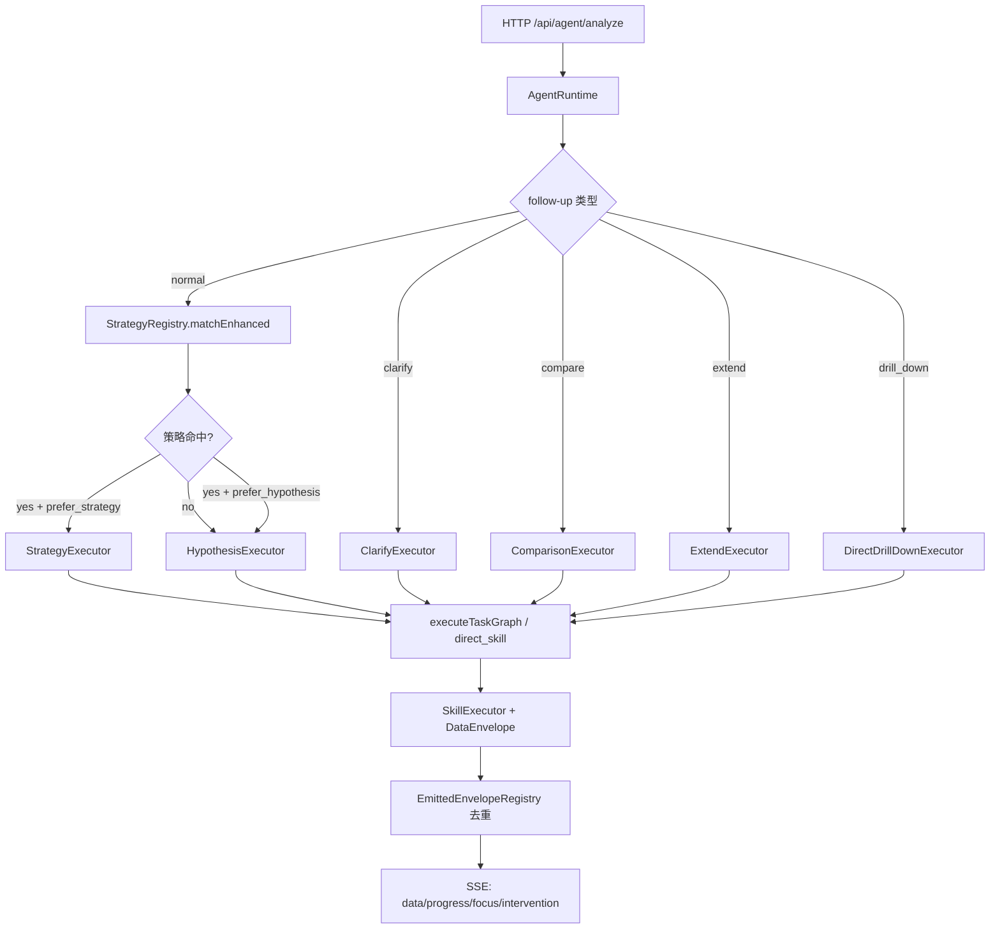

# SmartPerfetto 架构深度分析（与代码对齐）

> 更新日期：2026-02-11
> 范围：以当前 `backend/src/agent/` 的 **目标驱动 Agent** 主链路为准（trace-scoped，多轮对话可持续）。

本目录用于沉淀"可维护、可落地"的架构深度文档：不仅描述模块如何工作，也明确 **哪些已经实现**、**哪些是设计但未接入主链路**，避免"文档看起来很高级，实际系统仍像 pipeline + LLM 胶水"。

---

## 文档索引

| 文档 | 关注点 | 对应核心代码 |
|------|--------|--------------|
| [01-agent-runtime.md](./01-agent-runtime.md) | Runtime（薄协调层）与执行器路由 | `backend/src/agentv2/runtime/agentRuntime.ts` |
| [02-multi-round-conversation.md](./02-multi-round-conversation.md) | 多轮对话：follow-up、实体引用、上下文注入 | `backend/src/agent/context/enhancedSessionContext.ts` |
| [03-memory-state-management.md](./03-memory-state-management.md) | Memory：短期/长期、证据摘要、trace 隔离、持久化 | `backend/src/agent/state/traceAgentState.ts` |
| [04-strategy-system.md](./04-strategy-system.md) | Strategy：确定性流水线作为"工具"，以及如何与目标驱动 loop 融合 | `backend/src/agent/strategies/*` |
| [05-domain-agents.md](./05-domain-agents.md) | Domain Agents：Think-Act-Reflect、skills、动态 SQL 自主修复 | `backend/src/agent/agents/*` |
| [06-scrolling-startup-optimization.md](./06-scrolling-startup-optimization.md) | Scrolling/Startup 全流程梳理与 startup 对齐优化方案 | `backend/src/agent/strategies/*`, `backend/skills/composite/*startup*` |
| [07-domain-extensibility-refactor.md](./07-domain-extensibility-refactor.md) | 领域可扩展性重构蓝图（manifest/registry 驱动） | `backend/src/agent/config/*`, `backend/src/agent/core/*` |

---

## 一句话结论（为什么以前"机械化"，现在如何避免）

SmartPerfetto 的核心升级点是：从"按固定 pipeline 走完就结束"变为围绕 **用户目标** 构建闭环：

**目标（Goal） → 假设空间（Hypotheses） → 实验（Experiments） → 证据（Evidence） → 结论（Conclusion） → 下一步（Next）**

并且把"已做过的实验/已获得的证据摘要/用户偏好"在每一轮都注入给模型（同一 trace），减少重复、遗漏与空洞复述。

---

## 架构总览（当前真实运行路径）

### 最新对齐点（2026-02-11）

- Orchestrator 路由已是“多执行器优先级链”：`clarify/compare/extend/drill_down` 优先于策略匹配。
- 策略命中后仍会按 `DomainManifest.strategyExecutionPolicies` 决定是否偏好 hypothesis loop。
- `scene_reconstruction` 的 Stage2 task 已由 `DomainManifest.sceneReconstructionRoutes` 动态构建，不再写死二分逻辑。
- Data 输出统一走 `DataEnvelope` + `emitDataEnvelopes()`，并由 `EmittedEnvelopeRegistry` 做 session 级去重。
- 结论提示词已接入 scene template 链路：`sceneTemplateStore -> sceneRouter -> scenePolicy`。
- `layered` 结果路径新增统一解包与列定义透传：`skillAnalysisAdapter` 提取 `display.columns -> columnDefinitions`，前端按该定义渲染并保留 `navigate_range.durationColumn` 依赖列。
- 启动与滑动展示层时长统一 `ms`，时间跳转链路保持 `ns` 精度（双轨时间契约）。
- 真实 trace 回归纳入默认流程：`npm run test:skill-eval:real-traces` 覆盖 `test-traces/app_start_heavy.pftrace` 与 `test-traces/app_aosp_scrolling_heavy_jank.pftrace`。

关键约束：
- **仅同一 trace**：所有记忆/状态以 `(sessionId, traceId)` 为 key，且有迁移时的 trace guard。
- **偏好预算是软约束**：默认偏好每轮 ≤3 个实验；但当结果不足时允许继续（最多到硬上限）。
- **结论必须含证据链摘要**：输出结构固定为"结论 / 证据链 / 不确定性与反例 / 下一步"。

---

## Scrolling / Startup 专题（当前重点）

- `scrolling`：已接入 strategy 主链路（概览 -> 会话 -> 帧级 `direct_skill`）。
- `startup`：已接入 `startupStrategy` 三阶段主链路（`startup_overview -> launch_event_overview -> launch_event_detail`）。
- `scene_reconstruction`：二阶段改为 `DomainManifest.sceneReconstructionRoutes` 路由驱动（默认 startup -> `startup_detail`，其他 -> `scrolling_analysis`）。
- `drill-down`：`frame/session/startup` 三类实体直达已统一到 `drillDownRegistry` 映射入口。

详见：
- [06-scrolling-startup-optimization.md](./06-scrolling-startup-optimization.md)

---

## 模块清单（与代码对齐）

### Agent System（141 source files，不含测试）

#### Core (`backend/src/agent/core/`)

| 文件 | 职责 |
|------|------|
| agentRuntime.ts | 主协调器（薄协调层）：状态装配 → 意图理解 → 执行器路由 → 结论生成 |
| orchestratorTypes.ts | Orchestrator 配置/结果/选项/上下文类型定义 |
| circuitBreaker.ts | 熔断器，置信度过低时触发用户介入 |
| modelRouter.ts | 多模型路由（DeepSeek/OpenAI/Anthropic/GLM） |
| stateMachine.ts | 旧状态机实现（已废弃，保留兼容） |
| intentUnderstanding.ts | 意图理解 |
| hypothesisGenerator.ts | 初始假设生成 |
| conclusionGenerator.ts | 结论综合（强制结构化输出：结论/证据链/不确定性/下一步） |
| conclusionSceneTemplates.ts | 结论场景模板入口（resolve/build hints） |
| sceneRouter.ts | 模板路由（aspect/goal/finding 评分） |
| scenePolicy.ts | 模板转 prompt hints（含 deep_reason_label 占位符） |
| sceneTemplateStore.ts | base/override YAML 加载与缓存 |
| sceneTemplateValidator.ts | scene template 配置校验与告警 |
| feedbackSynthesizer.ts | LLM 综合发现 |
| followUpHandler.ts | 后续问题处理与上下文延续 |
| pipelineExecutor.ts | 旧 pipeline 执行器（已废弃，保留兼容） |
| taskGraphPlanner.ts | 任务图生成 |
| taskGraphExecutor.ts | 依赖有序执行 |
| drillDownResolver.ts | 解析 drill-down 导航（时间戳/区间跳转） |
| entityCapture.ts | 从分析结果中提取实体（进程/线程/帧） |
| strategySelector.ts | Trace 上下文检测与策略选择 |
| interventionController.ts | 用户介入控制器（不确定时请求用户选择方向） |
| incrementalAnalyzer.ts | 增量分析器（避免重复分析已覆盖区间） |
| jankCauseSummarizer.ts | 卡顿原因摘要生成（结构化结论） |
| emittedEnvelopeRegistry.ts | 已发送 DataEnvelope 注册（去重/追踪） |

#### Executors (`backend/src/agent/core/executors/`)

| 执行器 | 模式 | 触发条件 | 说明 |
|--------|------|----------|------|
| strategyExecutor.ts | Deterministic | Strategy matched | 确定性多阶段流水线 |
| hypothesisExecutor.ts | Adaptive LLM | No strategy match | 假设驱动多轮分析 |
| directSkillExecutor.ts | Direct bypass | Stage template | 直接执行 Skill（零 LLM 开销） |
| clarifyExecutor.ts | Conversation | User clarification | 处理用户澄清请求 |
| comparisonExecutor.ts | Conversation | Compare request | 对比多次分析结果 |
| extendExecutor.ts | Conversation | Extend request | 扩展上一轮分析 |
| directDrillDownExecutor.ts | Drill-down | Time/range navigation | 直接跳转时间戳或区间 |
| traceConfigDetector.ts | Detection | Trace loaded | Trace 配置检测（采样率/时长/数据源） |
| analysisExecutor.ts | Interface | - | 执行器基类接口 |

#### Strategies (`backend/src/agent/strategies/`)

| 文件 | 说明 |
|------|------|
| types.ts | StagedAnalysisStrategy, FocusInterval, StageDefinition, StageTaskTemplate |
| registry.ts | StrategyRegistry（keyword/LLM 混合匹配，含 fallback 元数据） |
| scrollingStrategy.ts | 滑动分析策略（3 阶段流水线） |
| startupStrategy.ts | 启动分析策略（3 阶段流水线） |
| sceneReconstructionStrategy.ts | 场景重建策略（Stage2 由 manifest 路由驱动） |
| helpers.ts | 区间提取和格式化工具函数 |

#### Config Registries (`backend/src/agent/config/`)

| 文件 | 说明 |
|------|------|
| domainManifest.ts | 策略偏好、证据清单、scene 路由规则（single source of truth） |
| drillDownRegistry.ts | `entity -> direct_skill` 映射（resolver/executor 复用） |

#### Context & State (`backend/src/agent/context/` + `state/`)

| 文件 | 说明 |
|------|------|
| context/enhancedSessionContext.ts | 多轮对话上下文（turns/findings/entity store/working memory） |
| context/contextBuilder.ts | 按角色过滤上下文 |
| context/contextTypes.ts | 上下文类型定义 |
| context/entityStore.ts | 跨轮次实体追踪（进程/线程/帧/区间） |
| context/focusStore.ts | 用户关注点（实体/时间段/指标/问题）与增量范围 |
| context/policies/ | Planner/Evaluator/Worker Policy（3 files） |
| state/traceAgentState.ts | Trace-scoped 持久状态（目标/偏好/实验/证据摘要） |
| state/checkpointManager.ts | 暂停/恢复 |
| state/sessionStore.ts | 会话持久化 |

#### Compaction (`backend/src/agent/compaction/`)

| 文件 | 说明 |
|------|------|
| compactionTypes.ts | 压缩类型定义 |
| contextCompactor.ts | Token 溢出防护 |
| tokenEstimator.ts | Token 用量估算 |
| strategies/slidingWindowStrategy.ts | 滑动窗口压缩 |

#### Fork (`backend/src/agent/fork/`)

| 文件 | 说明 |
|------|------|
| forkManager.ts | 会话分叉管理 |
| forkTypes.ts | 分叉类型定义 |
| mergeStrategies.ts | 分叉合并策略 |
| sessionTree.ts | 会话树结构 |

#### Domain Agents (`backend/src/agent/agents/domain/`)

| Agent | 说明 |
|-------|------|
| frameAgent.ts | 帧渲染分析（jank_frame_detail, scrolling_analysis, consumer_jank_detection） |
| cpuAgent.ts | CPU 调度与负载 |
| memoryAgent.ts | 内存分配与 GC |
| binderAgent.ts | IPC/Binder 事务 |
| additionalAgents.ts | Startup、Interaction、ANR、System（4 个 Agent） |

#### Planning & Evaluation (`backend/src/agent/agents/`)

| 文件 | 说明 |
|------|------|
| plannerAgent.ts | 意图理解、任务分解 |
| evaluatorAgent.ts | 结果质量评估 |
| iterationStrategyPlanner.ts | 迭代策略决策（置信度评估，是否继续下一轮） |
| baseExpertAgent.ts | Expert Agent 基类 |
| scrollingExpertAgent.ts | 滑动专家（legacy） |
| base/baseAgent.ts | Agent 基类（Think-Act-Reflect） |
| base/baseSubAgent.ts | SubAgent 基类 |
| tools/adbTools.ts | ADB 工具集成 |

#### Decision Trees (`backend/src/agent/decision/`)

| 文件 | 说明 |
|------|------|
| decisionTreeExecutor.ts | 决策树执行引擎 |
| decisionTreeStageExecutor.ts | 决策树与 Pipeline 集成 |
| skillExecutorAdapter.ts | Skill 调用适配器 |
| types.ts | 决策节点/分支/树类型（CHECK/ACTION/BRANCH/CONCLUDE） |
| trees/scrollingDecisionTree.ts | 滑动场景决策树 |
| trees/launchDecisionTree.ts | 启动场景决策树 |

#### Experts (`backend/src/agent/experts/`)

| 文件 | 说明 |
|------|------|
| launchExpert.ts | 启动性能专家 |
| interactionExpert.ts | 交互响应专家 |
| systemExpert.ts | 系统级分析专家 |
| base/baseExpert.ts | Expert 基类 |
| crossDomain/baseCrossDomainExpert.ts | 跨域分析基类 |
| crossDomain/hypothesisManager.ts | 假设生命周期管理 |
| crossDomain/dialogueProtocol.ts | Agent 通信协议 |
| crossDomain/moduleCatalog.ts | 模块目录（framework/vendor capabilities） |
| crossDomain/moduleExpertInvoker.ts | 模块专家调用 |
| crossDomain/experts/performanceExpert.ts | 性能综合分析 |

#### Tools (`backend/src/agent/tools/`)

| 文件 | 说明 |
|------|------|
| sqlExecutor.ts | SQL 查询执行 |
| sqlGenerator.ts | 动态 SQL 生成 |
| sqlValidator.ts | SQL 验证与修复 |
| frameAnalyzer.ts | 帧分析 |
| skillInvoker.ts | Skill 调用（参数映射） |
| dataStats.ts | 数据统计 |

#### Communication (`backend/src/agent/communication/`)

- agentMessageBus.ts - Agent 间消息总线

#### Hooks (`backend/src/agent/hooks/`)

| 文件 | 说明 |
|------|------|
| hookTypes.ts | Hook 生命周期和注册类型 |
| hookRegistry.ts | Hook 注册管理 |
| hookContext.ts | Hook 执行上下文 |
| middleware/loggingMiddleware.ts | 日志中间件 |
| middleware/timingMiddleware.ts | 计时中间件 |

#### Detectors (`backend/src/agent/detectors/`)

| 文件 | 说明 |
|------|------|
| architectureDetector.ts | 架构检测（总控） |
| baseDetector.ts | Detector 基类 |
| standardDetector.ts | 标准 Android |
| composeDetector.ts | Jetpack Compose |
| flutterDetector.ts | Flutter |
| webviewDetector.ts | WebView |
| types.ts | 检测类型定义 |

#### Other Agent Files

| 文件 | 说明 |
|------|------|
| types/agentProtocol.ts | Agent 通信协议类型 |
| types.ts | 通用 Agent 类型 |
| llmAdapter.ts | LLM 适配器 |
| toolRegistry.ts | 工具注册表 |
| traceRecorder.ts | Trace 录制 |
| evalSystem.ts | 评估系统 |

---

### Services（43 source files，不含测试）

| Service | 位置 | 说明 |
|---------|------|------|
| TraceProcessorService | services/traceProcessorService.ts | HTTP RPC 查询（端口池 9100-9900） |
| WorkingTraceProcessor | services/workingTraceProcessor.ts | Trace Processor 工厂与实例管理 |
| PortPool | services/portPool.ts | RPC 端口池管理 |
| SkillExecutor | services/skillEngine/skillExecutor.ts | YAML Skill 引擎 |
| SkillLoader | services/skillEngine/skillLoader.ts | Skill 加载器 |
| SkillAnalysisAdapter | services/skillEngine/skillAnalysisAdapter.ts | Skill 分析适配 |
| AnswerGenerator | services/skillEngine/answerGenerator.ts | 答案生成器 |
| SmartSummaryGenerator | services/skillEngine/smartSummaryGenerator.ts | 智能摘要 |
| EventCollector | services/skillEngine/eventCollector.ts | 事件收集 |
| PipelineSkillLoader | services/pipelineSkillLoader.ts | Pipeline Skill 加载器（含 Teaching） |
| PipelineDocService | services/pipelineDocService.ts | Pipeline 文档服务 |
| RenderingPipelineDetectionSkillGenerator | services/renderingPipelineDetectionSkillGenerator.ts | 渲染管线检测 Skill 动态生成 |
| PerfettoStdlibScanner | services/perfettoStdlibScanner.ts | Perfetto 标准库扫描 |
| HTMLReportGenerator | services/htmlReportGenerator.ts | HTML 报告生成 |
| SessionLogger | services/sessionLogger.ts | JSONL 会话日志 |
| AutoAnalysisService | services/autoAnalysisService.ts | 自动分析服务 |
| SessionPersistenceService | services/sessionPersistenceService.ts | 会话持久化 |
| ResultExportService | services/resultExportService.ts | 结果导出 |
| AIService | services/aiService.ts | AI 服务（基础） |
| AdvancedAIService | services/advancedAIService.ts | AI 服务（高级） |
| EnhancedAIService | services/enhancedAIService.ts | AI 服务（增强） |
| PromptTemplateService | services/promptTemplateService.ts | 提示词模板 |
| ADB Services | services/adb/ | ADB 上下文检测与设备匹配（5 files） |
| AnalysisTemplates | services/analysisTemplates/ | 分析模板（CPU/帧/四象限） |

---

### Skills（104 YAML 定义）

| 类别 | 数量 | 位置 |
|------|------|------|
| Atomic | 32 | `backend/skills/atomic/` |
| Composite | 27 | `backend/skills/composite/` |
| Pipeline | 25 | `backend/skills/pipelines/` |
| Deep | 2 | `backend/skills/deep/` |
| Modules | 18 | `backend/skills/modules/` |
| Vendors | 8 | `backend/skills/vendors/` |

---

### Routes（16 route files）

| 路由文件 | 说明 |
|----------|------|
| agentRoutes.ts | Agent 分析主链路（22 endpoints） |
| perfettoSqlRoutes.ts | Perfetto SQL 查询 |
| perfettoLocalRoutes.ts | 本地 Perfetto 服务 |
| simpleTraceRoutes.ts | 简单 Trace 操作 |
| aiChatRoutes.ts | AI 对话 |
| reportRoutes.ts | 报告生成 |
| exportRoutes.ts | 结果导出 |
| sessionRoutes.ts | 会话管理 |
| skillRoutes.ts | Skill 查询 |
| skillAdminRoutes.ts | Skill 管理 |
| templateAnalysisRoutes.ts | 模板分析 |
| advancedAIRoutes.ts | 高级 AI |
| autoAnalysis.ts | 自动分析 |
| traceProcessorRoutes.ts | Trace Processor |
| trace.ts | Trace 操作 |
| sql.ts | SQL 直接查询 |

---

### Frontend Plugin

位置：`perfetto/ui/src/plugins/com.smartperfetto.AIAssistant/`

| 文件 | 说明 |
|------|------|
| ai_panel.ts | 主 UI（含 Mermaid 渲染） |
| ai_service.ts | 后端通信 |
| sql_result_table.ts | 数据表格（schema-driven） |
| chart_visualizer.ts | 图表可视化 |
| navigation_bookmark_bar.ts | 导航书签 |
| scene_navigation_bar.ts | 场景导航栏 |
| scene_reconstruction.ts | 场景重建 UI |
| intervention_panel.ts | 用户介入面板 |
| session_manager.ts | 会话管理 |
| settings_modal.ts | 设置弹窗 |
| mermaid_renderer.ts | Mermaid 图表渲染器 |
| data_formatter.ts | 数据格式化 |
| auto_pin_utils.ts | 自动 Pin 工具 |
| sse_event_handlers.ts | SSE 事件处理 |
| types.ts | 类型定义 |
| styles.scss | 样式 |
| renderers/ | 渲染器模块（formatters.ts） |
| generated/ | 自动生成类型（data_contract/frame_analysis/jank_frame_detail） |

---

## 文件统计总览

| 类别 | 数量 |
|------|------|
| Agent System | ~131 source files |
| Services | ~43 service files |
| Skills | 112 definitions (32 atomic + 27 composite + 25 pipelines + 2 deep + 18 modules + 8 vendors) |
| Routes | 16 route files |
| Frontend Plugin | ~22 files |

---

## 推荐阅读顺序

1. `docs/ARCHITECTURE.md`：目标驱动 Agent 总览（短）
2. 本目录 `01/02/03`：编排 + 对话 + memory（主矛盾在这里）
3. `04/05`：策略与技能工具化（落地"像专家"体验的关键）
