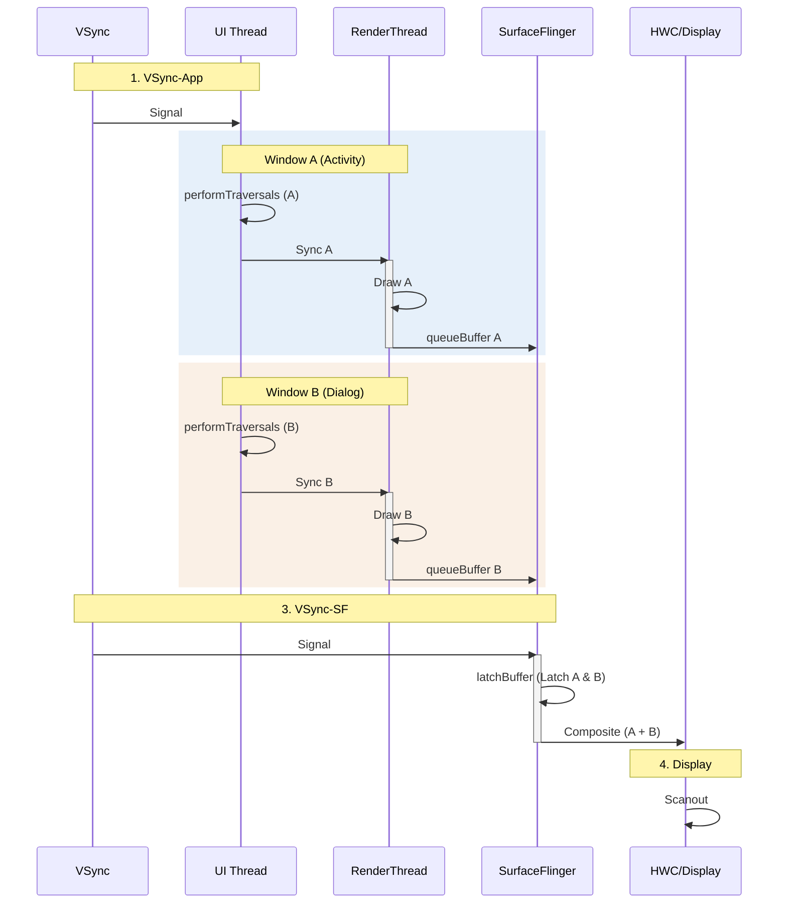

# Multi-Window AOSP Rendering Pipeline (Dual Source)

在性能优化中，这也是一个极易被忽视的场景：**同一个 App 进程同时显示两个窗口**。

常见的例子包括：
1.  **Dialog**: 打开一个 Dialog 时，背后的 Activity 依然可见，此时两者都在绘制。
2.  **分屏/多窗口模式**: 两个 Activity 同时处于 `RESUMED` 状态。
3.  **悬浮窗**: System Alert Window 覆盖在 Activity 之上。

## 1. 核心瓶颈：串行化 (Serialization)

虽然它们是两个独立的 Window（拥有各自的 Surface），但在 App 进程内部，它们共享极其有限的资源。

### UI Thread Contention (主线程争抢)
Android 的 `Choreographer` 是线程单例的。当 Vsync 信号到来时，主线程会收到**一次**回调，但它必须处理**所有**活跃窗口的 Input/Animation/Traversal。
*   **现象**: 在 Trace 中，你会看到 `doFrame` 内部连续出现两个 `performTraversals`。
*   **后果**: 如果第一个窗口（比如复杂的 Activity）耗时过长，会直接推迟第二个窗口（比如 Dialog）的更新，甚至导致掉帧。

### RenderThread Contention (渲染线程争抢)
更致命的是，一个 App 进程只有一个 `RenderThread`。
*   **Serial Draw**: 所有窗口的 GPU 命令生成任务必须排队执行。
*   **Context Switching**: 虽然在同一个 RenderThread 中通常**共享同一个 EGLContext**，但 GL 状态机的切换（State Change）和资源绑定（Bind Texture）开销是不可避免的。

## 2. 深度执行流程 (Deep Execution Flow)

### 阶段一：Vsync 唤醒与分发
1.  **Vsync-App**: 主线程被唤醒。
2.  **Choreographer**: 触发 `doFrame`。
3.  **Callback Queue**: 处理回调。此时，两个 `ViewRootImpl` 都注册了 Traversal 回调。

### 阶段二：UI Thread Serial Execution
1.  **Window A (Activity)**: 执行 `performTraversals` (Measure/Layout/Draw)。生成 DisplayList。
2.  **Window B (Dialog)**: 紧接着执行 `performTraversals`。生成 DisplayList。
    *   *Risk*: 此时如果超过 16.6ms，两者的帧都会延迟。

### 阶段三：RenderThread Serial Execution
1.  **Sync A**: 渲染线程同步 Window A 的数据。
2.  **Draw A**: 渲染线程生成 Window A 的 GL 指令 -> `eglSwapBuffers` -> `queueBuffer` (Surface A)。
3.  **Sync B**: 渲染线程同步 Window B 的数据。
4.  **Draw B**: 渲染线程生成 Window B 的 GL 指令 -> `eglSwapBuffers` -> `queueBuffer` (Surface B)。

## 3. 渲染时序图

注意 `RenderThread` 的忙碌程度是普通情况的两倍。

## 4. 优化建议
*   **合并窗口**: 如果可能，尽量用 View 的方式实现（如 Fragment Dialog），而不是真正的 Window Dialog。这样可以将两次 Traversal 合并为一次。
*   **减少层级**: 确保背景窗口（如果不可见）由于 `View.GONE` 或 `STOPPED` 状态而不参与绘制。
