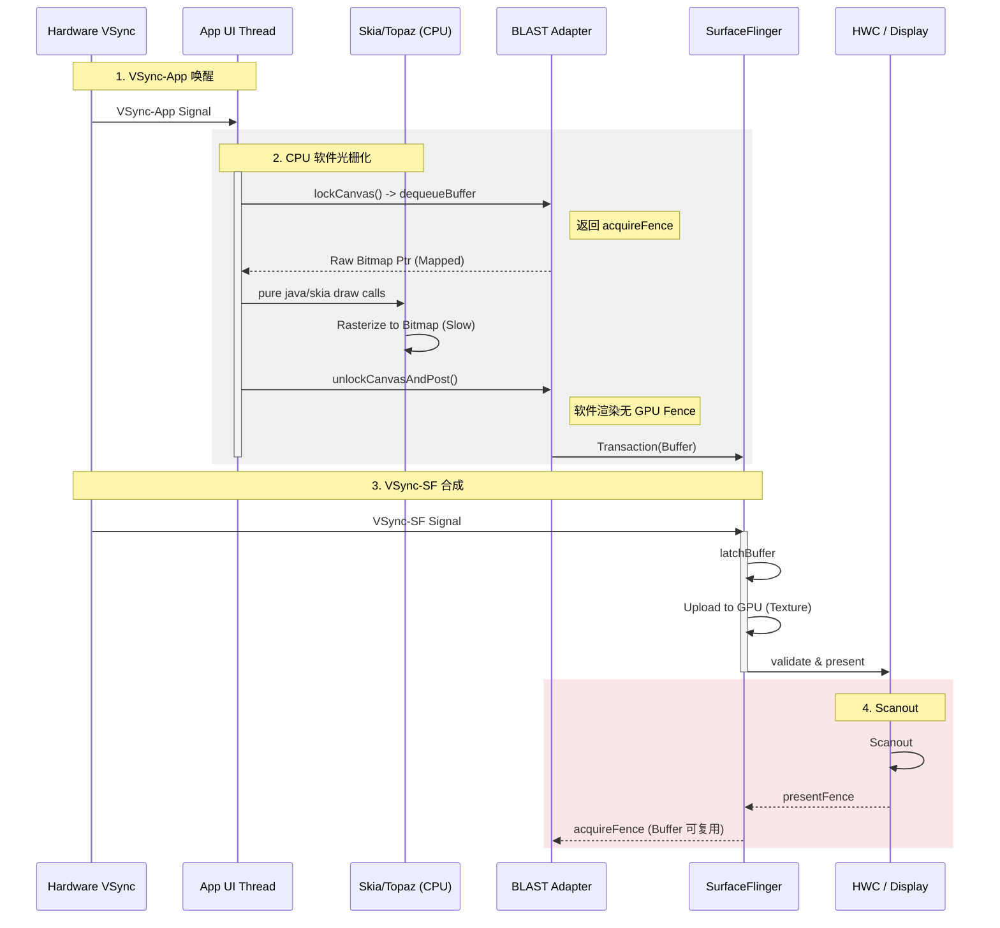

# Software Rendering Pipeline

当 `View` 被设置为关闭硬件加速，或者直接使用 `Surface.lockCanvas()` 时，进入软件渲染模式。
即便是在软件绘制模式下，最终的 Buffer 提交在现代 Android 上也已迁移至 BLAST 通道。

## 1. 纯软件绘制流程详解 (Deep Execution Flow)

这是 Android 最古老的绘制方式，现在通常只用于自定义 View (`onDraw`) 或者为了降级兼容。全程依靠 CPU。

### 第一阶段：Lock (锁定画布)
1.  **lockCanvas**: App 向系统申请：“给我一块内存（Bitmap），我要往上面画画”。
    *   这里会直接操作 Buffer 的内存地址。
2.  **CPU Rasterization (光栅化)**:
    *   你调用的 `canvas.drawCircle`，底层是 Skia 库用 **CPU 指令** 一个像素一个像素去计算颜色并填进内存。
    *   *Trace*: `Skia` 相关的标签，CPU 占用率飙升。

### 第二阶段：Unlock & Post (提交)
1.  **unlockCanvasAndPost**: 画完了，告诉系统“这块内存我写好了”。
2.  **Copy/Send**: 这块 Bitmap 会被提交给 SurfaceFlinger（在 BLAST 下也是封装成 Transaction）。
    *   *劣势*: 分辨率越高，Bitmap 越大，CPU 画得越慢，传输也越慢。

---

## 2. 核心差异
与硬件加速相比，软件渲染 **完全不使用 GPU** 进行绘图（合成阶段 SF 仍然可能用 GPU）。所有的像素计算（画线、画图、混合）都由 CPU 上的 **Skia** 库完成。

## 2. 软件渲染时序图

这是一个全 CPU 的过程，不涉及 RenderThread 的 GPU 指令提交。

## 3. 详细步骤 (Trace 视角)

1.  **Vsync-App**: 主线程唤醒。
2.  **Surface.lockCanvas()**:
    *   **IPC**: 向本地 BLASTAdapter 请求一个 Buffer。
    *   **Map**: 将 GraphicBuffer 的内存映射 (mmap) 到 App 进程空间。
    *   *Trace*: `lockCanvas`, `dequeueBuffer`.
3.  **Draw (CPU Rasterization)**:
    *   `View.draw()` 调用 `Canvas` API。
    *   底层调用 `SkCanvas` (C++)。
    *   CPU 密集型操作。
    *   *Trace*: `draw`, `Skia DoDraw`.
4.  **Surface.unlockCanvasAndPost()**:
    *   **Unmap**: 解除内存映射。
    *   **Queue**: 提交 Buffer。
    *   **Transaction**: 将 Buffer 封装在 Transaction 中发送给 SF。
    *   *Trace*: `unlockCanvasAndPost`, `queueBuffer`.

## 4. 性能特征
*   **带宽瓶颈**: 从 CPU 内存拷贝像素到 GraphicBuffer 非常慢。
*   **CPU 瓶颈**: 复杂图形（阴影、大图缩放）会占满 CPU。
*   **部分更新 (Dirty Rect)**: 软件渲染通常支持“只重绘变化区域”，这是它唯一的优势。
