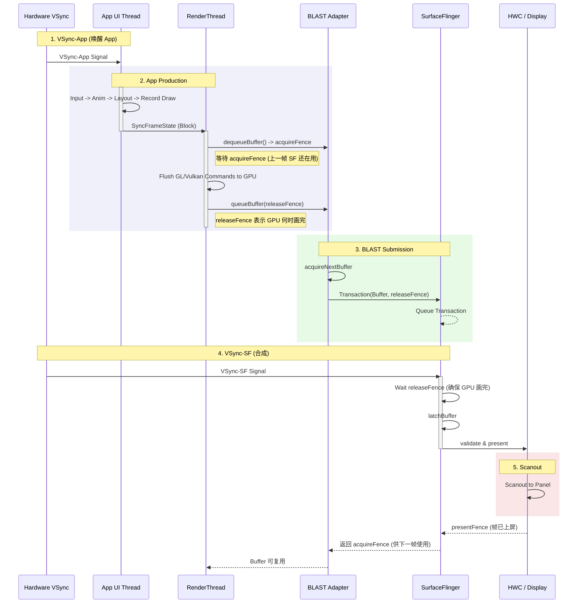
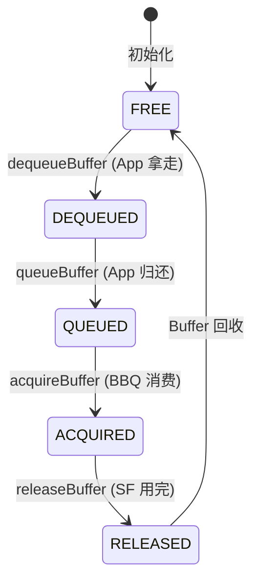
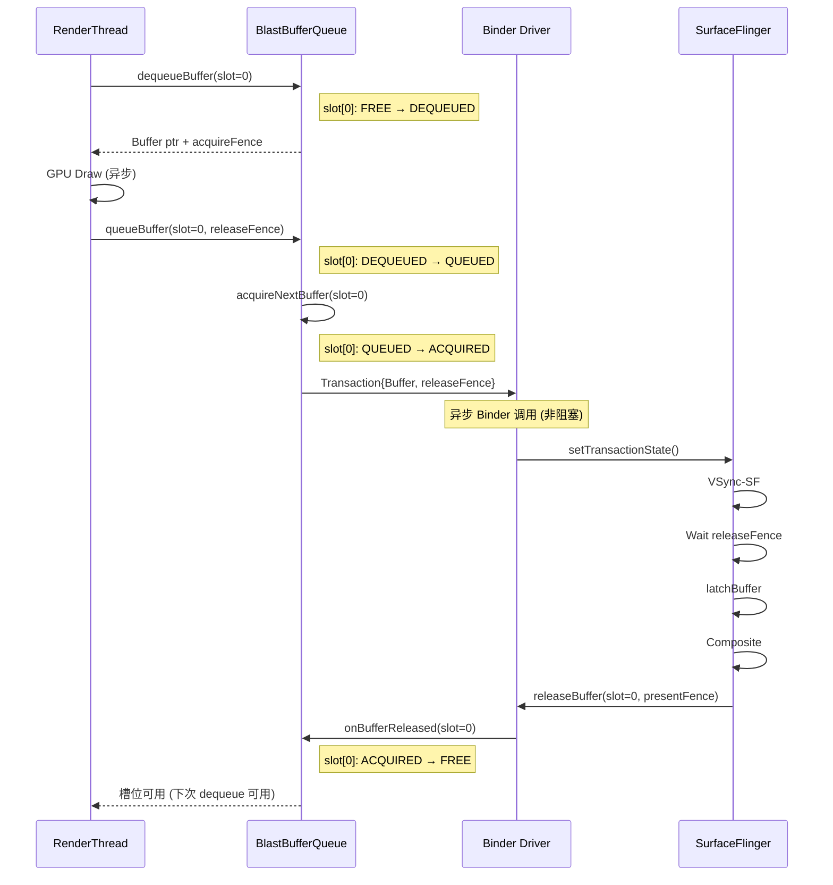

# Standard AOSP Rendering Pipeline (Deep Dive: BLAST)

> [!NOTE]
> **适用版本**: 本文档基于 **Android 12+ BLAST 成熟架构**。Android 16 新增的 `RuntimeColorFilter` / `RuntimeXfermode` API 允许开发者创建自定义图形效果（如 Threshold、Sepia、Hue Saturation），进一步扩展了 RenderThread 的能力。

这是 Android 现代硬件加速渲染链路（Android 10+, 尤其是 Android 12+ 之后）。与旧版相比，最核心的变化是引入了 **BLAST (Buffer Layer State Transition)** 机制，取代了传统的 Binder-based BufferQueue 提交模式。

## 1. 全链路执行流程详解 (Deep Execution Flow)

在深入图表之前，我们先从 App 的视角完整走一遍“一帧是如何画出来的”。这个过程像是一个精密的工厂流水线：

### 第一阶段：UI Thread (主线程) - 生产蓝图
当 `Vsync-App` 信号到达时，主线程被唤醒，开始构建这一帧的“绘制蓝图”：
1.  **Input (输入处理)**: 处理触摸事件。如果你点击了按钮，View 的状态在这里改变（如 `setPressed(true)`），并标记 `invalidate()`。
2.  **Animation (动画)**: 属性动画 (`ValueAnimator`) 在这里计算当前时间点的值（比如按钮缩放到 1.1倍）。
3.  **Measure (测量)**: 确定每个 View 的大小。这是自顶向下的递归调用，父 View 问子 View “你要多大”，子 View 算完告诉父 View。
4.  **Layout (布局)**: 确定每个 View 的位置。父 View 根据测量结果，告诉子 View “你坐在 (x, y) 坐标”。
5.  **Draw (记录/构建)**: **注意，这里并没有真正的像素产生！**
    *   这里执行 `View.onDraw(Canvas)`。
    *   但这个 Canvas 是 `RecordingCanvas`。它的作用是把你的绘制命令（画圆、画文字、画图）**记录** 下来，存到一个叫 `DisplayList` (或 `RenderNode`) 的数据结构中。
    *   产物：**一堆绘制指令列表 (DisplayList)**。

### 第二阶段：Sync (同步) - 移交蓝图
UI 线程做完所有事后，需要把最新的 DisplayList 交给渲染线程。
*   **SyncFrameState**: 这是一个阻塞操作。UI 线程会卡住，等待 RenderThread 醒来并把 DisplayList 及其相关资源（Bitmap 等）同步过去。
*   **为什么阻塞？** 为了保证线程安全，防止 RenderThread 在画的时候 UI 线程改了数据。

### 第三阶段：RenderThread (渲染线程) - 真正的绘制
RenderThread 拿到蓝图后，开始干活：
1.  **dequeueBuffer**: 它向系统（BLASTBufferQueue）要一张空白的画布（Buffer）。
    *   *Trace*: 你会看到 `dequeueBuffer` 耗时，如果很久，说明前面太慢或者没 Buffer 了。
2.  **Flush Commands (GPU Draw)**:
    *   它遍历 DisplayList，把里面的“画圆、画图”指令，翻译成 GPU 能听懂的 **OpenGL/Vulkan 指令**。
    *   调用 `glDraw*` 或 `vkCmdDraw`。
    *   此时 CPU 并不怎么累，累的是 GPU。
3.  **queueBuffer (提交)**:
    *   画完了，把这张 Buffer 还回去。
    *   在 BLAST 模式下，这会触发一个 Transaction。

### 第四阶段：提交与合成 (BLAST & SurfaceFlinger)
1.  **BLAST Transaction**: App 告诉 SurfaceFlinger：“这是新的一帧（Buffer），同时我的窗口位置在 (x, y)”。
2.  **SurfaceFlinger**: 收到所有 App 的 Transaction，按照 Z-Order 把它们拼在一起。
3.  **HWC**: 最终把拼好的图送到屏幕上显示。

---

## 2. 核心组件交互图 (Overview)

在深入 Trace 之前，先建立宏观视角：

-   **App (UI Thread)**: 负责构建视图树，生产 DisplayList。
-   **App (RenderThread)**: 负责将 DisplayList 转换为 GPU 指令。
-   **BLASTBufferQueue (BBQ)**: 运行在 App 进程侧的适配器。它将传统的 `BufferQueue` 生产模式转化为 `SurfaceControl` 的 Transaction 提交。
-   **SurfaceFlinger (SF)**: 接收 Transaction，原子性地应用这些 Buffer 更新。
-   **HWC (Hardware Composer)**: 硬件合成。

---

## 2. 详细渲染时序图 (BLAST Sequence)

这张图展示了引入 BLAST 后的变化：Buffer 的提交变成了 Transaction 的一部分。



---

## 3. 渲染步骤深度拆解 (Trace 视角)

以下步骤对应 Perfetto Trace 中的实际 Slice 标签。

### 阶段一：Sync & RenderThread (生产)

当 `Vsync-App` 触发，UI 线程完成后：

1.  **DrawFrame**: RenderThread 开始绘制。
    *   *Trace*: `DrawFrame`
2.  **dequeueBuffer**: RT 向本地的 BBQ 申请 Buffer。
    *   *注意*: 在 BLAST 模式下，BufferQueue 的逻辑主要在 App 进程内（BLASTBufferQueue 是 Consumer）。
    *   *Trace*: `dequeueBuffer`, `BLASTBufferQueue::dequeueBuffer `
3.  **queueBuffer**: 绘制完成，还给 BBQ。
    *   *Trace*: `queueBuffer`, `BLASTBufferQueue::onFrameAvailable`

### 阶段二：BLAST Adapter (转换)

这是最关键的新增步骤，通常发生在 RenderThread 或专门的 BLAST 线程中。

4.  **acquireNextBuffer**: BBQ 作为消费者，从队列中取回刚刚画好的 Buffer。
5.  **Build Transaction**: BBQ 创建一个 `SurfaceControl.Transaction`。
    *   `t.setBuffer(buffer)`: 设置新的 Buffer。
    *   `t.setAcquireFence(fence)`: 设置同步栅栏。
6.  **applyTransaction**: 将 Transaction 发送给 SurfaceFlinger。
    *   *Trace*: `SurfaceControl::applyTransaction` (可以看到 Binder 调用)

### 阶段三：SurfaceFlinger (事务处理)

7.  **setTransactionState**: SF 收到 Transaction，放入待处理队列。
    *   *Trace*: `setTransactionState`
8.  **handleMessageInvalidate/Refresh**: Vsync-SF 到达。
9.  **flushTransaction**: SF 统一应用所有挂起的 Transaction（包括 App Buffer 更新、Window 位置变化等）。
    *   **原子性**: 保证 Buffer 更新和窗口大小变化是**同时**生效的，彻底解决了旧架构中的画面撕裂和尺寸不同步问题。
10. **latchBuffer**: 锁定当前显示的 Buffer。

---

## 3.5 BlastBufferQueue Buffer 生命周期 (Deep Dive)

这是理解 BLAST 异步机制的核心。BBQ 内部维护一个 **Buffer 槽位池**（通常 3 个槽位，支持 Triple Buffering）。

### Buffer 状态机



### Buffer 计数逻辑 (槽位视角)

| 操作 | 触发者 | 槽位变化 | Fence |
|:---|:---|:---|:---|
| **dequeueBuffer** | RenderThread | FREE → DEQUEUED (App 占用 +1) | 返回 acquireFence |
| **queueBuffer** | RenderThread | DEQUEUED → QUEUED (App 占用 -1, 待消费 +1) | 传入 releaseFence |
| **acquireBuffer** | BBQ 内部 | QUEUED → ACQUIRED (待消费 -1, 消费中 +1) | — |
| **releaseBuffer** | SF (通过回调) | ACQUIRED → FREE (消费中 -1) | presentFence 通知完成 |

### 异步流转时序 (App → SF)



### 关键点：为什么是异步的？

1.  **Binder 非阻塞**: `applyTransaction` 是异步 Binder 调用，RenderThread 不等待 SF 处理完。
2.  **Fence 同步**: GPU 完成通过 releaseFence 告知 SF，而非 CPU 等待。
3.  **槽位复用**: App 可以继续 dequeue 下一个槽位（如 slot=1），无需等待 slot=0 被 SF 释放。

### Triple Buffering 示意

```
时间 →
App:    [Draw F0]  [Draw F1]  [Draw F2]  [Draw F3] ...
           ↓          ↓          ↓          ↓
Slot:   slot[0]    slot[1]    slot[2]    slot[0]  ← 循环复用
           ↓          ↓          ↓          ↓
SF:        ...    [Latch F0] [Latch F1] [Latch F2] ...
```

## 4. 线程任务详情 (Thread Roles)

| 线程名称 | 关键职责 | 常见 Trace 标签 |
| :--- | :--- | :--- |
| **RenderThread** | 生成 GPU 指令, **通过 BLAST 提交事务** | `DrawFrame`, `queueBuffer`, `applyTransaction` |
| **SurfaceFlinger** | 处理 Transactions, Latch Buffers, 合成 | `setTransactionState`, `handleMessageRefresh`, `latchBuffer` |
| **Binder Driver** | 传输 Transaction 数据 | `binder transaction` |

---

## 6. FrameTimeline & Jank Detection (Android 12+)

在 AOSP 16 中，性能分析不再单纯依赖 "Vsync 周期"，而是基于 **FrameTimeline**。

### 核心机制
1.  **VsyncId**: 每个 Vsync 信号都有一个唯一的 ID。
2.  **Propagation**:
    *   `Choreographer` 收到 `VsyncId` (e.g., 1001)。
    *   App 在 `doFrame` 开始时根据 1001 计算预期上屏时间 (`ExpectedPresentTime`)。
    *   `RenderThread` 在提交 `queueBuffer` 时，将这个 1001 传给 SurfaceFlinger。
3.  **Matching**: SF 收到 Buffer 后，检查当前实际时间是否超过了 ID=1001 的预期时间。如果超过，标记为 **Jank**。

### Trace 表现
在 Perfetto 中：
*   **Expected Timeline**: 绿条，表示“这帧这应该在这里结束”。
*   **Actual Timeline**: 实心条，表示“这帧实际在这里结束”。
*   **Jank Tag**: 如果 Actual > Expected，系统会自动标记 `Jank` 或 `BigJank`。

