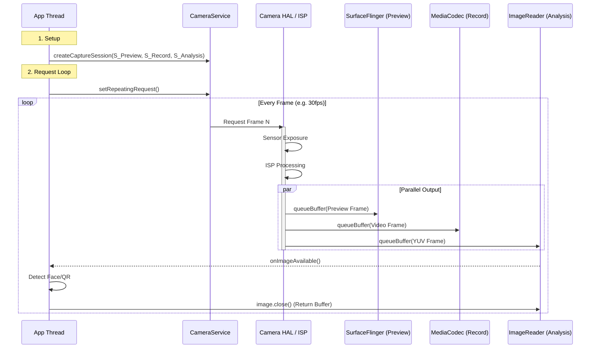
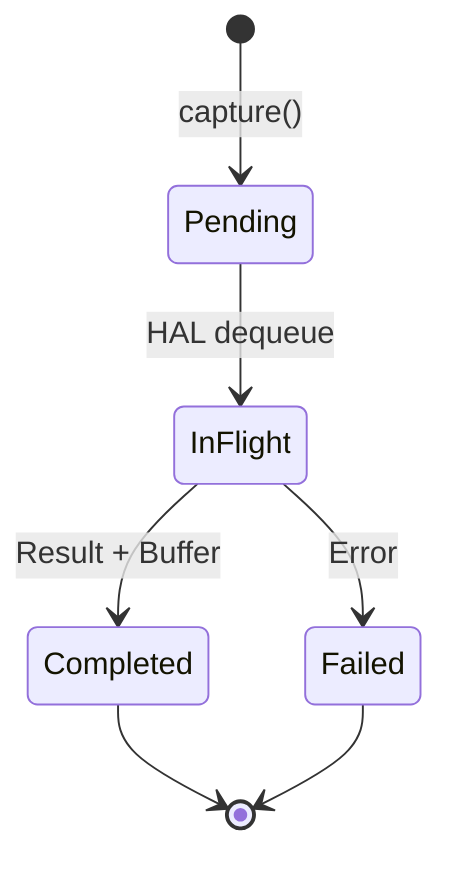

# Camera Rendering Pipeline (Camera2 & HAL3)

Camera 是 Android 系统中数据量最大、实时性要求最高的子系统之一。理解 Camera 管线对于优化“通过取景器预览”的流畅度以及实现高效的图像分析（如扫码、人脸识别）至关重要。

## 1. 核心架构：多流并发 (Multi-Stream)

与简单的 View 渲染不同，Camera 系统天生就是**多消费者 (Multiple Consumers)** 的。
Camera HAL (Hardware Abstraction Layer) 可以同时向多个 Surface 输出数据，而且通常是**零拷贝 (Zero Copy)** 的。

### 关键组件

1.  **CameraService (Native)**: 系统服务，负责管理 Camera 硬件资源。
2.  **Start Request**: App 发送 CaptureRequest (不仅包含“拍”的指令，还包含 ISO、曝光等参数)。
3.  **App Surface**: App 提前配置好的一组 Surface（例如一个给屏幕预览，一个给编码器录像）。
4.  **HAL3 / ISP**: 硬件图像信号处理器，产生原始数据并转换为 YUV/JPEG。

---

## 2. 数据流详解 (Deep Execution Flow)

### 阶段一：Configure (配置流)
在使用相机前，App 必须告诉系统“我要几路数据，每路多大”：
1.  **createCaptureSession**: App 传入一组 Surface 列表。
    *   `SurfaceView` (Preview)
    *   `MediaRecorder.getSurface()` (Video)
    *   `ImageReader.getSurface()` (Analysis/YUV)
2.  **HAL Configure**: CameraService 将这些 Surface 的 Usage/Format 告诉 HAL。HAL 会根据硬件能力（如 ISP 吞吐量）决定是否支持该组合。

### 阶段二：Request & Produce (生产)
1.  **setRepeatingRequest**: App 下发一个循环请求（通常用于预览）。
2.  **ISP Processing**: 传感器 (Sensor) 曝光 -> ISP 去噪/白平衡 -> 输出 RAW/YUV。
3.  **Buffer Fill**: HAL 直接向各个 Surface 的 BufferQueue 填充数据。
    *   *注意*: 现代 HAL 通常直接操作 GraphicBuffer，不经过 CPU 拷贝。

### 阶段三：Consume (消费/渲染)

#### Case A: Preview (预览)
*   **SurfaceView**: HAL 填充 Buffer -> SurfaceFlinger (Overlay) -> 屏幕。
    *   *延迟*: 最低。
*   **TextureView**: HAL 填充 Buffer -> SurfaceTexture -> App GL Texture -> App Draw -> SF -> 屏幕。
    *   *延迟*: 较高（多了一次 GPU 采样）。

#### Case B: Recording (录像)
*   **MediaCodec Input Surface**: HAL 填充 Buffer -> MediaCodec (Encoder) -> H.264/265 bitstream。
    *   *路径*: 全程 Hardware Tunneling，不经过 CPU。

#### Case C: Analysis (AI/CV)
*   **ImageReader**: HAL 填充 Buffer -> App `onImageAvailable`。
    *   App 通过 `image.getPlanes()` 获取 YUV 数据指针 (ByteBuffer)。
    *   *性能坑点*: 如果 App 拿到 Buffer 后处理太慢（不及时 close），会导致 HAL 没有空闲 Buffer 可用，从而发生**掉帧 (Frame Drop)**。

---

## 3. 渲染时序图

这是一个典型的“一产多销”模型。

## 4. 性能特征与调优

### 4.1 ZSL (Zero Shutter Lag)
为了解决“按下快门到真正拍照”的延迟：
*   Camera 实际上一直在后台以全分辨率拍图，存入一个环形缓冲区 (Ring Buffer)。
*   当用户按快门时，系统直接从缓冲区里“捞”出最近的一帧 JPEG。
*   这就是为什么现在的手机拍照几乎是瞬时的。

### 4.2 SurfaceView vs TextureView
*   **必须使用 SurfaceView** 的场景：4K/60fps 预览、DRM 内容、追求极致省电。
*   **可以使用 TextureView** 的场景：需要对预览画面做滤镜（美颜）、需要预览画面做动画（缩放/圆角）。

### 4.3 内存抖动
*   **ImageReader**: 务必复用。很多初学者在 `onImageAvailable` 里 `new byte[]` 来拷贝数据，这是性能杀手。应该直接使用 NDK 或 RenderScript/Vulkan 直接处理 `ByteBuffer`。

## 5. 常见 Trace 分析
在 Perfetto 中：
*   **CameraProvider**: 查看 HAL 层的耗时。
*   **CameraService**: 查看 Request 下发频率。
*   **dma_buf**: 监控 GraphicBuffer 的内存分配（Camera 预览通常也是大内存消耗户）。

## 6. HAL3 Request-Buffer 生命周期 (Deep Dive)

理解 Camera2 的 Request 与 Buffer 的生命周期是追查**掉帧**和**延迟**问题的关键。

### 6.1 Request 状态机

### 6.2 Buffer 生命周期

| 阶段 | 触发者 | Buffer 状态 |
|:---|:---|:---|
| **Dequeue** | HAL (ISP) | HAL 拥有，正在填充 |
| **Fill** | ISP Pipeline | 数据写入中 |
| **Queue** | HAL | 提交给 Consumer (SF/App) |
| **Acquire** | Consumer | Consumer 拥有，正在使用 |
| **Release** | Consumer | 归还给 BufferQueue |

### 6.3 Session Callback (性能关键)

`CameraCaptureSession.CaptureCallback` 提供了精细的时间戳信息：

| 回调方法 | 触发时机 | 性能分析用途 |
|:---|:---|:---|
| `onCaptureStarted` | Sensor 曝光开始 | 测量 Request 下发延迟 |
| `onCaptureProgressed` | 部分 Metadata 就绪 | 3A (AE/AF/AWB) 收敛速度分析 |
| `onCaptureCompleted` | 全部 Metadata 就绪 | 测量 Pipeline 总耗时 |
| `onCaptureFailed` | HAL 报错 | 掉帧根因定位 |
| `onCaptureBufferLost` | Buffer 丢失 | BufferQueue 压力分析 |

### 6.4 典型掉帧场景

1.  **Buffer Starvation**: Consumer (`ImageReader`) 处理太慢，`image.close()` 不及时，导致 HAL 无法 Dequeue。
    *   *Trace*: `CameraProvider` 中看到 `dequeueBuffer` 阻塞。
2.  **Pipeline Stall**: ISP 处理某些特效（HDR、夜景）耗时过长，超过帧间隔。
    *   *Trace*: `onCaptureCompleted` 到 `onCaptureStarted` 间隔不稳定。
3.  **Binder Congestion**: CameraService 与 App 之间的 IPC 拥塞。
    *   *Trace*: `binder transaction` 耗时异常。
