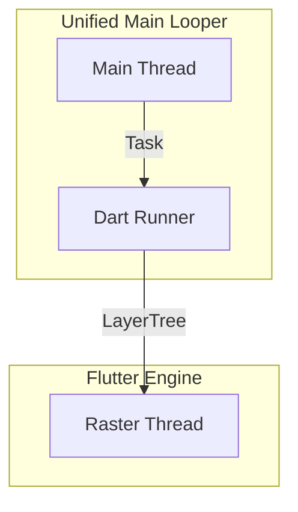

# Flutter Rendering Architecture (Index)

Flutter 的渲染架构随着版本演进发生了巨大变化。为了更好地理解其微观实现，我们将文档拆分为以下几个部分。

## 1. 核心版本演进

| 特性 | Flutter 3.19 (Legacy) | Flutter 3.29+ (Modern) |
| :--- | :--- | :--- |
| **渲染引擎** | Skia | Impeller (Vulkan/Metal) |
| **线程模型** | 独立 `1.ui` Thread + `1.raster` Thread | **Merged Platform Model** (UI 跑在 Main) |
| **典型 Trace** | `MessageLoop::Run` (独立轨道) | `Looper::pollOnce` (主线程轨道) |

## 2. 线程模型 (Merged Model)

在 Flutter 3.29+ 中，Dart 代码（UI Task）直接运行在 Android 的主线程上，消除了原本 `1.ui` 线程与 Platform Channel 通信的锁开销。

## 3. 详细渲染管线 (Pipelines)

请根据具体的集成模式查看对应的详细文档：

### 3.1 [SurfaceView 模式 (默认/高性能)](flutter_surfaceview.md)
*   **适用场景**: 全屏 Flutter 应用，或无重叠的嵌入。
*   **架构**: 独立 Surface，直接提交 BLAST，不经过 App RenderThread。
*   **关键词**: `Impeller`, `Vulkan`, `BLASTBufferQueue`, `Zero Copy`.

### 3.2 [TextureView 模式 (混合/兼容)](flutter_textureview.md)
*   **适用场景**: 需要半透明、旋转、裁剪，或嵌入复杂 View 层级中。
*   **架构**: 渲染到纹理 -> App 主线程中转 -> App RenderThread 合成。
*   **关键词**: `SurfaceTexture`, `updateTexImage`, `Performance Penalty`.
