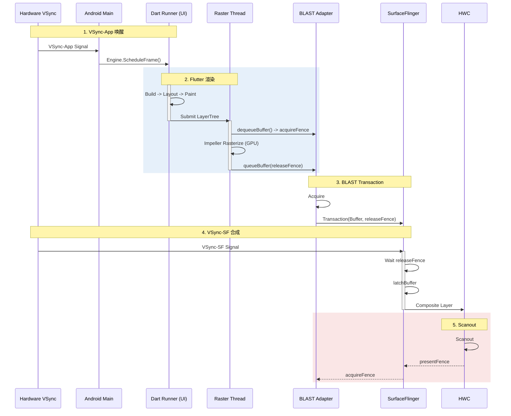

# Flutter SurfaceView Pipeline (Impeller/BLAST)

这是 Flutter 在 Android 上的默认和推荐模式（Modern Android）。它利用 `SurfaceView` 独立的 Surface 和 BLAST 机制，实现了高性能、低延迟的渲染。

## 1. 独立合成流程详解 (Deep Execution Flow)

在此模式下，Flutter 的渲染流水线与 Android 原生 UI 线程几乎完全去耦，除了 Vsync 信号的驱动。

### 第一阶段：Dart Runner (UI Thread)
1.  **Vsync**: 引擎层收到信号，驱动 Dart 运行。
2.  **Build (构建)**: 运行 `Widget.build()`。这就像搭积木，决定“界面长什么样”。
    *   *产物*: Element Tree (更稳定的结构)。
3.  **Layout (布局)**: `RenderObject.performLayout()`。
    *   计算每个渲染对象的大小和位置。这对应 AOSP 的 Measure/Layout，但全在 Dart 里完成。
4.  **Paint (绘制)**: `RenderObject.paint()`。
    *   **关键**: 这里也不产生像素，而是生成一个 **Layer Tree** (图层树)。它好比是一份“绘图指令列表”。
5.  **Submit**: Dart 线程把 Layer Tree 打包，发给 Raster Thread。

### 第二阶段：Raster Thread (光栅化)
1.  **LayerTree Processing**: 拿到 Dart 发来的指令树，进行优化和合成。
2.  **Rasterization (Impeller)**:
    *   使用 Vulkan (或 Metal) 直接生成 Command Buffer。
    *   不需要像 Skia 那样即时(JIT)编译 Shader，因其 Shader 是预编译的(AOT)，极大减少了首帧卡顿。
3.  **Present (直接提交)**:
    *   通过 `vkQueuePresentKHR` (Vulkan) 或 `eglSwapBuffers` (GL)。
    *   **关键**: 这一步直接写入到一张独立的 SurfaceBuffer 中。

### 第三阶段：BLAST Submission (系统合成)
1.  **queueBuffer**: Vulkan 驱动底层调用 `queueBuffer`。
2.  **BLAST Adapter**: 这是一个运行在 App 进程中的组件。它捕获这个 Buffer，并将其封装进一个 `SurfaceControl.Transaction`。
3.  **Atomic Sync**: 如果这个 Transaction 包含了 Window 的位置变化（比如 resize），它们会原子生效。
4.  **SurfaceFlinger**: 收到 Transaction，直接合成到屏幕，**不经过 App RenderThread**。

---

## 2. 渲染时序图

这张图展示了从 Dart 构建到最终 BLAST 合成的全过程。



## 3. 线程角色详情 (Thread Roles)

| 线程名称 | 关键职责 | 常见 Trace 标签 |
|:---|:---|:---|
| **1.ui / ui** | Dart 代码执行, Build/Layout/Paint | `Engine::BeginFrame`, `FrameworkAnimator` |
| **1.raster / raster** | Layer Tree 光栅化, GPU 指令生成 | `Rasterizer::DrawToSurfaces`, `EntityPass::Render` |
| **1.io** | 图片解码, 资源加载 | `ImageDecoder`, `SkiaUnrefQueue` |
| **1.platform** | 平台通道调用 | `MethodChannel` |
| **SurfaceFlinger** | 合成 Flutter Layer 与系统 UI | `handleMessageRefresh`, `latchBuffer` |

---

## 4. Platform View 兼容性限制

当 Flutter 应用需要嵌入原生 Android View（如 Google Maps、WebView）时，SurfaceView 模式存在根本性限制。

### 3.1 为什么不兼容

| 问题 | 根因 |
|:---|:---|
| **Z-Order 冲突** | 原生 View 和 Flutter SurfaceView 是两个独立的 Layer，无法交错 |
| **手势穿透** | 触摸事件分发路径不一致 |
| **裁剪/圆角** | SurfaceView 不支持 `clipPath` 等 View 变换 |

### 3.2 自动降级机制

当检测到 `PlatformView` 存在时，Flutter 引擎会**自动降级**到 TextureView 模式：

```dart
// flutter/engine: shell/platform/android/io/flutter/embedding/android/FlutterView.java
if (platformViewsController.usesVirtualDisplays()) {
    // TextureView 模式 (Hybrid Composition Virtual Display)
} else {
    // Hybrid Composition (Android View 直接嵌入)
}
```

### 3.3 开发者建议

1.  **尽量减少 PlatformView 数量**: 每增加一个，性能损失约 5-10%。
2.  **优先使用 Flutter 原生组件**: 如 `flutter_map` 代替 Google Maps。
3.  **监控降级**: 在 Perfetto 中检查是否意外启用了 TextureView 模式（看是否有 `SurfaceTexture` 相关 Slice）。

