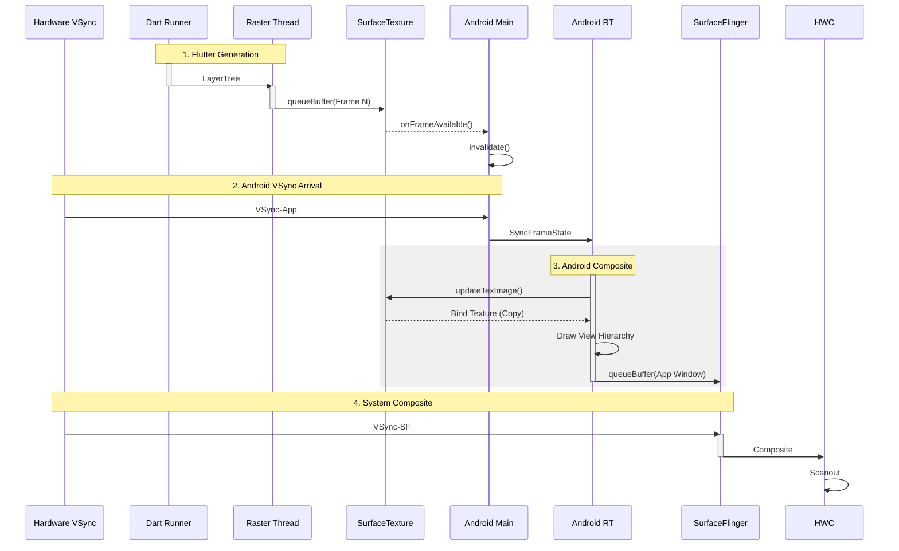

# Flutter TextureView Pipeline (PlatformView)

当需要将 Flutter 视图嵌入复杂的 Android View 层级中，或者需要对 Flutter View 进行半透明、旋转、裁剪动画时，会回退到 `TextureView` 模式。

## 1. 混合渲染流程详解 (Deep Execution Flow)

在此模式下，Flutter 降级为一个普通的“内容生产者”，它的每一帧都必须经过 Android 原生渲染管线的“转手”。

### 第一阶段：Flutter 生产 (Dart & Raster)
与 SurfaceView 模式类似，Dart 进行 Build/Layout/Paint，Raster 进行光栅化。
*   **差异点**: Raster Thread 的目标不是一张独立的 Surface，而是一个 **SurfaceTexture** (纹理对象)。
*   **Present**: 调用 `queueBuffer` 后，它不会直接发给系统，而是触发一个回调通知 Java 层。

### 第二阶段：Main Thread Roundtrip (主线程周转)
这是性能隐患的核心，但 **Flutter 3.29+** 对此进行了重大优化：

#### Legacy (<=3.24)
1.  **Frame Available**: `SurfaceTexture` 在任意线程触发回调。
2.  **Lock**: 需要竞争锁来跨线程通知。

#### Modern (3.29+ Merged Model)
在 3.29+ 中，因为 Flutter UI 任务本身就跑在 Main Thread，所以 SurfaceTexture 的创建和管理也被强制绑定到了 **Main Thread**。
1.  **Ownership**: 所有的 PlatformView SurfaceTexture 现在归 Main Thread 所有。
2.  **No Lock**: Raster Thread 提交后 (`queueBuffer`)，`onFrameAvailable` 回调直接在 Main Thread 响应，消除了上下文切换和锁竞争。
3.  **Invalidate**: 主线程立即收到信号，直接调用 `invalidate()`。
4.  **Wait Vsync**: 虽然消除了锁，但“等待下一个 Vsync”的物理限制依然存在（因为是 TextureView）。

### 第三阶段：RenderThread Composite (渲染线程合成)
1.  **updateTexImage**: App 的 `RenderThread` 在绘制这一帧 View 树时，发现有个 `TextureView`。它调用 `updateTexImage` 从 SurfaceTexture 中把 Flutter 刚画的那帧“吸”出来，变成一个 OpenGL 纹理。
2.  **Draw**: 把它当做一张图片画在 App 的主 Framebuffer 上。
3.  **BLAST**: 最终，App 的主 Framebuffer 通过 BLAST 提交给 SurfaceFlinger。

**结论**: 一帧 Flutter 画面，要先被 Flutter 画一次，再被 Android 画一次，才能上屏。

---

## 2. 渲染时序图

注意图中的 "Main Thread Roundtrip" 和 "Double Draw"。

