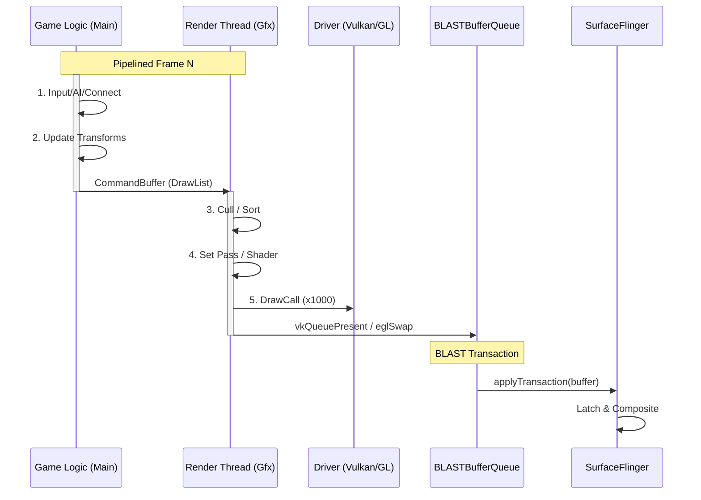

# Game Engine Rendering Pipeline (Unity / Unreal)

专业游戏引擎（如 Unity, Unreal, Godot）通常具有自己的跨平台渲染架构，但在 Android 上运行时，它们必须遵循 Android 的窗口系统规则。

## 1. 游戏渲染流程详解 (Deep Execution Flow)

游戏引擎的渲染循环 (Game Loop) 与普通 App 的事件驱动模型不同，它是一个死循环，尽可能快地跑（或者跑在固定帧率）。

### 第一阶段：Logic Thread (主逻辑线程)
这是 C# 脚本或 Lua 逻辑运行的地方：
1.  **Input**: 收集上一帧的触摸、摇杆输入。
2.  **Simulation (Update)**:
    *   执行 `Update()` 生命周期。
    *   **Physics**: 物理引擎计算碰撞、刚体运动。
    *   **AI**: 寻路、行为树计算。
3.  **Render Setup (LateUpdate)**:
    *   游戏逻辑决定位置后，摄像机 (Camera) 确定要看哪里。
    *   **Culling (剔除)**: 计算哪些物体在镜头内，不在里面的直接扔掉，不交给渲染线程。
    *   **Command Generation**: 生成一份渲染指令列表 (DrawCall List)，放入一个 RingBuffer 队列传给渲染线程。

### 第二阶段：Render Thread (原生渲染线程)
专门负责与 GPU 对话 (GLES/Vulkan Context 绑定在这里)：
1.  **Uniform Update**: 设置全局变量（如光照方向、View Matrix）。
2.  **Batching (合批)**: 为了减少 DrawCall，把材质相同的物体合并成一个大 Mesh。
3.  **DrawLoop**:
    *   `glUseProgram` (Shader)
    *   `glBindTexture`
    *   `glDrawElements` (真正的 GPU 提交)
    *   *Trace*: 你会看到密密麻麻的 `glDraw` 调用。
4.  **Swap**: 调用 `eglSwapBuffers`，把 Back Buffer 提交给 SurfaceFlinger。

---

## 2. 核心线程架构

游戏引擎通常采用双线程或三线程架构来最大化并行度。

*   **Game Logic Thread (Main)**: 运行 C# / Lua / C++ 脚本，处理物理、AI、输入。
*   **Render Thread (Native)**: 提交图形指令 (GLES / Vulkan)。
*   **Worker Threads**: 物理模拟、音频、资源加载。

### 线程角色详情 (Thread Roles)

| 线程名称 | 关键职责 | 常见 Trace 标签 |
|:---|:---|:---|
| **UnityMain / Main** | 游戏逻辑, Update/LateUpdate, 物理模拟 | `PlayerLoop`, `Update.PhysicsFixedUpdate` |
| **UnityGfx / Gfx** | 渲染命令提交, Batching, GPU 调度 | `Gfx.WaitForPresent`, `RenderThread` |
| **UnityJobWorker** | 多线程任务, Burst 编译任务 | `JobSystem`, `ParallelFor` |
| **GameThread** (UE) | Unreal 主逻辑线程 | `GameThread::Tick` |
| **RenderThread** (UE) | Unreal 渲染线程 | `FRenderingThread` |
| **RHIThread** (UE) | 底层图形 API 调用 | `FRHICommandList::Execute` |
| **SurfaceFlinger** | 系统合成 | `handleMessageRefresh` |

---

## 2. 渲染循环时序图 (Game Loop)

这是一个典型的“多线程流水线”渲染。

## 3. 关键技术：Swappy (Android Game Development Kit)

为了解决“游戏逻辑帧率”和“屏幕刷新率”不匹配导致的 **Jank**（卡顿）或 **Latency**（延迟），Google 推出了 **Swappy Frame Pacing Library**。

*   **问题**: 游戏跑 40fps，屏幕 60Hz。如果直接提交，会导致部分帧显示 16ms，部分显示 33ms，视觉抖动。
*   **Swappy**: 自动插入 `eglPresentationTimeANDROID` 或 Vulkan 扩展，告诉 SurfaceFlinger：“这帧请在未来的某个精确时间点（Timestamp）显示”。
*   **Trace**: 在 Perfetto 中会看到 `Swappy` 相关的 Section，以及 `Choreographer` 的反馈回路。

## 4. BufferQueue 模式

游戏引擎几乎总是使用 **SurfaceView** (或 `GameActivity` 提供的 Surface)。
因此，它们也完全受益于 **BLAST** 架构：
1.  **Resize同步**: 当用户改变窗口大小时（如折叠屏展开），引擎的 Resize 和 Surface 的 Resize 是原子同步的。
2.  **低延迟**: 直接通过 SurfaceControl 提交，由 HWC 合成。

## 5. Trace 分析特征

1.  **UnityMain**: 看到 `BaseBehaviour.Update`, `Physics.Simulate`。
2.  **UnityGfxDevice**:看到 `Camera.Render`, `DrawBatch`。
3.  **Vsync**: 引擎通常会自己等待 Vsync（或者是 Swappy 帮它等），而不是依赖 `doFrame` 回调。
