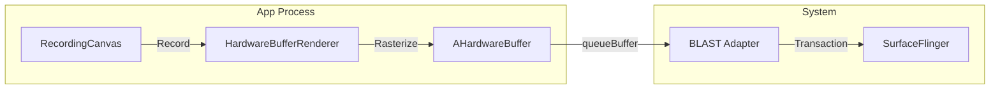
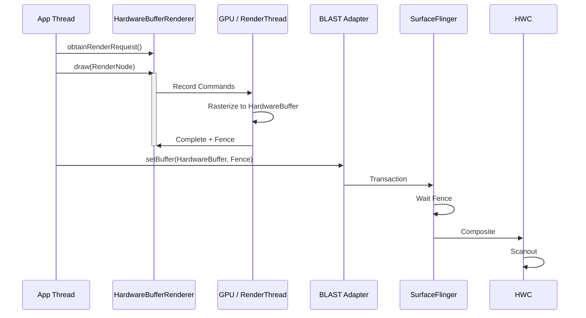

# Hardware Buffer Renderer Pipeline (Android 14+)

`HardwareBufferRenderer` 是 Android 14 (API 34) 引入的现代**硬件加速离屏渲染** API，作为传统 `lockCanvas()` 的高性能替代方案。它利用 `RenderNode` 和 GPU 进行光栅化，而非 CPU 软件渲染。

## 1. 为什么需要它？

传统软件渲染 (`Surface.lockCanvas()`) 存在几个根本性问题：

| **渲染引擎** | CPU (Skia Software) | **GPU (Hardware Accelerated)** |
| **内存拷贝** | CPU → GraphicBuffer 拷贝 | **零拷贝** (GPU 直接写入 Buffer) |
| **格式限制** | 仅 RGBA_8888 | 支持多种格式 (RGBA_F16, 10bit, etc.) |
| **HDR 支持** | ❌ | ✅ 原生 HDR |
| **Fence 控制** | 隐式 | **显式** |
| **线程安全** | 需要锁 | 完全线程安全 |

## 2. 核心架构



## 3. API 使用流程

### 3.1 Java API

```java
// 1. 创建 HardwareBufferRenderer
HardwareBufferRenderer renderer = new HardwareBufferRenderer(
    HardwareBuffer.create(width, height, HardwareBuffer.RGBA_8888, 1,
        HardwareBuffer.USAGE_GPU_SAMPLED_IMAGE | HardwareBuffer.USAGE_CPU_WRITE)
);

// 2. 获取 RecordingRenderRequest
RenderRequest request = renderer.obtainRenderRequest();

// 3. 记录绘制指令
request.setContentRoot(rootRenderNode);
request.setColorSpace(ColorSpace.get(ColorSpace.Named.DISPLAY_P3));

// 4. 执行渲染
request.draw(executor, result -> {
    // result 包含 Fence 和状态
    SyncFence fence = result.getFence();
    
    // 5. 提交给 SurfaceControl
    SurfaceControl.Transaction t = new SurfaceControl.Transaction();
    t.setBuffer(surfaceControl, hardwareBuffer, fence);
    t.apply();
});
```

### 3.2 NDK API

```c
// 创建 Renderer
AHardwareBufferRenderer* renderer;
AHardwareBufferRenderer_create(hardwareBuffer, &renderer);

// 获取 Canvas
ACanvas* canvas;
AHardwareBufferRenderer_getCanvas(renderer, &canvas);

// 绘制
ACanvas_drawRect(canvas, rect, paint);

// 提交
int fenceFd;
AHardwareBufferRenderer_submit(renderer, &fenceFd);

// 使用 fence 与 SurfaceControl 配合
ASurfaceTransaction_setBuffer(transaction, sc, hardwareBuffer, fenceFd);
```

## 4. 渲染时序图

注意这是一个 **GPU 硬件加速光栅化 + GPU 合成** 的流程（区别于 `lockCanvas()` 的 CPU 软件渲染）。



## 5. 性能对比

| 场景 | lockCanvas() | HardwareBufferRenderer |
|:---|:---|:---|
| 1080p 全屏绘制 | ~15ms | ~8ms |
| 内存带宽 | 2x (拷贝) | 1x (直写) |
| HDR 内容 | 不支持 | 原生支持 |
| 多线程 | 需要同步 | 原生支持 |

## 6. 使用场景

1.  **自定义绘图引擎**: 如 PDF 渲染器、矢量图编辑器。
2.  **HDR 图像处理**: 需要 RGBA_F16 格式的场景。
3.  **高帧率软件渲染**: 配合 Choreographer 实现 120fps 软件渲染。
4.  **跨进程 Buffer 共享**: HardwareBuffer 可以通过 Binder 传递。

## 7. 兼容性

*   **最低版本**: Android 14 (API 34)
*   **降级方案**: 在旧版本上回退到 `lockCanvas()` + BLAST
