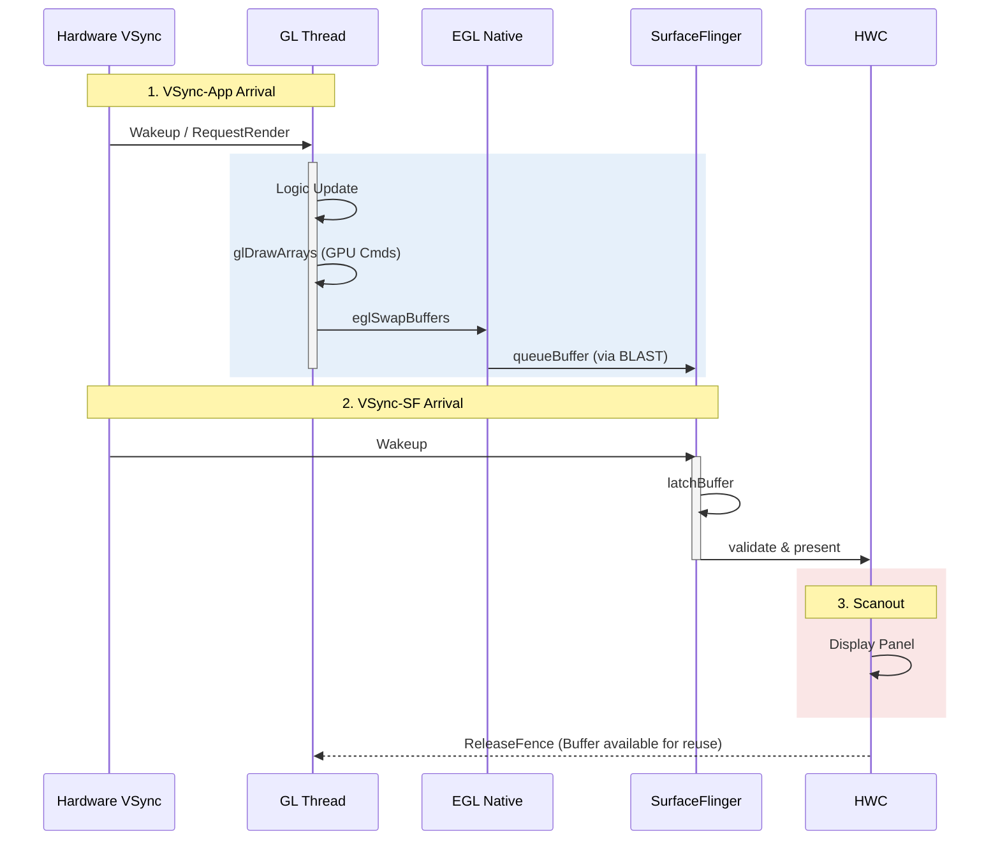

# OpenGL ES Rendering Pipeline (GL Thread)

> [!WARNING]
> **Android 15+ 注意**: 从 Android 15 开始，新设备将**强制使用 ANGLE** 作为 OpenGL ES 后端。您的 GLES 调用实际上会被翻译为 Vulkan 指令。详见 [ANGLE Pipeline](angle_gles_vulkan.md)。对于新项目，**建议直接使用 Vulkan**。

典型的 OpenGL 应用（如地图模块 `scrolling-gl-map`）通常运行在专门的 `GLThread` 上。
现代 `GLSurfaceView` 也是基于 `SurfaceView` 的，因此在底层同样受益于 BLAST 带来的同步特性。

## 1. 核心架构
*   **EGL**: 连接 OpenGL ES API 和 Android 本地窗口系统 (Surface) 的桥梁。
*   **GLThread**: `GLSurfaceView` 内部维护的线程，负责全生命周期的渲染循环。

## 2. 渲染循环时序图



## 3. 渲染循环详解 (Step-by-Step)

### 步骤 1: 等待 (Idle/Wait)
GL 线程在没有任务时会 wait 也就是休眠。
*   **Continuous Mode**: 依赖 Vsync 唤醒。
*   **Dirty Mode**: 依赖 `requestRender` 唤醒。

### 步骤 2: eglMakeCurrent
将 EGL Context 绑定到当前线程。如果 Surface 发生变化（如尺寸改变），这里会触发 `eglCreateWindowSurface`。

### 步骤 3: User Draw (onDrawFrame)
执行用户的 OpenGL 指令。
*   此时指令被写入 GPU Command Buffer，**并未立即执行**。

### 步骤 4: eglSwapBuffers (关键提交点)
这是该管线最重要的函数。
1.  **Flush**: 强制发送所有 GL 指令给 GPU。
2.  **queueBuffer**: 将画好的帧（Back Buffer）提交给本地的 BLASTAdapter。
3.  **Transaction**: 适配器立即（或并在 Vsync 时）发送 Transaction 给 SF。

## 4. Buffer 流转与 Triple Buffering

在 Perfetto 中，你会看到 `eglSwapBuffers` 占据了大部分时间条。这通常**不是**因为它慢，而是因为它在等待空闲 Buffer。

*   **Double Buffer**: 容易发生阻塞，Render 必须等 Display。
*   **Triple Buffer**: 允许 App 多画一帧，`dequeueBuffer` 不容易卡住，提高 GPU 利用率。

## 5. Fence 机制详解 (Sync Primitives)

OpenGL ES 在 Android 上的同步依赖 **Fence** 机制，这是跨 GPU/CPU/Display 的关键桥梁。

### 5.1 Acquire Fence (获取栅栏)
*   **来源**: 当 `eglSwapBuffers` 调用 `dequeueBuffer` 获取新 Buffer 时，系统可能返回一个 acquireFence。
*   **含义**: "这个 Buffer 还在被 Display/SF 使用，等 Fence signal 后才能写"。
*   **Trace**: 在 Perfetto 中看到 `dequeueBuffer` 耗时很长，往往是在等待 acquireFence。

### 5.2 Release Fence (释放栅栏)
*   **来源**: 当 `eglSwapBuffers` 调用 `queueBuffer` 时，App 会传递一个 releaseFence 给 SF。
*   **含义**: "GPU 还没画完这个 Buffer，等 Fence signal 后才能读/显示"。
*   **Trace**: SF 在 `latchBuffer` 时如果 Fence 未 signal，会等待。

### 5.3 EGL Sync Objects
对于需要精确控制同步的场景，可使用 EGL 扩展：
```c
// 创建 Fence 对象 (GPU 端)
EGLSyncKHR sync = eglCreateSyncKHR(display, EGL_SYNC_FENCE_KHR, NULL);

// CPU 等待 GPU 完成
eglClientWaitSyncKHR(display, sync, 0, EGL_FOREVER_KHR);

// 导出为 Android Native Fence FD
int fd = eglDupNativeFenceFDANDROID(display, sync);
```

## 6. ANGLE：GLES-over-Vulkan

在 Android 11+ 上，部分设备启用了 **ANGLE** (Almost Native Graphics Layer Engine) 作为 OpenGL ES 的默认实现。

*   **原理**: GLES API 调用被翻译为 Vulkan 指令。
*   **优势**: 更一致的驱动行为，更少的 GPU 厂商 bug。
*   **Trace 差异**: 你会看到 `vkQueueSubmit` 而非 `glDraw*`，Buffer 提交仍走 BLAST。
*   **详情**: 参见 [ANGLE 渲染管线](angle_gles_vulkan.md)。
