# Android Rendering Pipelines Overview

本项目涵盖了 Android 系统中几乎所有的核心出图链路。理解这些链路对于性能调优至关重要。

> [!IMPORTANT]
> **文档版本**: 本文档已更新至 **Android 16 (Baklava)** 架构。以下为 Android 版本与渲染架构的对应关系。

## 版本与架构矩阵

| Android 版本 | 核心架构 | 关键特性 |
|:---|:---|:---|
| **Android 16** (API 36) | BLAST + ANGLE 默认 + VPA | Enhanced ARR, RuntimeColorFilter, GPU syscall filtering |
| **Android 15** (API 35) | BLAST + ANGLE 强制采用 | Vulkan Profiles (VPA), ANGLE 作为默认 GLES |
| **Android 14** (API 34) | BLAST + HardwareBufferRenderer | 现代软件渲染 API |
| **Android 12-13** (API 31-33) | BLAST 成熟期 | FrameTimeline, 完整 BLAST Sync |
| **Android 10-11** (API 29-30) | BLAST 引入期 | BLASTBufferQueue, SurfaceControl NDK |
| **Android 9 及以下** | Legacy BufferQueue | 传统 queueBuffer 模式 (已弃用) |

### Android 15/16 新特性快速索引

| 特性 | 适用版本 | 文档链接 |
|:---|:---|:---|
| ANGLE 强制采用 | Android 15+ | [ANGLE Pipeline](angle_gles_vulkan.md) |
| Vulkan Profiles (VPA) | Android 15+ | [Vulkan Native](vulkan_native.md) |
| Enhanced Adaptive Refresh Rate | Android 16 | [VRR Pipeline](variable_refresh_rate.md) |
| RuntimeColorFilter / RuntimeXfermode | Android 16 | [Standard Pipeline](android_view_standard.md) |
| HardwareBufferRenderer | Android 14+ | [Hardware Buffer Renderer](hardware_buffer_renderer.md) |

---

## 典型模式对比

| 模式 | 核心组件 | 生产者 (Producer) | 消费者 (Consumer) | 特点 | 对应模块 |
| :--- | :--- | :--- | :--- | :--- | :--- |
| **Android View (Standard)** | RecyclerView | UI Thread + RenderThread | SurfaceFlinger | 标准链，最通用 | `scrolling-aosp-performance` |
| **Android View (Software)** | Canvas | UI Thread (CPU) | SurfaceFlinger | 绕过 GPU，测试 CPU 极限 | `scrolling-aosp-softwarerender` |
| **Android View (Mixed)** | Recycler+Surface | UI + Producer Thread | SurfaceFlinger | 混合渲染，视频流场景 | `scrolling-aosp-mixedrender` |
| **SurfaceView** | SurfaceView/EGL | Dedicated Thread | SurfaceFlinger | 独立 Surface，减少 App 侧合成 | `scrolling-aosp-purerenderthread` |
| **TextureView** | SurfaceTexture | Dedicated Thread | App RenderThread | 灵活性高，但有多余拷贝/同步 | `scrolling-webview-texture` |
| **OpenGL ES** | EGL/GLES | GL Thread | SurfaceFlinger | 高频指令流，适合地图/游戏 | `scrolling-gl-map` |

## 详细链路文档

- [Android View (Standard) Pipeline](android_view_standard.md)
- **[Android View (Multi-Window) Pipeline](android_view_multi_window.md)**: 同一进程内双窗口（如 Dialog）导致的主线程/渲染线程串行争抢。
- [Android View (Software) Pipeline](android_view_software.md)
- **[Android View (Mixed) Pipeline](android_view_mixed.md)**: **[NEW]** 混合渲染模式 (Hybrid Composition)。
- [SurfaceView (Direct Producer) Pipeline](surfaceview.md)
- [TextureView (App-side Composition) Pipeline](textureview.md)
- **[Flutter Architecture (Impeller/Thread Merging)](flutter_architecture.md)**: 3.29+ 架构下的主线程合并与 Impeller 渲染。
    *   [Flutter SurfaceView (Direct)](flutter_surfaceview.md)
    *   [Flutter TextureView (Copy)](flutter_textureview.md)
- [OpenGL ES (GL Thread) Pipeline](opengl_es.md)
- **[Vulkan Native Pipeline](vulkan_native.md)**: **[NEW]** 纯 Vulkan 渲染与 BLAST 交互。
- **[SurfaceControl API Deep Dive](surface_control_api.md)**: NDK 级别的图层控制。
- **[PIP & Freeform Window](android_pip_freeform.md)**: 画中画与多窗口渲染。
- **[Video Overlay (HWC)](video_overlay_hwc.md)**: 极致性能的纯硬件视频合成。
- **[Camera Rendering Pipeline](camera_pipeline.md)**: **[NEW]** Camera2 API、HAL3 多流并发与 ZSL 机制。
- **[Hardware Buffer Renderer](hardware_buffer_renderer.md)**: **[NEW]** Android 14+ 现代软件渲染 API。
- **[ANGLE (GLES-over-Vulkan)](angle_gles_vulkan.md)**: **[NEW]** OpenGL ES 到 Vulkan 翻译层。
- **[Variable Refresh Rate (VRR)](variable_refresh_rate.md)**: **[NEW]** 动态刷新率渲染管线。

## WebView Rendering Deep Dive

WebView 拥有最为复杂的渲染架构，根据场景不同分为 4 种模式。

### Process Architecture
```mermaid
%%{
  init: {
    'theme': 'base',
    'themeVariables': {
      'primaryColor': '#46af54',
      'primaryTextColor': '#ffffff',
      'primaryBorderColor': '#388e3c',
      'lineColor': '#8ab4f8',
      'secondaryColor': '#8ab4f8',
      'tertiaryColor': '#202124',
      'actorBkg': '#202124',
      'actorBorder': '#5f6368',
      'actorTextColor': '#e8eaed',
      'signalColor': '#8ab4f8',
      'signalTextColor': '#e8eaed',
      'labelBoxBkgColor': '#3c4043',
      'labelBoxBorderColor': '#5f6368',
      'labelTextColor': '#e8eaed'
    }
  }
}%%
graph TD
    subgraph "App Process"
        UI[UI Thread]
        RT[RenderThread]
        SV[SurfaceView (Wrapper)]
        TV[TextureView (Custom)]
    end
    
    subgraph "Chromium Process (Sandboxed)"
        Main[CrRendererMain]
        Comp[Compositor Thread]
        Tile[Raster Worker]
    end
    
    subgraph "GPU Process"
        GPU[Viz / GPU Main]
        SC[SurfaceControl (Direct)]
    end

    UI -->|IPC| Main
    Main -->|Commit| Comp
    Comp -->|Task| Tile
    Comp -->|CommandBuffer| GPU
    GPU -->|GL/Vulkan| RT
    GPU -.->|Buffer| SC
    UI -.->|Holder| SV
    GPU -.->|Frame| TV
```

### WebView Pipelines

| 模式 | 场景 | Buffer 生产者 | 关键特征 | 文档 |
| :--- | :--- | :--- | :--- | :--- |
| **1. GL Functor** | 普通新闻/H5 | **App RenderThread** | 此模式下 App 渲染线程会 Sync 等待 WebView | [文档](webview_gl_functor.md) |
| **2. SurfaceView Wrapper** | 全屏视频 | **App Player** | 视频直接上屏，WebView 仅负责占位 | [文档](webview_surfaceview_wrapper.md) |
| **3. SurfaceControl** | 现代 Vulkan | **Viz (GPU)** | 独立合成，App 侧挖洞 (Hole Punch) | [文档](webview_surface_control.md) |
| **4. Custom TextureView** | 国内定制内核 | **App RenderThread** | 渲染到 SurfaceTexture，主线程回调拷贝 | [文档](webview_textureview_custom.md) |

### 7. 专业架构 Review (高级性能工程师视角)
基于目前的测试桩架构，我认为尚有以下变体可以进一步细化，以逼近真实生产环境：

1.  **WebView SurfaceControl 深度模拟**: 目前项目中 GeckoView 对 SurfaceView 的使用接近 SurfaceControl，但建议增加一个专门模拟 `SurfaceControl.Transaction` 异步提交延迟的桩，这能更真实地反映现代浏览器内核与 SF 的交互瓶颈。
2.  **Flutter 3.29 负载对等测试**: 建议在 `switch-flutter` 中增加一个实验，模拟 UI 和 Platform 线程合并后，如果系统回调阻塞（如同步 Binder 调用）对 Dart 层帧率的影响。
3.  **Vulkan 路径覆盖**: 目前大多数模块侧重 GLES/Skia。在 Android 12+，Skia-Vulkan 已成为主流，增加对 Vulkan 渲染路径的统计（通过 `vkQueuePresentKHR`）将是该项目的顶层拼图。

## 如何根据链路进行分析？

1.  **确定生产者线程**: 是 UI 线程、RenderThread 还是开发者自定义线程？
2.  **查看 Vsync 挂钩点**: 是否绑定了 `Choreographer`？
3.  **观察 BufferQueue 深度**: 使用 `dumpsys SurfaceFlinger` 查看对应的 Buffer 层级。
4.  **监测渲染耗时**: 使用 Perfetto 追踪 `drawFrame` (RT) 或 `lockCanvas` (UI) 的频率。


---

# PIP & Freeform Window Rendering

Android 的多窗口模式（Split Screen, Freeform, Picture-in-Picture）在渲染层面上并没有太多魔法，但理解其窗口组织形式对于性能分析很有帮助。

## 1. 窗口组织架构 (Window Hierarchy)

在 SurfaceFlinger 侧，所有的窗口都是 Layer Tree 的一部分。

*   **Task Layer**: 在多窗口模式下，系统会为每个 Task 创建一个根容器 Layer。
*   **Activity Layer**: Task 下面挂载各个 Activity 的 SurfaceControl。
*   **App Surface**: Activity 下面才是我们熟悉的 App Window Surface。

```mermaid
%%{
  init: {
    'theme': 'base',
    'themeVariables': {
      'primaryColor': '#46af54',
      'primaryTextColor': '#ffffff',
      'primaryBorderColor': '#388e3c',
      'lineColor': '#8ab4f8',
      'secondaryColor': '#8ab4f8',
      'tertiaryColor': '#202124',
      'actorBkg': '#202124',
      'actorBorder': '#5f6368',
      'actorTextColor': '#e8eaed',
      'signalColor': '#8ab4f8',
      'signalTextColor': '#e8eaed',
      'labelBoxBkgColor': '#3c4043',
      'labelBoxBorderColor': '#5f6368',
      'labelTextColor': '#e8eaed'
    }
  }
}%%
graph TD
    Display[Display Root]
    Stack[Stack / Task Container]
    WinA[Window A (Main App)]
    WinB[Window B (PIP / Freeform)]
    
    Display --> Stack
    Stack --> WinA
    Stack --> WinB
```

## 2. PIP (画中画) 渲染流程

### 2.1 进入 PIP
1.  **Enter**: App 调用 `enterPictureInPictureMode()`。
2.  **Animation**: WindowManagerSystem (WMS) 接管窗口动画。
    *   WMS 使用 SurfaceControl 动画 API，将 App 的 Surface 缩小并移动到角落。
    *   *注意*: 在动画过程中，App 仍然在全分辨率渲染（或者根据 configuration change 变为小分辨率）。

### 2.2 持续渲染
在 PIP 模式下，App 的渲染循环与全屏模式**完全一致**：
1.  **Vsync**: 照常接收 Vsync-App。
2.  **Draw**: 照常绘制。
3.  **Submit**: 提交 Buffer。
4.  **Composite**: SF 将其作为一个小 Layer 合成到屏幕上。

### 2.3 性能考量
*   **Overdraw**: PIP 窗口悬浮在桌面或其他 App 之上，这一定会带来 Overdraw。
*   **Touch Input**: 输入事件会被分发给 PIP 窗口，App 需要处理小窗口下的点击逻辑。
*   **Resource Budget**: 系统通常会限制 PIP 窗口的 CPU/GPU 优先级，确保主前台应用（Background Task）流畅。

## 3. Freeform (自由窗口 / 桌面模式)

这在折叠屏和平板电脑上越来越常见。

*   **Multiple Resizing**: 用户可以随意拉伸窗口。
*   **Latency**: 窗口边框的拖拽通常由 SystemUI 渲染（作为一个独立的 Layer），而 App 内容跟随 resize。
    *   如果 App 响应慢，会出现“黑边”或“内容拉伸”。
    *   **BLAST Sync** 极其关键：WMS 会将“窗口边框大小”和“App 内容 Buffer”同步提交，消除这些瑕疵。

## 4. Trace 分析特征

在 System Trace 中：
1.  **BufferQueue**: 每个独立窗口都有自己的 BufferQueue。
2.  **Vsync-App**: 所有可见窗口都会收到 Vsync。
3.  **Composition**: SurfaceFlinger 的 `handleMessageRefresh` 处理所有可见 Layer 的合成。如果只有 PIP 窗口更新，背景不动，HWC 可能可以直接复用背景 Layer 的 Cache。

## 5. Freeform Resize 同步竞态 (Deep Dive)

在 Freeform 窗口拖拽调整大小时，存在一个经典的**竞态条件**，理解它对于分析"黑边"和"内容拉伸"问题至关重要。

### 5.1 竞态流程

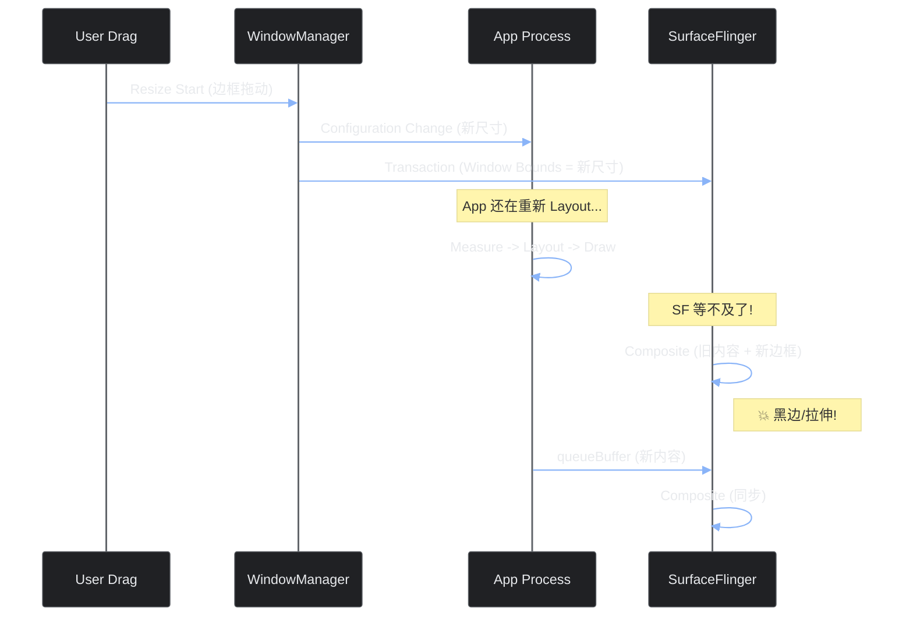
```mermaid
%%{
  init: {
    'theme': 'base',
    'themeVariables': {
      'primaryColor': '#46af54',
      'primaryTextColor': '#ffffff',
      'primaryBorderColor': '#388e3c',
      'lineColor': '#8ab4f8',
      'secondaryColor': '#8ab4f8',
      'tertiaryColor': '#202124',
      'actorBkg': '#202124',
      'actorBorder': '#5f6368',
      'actorTextColor': '#e8eaed',
      'signalColor': '#8ab4f8',
      'signalTextColor': '#e8eaed',
      'labelBoxBkgColor': '#3c4043',
      'labelBoxBorderColor': '#5f6368',
      'labelTextColor': '#e8eaed'
    }
  }
}%%
sequenceDiagram
    participant User as User Drag
    participant WMS as WindowManager
    participant App as App Process
    participant SF as SurfaceFlinger

    User->>WMS: Resize Start (边框拖动)
    WMS->>App: Configuration Change (新尺寸)
    WMS->>SF: Transaction (Window Bounds = 新尺寸)
    
    Note over App: App 还在重新 Layout...
    App->>App: Measure -> Layout -> Draw
    
    Note over SF: SF 等不及了!
    SF->>SF: Composite (旧内容 + 新边框)
    Note right of SF: 💥 黑边/拉伸!
    
    App->>SF: queueBuffer (新内容)
    SF->>SF: Composite (同步)
```

### 5.2 BLAST Sync 解决方案

Android 12+ 通过 **BLAST Sync** 解决此问题：

1.  **Sync Token**: WMS 为这次 resize 生成一个 Token。
2.  **App Barrier**: App 完成新尺寸的渲染后，带着同一个 Token 提交 Buffer。
3.  **SF 等待**: SF 收到 Window Bounds Transaction 时，会**等待**对应 Token 的 Buffer 到达。
4.  **原子应用**: 两者同时生效，无撕裂。

### 5.3 Trace 定位

在 Perfetto 中查找：
*   `WMS.resizeTask`: 标记 resize 开始。
*   `Transaction.apply`: 查看是否带有 `SyncId`。
*   `SurfaceFlinger.waitForSync`: 如果这个 Slice 很长，说明 App 响应慢。

### 5.4 优化建议

1.  **减少 Configuration Change 开销**: 避免在 `onConfigurationChanged` 中做重计算。
2.  **预渲染策略**: 如 Chrome 会预渲染几个常见尺寸的 Bitmap Cache。
3.  **Skeleton UI**: 在 resize 过程中显示骨架屏而非空白。


---

# Android View Mixed Pipeline (Hybrid Composition)

这是 Android App 中处理多媒体内容最常见的模式，也是 `scrolling-aosp-mixedrender` 模块所演示的核心场景。

**混合渲染 (Mixed Rendering)** 指的是：标准的 Android View 系统（UI + RenderThread）与独立的 SurfaceView（Producer Thread）在同一个界面中同时运行，最终由 SurfaceFlinger 进行视觉合成。

## 1. 核心架构：并行流水线

在这种模式下，App 内部存在两条完全独立的渲染流水线：

1.  **View Pipeline (UI)**:
    *   负责：RecyclerView, Toolbar, Buttons, Text。
    *   线程：UI Thread -> RenderThread。
    *   目标：`Layer 0` (App Main Window)。
2.  **Media Pipeline (Content)**:
    *   负责：视频流、直播流、3D 模型。
    *   线程：Decoder Thread / Game Logic Thread。
    *   目标：`Layer -1` (SurfaceView, 位于主窗口下方)。

## 2. 深度执行流程 (Deep Execution Flow)

### 阶段一：并行生产 (Parallel Production)
*   **Pipeline A (View)**: 响应 Vsync-App，执行 Measure/Layout/Draw，生成 DisplayList，同步给 RenderThread，生成 Main Window 的 Buffer。
*   **Pipeline B (Media)**: 独立于 Vsync（或尝试对齐），解码视频帧，直接 `queueBuffer` 到由于 SurfaceView 创建的独立 BufferQueue。

### 阶段二：打洞与合成 (Hole Punching & Composite)
1.  **Hole Punching**:
    *   View 系统在 SurfaceView 所在的区域绘制透明像素 (`#00000000`)。
    *   这告诉 SurfaceFlinger：“这块区域我不管，透下去显示后面的内容”。
2.  **SurfaceFlinger Latch**:
    *   SF 同时接收到两个 Surface 的 Buffer 更新。
    *   **Layer 0 (Top)**: App UI (带透明洞)。
    *   **Layer -1 (Bottom)**: 视频内容。
3.  **Hardware Composite**:
    *   HWC 将这两层叠加，用户看到的是一张完整的界面。

---

## 3. 渲染时序图 (E2E)

这张图展示了双管线并行的特征。注意 Pipeline B 完全不被 UI Thread 阻塞。

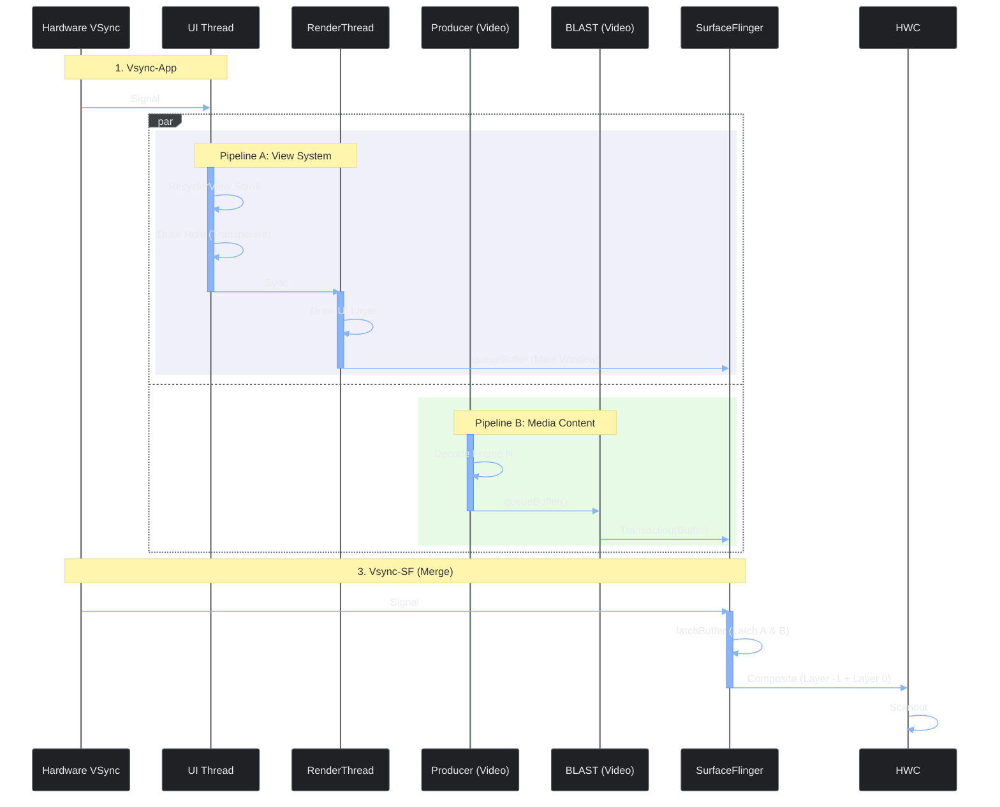
```mermaid
%%{
  init: {
    'theme': 'base',
    'themeVariables': {
      'primaryColor': '#46af54',
      'primaryTextColor': '#ffffff',
      'primaryBorderColor': '#388e3c',
      'lineColor': '#8ab4f8',
      'secondaryColor': '#8ab4f8',
      'tertiaryColor': '#202124',
      'actorBkg': '#202124',
      'actorBorder': '#5f6368',
      'actorTextColor': '#e8eaed',
      'signalColor': '#8ab4f8',
      'signalTextColor': '#e8eaed',
      'labelBoxBkgColor': '#3c4043',
      'labelBoxBorderColor': '#5f6368',
      'labelTextColor': '#e8eaed'
    }
  }
}%%
sequenceDiagram
    participant HW as Hardware VSync
    participant UI as UI Thread
    participant RT as RenderThread
    participant PT as Producer (Video)
    participant BBQ as BLAST (Video)
    participant SF as SurfaceFlinger
    participant HWC as HWC

    %% 1. Vsync Arrival
    Note over HW, UI: 1. Vsync-App
    HW->>UI: Signal
    
    par
        %% Pipeline A: Main UI
        rect rgb(240, 240, 250)
            Note over UI, RT: Pipeline A: View System
            activate UI
            UI->>UI: RecyclerView Scroll
            UI->>UI: Draw Hole (Transparent)
            UI->>RT: Sync
            deactivate UI
            
            activate RT
            RT->>RT: Draw UI Layer
            RT->>SF: queueBuffer (Main Window)
            deactivate RT
        end
        
    and
        %% Pipeline B: Video
        rect rgb(230, 250, 230)
            Note over PT, BBQ: Pipeline B: Media Content
            activate PT
            PT->>PT: Decode Frame N
            PT->>BBQ: queueBuffer()
            deactivate PT
            BBQ->>SF: Transaction(Buffer)
        end
    end

    %% 3. Composition
    Note over HW, SF: 3. Vsync-SF (Merge)
    HW->>SF: Signal
    activate SF
    SF->>SF: latchBuffer (Latch A & B)
    SF->>HWC: Composite (Layer -1 + Layer 0)
    deactivate SF

    %% 4. Display
    HWC->>HWC: Scanout
```

## 4. 性能特征
*   **UI 卡顿不影响视频**: 即使主线程因为 RecyclerView 极其复杂而掉帧，视频流通常依然流畅（因为它是独立的 Surface）。
*   **同步挑战**: 如果列表快速滚动，SurfaceView 的位置变化（由 UI 控制）需要和视频帧内容（由 Player 控制）完美同步，否则会出现视频“飘移”或黑边。
    *   *解法*: Android 12+ 强制使用 BLAST Sync 解决此问题。


---

# Multi-Window AOSP Rendering Pipeline (Dual Source)

在性能优化中，这也是一个极易被忽视的场景：**同一个 App 进程同时显示两个窗口**。

常见的例子包括：
1.  **Dialog**: 打开一个 Dialog 时，背后的 Activity 依然可见，此时两者都在绘制。
2.  **分屏/多窗口模式**: 两个 Activity 同时处于 `RESUMED` 状态。
3.  **悬浮窗**: System Alert Window 覆盖在 Activity 之上。

## 1. 核心瓶颈：串行化 (Serialization)

虽然它们是两个独立的 Window（拥有各自的 Surface），但在 App 进程内部，它们共享极其有限的资源。

### UI Thread Contention (主线程争抢)
Android 的 `Choreographer` 是线程单例的。当 Vsync 信号到来时，主线程会收到**一次**回调，但它必须处理**所有**活跃窗口的 Input/Animation/Traversal。
*   **现象**: 在 Trace 中，你会看到 `doFrame` 内部连续出现两个 `performTraversals`。
*   **后果**: 如果第一个窗口（比如复杂的 Activity）耗时过长，会直接推迟第二个窗口（比如 Dialog）的更新，甚至导致掉帧。

### RenderThread Contention (渲染线程争抢)
更致命的是，一个 App 进程只有一个 `RenderThread`。
*   **Serial Draw**: 所有窗口的 GPU 命令生成任务必须排队执行。
*   **Context Switching**: 虽然在同一个 RenderThread 中通常**共享同一个 EGLContext**，但 GL 状态机的切换（State Change）和资源绑定（Bind Texture）开销是不可避免的。

## 2. 深度执行流程 (Deep Execution Flow)

### 阶段一：Vsync 唤醒与分发
1.  **Vsync-App**: 主线程被唤醒。
2.  **Choreographer**: 触发 `doFrame`。
3.  **Callback Queue**: 处理回调。此时，两个 `ViewRootImpl` 都注册了 Traversal 回调。

### 阶段二：UI Thread Serial Execution
1.  **Window A (Activity)**: 执行 `performTraversals` (Measure/Layout/Draw)。生成 DisplayList。
2.  **Window B (Dialog)**: 紧接着执行 `performTraversals`。生成 DisplayList。
    *   *Risk*: 此时如果超过 16.6ms，两者的帧都会延迟。

### 阶段三：RenderThread Serial Execution
1.  **Sync A**: 渲染线程同步 Window A 的数据。
2.  **Draw A**: 渲染线程生成 Window A 的 GL 指令 -> `eglSwapBuffers` -> `queueBuffer` (Surface A)。
3.  **Sync B**: 渲染线程同步 Window B 的数据。
4.  **Draw B**: 渲染线程生成 Window B 的 GL 指令 -> `eglSwapBuffers` -> `queueBuffer` (Surface B)。

## 3. 渲染时序图

注意 `RenderThread` 的忙碌程度是普通情况的两倍。

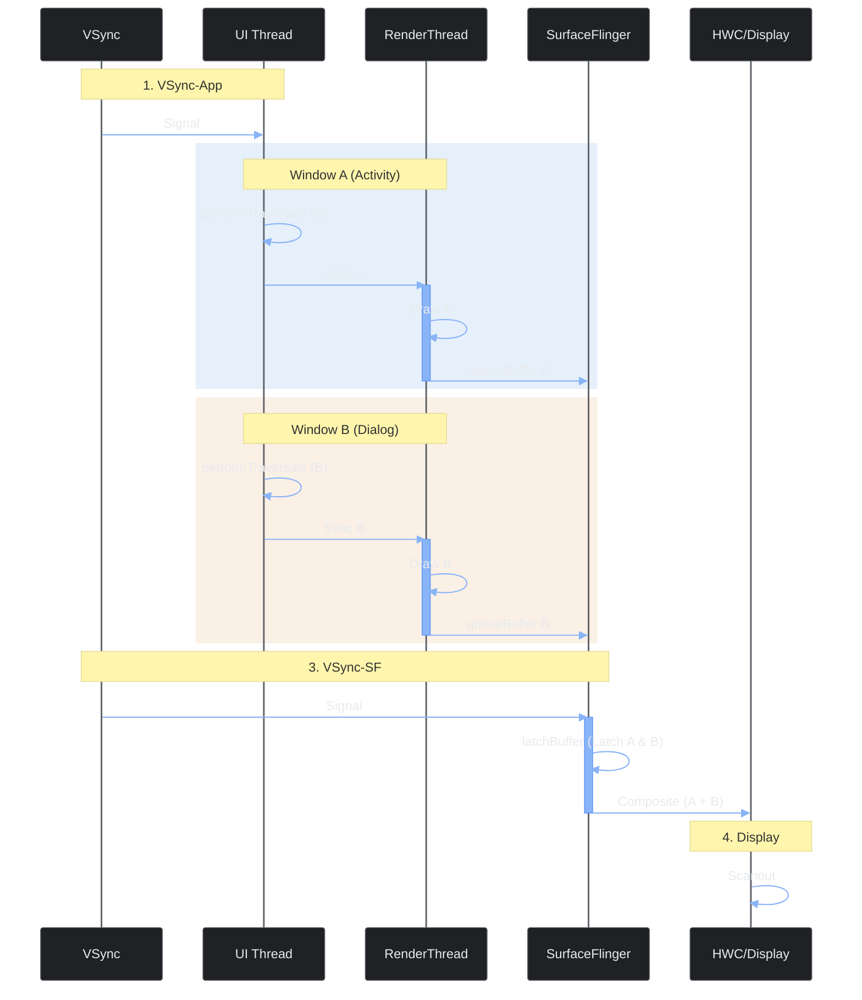
```mermaid
%%{
  init: {
    'theme': 'base',
    'themeVariables': {
      'primaryColor': '#46af54',
      'primaryTextColor': '#ffffff',
      'primaryBorderColor': '#388e3c',
      'lineColor': '#8ab4f8',
      'secondaryColor': '#8ab4f8',
      'tertiaryColor': '#202124',
      'actorBkg': '#202124',
      'actorBorder': '#5f6368',
      'actorTextColor': '#e8eaed',
      'signalColor': '#8ab4f8',
      'signalTextColor': '#e8eaed',
      'labelBoxBkgColor': '#3c4043',
      'labelBoxBorderColor': '#5f6368',
      'labelTextColor': '#e8eaed'
    }
  }
}%%
sequenceDiagram
    participant HW as VSync
    participant UI as UI Thread
    participant RT as RenderThread
    participant SF as SurfaceFlinger
    participant HWC as HWC/Display

    Note over HW, UI: 1. VSync-App
    HW->>UI: Signal

    %% 2. Serial Execution
    rect rgb(230, 240, 250)
        Note over UI, RT: Window A (Activity)
        UI->>UI: performTraversals (A)
        UI->>RT: Sync A
        activate RT
        RT->>RT: Draw A
        RT->>SF: queueBuffer A
        deactivate RT
    end

    rect rgb(250, 240, 230)
        Note over UI, RT: Window B (Dialog)
        UI->>UI: performTraversals (B)
        UI->>RT: Sync B
        activate RT
        RT->>RT: Draw B
        RT->>SF: queueBuffer B
        deactivate RT
    end

    %% 3. Composition
    Note over HW, SF: 3. VSync-SF
    HW->>SF: Signal
    activate SF
    SF->>SF: latchBuffer (Latch A & B)
    SF->>HWC: Composite (A + B)
    deactivate SF
    
    Note over HWC: 4. Display
    HWC->>HWC: Scanout
```

## 4. 优化建议
*   **合并窗口**: 如果可能，尽量用 View 的方式实现（如 Fragment Dialog），而不是真正的 Window Dialog。这样可以将两次 Traversal 合并为一次。
*   **减少层级**: 确保背景窗口（如果不可见）由于 `View.GONE` 或 `STOPPED` 状态而不参与绘制。


---

# Software Rendering Pipeline

当 `View` 被设置为关闭硬件加速，或者直接使用 `Surface.lockCanvas()` 时，进入软件渲染模式。
即便是在软件绘制模式下，最终的 Buffer 提交在现代 Android 上也已迁移至 BLAST 通道。

## 1. 纯软件绘制流程详解 (Deep Execution Flow)

这是 Android 最古老的绘制方式，现在通常只用于自定义 View (`onDraw`) 或者为了降级兼容。全程依靠 CPU。

### 第一阶段：Lock (锁定画布)
1.  **lockCanvas**: App 向系统申请：“给我一块内存（Bitmap），我要往上面画画”。
    *   这里会直接操作 Buffer 的内存地址。
2.  **CPU Rasterization (光栅化)**:
    *   你调用的 `canvas.drawCircle`，底层是 Skia 库用 **CPU 指令** 一个像素一个像素去计算颜色并填进内存。
    *   *Trace*: `Skia` 相关的标签，CPU 占用率飙升。

### 第二阶段：Unlock & Post (提交)
1.  **unlockCanvasAndPost**: 画完了，告诉系统“这块内存我写好了”。
2.  **Copy/Send**: 这块 Bitmap 会被提交给 SurfaceFlinger（在 BLAST 下也是封装成 Transaction）。
    *   *劣势*: 分辨率越高，Bitmap 越大，CPU 画得越慢，传输也越慢。

---

## 2. 核心差异
与硬件加速相比，软件渲染 **完全不使用 GPU** 进行绘图（合成阶段 SF 仍然可能用 GPU）。所有的像素计算（画线、画图、混合）都由 CPU 上的 **Skia** 库完成。

## 2. 软件渲染时序图

这是一个全 CPU 的过程，不涉及 RenderThread 的 GPU 指令提交。

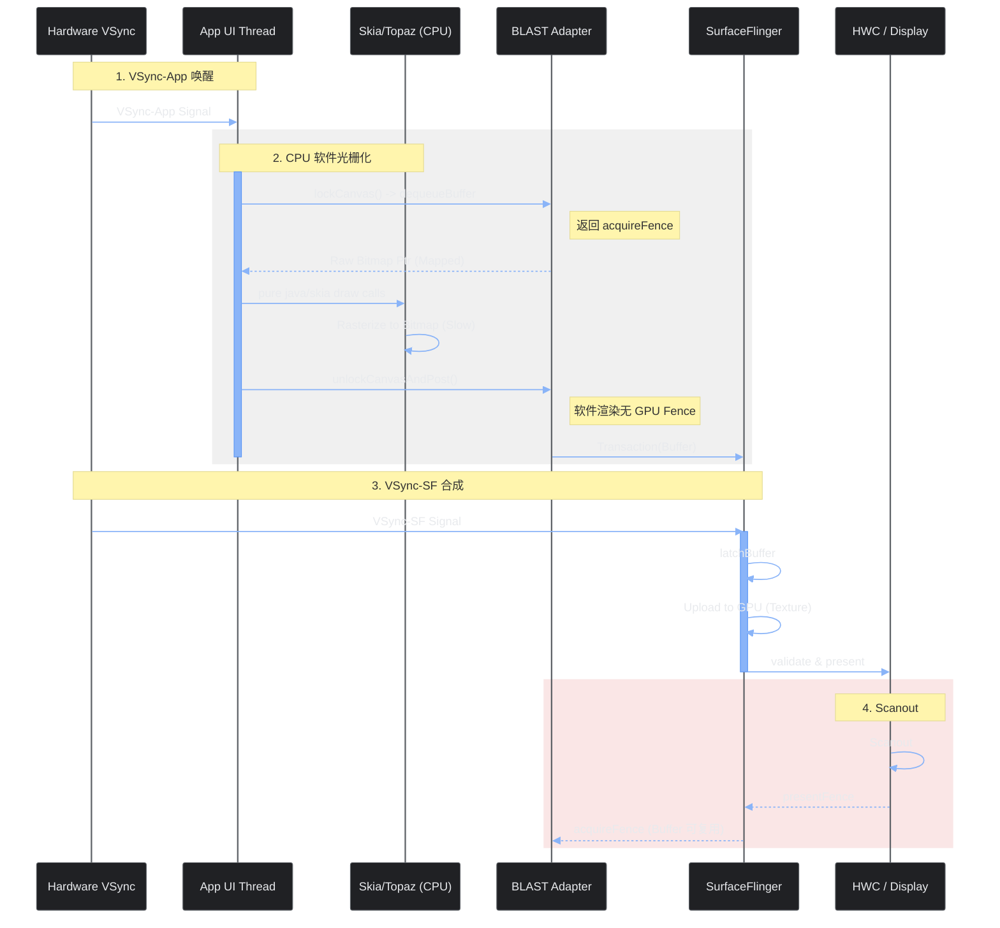
```mermaid
%%{
  init: {
    'theme': 'base',
    'themeVariables': {
      'primaryColor': '#46af54',
      'primaryTextColor': '#ffffff',
      'primaryBorderColor': '#388e3c',
      'lineColor': '#8ab4f8',
      'secondaryColor': '#8ab4f8',
      'tertiaryColor': '#202124',
      'actorBkg': '#202124',
      'actorBorder': '#5f6368',
      'actorTextColor': '#e8eaed',
      'signalColor': '#8ab4f8',
      'signalTextColor': '#e8eaed',
      'labelBoxBkgColor': '#3c4043',
      'labelBoxBorderColor': '#5f6368',
      'labelTextColor': '#e8eaed'
    }
  }
}%%
sequenceDiagram
    participant HW as Hardware VSync
    participant UI as App UI Thread
    participant CPU as Skia/Topaz (CPU)
    participant BBQ as BLAST Adapter
    participant SF as SurfaceFlinger
    participant HWC as HWC / Display

    %% 1. VSync-App
    Note over HW, UI: 1. VSync-App 唤醒
    HW->>UI: VSync-App Signal
    
    %% 2. CPU Drawing
    rect rgb(240, 240, 240)
        Note over UI, CPU: 2. CPU 软件光栅化
        activate UI
        UI->>BBQ: lockCanvas() -> dequeueBuffer
        Note right of BBQ: 返回 acquireFence
        BBQ-->>UI: Raw Bitmap Ptr (Mapped)
        
        UI->>CPU: pure java/skia draw calls
        CPU->>CPU: Rasterize to Bitmap (Slow)
        
        UI->>BBQ: unlockCanvasAndPost()
        Note right of BBQ: 软件渲染无 GPU Fence
        BBQ->>SF: Transaction(Buffer)
        deactivate UI
    end

    %% 3. VSync-SF
    Note over HW, SF: 3. VSync-SF 合成
    HW->>SF: VSync-SF Signal
    activate SF
    SF->>SF: latchBuffer
    SF->>SF: Upload to GPU (Texture)
    SF->>HWC: validate & present
    deactivate SF

    %% 4. Display
    rect rgb(250, 230, 230)
        Note over HWC: 4. Scanout
        HWC->>HWC: Scanout
        HWC-->>SF: presentFence
        SF-->>BBQ: acquireFence (Buffer 可复用)
    end
```

## 3. 详细步骤 (Trace 视角)

1.  **Vsync-App**: 主线程唤醒。
2.  **Surface.lockCanvas()**:
    *   **IPC**: 向本地 BLASTAdapter 请求一个 Buffer。
    *   **Map**: 将 GraphicBuffer 的内存映射 (mmap) 到 App 进程空间。
    *   *Trace*: `lockCanvas`, `dequeueBuffer`.
3.  **Draw (CPU Rasterization)**:
    *   `View.draw()` 调用 `Canvas` API。
    *   底层调用 `SkCanvas` (C++)。
    *   CPU 密集型操作。
    *   *Trace*: `draw`, `Skia DoDraw`.
4.  **Surface.unlockCanvasAndPost()**:
    *   **Unmap**: 解除内存映射。
    *   **Queue**: 提交 Buffer。
    *   **Transaction**: 将 Buffer 封装在 Transaction 中发送给 SF。
    *   *Trace*: `unlockCanvasAndPost`, `queueBuffer`.

## 4. 性能特征
*   **带宽瓶颈**: 从 CPU 内存拷贝像素到 GraphicBuffer 非常慢。
*   **CPU 瓶颈**: 复杂图形（阴影、大图缩放）会占满 CPU。
*   **部分更新 (Dirty Rect)**: 软件渲染通常支持“只重绘变化区域”，这是它唯一的优势。


---

# Standard AOSP Rendering Pipeline (Deep Dive: BLAST)

> [!NOTE]
> **适用版本**: 本文档基于 **Android 12+ BLAST 成熟架构**。Android 16 新增的 `RuntimeColorFilter` / `RuntimeXfermode` API 允许开发者创建自定义图形效果（如 Threshold、Sepia、Hue Saturation），进一步扩展了 RenderThread 的能力。

这是 Android 现代硬件加速渲染链路（Android 10+, 尤其是 Android 12+ 之后）。与旧版相比，最核心的变化是引入了 **BLAST (Buffer Layer State Transition)** 机制，取代了传统的 Binder-based BufferQueue 提交模式。

## 1. 全链路执行流程详解 (Deep Execution Flow)

在深入图表之前，我们先从 App 的视角完整走一遍“一帧是如何画出来的”。这个过程像是一个精密的工厂流水线：

### 第一阶段：UI Thread (主线程) - 生产蓝图
当 `Vsync-App` 信号到达时，主线程被唤醒，开始构建这一帧的“绘制蓝图”：
1.  **Input (输入处理)**: 处理触摸事件。如果你点击了按钮，View 的状态在这里改变（如 `setPressed(true)`），并标记 `invalidate()`。
2.  **Animation (动画)**: 属性动画 (`ValueAnimator`) 在这里计算当前时间点的值（比如按钮缩放到 1.1倍）。
3.  **Measure (测量)**: 确定每个 View 的大小。这是自顶向下的递归调用，父 View 问子 View “你要多大”，子 View 算完告诉父 View。
4.  **Layout (布局)**: 确定每个 View 的位置。父 View 根据测量结果，告诉子 View “你坐在 (x, y) 坐标”。
5.  **Draw (记录/构建)**: **注意，这里并没有真正的像素产生！**
    *   这里执行 `View.onDraw(Canvas)`。
    *   但这个 Canvas 是 `RecordingCanvas`。它的作用是把你的绘制命令（画圆、画文字、画图）**记录** 下来，存到一个叫 `DisplayList` (或 `RenderNode`) 的数据结构中。
    *   产物：**一堆绘制指令列表 (DisplayList)**。

### 第二阶段：Sync (同步) - 移交蓝图
UI 线程做完所有事后，需要把最新的 DisplayList 交给渲染线程。
*   **SyncFrameState**: 这是一个阻塞操作。UI 线程会卡住，等待 RenderThread 醒来并把 DisplayList 及其相关资源（Bitmap 等）同步过去。
*   **为什么阻塞？** 为了保证线程安全，防止 RenderThread 在画的时候 UI 线程改了数据。

### 第三阶段：RenderThread (渲染线程) - 真正的绘制
RenderThread 拿到蓝图后，开始干活：
1.  **dequeueBuffer**: 它向系统（BLASTBufferQueue）要一张空白的画布（Buffer）。
    *   *Trace*: 你会看到 `dequeueBuffer` 耗时，如果很久，说明前面太慢或者没 Buffer 了。
2.  **Flush Commands (GPU Draw)**:
    *   它遍历 DisplayList，把里面的“画圆、画图”指令，翻译成 GPU 能听懂的 **OpenGL/Vulkan 指令**。
    *   调用 `glDraw*` 或 `vkCmdDraw`。
    *   此时 CPU 并不怎么累，累的是 GPU。
3.  **queueBuffer (提交)**:
    *   画完了，把这张 Buffer 还回去。
    *   在 BLAST 模式下，这会触发一个 Transaction。

### 第四阶段：提交与合成 (BLAST & SurfaceFlinger)
1.  **BLAST Transaction**: App 告诉 SurfaceFlinger：“这是新的一帧（Buffer），同时我的窗口位置在 (x, y)”。
2.  **SurfaceFlinger**: 收到所有 App 的 Transaction，按照 Z-Order 把它们拼在一起。
3.  **HWC**: 最终把拼好的图送到屏幕上显示。

---

## 2. 核心组件交互图 (Overview)

在深入 Trace 之前，先建立宏观视角：

-   **App (UI Thread)**: 负责构建视图树，生产 DisplayList。
-   **App (RenderThread)**: 负责将 DisplayList 转换为 GPU 指令。
-   **BLASTBufferQueue (BBQ)**: 运行在 App 进程侧的适配器。它将传统的 `BufferQueue` 生产模式转化为 `SurfaceControl` 的 Transaction 提交。
-   **SurfaceFlinger (SF)**: 接收 Transaction，原子性地应用这些 Buffer 更新。
-   **HWC (Hardware Composer)**: 硬件合成。

---

## 2. 详细渲染时序图 (BLAST Sequence)

这张图展示了引入 BLAST 后的变化：Buffer 的提交变成了 Transaction 的一部分。

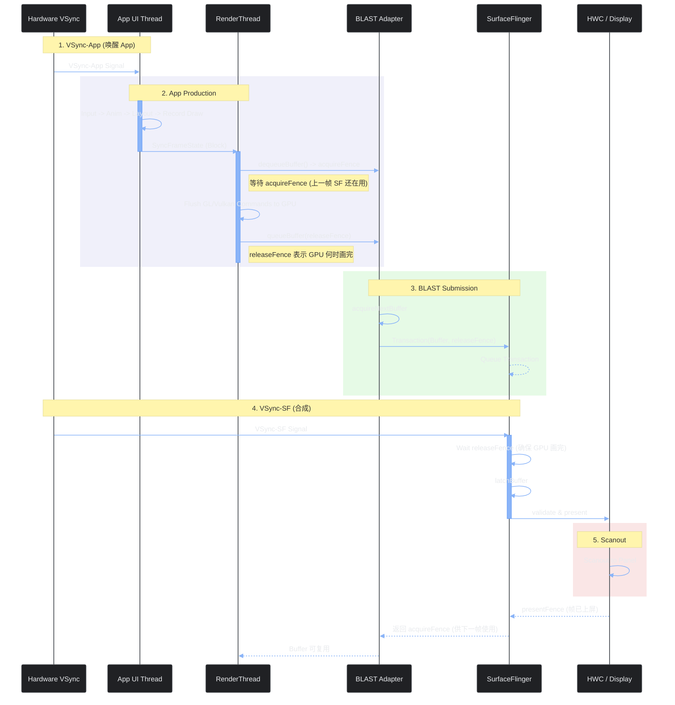
```mermaid
%%{
  init: {
    'theme': 'base',
    'themeVariables': {
      'primaryColor': '#46af54',
      'primaryTextColor': '#ffffff',
      'primaryBorderColor': '#388e3c',
      'lineColor': '#8ab4f8',
      'secondaryColor': '#8ab4f8',
      'tertiaryColor': '#202124',
      'actorBkg': '#202124',
      'actorBorder': '#5f6368',
      'actorTextColor': '#e8eaed',
      'signalColor': '#8ab4f8',
      'signalTextColor': '#e8eaed',
      'labelBoxBkgColor': '#3c4043',
      'labelBoxBorderColor': '#5f6368',
      'labelTextColor': '#e8eaed'
    }
  }
}%%
sequenceDiagram
    participant HW as Hardware VSync
    participant App as App UI Thread
    participant RT as RenderThread
    participant BBQ as BLAST Adapter
    participant SF as SurfaceFlinger
    participant HWC as HWC / Display

    %% 1. VSync-App Arrival
    Note over HW, App: 1. VSync-App (唤醒 App)
    HW->>App: VSync-App Signal
    
    %% 2. App Processing
    rect rgb(240, 240, 250)
        Note over App, RT: 2. App Production
        activate App
        App->>App: Input -> Anim -> Layout -> Record Draw
        App->>RT: SyncFrameState (Block)
        deactivate App
        
        activate RT
        RT->>BBQ: dequeueBuffer() -> acquireFence
        Note right of RT: 等待 acquireFence (上一帧 SF 还在用)
        RT->>RT: Flush GL/Vulkan Commands to GPU
        RT->>BBQ: queueBuffer(releaseFence)
        Note right of RT: releaseFence 表示 GPU 何时画完
        deactivate RT
    end

    %% 3. BLAST Submission
    rect rgb(230, 250, 230)
        Note over BBQ, SF: 3. BLAST Submission
        BBQ->>BBQ: acquireNextBuffer
        BBQ->>SF: Transaction(Buffer, releaseFence)
        SF-->>SF: Queue Transaction
    end

    %% 4. VSync-SF Processing
    Note over HW, SF: 4. VSync-SF (合成)
    HW->>SF: VSync-SF Signal
    activate SF
    SF->>SF: Wait releaseFence (确保 GPU 画完)
    SF->>SF: latchBuffer
    SF->>HWC: validate & present
    deactivate SF

    %% 5. Display & Fence Release
    rect rgb(250, 230, 230)
        Note over HWC: 5. Scanout
        HWC->>HWC: Scanout to Panel
    end
    
    HWC-->>SF: presentFence (帧已上屏)
    SF-->>BBQ: 返回 acquireFence (供下一帧使用)
    BBQ-->>RT: Buffer 可复用
```

---

## 3. 渲染步骤深度拆解 (Trace 视角)

以下步骤对应 Perfetto Trace 中的实际 Slice 标签。

### 阶段一：Sync & RenderThread (生产)

当 `Vsync-App` 触发，UI 线程完成后：

1.  **DrawFrame**: RenderThread 开始绘制。
    *   *Trace*: `DrawFrame`
2.  **dequeueBuffer**: RT 向本地的 BBQ 申请 Buffer。
    *   *注意*: 在 BLAST 模式下，BufferQueue 的逻辑主要在 App 进程内（BLASTBufferQueue 是 Consumer）。
    *   *Trace*: `dequeueBuffer`, `BLASTBufferQueue::dequeueBuffer `
3.  **queueBuffer**: 绘制完成，还给 BBQ。
    *   *Trace*: `queueBuffer`, `BLASTBufferQueue::onFrameAvailable`

### 阶段二：BLAST Adapter (转换)

这是最关键的新增步骤，通常发生在 RenderThread 或专门的 BLAST 线程中。

4.  **acquireNextBuffer**: BBQ 作为消费者，从队列中取回刚刚画好的 Buffer。
5.  **Build Transaction**: BBQ 创建一个 `SurfaceControl.Transaction`。
    *   `t.setBuffer(buffer)`: 设置新的 Buffer。
    *   `t.setAcquireFence(fence)`: 设置同步栅栏。
6.  **applyTransaction**: 将 Transaction 发送给 SurfaceFlinger。
    *   *Trace*: `SurfaceControl::applyTransaction` (可以看到 Binder 调用)

### 阶段三：SurfaceFlinger (事务处理)

7.  **setTransactionState**: SF 收到 Transaction，放入待处理队列。
    *   *Trace*: `setTransactionState`
8.  **handleMessageInvalidate/Refresh**: Vsync-SF 到达。
9.  **flushTransaction**: SF 统一应用所有挂起的 Transaction（包括 App Buffer 更新、Window 位置变化等）。
    *   **原子性**: 保证 Buffer 更新和窗口大小变化是**同时**生效的，彻底解决了旧架构中的画面撕裂和尺寸不同步问题。
10. **latchBuffer**: 锁定当前显示的 Buffer。

---

## 3.5 BlastBufferQueue Buffer 生命周期 (Deep Dive)

这是理解 BLAST 异步机制的核心。BBQ 内部维护一个 **Buffer 槽位池**（通常 3 个槽位，支持 Triple Buffering）。

### Buffer 状态机

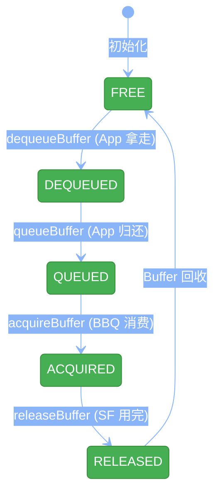
```mermaid
%%{
  init: {
    'theme': 'base',
    'themeVariables': {
      'primaryColor': '#46af54',
      'primaryTextColor': '#ffffff',
      'primaryBorderColor': '#388e3c',
      'lineColor': '#8ab4f8',
      'secondaryColor': '#8ab4f8',
      'tertiaryColor': '#202124',
      'actorBkg': '#202124',
      'actorBorder': '#5f6368',
      'actorTextColor': '#e8eaed',
      'signalColor': '#8ab4f8',
      'signalTextColor': '#e8eaed',
      'labelBoxBkgColor': '#3c4043',
      'labelBoxBorderColor': '#5f6368',
      'labelTextColor': '#e8eaed'
    }
  }
}%%
stateDiagram-v2
    [*] --> FREE: 初始化
    FREE --> DEQUEUED: dequeueBuffer (App 拿走)
    DEQUEUED --> QUEUED: queueBuffer (App 归还)
    QUEUED --> ACQUIRED: acquireBuffer (BBQ 消费)
    ACQUIRED --> RELEASED: releaseBuffer (SF 用完)
    RELEASED --> FREE: Buffer 回收
```

### Buffer 计数逻辑 (槽位视角)

| 操作 | 触发者 | 槽位变化 | Fence |
|:---|:---|:---|:---|
| **dequeueBuffer** | RenderThread | FREE → DEQUEUED (App 占用 +1) | 返回 acquireFence |
| **queueBuffer** | RenderThread | DEQUEUED → QUEUED (App 占用 -1, 待消费 +1) | 传入 releaseFence |
| **acquireBuffer** | BBQ 内部 | QUEUED → ACQUIRED (待消费 -1, 消费中 +1) | — |
| **releaseBuffer** | SF (通过回调) | ACQUIRED → FREE (消费中 -1) | presentFence 通知完成 |

### 异步流转时序 (App → SF)

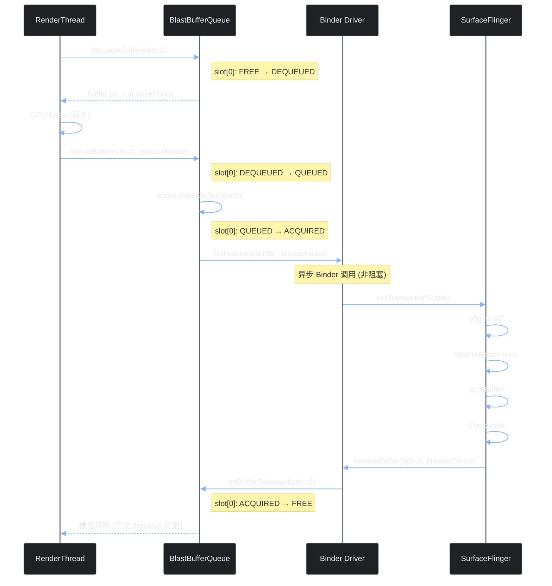
```mermaid
%%{
  init: {
    'theme': 'base',
    'themeVariables': {
      'primaryColor': '#46af54',
      'primaryTextColor': '#ffffff',
      'primaryBorderColor': '#388e3c',
      'lineColor': '#8ab4f8',
      'secondaryColor': '#8ab4f8',
      'tertiaryColor': '#202124',
      'actorBkg': '#202124',
      'actorBorder': '#5f6368',
      'actorTextColor': '#e8eaed',
      'signalColor': '#8ab4f8',
      'signalTextColor': '#e8eaed',
      'labelBoxBkgColor': '#3c4043',
      'labelBoxBorderColor': '#5f6368',
      'labelTextColor': '#e8eaed'
    }
  }
}%%
sequenceDiagram
    participant RT as RenderThread
    participant BBQ as BlastBufferQueue
    participant Binder as Binder Driver
    participant SF as SurfaceFlinger

    %% 1. App 生产
    RT->>BBQ: dequeueBuffer(slot=0)
    Note right of BBQ: slot[0]: FREE → DEQUEUED
    BBQ-->>RT: Buffer ptr + acquireFence
    
    RT->>RT: GPU Draw (异步)
    
    RT->>BBQ: queueBuffer(slot=0, releaseFence)
    Note right of BBQ: slot[0]: DEQUEUED → QUEUED
    
    %% 2. BBQ 内部消费
    BBQ->>BBQ: acquireNextBuffer(slot=0)
    Note right of BBQ: slot[0]: QUEUED → ACQUIRED
    
    %% 3. 异步发送到 SF
    BBQ->>Binder: Transaction{Buffer, releaseFence}
    Note over Binder: 异步 Binder 调用 (非阻塞)
    Binder->>SF: setTransactionState()
    
    %% 4. VSync-SF 触发
    SF->>SF: VSync-SF
    SF->>SF: Wait releaseFence
    SF->>SF: latchBuffer
    SF->>SF: Composite
    
    %% 5. 释放回 BBQ
    SF->>Binder: releaseBuffer(slot=0, presentFence)
    Binder->>BBQ: onBufferReleased(slot=0)
    Note right of BBQ: slot[0]: ACQUIRED → FREE
    BBQ-->>RT: 槽位可用 (下次 dequeue 可用)
```

### 关键点：为什么是异步的？

1.  **Binder 非阻塞**: `applyTransaction` 是异步 Binder 调用，RenderThread 不等待 SF 处理完。
2.  **Fence 同步**: GPU 完成通过 releaseFence 告知 SF，而非 CPU 等待。
3.  **槽位复用**: App 可以继续 dequeue 下一个槽位（如 slot=1），无需等待 slot=0 被 SF 释放。

### Triple Buffering 示意

```
时间 →
App:    [Draw F0]  [Draw F1]  [Draw F2]  [Draw F3] ...
           ↓          ↓          ↓          ↓
Slot:   slot[0]    slot[1]    slot[2]    slot[0]  ← 循环复用
           ↓          ↓          ↓          ↓
SF:        ...    [Latch F0] [Latch F1] [Latch F2] ...
```

## 4. 线程任务详情 (Thread Roles)

| 线程名称 | 关键职责 | 常见 Trace 标签 |
| :--- | :--- | :--- |
| **RenderThread** | 生成 GPU 指令, **通过 BLAST 提交事务** | `DrawFrame`, `queueBuffer`, `applyTransaction` |
| **SurfaceFlinger** | 处理 Transactions, Latch Buffers, 合成 | `setTransactionState`, `handleMessageRefresh`, `latchBuffer` |
| **Binder Driver** | 传输 Transaction 数据 | `binder transaction` |

---

## 6. FrameTimeline & Jank Detection (Android 12+)

在 AOSP 16 中，性能分析不再单纯依赖 "Vsync 周期"，而是基于 **FrameTimeline**。

### 核心机制
1.  **VsyncId**: 每个 Vsync 信号都有一个唯一的 ID。
2.  **Propagation**:
    *   `Choreographer` 收到 `VsyncId` (e.g., 1001)。
    *   App 在 `doFrame` 开始时根据 1001 计算预期上屏时间 (`ExpectedPresentTime`)。
    *   `RenderThread` 在提交 `queueBuffer` 时，将这个 1001 传给 SurfaceFlinger。
3.  **Matching**: SF 收到 Buffer 后，检查当前实际时间是否超过了 ID=1001 的预期时间。如果超过，标记为 **Jank**。

### Trace 表现
在 Perfetto 中：
*   **Expected Timeline**: 绿条，表示“这帧这应该在这里结束”。
*   **Actual Timeline**: 实心条，表示“这帧实际在这里结束”。
*   **Jank Tag**: 如果 Actual > Expected，系统会自动标记 `Jank` 或 `BigJank`。


---

# ANGLE Rendering Pipeline (GLES-over-Vulkan)

> [!WARNING]
> **Android 15+ 强制采用**: 从 Android 15 开始，新设备将**强制**使用 ANGLE 作为 OpenGL ES 的默认实现。如果您的 App 依赖厂商特定的 GLES 扩展（如 `GL_QCOM_*`），必须测试 ANGLE 兼容性或迁移到 Vulkan。

**ANGLE** (Almost Native Graphics Layer Engine) 是 Google 开发的开源图形抽象层，将 OpenGL ES API 翻译为底层原生 API (Vulkan/Metal/D3D)。从 Android 10 开始部分设备启用，**Android 15+ 成为强制默认 GLES 实现**。

## 1. 为什么需要 ANGLE？

传统 Android 图形栈的痛点：

| 问题 | 根因 | ANGLE 解决方案 |
|:---|:---|:---|
| **驱动碎片化** | 每个 GPU 厂商实现不同 | 统一的 ANGLE 翻译层 |
| **兼容性 Bug** | 厂商 GLES 驱动质量参差 | Google 维护的标准实现 |
| **调试困难** | 厂商驱动闭源 | ANGLE 开源，可 Debug |
| **Vulkan 资源利用** | 老 App 用 GLES 无法享受 Vulkan 优势 | 透明翻译到 Vulkan |

## 2. 核心架构

```mermaid
%%{
  init: {
    'theme': 'base',
    'themeVariables': {
      'primaryColor': '#46af54',
      'primaryTextColor': '#ffffff',
      'primaryBorderColor': '#388e3c',
      'lineColor': '#8ab4f8',
      'secondaryColor': '#8ab4f8',
      'tertiaryColor': '#202124',
      'actorBkg': '#202124',
      'actorBorder': '#5f6368',
      'actorTextColor': '#e8eaed',
      'signalColor': '#8ab4f8',
      'signalTextColor': '#e8eaed',
      'labelBoxBkgColor': '#3c4043',
      'labelBoxBorderColor': '#5f6368',
      'labelTextColor': '#e8eaed'
    }
  }
}%%
graph TD
    subgraph "App Layer"
        App[App (GLES Calls)]
    end
    
    subgraph "ANGLE Layer"
        Translator[GLES -> Vulkan Translator]
        Shader[SPIR-V Compiler]
        State[State Tracker]
    end
    
    subgraph "System"
        VK[Vulkan Driver]
        GPU[GPU]
    end
    
    App -->|glDrawArrays| Translator
    Translator -->|vkCmdDraw| VK
    Translator -->|Shader| Shader
    Shader -->|SPIR-V| VK
    VK -->|Execute| GPU
```

## 3. 启用检测

### 3.1 运行时检测

```java
// 检查 ANGLE 是否启用
String renderer = GLES20.glGetString(GLES20.GL_RENDERER);
boolean isANGLE = renderer.contains("ANGLE");

// 获取后端
// "ANGLE (Google, Vulkan 1.3.x, ...)"
```

### 3.2 adb 命令

```bash
# 查看当前 ANGLE 状态
adb shell settings get global angle_gl_driver_all_apps

# 强制所有 App 使用 ANGLE
adb shell settings put global angle_gl_driver_all_apps angle

# 恢复系统默认
adb shell settings delete global angle_gl_driver_all_apps
```

## 4. 渲染时序图

注意 GLES 调用被翻译为 Vulkan 调用。

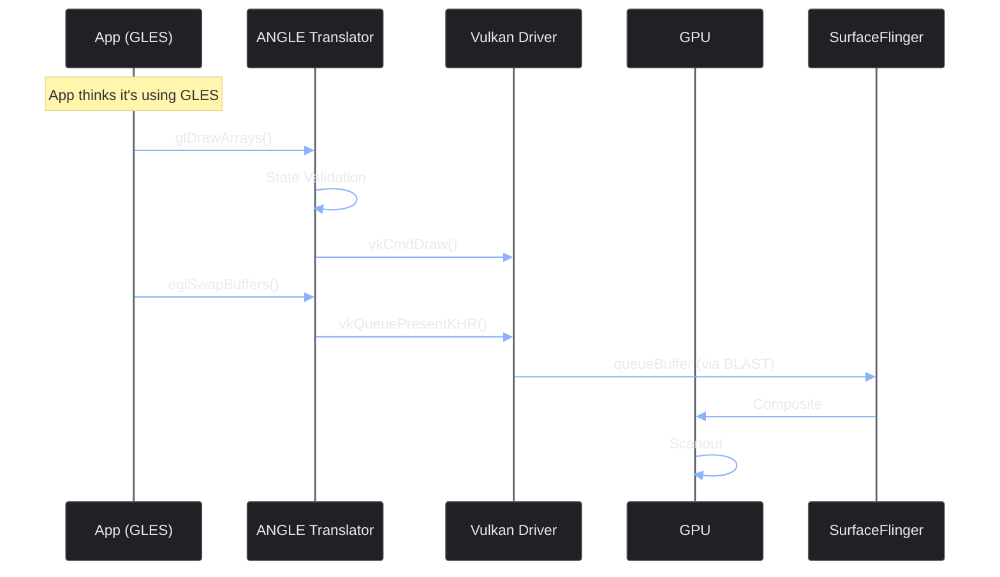
```mermaid
%%{
  init: {
    'theme': 'base',
    'themeVariables': {
      'primaryColor': '#46af54',
      'primaryTextColor': '#ffffff',
      'primaryBorderColor': '#388e3c',
      'lineColor': '#8ab4f8',
      'secondaryColor': '#8ab4f8',
      'tertiaryColor': '#202124',
      'actorBkg': '#202124',
      'actorBorder': '#5f6368',
      'actorTextColor': '#e8eaed',
      'signalColor': '#8ab4f8',
      'signalTextColor': '#e8eaed',
      'labelBoxBkgColor': '#3c4043',
      'labelBoxBorderColor': '#5f6368',
      'labelTextColor': '#e8eaed'
    }
  }
}%%
sequenceDiagram
    participant App as App (GLES)
    participant ANGLE as ANGLE Translator
    participant VK as Vulkan Driver
    participant GPU as GPU
    participant SF as SurfaceFlinger

    Note over App: App thinks it's using GLES
    App->>ANGLE: glDrawArrays()
    ANGLE->>ANGLE: State Validation
    ANGLE->>VK: vkCmdDraw()
    
    App->>ANGLE: eglSwapBuffers()
    ANGLE->>VK: vkQueuePresentKHR()
    VK->>SF: queueBuffer (via BLAST)
    
    SF->>GPU: Composite
    GPU->>GPU: Scanout
```

## 5. 性能特征

### 5.1 优势

| 方面 | 传统 GLES Driver | ANGLE-Vulkan |
|:---|:---|:---|
| **Draw Call 开销** | 较高 (状态机) | 较低 (显式状态) |
| **多线程** | 有限 | 完全支持 |
| **Shader 编译** | 运行时 | 预编译 SPIR-V |
| **调试工具** | 厂商特定 | RenderDoc 统一 |

### 5.2 开销

*   **翻译层开销**: ~5-10% CPU 开销 (复杂场景)
*   **首次 Shader 编译**: 稍慢 (GLSL → SPIR-V → GPU Binary)
*   **内存**: 略高 (需要维护翻译状态)

## 6. Trace 分析

在 Perfetto 中 ANGLE 的特征：

1.  **GPU Track**: 看到 `vkQueue*` 而非 `glDraw*`
2.  **ANGLE Thread**: 可能有独立的翻译线程
3.  **Shader Compile**: `ANGLE Shader Compile` Slice

### 6.1 常见问题定位

```sql
-- 查找 ANGLE 相关耗时
SELECT name, dur FROM slice 
WHERE name LIKE '%ANGLE%' OR name LIKE '%vk%'
ORDER BY dur DESC LIMIT 20;
```

## 7. 开发者建议

1.  **测试覆盖**: 确保 App 在 ANGLE 和 Native GLES 下都测试过
2.  **避免厂商扩展**: 如 `GL_QCOM_*`, ANGLE 可能不支持
3.  **Shader 优化**: ANGLE 对 Shader 要求更严格，不合规的 GLSL 会报错
4.  **调试模式**: 使用 `angle_debug_layers` 开启验证层
5.  **优先 Vulkan**: 新项目建议直接使用 Vulkan，避免 ANGLE 翻译层开销

## 8. 兼容性

| Android 版本 | ANGLE 状态 |
|:---|:---|
| **Android 16** (API 36) | **强制默认** + VPA 统一 Vulkan 特性 |
| **Android 15** (API 35) | **强制默认**，新设备无法绕过 |
| Android 14 (API 34) | 多数设备默认 |
| Android 13 (API 33) | 多数设备默认 |
| Android 12 (API 31) | 更广泛默认启用 |
| Android 11 (API 30) | 部分设备默认启用 |
| Android 10 (API 29) | 实验性，需手动启用 |


---

# Camera Rendering Pipeline (Camera2 & HAL3)

Camera 是 Android 系统中数据量最大、实时性要求最高的子系统之一。理解 Camera 管线对于优化“通过取景器预览”的流畅度以及实现高效的图像分析（如扫码、人脸识别）至关重要。

## 1. 核心架构：多流并发 (Multi-Stream)

与简单的 View 渲染不同，Camera 系统天生就是**多消费者 (Multiple Consumers)** 的。
Camera HAL (Hardware Abstraction Layer) 可以同时向多个 Surface 输出数据，而且通常是**零拷贝 (Zero Copy)** 的。

### 关键组件

1.  **CameraService (Native)**: 系统服务，负责管理 Camera 硬件资源。
2.  **Start Request**: App 发送 CaptureRequest (不仅包含“拍”的指令，还包含 ISO、曝光等参数)。
3.  **App Surface**: App 提前配置好的一组 Surface（例如一个给屏幕预览，一个给编码器录像）。
4.  **HAL3 / ISP**: 硬件图像信号处理器，产生原始数据并转换为 YUV/JPEG。

---

## 2. 数据流详解 (Deep Execution Flow)

### 阶段一：Configure (配置流)
在使用相机前，App 必须告诉系统“我要几路数据，每路多大”：
1.  **createCaptureSession**: App 传入一组 Surface 列表。
    *   `SurfaceView` (Preview)
    *   `MediaRecorder.getSurface()` (Video)
    *   `ImageReader.getSurface()` (Analysis/YUV)
2.  **HAL Configure**: CameraService 将这些 Surface 的 Usage/Format 告诉 HAL。HAL 会根据硬件能力（如 ISP 吞吐量）决定是否支持该组合。

### 阶段二：Request & Produce (生产)
1.  **setRepeatingRequest**: App 下发一个循环请求（通常用于预览）。
2.  **ISP Processing**: 传感器 (Sensor) 曝光 -> ISP 去噪/白平衡 -> 输出 RAW/YUV。
3.  **Buffer Fill**: HAL 直接向各个 Surface 的 BufferQueue 填充数据。
    *   *注意*: 现代 HAL 通常直接操作 GraphicBuffer，不经过 CPU 拷贝。

### 阶段三：Consume (消费/渲染)

#### Case A: Preview (预览)
*   **SurfaceView**: HAL 填充 Buffer -> SurfaceFlinger (Overlay) -> 屏幕。
    *   *延迟*: 最低。
*   **TextureView**: HAL 填充 Buffer -> SurfaceTexture -> App GL Texture -> App Draw -> SF -> 屏幕。
    *   *延迟*: 较高（多了一次 GPU 采样）。

#### Case B: Recording (录像)
*   **MediaCodec Input Surface**: HAL 填充 Buffer -> MediaCodec (Encoder) -> H.264/265 bitstream。
    *   *路径*: 全程 Hardware Tunneling，不经过 CPU。

#### Case C: Analysis (AI/CV)
*   **ImageReader**: HAL 填充 Buffer -> App `onImageAvailable`。
    *   App 通过 `image.getPlanes()` 获取 YUV 数据指针 (ByteBuffer)。
    *   *性能坑点*: 如果 App 拿到 Buffer 后处理太慢（不及时 close），会导致 HAL 没有空闲 Buffer 可用，从而发生**掉帧 (Frame Drop)**。

---

## 3. 渲染时序图

这是一个典型的“一产多销”模型。

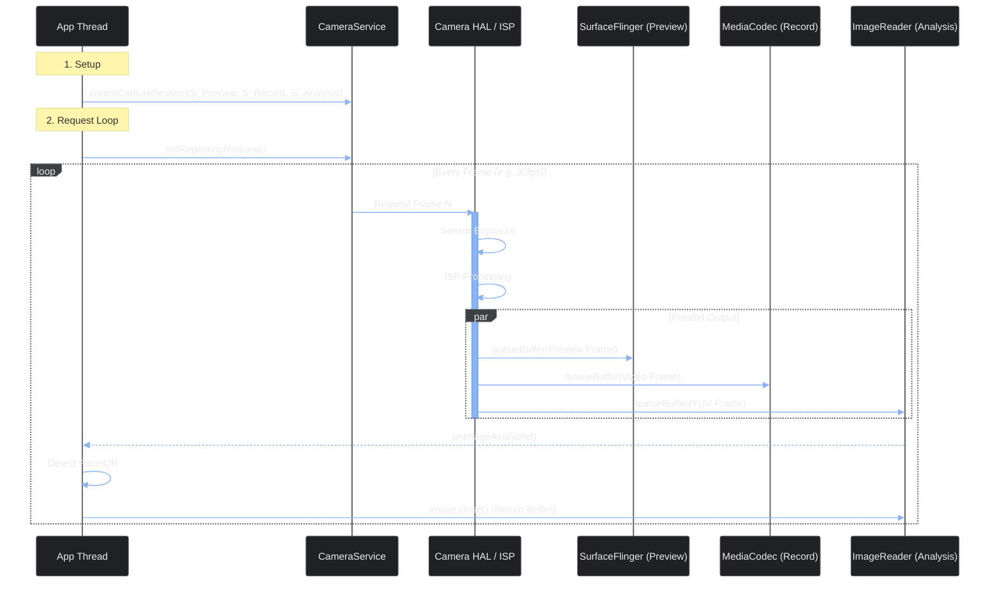
```mermaid
%%{
  init: {
    'theme': 'base',
    'themeVariables': {
      'primaryColor': '#46af54',
      'primaryTextColor': '#ffffff',
      'primaryBorderColor': '#388e3c',
      'lineColor': '#8ab4f8',
      'secondaryColor': '#8ab4f8',
      'tertiaryColor': '#202124',
      'actorBkg': '#202124',
      'actorBorder': '#5f6368',
      'actorTextColor': '#e8eaed',
      'signalColor': '#8ab4f8',
      'signalTextColor': '#e8eaed',
      'labelBoxBkgColor': '#3c4043',
      'labelBoxBorderColor': '#5f6368',
      'labelTextColor': '#e8eaed'
    }
  }
}%%
sequenceDiagram
    participant App as App Thread
    participant CS as CameraService
    participant HAL as Camera HAL / ISP
    participant SF as SurfaceFlinger (Preview)
    participant MC as MediaCodec (Record)
    participant AI as ImageReader (Analysis)

    Note over App: 1. Setup
    App->>CS: createCaptureSession(S_Preview, S_Record, S_Analysis)

    Note over App: 2. Request Loop
    App->>CS: setRepeatingRequest()
    
    loop Every Frame (e.g. 30fps)
        CS->>HAL: Request Frame N
        activate HAL
        HAL->>HAL: Sensor Exposure
        HAL->>HAL: ISP Processing
        
        par Parallel Output
            HAL->>SF: queueBuffer(Preview Frame)
            HAL->>MC: queueBuffer(Video Frame)
            HAL->>AI: queueBuffer(YUV Frame)
        end
        deactivate HAL
        
        AI-->>App: onImageAvailable()
        App->>App: Detect Face/QR
        App->>AI: image.close() (Return Buffer)
    end
```

## 4. 性能特征与调优

### 4.1 ZSL (Zero Shutter Lag)
为了解决“按下快门到真正拍照”的延迟：
*   Camera 实际上一直在后台以全分辨率拍图，存入一个环形缓冲区 (Ring Buffer)。
*   当用户按快门时，系统直接从缓冲区里“捞”出最近的一帧 JPEG。
*   这就是为什么现在的手机拍照几乎是瞬时的。

### 4.2 SurfaceView vs TextureView
*   **必须使用 SurfaceView** 的场景：4K/60fps 预览、DRM 内容、追求极致省电。
*   **可以使用 TextureView** 的场景：需要对预览画面做滤镜（美颜）、需要预览画面做动画（缩放/圆角）。

### 4.3 内存抖动
*   **ImageReader**: 务必复用。很多初学者在 `onImageAvailable` 里 `new byte[]` 来拷贝数据，这是性能杀手。应该直接使用 NDK 或 RenderScript/Vulkan 直接处理 `ByteBuffer`。

## 5. 常见 Trace 分析
在 Perfetto 中：
*   **CameraProvider**: 查看 HAL 层的耗时。
*   **CameraService**: 查看 Request 下发频率。
*   **dma_buf**: 监控 GraphicBuffer 的内存分配（Camera 预览通常也是大内存消耗户）。

## 6. HAL3 Request-Buffer 生命周期 (Deep Dive)

理解 Camera2 的 Request 与 Buffer 的生命周期是追查**掉帧**和**延迟**问题的关键。

### 6.1 Request 状态机

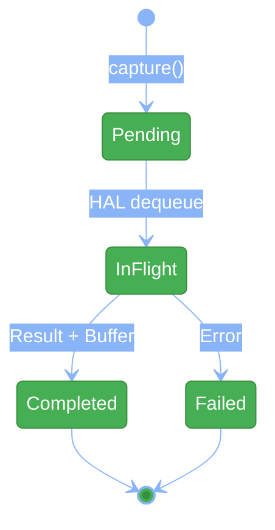
```mermaid
%%{
  init: {
    'theme': 'base',
    'themeVariables': {
      'primaryColor': '#46af54',
      'primaryTextColor': '#ffffff',
      'primaryBorderColor': '#388e3c',
      'lineColor': '#8ab4f8',
      'secondaryColor': '#8ab4f8',
      'tertiaryColor': '#202124',
      'actorBkg': '#202124',
      'actorBorder': '#5f6368',
      'actorTextColor': '#e8eaed',
      'signalColor': '#8ab4f8',
      'signalTextColor': '#e8eaed',
      'labelBoxBkgColor': '#3c4043',
      'labelBoxBorderColor': '#5f6368',
      'labelTextColor': '#e8eaed'
    }
  }
}%%
stateDiagram-v2
    [*] --> Pending: capture()
    Pending --> InFlight: HAL dequeue
    InFlight --> Completed: Result + Buffer
    InFlight --> Failed: Error
    Completed --> [*]
    Failed --> [*]
```

### 6.2 Buffer 生命周期

| 阶段 | 触发者 | Buffer 状态 |
|:---|:---|:---|
| **Dequeue** | HAL (ISP) | HAL 拥有，正在填充 |
| **Fill** | ISP Pipeline | 数据写入中 |
| **Queue** | HAL | 提交给 Consumer (SF/App) |
| **Acquire** | Consumer | Consumer 拥有，正在使用 |
| **Release** | Consumer | 归还给 BufferQueue |

### 6.3 Session Callback (性能关键)

`CameraCaptureSession.CaptureCallback` 提供了精细的时间戳信息：

| 回调方法 | 触发时机 | 性能分析用途 |
|:---|:---|:---|
| `onCaptureStarted` | Sensor 曝光开始 | 测量 Request 下发延迟 |
| `onCaptureProgressed` | 部分 Metadata 就绪 | 3A (AE/AF/AWB) 收敛速度分析 |
| `onCaptureCompleted` | 全部 Metadata 就绪 | 测量 Pipeline 总耗时 |
| `onCaptureFailed` | HAL 报错 | 掉帧根因定位 |
| `onCaptureBufferLost` | Buffer 丢失 | BufferQueue 压力分析 |

### 6.4 典型掉帧场景

1.  **Buffer Starvation**: Consumer (`ImageReader`) 处理太慢，`image.close()` 不及时，导致 HAL 无法 Dequeue。
    *   *Trace*: `CameraProvider` 中看到 `dequeueBuffer` 阻塞。
2.  **Pipeline Stall**: ISP 处理某些特效（HDR、夜景）耗时过长，超过帧间隔。
    *   *Trace*: `onCaptureCompleted` 到 `onCaptureStarted` 间隔不稳定。
3.  **Binder Congestion**: CameraService 与 App 之间的 IPC 拥塞。
    *   *Trace*: `binder transaction` 耗时异常。


---

# Flutter Rendering Architecture (Index)

Flutter 的渲染架构随着版本演进发生了巨大变化。为了更好地理解其微观实现，我们将文档拆分为以下几个部分。

## 1. 核心版本演进

| 特性 | Flutter 3.19 (Legacy) | Flutter 3.29+ (Modern) |
| :--- | :--- | :--- |
| **渲染引擎** | Skia | Impeller (Vulkan/Metal) |
| **线程模型** | 独立 `1.ui` Thread + `1.raster` Thread | **Merged Platform Model** (UI 跑在 Main) |
| **典型 Trace** | `MessageLoop::Run` (独立轨道) | `Looper::pollOnce` (主线程轨道) |

## 2. 线程模型 (Merged Model)

在 Flutter 3.29+ 中，Dart 代码（UI Task）直接运行在 Android 的主线程上，消除了原本 `1.ui` 线程与 Platform Channel 通信的锁开销。

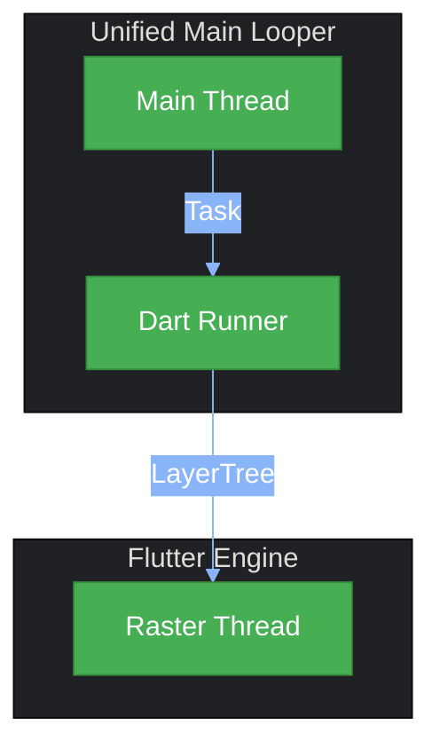
```mermaid
%%{
  init: {
    'theme': 'base',
    'themeVariables': {
      'primaryColor': '#46af54',
      'primaryTextColor': '#ffffff',
      'primaryBorderColor': '#388e3c',
      'lineColor': '#8ab4f8',
      'secondaryColor': '#8ab4f8',
      'tertiaryColor': '#202124',
      'actorBkg': '#202124',
      'actorBorder': '#5f6368',
      'actorTextColor': '#e8eaed',
      'signalColor': '#8ab4f8',
      'signalTextColor': '#e8eaed',
      'labelBoxBkgColor': '#3c4043',
      'labelBoxBorderColor': '#5f6368',
      'labelTextColor': '#e8eaed'
    }
  }
}%%
graph TD
    subgraph "Unified Main Looper"
        Main[Main Thread]
        Dart[Dart Runner]
    end
    subgraph "Flutter Engine"
        Raster[Raster Thread]
    end
    
    Main -->|Task| Dart
    Dart -->|LayerTree| Raster
```

## 3. 详细渲染管线 (Pipelines)

请根据具体的集成模式查看对应的详细文档：

### 3.1 [SurfaceView 模式 (默认/高性能)](flutter_surfaceview.md)
*   **适用场景**: 全屏 Flutter 应用，或无重叠的嵌入。
*   **架构**: 独立 Surface，直接提交 BLAST，不经过 App RenderThread。
*   **关键词**: `Impeller`, `Vulkan`, `BLASTBufferQueue`, `Zero Copy`.

### 3.2 [TextureView 模式 (混合/兼容)](flutter_textureview.md)
*   **适用场景**: 需要半透明、旋转、裁剪，或嵌入复杂 View 层级中。
*   **架构**: 渲染到纹理 -> App 主线程中转 -> App RenderThread 合成。
*   **关键词**: `SurfaceTexture`, `updateTexImage`, `Performance Penalty`.


---

# Flutter SurfaceView Pipeline (Impeller/BLAST)

这是 Flutter 在 Android 上的默认和推荐模式（Modern Android）。它利用 `SurfaceView` 独立的 Surface 和 BLAST 机制，实现了高性能、低延迟的渲染。

## 1. 独立合成流程详解 (Deep Execution Flow)

在此模式下，Flutter 的渲染流水线与 Android 原生 UI 线程几乎完全去耦，除了 Vsync 信号的驱动。

### 第一阶段：Dart Runner (UI Thread)
1.  **Vsync**: 引擎层收到信号，驱动 Dart 运行。
2.  **Build (构建)**: 运行 `Widget.build()`。这就像搭积木，决定“界面长什么样”。
    *   *产物*: Element Tree (更稳定的结构)。
3.  **Layout (布局)**: `RenderObject.performLayout()`。
    *   计算每个渲染对象的大小和位置。这对应 AOSP 的 Measure/Layout，但全在 Dart 里完成。
4.  **Paint (绘制)**: `RenderObject.paint()`。
    *   **关键**: 这里也不产生像素，而是生成一个 **Layer Tree** (图层树)。它好比是一份“绘图指令列表”。
5.  **Submit**: Dart 线程把 Layer Tree 打包，发给 Raster Thread。

### 第二阶段：Raster Thread (光栅化)
1.  **LayerTree Processing**: 拿到 Dart 发来的指令树，进行优化和合成。
2.  **Rasterization (Impeller)**:
    *   使用 Vulkan (或 Metal) 直接生成 Command Buffer。
    *   不需要像 Skia 那样即时(JIT)编译 Shader，因其 Shader 是预编译的(AOT)，极大减少了首帧卡顿。
3.  **Present (直接提交)**:
    *   通过 `vkQueuePresentKHR` (Vulkan) 或 `eglSwapBuffers` (GL)。
    *   **关键**: 这一步直接写入到一张独立的 SurfaceBuffer 中。

### 第三阶段：BLAST Submission (系统合成)
1.  **queueBuffer**: Vulkan 驱动底层调用 `queueBuffer`。
2.  **BLAST Adapter**: 这是一个运行在 App 进程中的组件。它捕获这个 Buffer，并将其封装进一个 `SurfaceControl.Transaction`。
3.  **Atomic Sync**: 如果这个 Transaction 包含了 Window 的位置变化（比如 resize），它们会原子生效。
4.  **SurfaceFlinger**: 收到 Transaction，直接合成到屏幕，**不经过 App RenderThread**。

---

## 2. 渲染时序图

这张图展示了从 Dart 构建到最终 BLAST 合成的全过程。

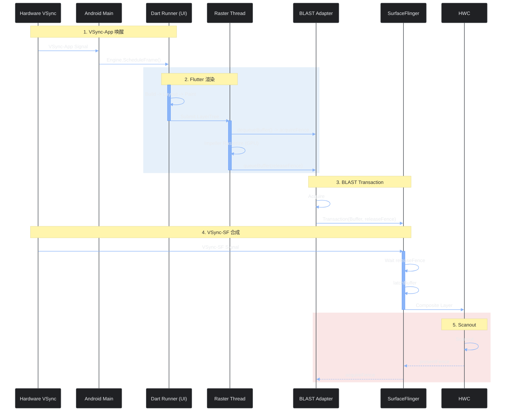
```mermaid
%%{
  init: {
    'theme': 'base',
    'themeVariables': {
      'primaryColor': '#46af54',
      'primaryTextColor': '#ffffff',
      'primaryBorderColor': '#388e3c',
      'lineColor': '#8ab4f8',
      'secondaryColor': '#8ab4f8',
      'tertiaryColor': '#202124',
      'actorBkg': '#202124',
      'actorBorder': '#5f6368',
      'actorTextColor': '#e8eaed',
      'signalColor': '#8ab4f8',
      'signalTextColor': '#e8eaed',
      'labelBoxBkgColor': '#3c4043',
      'labelBoxBorderColor': '#5f6368',
      'labelTextColor': '#e8eaed'
    }
  }
}%%
sequenceDiagram
    participant HW as Hardware VSync
    participant Main as Android Main
    participant Dart as Dart Runner (UI)
    participant Raster as Raster Thread
    participant BBQ as BLAST Adapter
    participant SF as SurfaceFlinger
    participant HWC as HWC

    %% 1. VSync-App
    Note over HW, Dart: 1. VSync-App 唤醒
    HW->>Main: VSync-App Signal
    Main->>Dart: Engine.ScheduleFrame()
    
    %% 2. Flutter Pipeline
    rect rgb(230, 240, 250)
        Note over Dart, Raster: 2. Flutter 渲染
        activate Dart
        Dart->>Dart: Build -> Layout -> Paint
        Dart->>Raster: Submit LayerTree
        deactivate Dart
        
        activate Raster
        Raster->>BBQ: dequeueBuffer() -> acquireFence
        Raster->>Raster: Impeller Rasterize (GPU)
        Raster->>BBQ: queueBuffer(releaseFence)
        deactivate Raster
    end
    
    %% 3. BLAST Submission
    Note over BBQ, SF: 3. BLAST Transaction
    BBQ->>BBQ: Acquire
    BBQ->>SF: Transaction(Buffer, releaseFence)

    %% 4. VSync-SF
    Note over HW, SF: 4. VSync-SF 合成
    HW->>SF: VSync-SF Signal
    activate SF
    SF->>SF: Wait releaseFence
    SF->>SF: latchBuffer
    SF->>HWC: Composite Layer
    deactivate SF

    %% 5. Display
    rect rgb(250, 230, 230)
        Note over HWC: 5. Scanout
        HWC->>HWC: Scanout
        HWC-->>SF: presentFence
        SF-->>BBQ: acquireFence
    end
``` 

## 3. Platform View 兼容性限制

当 Flutter 应用需要嵌入原生 Android View（如 Google Maps、WebView）时，SurfaceView 模式存在根本性限制。

### 3.1 为什么不兼容

| 问题 | 根因 |
|:---|:---|
| **Z-Order 冲突** | 原生 View 和 Flutter SurfaceView 是两个独立的 Layer，无法交错 |
| **手势穿透** | 触摸事件分发路径不一致 |
| **裁剪/圆角** | SurfaceView 不支持 `clipPath` 等 View 变换 |

### 3.2 自动降级机制

当检测到 `PlatformView` 存在时，Flutter 引擎会**自动降级**到 TextureView 模式：

```dart
// flutter/engine: shell/platform/android/io/flutter/embedding/android/FlutterView.java
if (platformViewsController.usesVirtualDisplays()) {
    // TextureView 模式 (Hybrid Composition Virtual Display)
} else {
    // Hybrid Composition (Android View 直接嵌入)
}
```

### 3.3 开发者建议

1.  **尽量减少 PlatformView 数量**: 每增加一个，性能损失约 5-10%。
2.  **优先使用 Flutter 原生组件**: 如 `flutter_map` 代替 Google Maps。
3.  **监控降级**: 在 Perfetto 中检查是否意外启用了 TextureView 模式（看是否有 `SurfaceTexture` 相关 Slice）。


---

# Flutter TextureView Pipeline (PlatformView)

当需要将 Flutter 视图嵌入复杂的 Android View 层级中，或者需要对 Flutter View 进行半透明、旋转、裁剪动画时，会回退到 `TextureView` 模式。

## 1. 混合渲染流程详解 (Deep Execution Flow)

在此模式下，Flutter 降级为一个普通的“内容生产者”，它的每一帧都必须经过 Android 原生渲染管线的“转手”。

### 第一阶段：Flutter 生产 (Dart & Raster)
与 SurfaceView 模式类似，Dart 进行 Build/Layout/Paint，Raster 进行光栅化。
*   **差异点**: Raster Thread 的目标不是一张独立的 Surface，而是一个 **SurfaceTexture** (纹理对象)。
*   **Present**: 调用 `queueBuffer` 后，它不会直接发给系统，而是触发一个回调通知 Java 层。

### 第二阶段：Main Thread Roundtrip (主线程周转)
这是性能隐患的核心，但 **Flutter 3.29+** 对此进行了重大优化：

#### Legacy (<=3.24)
1.  **Frame Available**: `SurfaceTexture` 在任意线程触发回调。
2.  **Lock**: 需要竞争锁来跨线程通知。

#### Modern (3.29+ Merged Model)
在 3.29+ 中，因为 Flutter UI 任务本身就跑在 Main Thread，所以 SurfaceTexture 的创建和管理也被强制绑定到了 **Main Thread**。
1.  **Ownership**: 所有的 PlatformView SurfaceTexture 现在归 Main Thread 所有。
2.  **No Lock**: Raster Thread 提交后 (`queueBuffer`)，`onFrameAvailable` 回调直接在 Main Thread 响应，消除了上下文切换和锁竞争。
3.  **Invalidate**: 主线程立即收到信号，直接调用 `invalidate()`。
4.  **Wait Vsync**: 虽然消除了锁，但“等待下一个 Vsync”的物理限制依然存在（因为是 TextureView）。

### 第三阶段：RenderThread Composite (渲染线程合成)
1.  **updateTexImage**: App 的 `RenderThread` 在绘制这一帧 View 树时，发现有个 `TextureView`。它调用 `updateTexImage` 从 SurfaceTexture 中把 Flutter 刚画的那帧“吸”出来，变成一个 OpenGL 纹理。
2.  **Draw**: 把它当做一张图片画在 App 的主 Framebuffer 上。
3.  **BLAST**: 最终，App 的主 Framebuffer 通过 BLAST 提交给 SurfaceFlinger。

**结论**: 一帧 Flutter 画面，要先被 Flutter 画一次，再被 Android 画一次，才能上屏。

---

## 2. 渲染时序图

注意图中的 "Main Thread Roundtrip" 和 "Double Draw"。

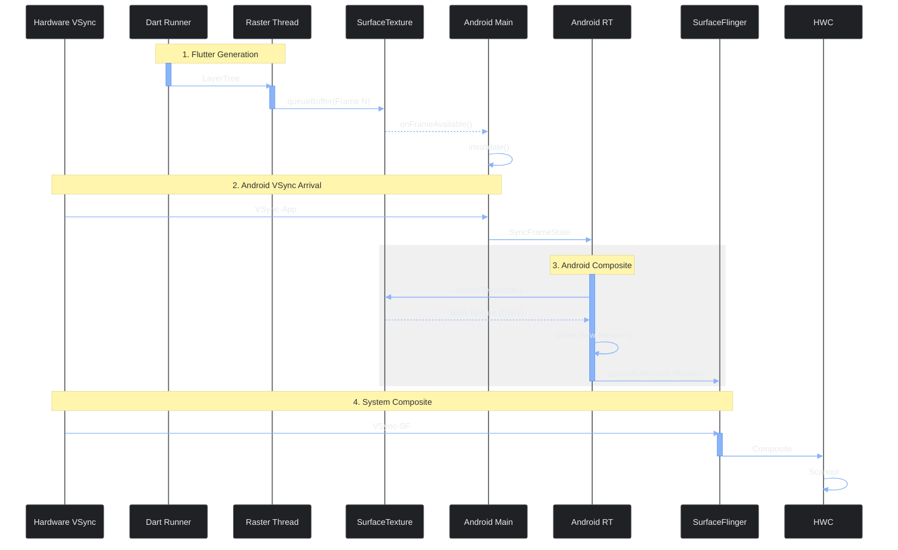
```mermaid
%%{
  init: {
    'theme': 'base',
    'themeVariables': {
      'primaryColor': '#46af54',
      'primaryTextColor': '#ffffff',
      'primaryBorderColor': '#388e3c',
      'lineColor': '#8ab4f8',
      'secondaryColor': '#8ab4f8',
      'tertiaryColor': '#202124',
      'actorBkg': '#202124',
      'actorBorder': '#5f6368',
      'actorTextColor': '#e8eaed',
      'signalColor': '#8ab4f8',
      'signalTextColor': '#e8eaed',
      'labelBoxBkgColor': '#3c4043',
      'labelBoxBorderColor': '#5f6368',
      'labelTextColor': '#e8eaed'
    }
  }
}%%
sequenceDiagram
    participant HW as Hardware VSync
    participant Dart as Dart Runner
    participant Raster as Raster Thread
    participant ST as SurfaceTexture
    participant Main as Android Main
    participant RT as Android RT
    participant SF as SurfaceFlinger
    participant HWC as HWC

    %% 1. Flutter Produce
    Note over Dart, Raster: 1. Flutter Generation
    activate Dart
    Dart->>Raster: LayerTree
    deactivate Dart
    activate Raster
    Raster->>ST: queueBuffer(Frame N)
    deactivate Raster
    
    %% 2. Callback
    ST-->>Main: onFrameAvailable()
    Main->>Main: invalidate()
    
    %% 3. Android VSync
    Note over HW, Main: 2. Android VSync Arrival
    HW->>Main: VSync-App
    Main->>RT: SyncFrameState
    
    %% 4. Android Render
    rect rgb(240, 240, 240)
        Note over RT: 3. Android Composite
        activate RT
        RT->>ST: updateTexImage()
        ST-->>RT: Bind Texture (Copy)
        RT->>RT: Draw View Hierarchy
        RT->>SF: queueBuffer(App Window)
        deactivate RT
    end
    
    %% 5. System Composite
    Note over HW, SF: 4. System Composite
    HW->>SF: VSync-SF
    activate SF
    SF->>HWC: Composite
    deactivate SF
    
    HWC->>HWC: Scanout
```


---

# Game Engine Rendering Pipeline (Unity / Unreal)

专业游戏引擎（如 Unity, Unreal, Godot）通常具有自己的跨平台渲染架构，但在 Android 上运行时，它们必须遵循 Android 的窗口系统规则。

## 1. 游戏渲染流程详解 (Deep Execution Flow)

游戏引擎的渲染循环 (Game Loop) 与普通 App 的事件驱动模型不同，它是一个死循环，尽可能快地跑（或者跑在固定帧率）。

### 第一阶段：Logic Thread (主逻辑线程)
这是 C# 脚本或 Lua 逻辑运行的地方：
1.  **Input**: 收集上一帧的触摸、摇杆输入。
2.  **Simulation (Update)**:
    *   执行 `Update()` 生命周期。
    *   **Physics**: 物理引擎计算碰撞、刚体运动。
    *   **AI**: 寻路、行为树计算。
3.  **Render Setup (LateUpdate)**:
    *   游戏逻辑决定位置后，摄像机 (Camera) 确定要看哪里。
    *   **Culling (剔除)**: 计算哪些物体在镜头内，不在里面的直接扔掉，不交给渲染线程。
    *   **Command Generation**: 生成一份渲染指令列表 (DrawCall List)，放入一个 RingBuffer 队列传给渲染线程。

### 第二阶段：Render Thread (原生渲染线程)
专门负责与 GPU 对话 (GLES/Vulkan Context 绑定在这里)：
1.  **Uniform Update**: 设置全局变量（如光照方向、View Matrix）。
2.  **Batching (合批)**: 为了减少 DrawCall，把材质相同的物体合并成一个大 Mesh。
3.  **DrawLoop**:
    *   `glUseProgram` (Shader)
    *   `glBindTexture`
    *   `glDrawElements` (真正的 GPU 提交)
    *   *Trace*: 你会看到密密麻麻的 `glDraw` 调用。
4.  **Swap**: 调用 `eglSwapBuffers`，把 Back Buffer 提交给 SurfaceFlinger。

---

## 2. 核心线程架构

游戏引擎通常采用双线程或三线程架构来最大化并行度。

*   **Game Logic Thread (Main)**: 运行 C# / Lua / C++ 脚本，处理物理、AI、输入。
*   **Render Thread (Native)**: 提交图形指令 (GLES / Vulkan)。
*   **Worker Threads**: 物理模拟、音频、资源加载。

| 线程 | 职责 | Android 对应 |
| :--- | :--- | :--- |
| **Main (UnityMain)** | 游戏循环 (Update) | 可能是 `Activity.Main` 也可能是独立线程 |
| **Render (UnityGfx)** | 渲染循环 (Draw) | 独立的 GL/Vulkan 线程 |

---

## 2. 渲染循环时序图 (Game Loop)

这是一个典型的“多线程流水线”渲染。

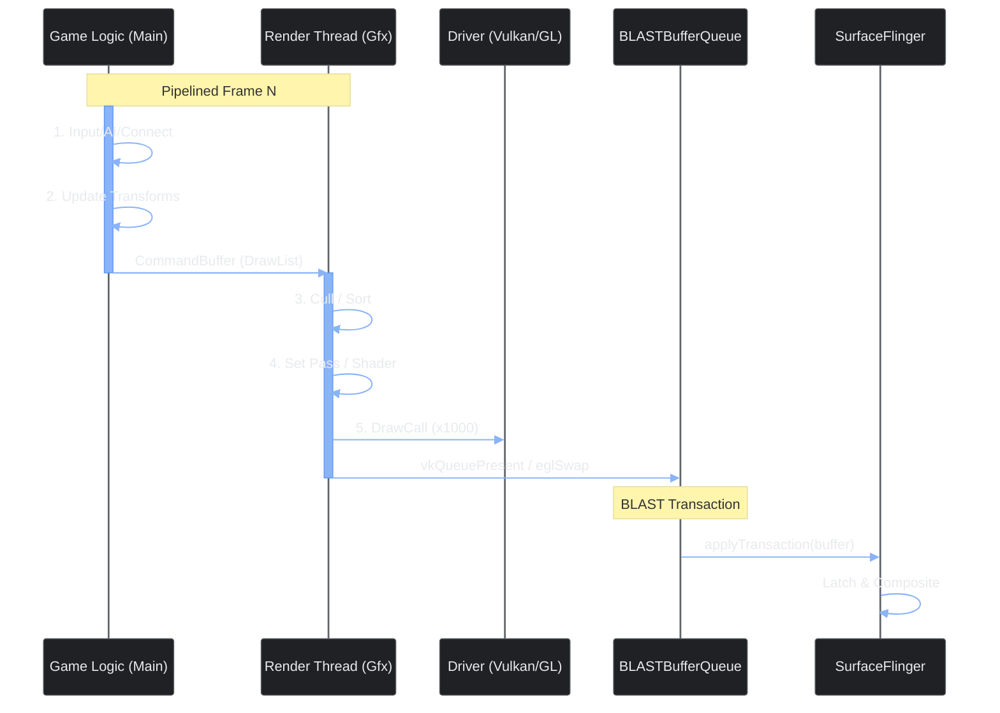
```mermaid
%%{
  init: {
    'theme': 'base',
    'themeVariables': {
      'primaryColor': '#46af54',
      'primaryTextColor': '#ffffff',
      'primaryBorderColor': '#388e3c',
      'lineColor': '#8ab4f8',
      'secondaryColor': '#8ab4f8',
      'tertiaryColor': '#202124',
      'actorBkg': '#202124',
      'actorBorder': '#5f6368',
      'actorTextColor': '#e8eaed',
      'signalColor': '#8ab4f8',
      'signalTextColor': '#e8eaed',
      'labelBoxBkgColor': '#3c4043',
      'labelBoxBorderColor': '#5f6368',
      'labelTextColor': '#e8eaed'
    }
  }
}%%
sequenceDiagram
    participant Logic as Game Logic (Main)
    participant Render as Render Thread (Gfx)
    participant Driver as Driver (Vulkan/GL)
    participant BBQ as BLASTBufferQueue
    participant SF as SurfaceFlinger

    Note over Logic, Render: Pipelined Frame N
    
    activate Logic
    Logic->>Logic: 1. Input/AI/Connect
    Logic->>Logic: 2. Update Transforms
    Logic->>Render: CommandBuffer (DrawList)
    deactivate Logic
    
    activate Render
    Render->>Render: 3. Cull / Sort
    Render->>Render: 4. Set Pass / Shader
    Render->>Driver: 5. DrawCall (x1000)
    
    Render->>BBQ: vkQueuePresent / eglSwap
    deactivate Render
    
    Note over BBQ: BLAST Transaction
    BBQ->>SF: applyTransaction(buffer)
    SF->>SF: Latch & Composite
```

## 3. 关键技术：Swappy (Android Game Development Kit)

为了解决“游戏逻辑帧率”和“屏幕刷新率”不匹配导致的 **Jank**（卡顿）或 **Latency**（延迟），Google 推出了 **Swappy Frame Pacing Library**。

*   **问题**: 游戏跑 40fps，屏幕 60Hz。如果直接提交，会导致部分帧显示 16ms，部分显示 33ms，视觉抖动。
*   **Swappy**: 自动插入 `eglPresentationTimeANDROID` 或 Vulkan 扩展，告诉 SurfaceFlinger：“这帧请在未来的某个精确时间点（Timestamp）显示”。
*   **Trace**: 在 Perfetto 中会看到 `Swappy` 相关的 Section，以及 `Choreographer` 的反馈回路。

## 4. BufferQueue 模式

游戏引擎几乎总是使用 **SurfaceView** (或 `GameActivity` 提供的 Surface)。
因此，它们也完全受益于 **BLAST** 架构：
1.  **Resize同步**: 当用户改变窗口大小时（如折叠屏展开），引擎的 Resize 和 Surface 的 Resize 是原子同步的。
2.  **低延迟**: 直接通过 SurfaceControl 提交，由 HWC 合成。

## 5. Trace 分析特征

1.  **UnityMain**: 看到 `BaseBehaviour.Update`, `Physics.Simulate`。
2.  **UnityGfxDevice**:看到 `Camera.Render`, `DrawBatch`。
3.  **Vsync**: 引擎通常会自己等待 Vsync（或者是 Swappy 帮它等），而不是依赖 `doFrame` 回调。


---

# Hardware Buffer Renderer Pipeline (Android 14+)

`HardwareBufferRenderer` 是 Android 14 (API 34) 引入的现代**硬件加速离屏渲染** API，作为传统 `lockCanvas()` 的高性能替代方案。它利用 `RenderNode` 和 GPU 进行光栅化，而非 CPU 软件渲染。

## 1. 为什么需要它？

传统软件渲染 (`Surface.lockCanvas()`) 存在几个根本性问题：

| **渲染引擎** | CPU (Skia Software) | **GPU (Hardware Accelerated)** |
| **内存拷贝** | CPU → GraphicBuffer 拷贝 | **零拷贝** (GPU 直接写入 Buffer) |
| **格式限制** | 仅 RGBA_8888 | 支持多种格式 (RGBA_F16, 10bit, etc.) |
| **HDR 支持** | ❌ | ✅ 原生 HDR |
| **Fence 控制** | 隐式 | **显式** |
| **线程安全** | 需要锁 | 完全线程安全 |

## 2. 核心架构


```mermaid
%%{
  init: {
    'theme': 'base',
    'themeVariables': {
      'primaryColor': '#46af54',
      'primaryTextColor': '#ffffff',
      'primaryBorderColor': '#388e3c',
      'lineColor': '#8ab4f8',
      'secondaryColor': '#8ab4f8',
      'tertiaryColor': '#202124',
      'actorBkg': '#202124',
      'actorBorder': '#5f6368',
      'actorTextColor': '#e8eaed',
      'signalColor': '#8ab4f8',
      'signalTextColor': '#e8eaed',
      'labelBoxBkgColor': '#3c4043',
      'labelBoxBorderColor': '#5f6368',
      'labelTextColor': '#e8eaed'
    }
  }
}%%
graph LR
    subgraph "App Process"
        Canvas[RecordingCanvas]
        Renderer[HardwareBufferRenderer]
        HB[AHardwareBuffer]
    end
    
    subgraph "System"
        BBQ[BLAST Adapter]
        SF[SurfaceFlinger]
    end
    
    Canvas -->|Record| Renderer
    Renderer -->|Rasterize| HB
    HB -->|queueBuffer| BBQ
    BBQ -->|Transaction| SF
```

## 3. API 使用流程

### 3.1 Java API

```java
// 1. 创建 HardwareBufferRenderer
HardwareBufferRenderer renderer = new HardwareBufferRenderer(
    HardwareBuffer.create(width, height, HardwareBuffer.RGBA_8888, 1,
        HardwareBuffer.USAGE_GPU_SAMPLED_IMAGE | HardwareBuffer.USAGE_CPU_WRITE)
);

// 2. 获取 RecordingRenderRequest
RenderRequest request = renderer.obtainRenderRequest();

// 3. 记录绘制指令
request.setContentRoot(rootRenderNode);
request.setColorSpace(ColorSpace.get(ColorSpace.Named.DISPLAY_P3));

// 4. 执行渲染
request.draw(executor, result -> {
    // result 包含 Fence 和状态
    SyncFence fence = result.getFence();
    
    // 5. 提交给 SurfaceControl
    SurfaceControl.Transaction t = new SurfaceControl.Transaction();
    t.setBuffer(surfaceControl, hardwareBuffer, fence);
    t.apply();
});
```

### 3.2 NDK API

```c
// 创建 Renderer
AHardwareBufferRenderer* renderer;
AHardwareBufferRenderer_create(hardwareBuffer, &renderer);

// 获取 Canvas
ACanvas* canvas;
AHardwareBufferRenderer_getCanvas(renderer, &canvas);

// 绘制
ACanvas_drawRect(canvas, rect, paint);

// 提交
int fenceFd;
AHardwareBufferRenderer_submit(renderer, &fenceFd);

// 使用 fence 与 SurfaceControl 配合
ASurfaceTransaction_setBuffer(transaction, sc, hardwareBuffer, fenceFd);
```

## 4. 渲染时序图

注意这是一个 **GPU 硬件加速光栅化 + GPU 合成** 的流程（区别于 `lockCanvas()` 的 CPU 软件渲染）。

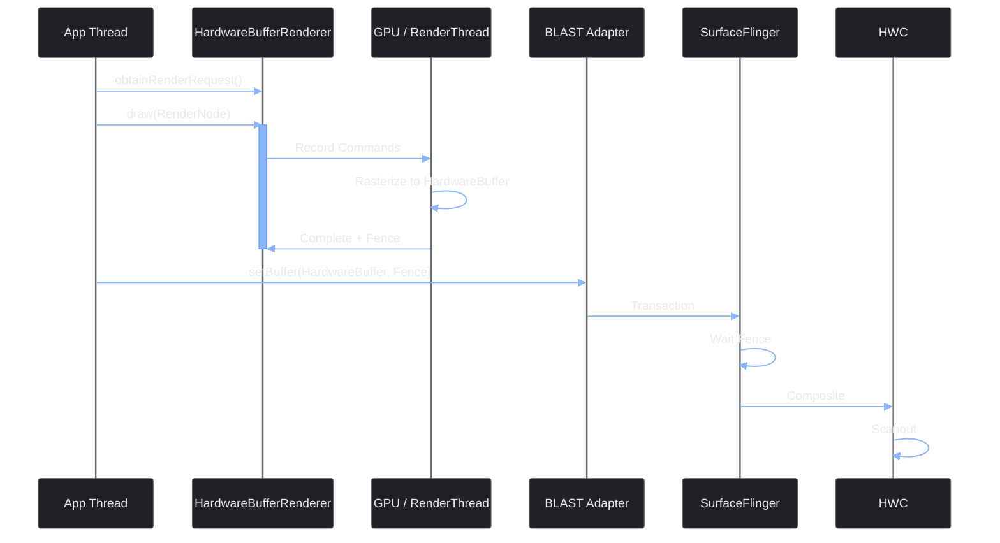
```mermaid
%%{
  init: {
    'theme': 'base',
    'themeVariables': {
      'primaryColor': '#46af54',
      'primaryTextColor': '#ffffff',
      'primaryBorderColor': '#388e3c',
      'lineColor': '#8ab4f8',
      'secondaryColor': '#8ab4f8',
      'tertiaryColor': '#202124',
      'actorBkg': '#202124',
      'actorBorder': '#5f6368',
      'actorTextColor': '#e8eaed',
      'signalColor': '#8ab4f8',
      'signalTextColor': '#e8eaed',
      'labelBoxBkgColor': '#3c4043',
      'labelBoxBorderColor': '#5f6368',
      'labelTextColor': '#e8eaed'
    }
  }
}%%
sequenceDiagram
    participant App as App Thread
    participant HBR as HardwareBufferRenderer
    participant GPU as GPU / RenderThread
    participant BBQ as BLAST Adapter
    participant SF as SurfaceFlinger
    participant HWC as HWC

    App->>HBR: obtainRenderRequest()
    App->>HBR: draw(RenderNode)
    
    activate HBR
    HBR->>GPU: Record Commands
    GPU->>GPU: Rasterize to HardwareBuffer
    GPU->>HBR: Complete + Fence
    deactivate HBR
    
    App->>BBQ: setBuffer(HardwareBuffer, Fence)
    BBQ->>SF: Transaction
    
    SF->>SF: Wait Fence
    SF->>HWC: Composite
    HWC->>HWC: Scanout
```

## 5. 性能对比

| 场景 | lockCanvas() | HardwareBufferRenderer |
|:---|:---|:---|
| 1080p 全屏绘制 | ~15ms | ~8ms |
| 内存带宽 | 2x (拷贝) | 1x (直写) |
| HDR 内容 | 不支持 | 原生支持 |
| 多线程 | 需要同步 | 原生支持 |

## 6. 使用场景

1.  **自定义绘图引擎**: 如 PDF 渲染器、矢量图编辑器。
2.  **HDR 图像处理**: 需要 RGBA_F16 格式的场景。
3.  **高帧率软件渲染**: 配合 Choreographer 实现 120fps 软件渲染。
4.  **跨进程 Buffer 共享**: HardwareBuffer 可以通过 Binder 传递。

## 7. 兼容性

*   **最低版本**: Android 14 (API 34)
*   **降级方案**: 在旧版本上回退到 `lockCanvas()` + BLAST


---

# OpenGL ES Rendering Pipeline (GL Thread)

> [!WARNING]
> **Android 15+ 注意**: 从 Android 15 开始，新设备将**强制使用 ANGLE** 作为 OpenGL ES 后端。您的 GLES 调用实际上会被翻译为 Vulkan 指令。详见 [ANGLE Pipeline](angle_gles_vulkan.md)。对于新项目，**建议直接使用 Vulkan**。

典型的 OpenGL 应用（如地图模块 `scrolling-gl-map`）通常运行在专门的 `GLThread` 上。
现代 `GLSurfaceView` 也是基于 `SurfaceView` 的，因此在底层同样受益于 BLAST 带来的同步特性。

## 1. 核心架构
*   **EGL**: 连接 OpenGL ES API 和 Android 本地窗口系统 (Surface) 的桥梁。
*   **GLThread**: `GLSurfaceView` 内部维护的线程，负责全生命周期的渲染循环。

## 2. 渲染循环时序图

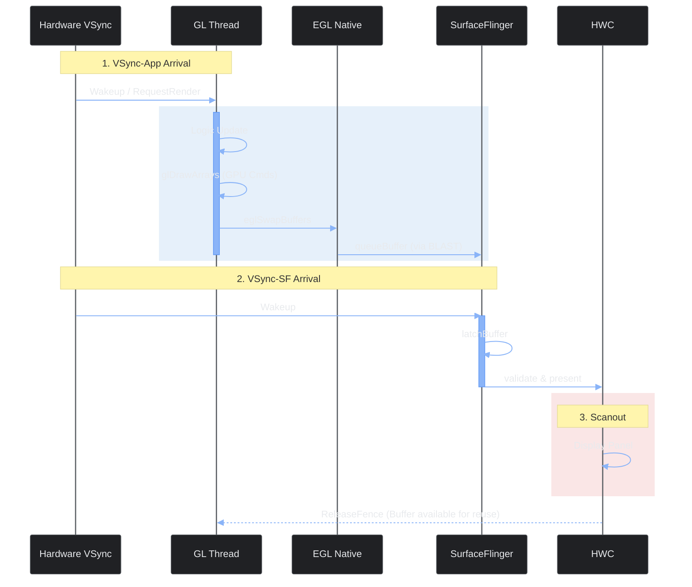
```mermaid
%%{
  init: {
    'theme': 'base',
    'themeVariables': {
      'primaryColor': '#46af54',
      'primaryTextColor': '#ffffff',
      'primaryBorderColor': '#388e3c',
      'lineColor': '#8ab4f8',
      'secondaryColor': '#8ab4f8',
      'tertiaryColor': '#202124',
      'actorBkg': '#202124',
      'actorBorder': '#5f6368',
      'actorTextColor': '#e8eaed',
      'signalColor': '#8ab4f8',
      'signalTextColor': '#e8eaed',
      'labelBoxBkgColor': '#3c4043',
      'labelBoxBorderColor': '#5f6368',
      'labelTextColor': '#e8eaed'
    }
  }
}%%
sequenceDiagram
    participant HW as Hardware VSync
    participant GL as GL Thread
    participant EGL as EGL Native
    participant SF as SurfaceFlinger
    participant HWC as HWC

    %% 1. Render Loop
    Note over HW, GL: 1. VSync-App Arrival
    HW->>GL: Wakeup / RequestRender
    
    rect rgb(230, 240, 250)
        activate GL
        GL->>GL: Logic Update
        GL->>GL: glDrawArrays (GPU Cmds)
        GL->>EGL: eglSwapBuffers
        EGL->>SF: queueBuffer (via BLAST)
        deactivate GL
    end

    %% 2. SF Processing
    Note over HW, SF: 2. VSync-SF Arrival
    HW->>SF: Wakeup
    activate SF
    SF->>SF: latchBuffer
    SF->>HWC: validate & present
    deactivate SF

    %% 3. Display
    rect rgb(250, 230, 230)
        Note over HWC: 3. Scanout
        HWC->>HWC: Display Panel
    end
    
    HWC-->>GL: ReleaseFence (Buffer available for reuse)
```

## 3. 渲染循环详解 (Step-by-Step)

### 步骤 1: 等待 (Idle/Wait)
GL 线程在没有任务时会 wait 也就是休眠。
*   **Continuous Mode**: 依赖 Vsync 唤醒。
*   **Dirty Mode**: 依赖 `requestRender` 唤醒。

### 步骤 2: eglMakeCurrent
将 EGL Context 绑定到当前线程。如果 Surface 发生变化（如尺寸改变），这里会触发 `eglCreateWindowSurface`。

### 步骤 3: User Draw (onDrawFrame)
执行用户的 OpenGL 指令。
*   此时指令被写入 GPU Command Buffer，**并未立即执行**。

### 步骤 4: eglSwapBuffers (关键提交点)
这是该管线最重要的函数。
1.  **Flush**: 强制发送所有 GL 指令给 GPU。
2.  **queueBuffer**: 将画好的帧（Back Buffer）提交给本地的 BLASTAdapter。
3.  **Transaction**: 适配器立即（或并在 Vsync 时）发送 Transaction 给 SF。

## 4. Buffer 流转与 Triple Buffering

在 Perfetto 中，你会看到 `eglSwapBuffers` 占据了大部分时间条。这通常**不是**因为它慢，而是因为它在等待空闲 Buffer。

*   **Double Buffer**: 容易发生阻塞，Render 必须等 Display。
*   **Triple Buffer**: 允许 App 多画一帧，`dequeueBuffer` 不容易卡住，提高 GPU 利用率。

## 5. Fence 机制详解 (Sync Primitives)

OpenGL ES 在 Android 上的同步依赖 **Fence** 机制，这是跨 GPU/CPU/Display 的关键桥梁。

### 5.1 Acquire Fence (获取栅栏)
*   **来源**: 当 `eglSwapBuffers` 调用 `dequeueBuffer` 获取新 Buffer 时，系统可能返回一个 acquireFence。
*   **含义**: "这个 Buffer 还在被 Display/SF 使用，等 Fence signal 后才能写"。
*   **Trace**: 在 Perfetto 中看到 `dequeueBuffer` 耗时很长，往往是在等待 acquireFence。

### 5.2 Release Fence (释放栅栏)
*   **来源**: 当 `eglSwapBuffers` 调用 `queueBuffer` 时，App 会传递一个 releaseFence 给 SF。
*   **含义**: "GPU 还没画完这个 Buffer，等 Fence signal 后才能读/显示"。
*   **Trace**: SF 在 `latchBuffer` 时如果 Fence 未 signal，会等待。

### 5.3 EGL Sync Objects
对于需要精确控制同步的场景，可使用 EGL 扩展：
```c
// 创建 Fence 对象 (GPU 端)
EGLSyncKHR sync = eglCreateSyncKHR(display, EGL_SYNC_FENCE_KHR, NULL);

// CPU 等待 GPU 完成
eglClientWaitSyncKHR(display, sync, 0, EGL_FOREVER_KHR);

// 导出为 Android Native Fence FD
int fd = eglDupNativeFenceFDANDROID(display, sync);
```

## 6. ANGLE：GLES-over-Vulkan

在 Android 11+ 上，部分设备启用了 **ANGLE** (Almost Native Graphics Layer Engine) 作为 OpenGL ES 的默认实现。

*   **原理**: GLES API 调用被翻译为 Vulkan 指令。
*   **优势**: 更一致的驱动行为，更少的 GPU 厂商 bug。
*   **Trace 差异**: 你会看到 `vkQueueSubmit` 而非 `glDraw*`，Buffer 提交仍走 BLAST。
*   **详情**: 参见 [ANGLE 渲染管线](angle_gles_vulkan.md)。


---

# SurfaceControl API Deep Dive (NDK)

在 Android NDK 开发中，`ASurfaceControl` (Android 10/Q 引入, API 29) 是与 SurfaceFlinger 进行低级交互的核心接口。它赋予了 App 像 WindowManager 一样的能力来操控图层。

## 1. 核心概念

*   **ASurfaceControl**: 代表 SurfaceFlinger 中的一个 Layer（图层）。它可以是一个 Buffer 容器（显示内容），也可以是一个纯容器（Color Layer / Container Layer）。
*   **ASurfaceTransaction**: 代表一组原子操作。你可以一次性修改多个 SurfaceControl 的属性（位置、大小、Buffer、Z-Order），然后 commit。

## 2. 也是 "BLAST"

NDK 的 SurfaceControl API 实际上就是 BLAST 协议的直接体现。

*   **Atomicity**: `ASurfaceTransaction_apply()` 保证了在这个 Transaction 内的所有修改，要么全生效，要么全不生效。
*   **Sync**: 可以通过 `ASurfaceTransaction_setBuffer` 绑定 Buffer，确保画面内容和窗口属性同步更新。

## 3. 典型使用流程

### 步骤 1: 创建 SurfaceControl
你需要一个父 SurfaceControl（通常来自 `SurfaceView.getSurfaceControl()`）或者直接挂载到 Display。

```c
ASurfaceControl* child = ASurfaceControl_create(
    parent, "MyOverlay", "ASurfaceControl", width, height, format, ...
);
```

### 步骤 2: 配置 Transaction
创建并配置一个事务：

```c
ASurfaceTransaction* transaction = ASurfaceTransaction_create();

// 设置 Buffer (来自 AHardwareBuffer)
ASurfaceTransaction_setBuffer(transaction, child, hardwareBuffer, fence);

// 设置位置
ASurfaceTransaction_setPosition(transaction, child, x, y);

// 设置层级
ASurfaceTransaction_setZOrder(transaction, child, 10);

// 设置可见性
ASurfaceTransaction_setVisibility(transaction, child, ASURFACE_TRANSACTION_VISIBILITY_SHOW);
```

### 步骤 3: 提交 Transaction
```c
ASurfaceTransaction_apply(transaction);
```
这一步会将打包好的数据发送给 SurfaceFlinger。

## 4. 关键 API 详解

### Buffer Management
*   `ASurfaceTransaction_setBuffer(..., ASurfaceTransaction_ASurfaceControl* sc, AHardwareBuffer* buffer, int fence_fd)`
    *   这是最核心的 API。你必须自己管理 `AHardwareBuffer` 的生命周期。
    *   `fence_fd`: 一个 acquire fence。SF 会等待这个 fence signal 后才去读 buffer。

### Hierarchy Management
*   `ASurfaceTransaction_reparent(...)`
    *   动态改变图层树结构。例如将一个图层从 SurfaceView 移到 Activity 顶层（实现画中画动画）。

## 5. 优势与场景

*   **WebView Out-of-process Rasterization**: 浏览器在独立进程合成页面，直接通过 SurfaceControl 发给 SF，不经过 App 主线程。
*   **Custom Video Player**: 可以实现极其复杂的视频弹幕融合效果。
*   **Dynamic UI**: 如 Flutter 这种自绘引擎，利用 SurfaceControl 实现高效的 PlatformView 嵌入。

## 6. 注意事项

*   **生命周期**: `ASurfaceControl` 是内核资源，必须及时 Release。
*   **Fence Leak**: 必须正确处理 Fence FD，否则会导致系统挂起。传递给 API 后，FD 的所有权通常会转移给系统（Close on exec）。

## 7. Frame Timeline API (Android 11+)

从 Android R 开始，SurfaceControl API 新增了 **Frame Timeline** 系列接口，用于精准控制帧的着陆时间。

### 7.1 核心 API

```c
// 获取下一帧的预期 VSync 时间 (Android 11+)
int64_t vsyncId;
int64_t expectedPresentTime;
ASurfaceTransaction_getNextFrameInfo(transaction, &vsyncId, &expectedPresentTime);

// 设置目标帧时间线 (Android 12+)
ASurfaceTransaction_setFrameTimeline(
    transaction,
    vsyncId   // 告诉 SF：这帧打算在这个 VSync 着陆
);
```

### 7.2 工作原理

```mermaid
%%{
  init: {
    'theme': 'base',
    'themeVariables': {
      'primaryColor': '#46af54',
      'primaryTextColor': '#ffffff',
      'primaryBorderColor': '#388e3c',
      'lineColor': '#8ab4f8',
      'secondaryColor': '#8ab4f8',
      'tertiaryColor': '#202124',
      'actorBkg': '#202124',
      'actorBorder': '#5f6368',
      'actorTextColor': '#e8eaed',
      'signalColor': '#8ab4f8',
      'signalTextColor': '#e8eaed',
      'labelBoxBkgColor': '#3c4043',
      'labelBoxBorderColor': '#5f6368',
      'labelTextColor': '#e8eaed'
    }
  }
}%%
sequenceDiagram
    participant App
    participant BBQ as BLAST Adapter
    participant SF as SurfaceFlinger

    App->>BBQ: getNextFrameInfo() -> vsyncId=42
    App->>App: Draw (耗时 8ms)
    App->>BBQ: setFrameTimeline(vsyncId=42)
    App->>BBQ: apply()
    
    BBQ->>SF: Transaction (vsyncId=42)
    SF->>SF: 收到，但当前是 vsync 41
    SF->>SF: 等待 vsync 42...
    SF->>SF: vsync 42 到达，Latch & Composite
```

### 7.3 性能优势

1.  **消除掉帧误判**: SF 知道这帧是故意"迟到"的（因为帧率设定），不会错误标记为 Jank。
2.  **支持动态帧率**: 配合 VRR 屏幕，App 可以精准控制 30/60/90/120fps 切换。
3.  **Perfetto 可视化**: 在 FrameTimeline Track 中可以看到 Expected vs Actual Present Time。

### 7.4 使用场景

*   **视频播放器**: 24fps/30fps 视频在 60Hz 屏幕上避免 3:2 pulldown 抖动。
*   **游戏引擎**: 在 GPU 负载高时主动降频，而非被动掉帧。
*   **省电模式**: 低功耗场景主动请求 30fps 渲染。


---

# SurfaceView Rendering Pipeline (Direct Producer via BLAST)

`SurfaceView` 是 Android 历史上最高效的视图组件。在 Android 10+ 之后，它底层已全面迁移到 **BLAST** 架构，主要为了解决 historically 的“同步问题”（Sync Issue）。

## 1. 生产者-消费者流程详解 (Deep Execution Flow)

SurfaceView 的核心在于“去耦”：它把绘图任务从 App 主线程剥离了出来。

### 第一阶段：Producer Thread (生产者)
这通常是视频解码线程 (MediaCodec) 或游戏逻辑线程：
1.  **dequeueBuffer**: 从 BufferQueue 拿一个空 Buffer。如果队列满了（Consumer 没来得及看），这里会阻塞。
2.  **Draw (绘制)**:
    *   **Canvas模式**: `lockCanvas()` -> 获得 Bitmap -> 涂鸦 -> `unlockCanvasAndPost()`。
    *   **GLES模式**: `eglMakeCurrent` -> `glDraw` -> `eglSwapBuffers`。
3.  **queueBuffer**: 绘制完成，把 Buffer 放回队列，并通知 Consumer。

### 第二阶段：Consumer (SurfaceFlinger)
注意，SurfaceView 的消费者**不是** App 进程，而是系统进程 SurfaceFlinger：
1.  **Acquire**: SF 收到 Buffer 可用的通知，拿走 Buffer。
2.  **Latch & Composite**: SF 在下一个 Vsync 到达时，把这个 Buffer 和 App 的主窗口（上面挖了个洞）叠在一起。
    *   *优势*: 这一步完全不经过 App 主线程，所以即使 App 主线程卡死（ANR），SurfaceView 里的视频依然能流畅播放。

---

## 2. 核心机制：挖洞 (Punch Through) & BLAST

SurfaceView 在 WMS 侧是一个独立的图层 (Layer)。
*   App 的主窗口 (DecorView) 在 SurfaceView 所在的坐标区域绘制透明像素（`#00000000`）。
*   SurfaceView 的 Surface 被放置在主窗口 Surface 的 **下方** (Z-Order -1)。
*   **BLAST 的改进**: App 的 UI 变化（比如 SurfaceView 的尺寸改变、位置移动）和 SurfaceView 本身的内容更新，可以通过同一个 Transaction ID 进行同步提交，即使它们在不同的线程。

### Z-Order 示意图

```mermaid
%%{
  init: {
    'theme': 'base',
    'themeVariables': {
      'primaryColor': '#46af54',
      'primaryTextColor': '#ffffff',
      'primaryBorderColor': '#388e3c',
      'lineColor': '#8ab4f8',
      'secondaryColor': '#8ab4f8',
      'tertiaryColor': '#202124',
      'actorBkg': '#202124',
      'actorBorder': '#5f6368',
      'actorTextColor': '#e8eaed',
      'signalColor': '#8ab4f8',
      'signalTextColor': '#e8eaed',
      'labelBoxBkgColor': '#3c4043',
      'labelBoxBorderColor': '#5f6368',
      'labelTextColor': '#e8eaed'
    }
  }
}%%
graph TD
    Display[Display Screen]
    Win[App Window (Z=0, Hole)]
    SV[SurfaceView Layer (Z=-1)]
    
    Display --> Win
    Display --> SV
    style Win fill:#00000000,stroke:#333,stroke-width:2px,stroke-dasharray: 5 5
    style SV fill:#f9f,stroke:#333,stroke-width:4px
```

---

## 2. 详细渲染时序图 (BLAST Sync)

这个图展示了 BLAST 如何让独立的 Producer 和 App 的 UI 变化保持同步。

```mermaid
%%{
  init: {
    'theme': 'base',
    'themeVariables': {
      'primaryColor': '#46af54',
      'primaryTextColor': '#ffffff',
      'primaryBorderColor': '#388e3c',
      'lineColor': '#8ab4f8',
      'secondaryColor': '#8ab4f8',
      'tertiaryColor': '#202124',
      'actorBkg': '#202124',
      'actorBorder': '#5f6368',
      'actorTextColor': '#e8eaed',
      'signalColor': '#8ab4f8',
      'signalTextColor': '#e8eaed',
      'labelBoxBkgColor': '#3c4043',
      'labelBoxBorderColor': '#5f6368',
      'labelTextColor': '#e8eaed'
    }
  }
}%%
sequenceDiagram
    participant HW as Hardware VSync
    participant PT as Producer Thread
    participant BBQ as BLAST Adapter
    participant UI as App UI Thread
    participant SF as SurfaceFlinger
    participant HWC as HWC / Display

    Note over HW, PT: 1. Independent Production
    PT->>PT: Video/Game Loop
    PT->>BBQ: dequeueBuffer() -> acquireFence
    activate PT
    PT->>PT: Draw (EGL/Vulkan)
    PT->>BBQ: queueBuffer(releaseFence)
    deactivate PT
    
    Note over BBQ: 2. Auto Transaction
    BBQ->>BBQ: acquireNextBuffer
    BBQ->>SF: Transaction(Buffer, releaseFence, Layer=-1)
    
    Note over HW, UI: 3. VSync-App -> UI Layer
    HW->>UI: VSync-App Signal
    UI->>SF: Transaction(Window Geometry, Layer=0)

    Note over HW, SF: 4. VSync-SF (合成)
    HW->>SF: VSync-SF Signal
    activate SF
    SF->>SF: Wait releaseFence
    SF->>SF: latchBuffer (Merge Layers)
    SF->>HWC: validate & present
    deactivate SF

    Note over HWC: 5. Scanout
    HWC->>HWC: Scanout (Composite Layers)
    HWC-->>SF: presentFence
    SF-->>BBQ: acquireFence (Buffer 可复用)
```

1.  **queueBuffer**: 这里的 `queueBuffer` 不再直接唤醒 SurfaceFlinger，而是唤醒本地的 `BLASTBufferQueue` 适配器。
2.  **Transaction**: 所有的 buffer 提交最终都变成了一个 `SurfaceControl.Transaction`。
3.  **Sync**: 如果使用了 `SurfaceView.setFrameTimeline()` 等高级 API，App 甚至可以强制要求“这一帧视频”必须和“这一帧 UI 滚动”一起出现，从而消除黑边。

### 阶段二：Consumer (SurfaceFlinger)
注意：这里 **完全不经过** App 的 UI Thread 或 RenderThread。

4.  **onMessageReceived**: SF 收到 Buffer 产生的信号。
5.  **acquireBuffer**: SF 锁定该 Buffer。
6.  **Composition**: SF 将 Main Surface (有洞) 和 SV Surface (内容) 叠加。

---

## 3. Buffer 流转示意图

```mermaid
%%{
  init: {
    'theme': 'base',
    'themeVariables': {
      'primaryColor': '#46af54',
      'primaryTextColor': '#ffffff',
      'primaryBorderColor': '#388e3c',
      'lineColor': '#8ab4f8',
      'secondaryColor': '#8ab4f8',
      'tertiaryColor': '#202124',
      'actorBkg': '#202124',
      'actorBorder': '#5f6368',
      'actorTextColor': '#e8eaed',
      'signalColor': '#8ab4f8',
      'signalTextColor': '#e8eaed',
      'labelBoxBkgColor': '#3c4043',
      'labelBoxBorderColor': '#5f6368',
      'labelTextColor': '#e8eaed'
    }
  }
}%%
graph LR
    subgraph App Process
        T[Producer Thread] --> |draw| B((Buffer))
        B --> |queue| BBQ[BLASTBufferQueue]
        BBQ --> |transaction| SF
    end

    subgraph System Process
        SF[SurfaceFlinger] --> |apply| SF
        SF --> |composite| HWC[Display]
    end
```

## 4. 优缺点与 Trace 特征

*   **优点**:
    *   **完美同步 (vs Legacy)**: 彻底解决了 SurfaceView 跟手性差、缩放闪烁的问题。
    *   **低功耗**: 保持了 Direct Composition 的优势。
*   **Trace 特征**:
    *   你会看到 `BLASTBufferQueue` 相关的 trace tag 频繁出现。
    *   SurfaceFlinger 的 `setTransactionState` 会非常繁忙。
    *   如果开启了 Sync，能在 trace 中看到 `TransactionReady` 等待信号。


---

# TextureView Rendering Pipeline (App-side Composition)

`TextureView` 是 Android 4.0 引入的，尽管随着 `SurfaceView` 重回舞台（得益于 BLAST 同步），TextureView 的使用频率有所下降，但它仍是某些特效场景的唯一选择。

## 1. 纹理合成流程详解 (Deep Execution Flow)

TextureView 是一个“伪装者”，它表面上是 View，背后却走了一套复杂的“转手”流程。

### 第一阶段：Producer (生产者)
和 SurfaceView 一样，这里也有一个独立的线程在画图（视频/相机）：
1.  **Produce**: 解码器生成一帧图像。
2.  **queueBuffer**: 提交给 `SurfaceTexture` (这是 TextureView 的私有队列)。
3.  **Callback**: 触发 `onFrameAvailable` 回调，**通知 App 主线程**。

### 第二阶段：App Main Thread (中转站)
这是 TextureView 性能问题的根源 —— 它必须切回主线程：
1.  **Receive Callback**: 主线程收到“有新帧”的消息。
2.  **Invalidate**: 告诉 View 系统，“我（TextureView）脏了，下一帧重画我”。
3.  **Wait**: 等待 Choreographer 的 Vsync 信号。

### 第三阶段：RenderThread (最终上屏)
1.  **updateTexImage**: 在绘制 TextureView 时，RenderThread 会调用这个方法。
    *   它把 SurfaceTexture 里的最新 Buffer，**转录**成一个 OpenGL 纹理 (OES Texture)。
2.  **Draw**: 把它当做一张普通的贴图，画在 App 的主窗口上。
3.  **Composite**: 随 App 主窗口一起提交给 SurfaceFlinger。
    *   *代价*: 因为要在 App 渲染管线里走一遭，所以如果 App 主线程卡顿，视频也会跟着卡。

---

## 2. 核心机制：纹理合成 (Texture Upload)

TextureView 不再拥有独立的 Window/Layer。
*   它提供一个 `SurfaceTexture` 给 Producer。
*   Producer 生产的图像，被转化为 OpenGL 的 **OES 纹理**。
*   App 的 `RenderThread` 在绘制 View 树时，将被动地把这个纹理“画”在自己的 Buffer 上。

## 2. 详细渲染时序图

这条链路涉及 **跨线程同步**。注意：最终提交 App 窗口时，App 会使用 BLAST Transaction 提交。

```mermaid
%%{
  init: {
    'theme': 'base',
    'themeVariables': {
      'primaryColor': '#46af54',
      'primaryTextColor': '#ffffff',
      'primaryBorderColor': '#388e3c',
      'lineColor': '#8ab4f8',
      'secondaryColor': '#8ab4f8',
      'tertiaryColor': '#202124',
      'actorBkg': '#202124',
      'actorBorder': '#5f6368',
      'actorTextColor': '#e8eaed',
      'signalColor': '#8ab4f8',
      'signalTextColor': '#e8eaed',
      'labelBoxBkgColor': '#3c4043',
      'labelBoxBorderColor': '#5f6368',
      'labelTextColor': '#e8eaed'
    }
  }
}%%
sequenceDiagram
    participant HW as Hardware VSync
    participant Prod as Producer (Decoder)
    participant ST as SurfaceTexture
    participant Main as App Main Thread
    participant RT as App RenderThread
    participant BBQ as BLAST Adapter
    participant SF as SurfaceFlinger
    participant HWC as HWC

    %% 1. Production
    Note over Prod: 1. Producer 生产帧
    Prod->>ST: queueBuffer(releaseFence)
    ST-->>Main: onFrameAvailable() (Callback)

    %% 2. VSync-App
    Note over HW, Main: 2. VSync-App 唤醒
    HW->>Main: VSync-App Signal
    activate Main
    Main->>Main: TextureView.updateLayer()
    Main->>RT: SyncFrameState
    deactivate Main

    %% 3. RenderThread
    rect rgb(240, 240, 240)
        Note over RT: 3. Texture 合成
        activate RT
        RT->>ST: updateTexImage() -> acquireBuffer
        Note right of ST: 等待 releaseFence
        ST-->>RT: Bind OES Texture
        RT->>RT: Draw UI + Texture
        RT->>BBQ: queueBuffer(releaseFence)
        deactivate RT
    end
    
    ST-->>Prod: releaseBuffer() (Buffer 归还)

    %% 4. VSync-SF
    Note over HW, SF: 4. VSync-SF 合成
    HW->>SF: VSync-SF Signal
    activate SF
    SF->>SF: Wait releaseFence
    SF->>SF: latchBuffer
    SF->>HWC: Composite App Layer
    deactivate SF

    %% 5. Display
    HWC->>HWC: Scanout
    HWC-->>SF: presentFence
    SF-->>BBQ: acquireFence
```

1.  **Producer (e.g. Decoder)**:
    *   `queueBuffer` 到 SurfaceTexture。
    *   触发 `onFrameAvailable` 回调。
2.  **Main Thread (App)**:
    *   收到回调，执行 `Runnable`。
    *   调用 `invalidate()` 请求重绘。
3.  **Vsync-App**:
    *   RenderThread 开始 `DrawFrame`。
    *   **关键步骤**: 调用 `SurfaceTexture.updateTexImage()`。
        *   这会从 `BufferQueue` 中 `acquire` 最新的一帧。
        *   将 Buffer 绑定到 GLES 上下文。
4.  **GPU Draw**:
    *   RenderThread 使用 Shader 采样该 OES 纹理。
    *   合成到 App 的主 Framebuffer 中。
5.  **Release**:
    *   RenderThread 释放旧的 Buffer (`releaseBuffer`) 回给 Producer。

---

## 3. Buffer 流转示意图

```mermaid
%%{
  init: {
    'theme': 'base',
    'themeVariables': {
      'primaryColor': '#46af54',
      'primaryTextColor': '#ffffff',
      'primaryBorderColor': '#388e3c',
      'lineColor': '#8ab4f8',
      'secondaryColor': '#8ab4f8',
      'tertiaryColor': '#202124',
      'actorBkg': '#202124',
      'actorBorder': '#5f6368',
      'actorTextColor': '#e8eaed',
      'signalColor': '#8ab4f8',
      'signalTextColor': '#e8eaed',
      'labelBoxBkgColor': '#3c4043',
      'labelBoxBorderColor': '#5f6368',
      'labelTextColor': '#e8eaed'
    }
  }
}%%
sequenceDiagram
    participant P as Producer
    participant ST as SurfaceTexture
    participant RT as RenderThread (App)
    participant SF as SurfaceFlinger

    P->>ST: queueBuffer (Internal BQ)
    ST-->>RT: **Wait for Next DrawFrame**
    RT->>ST: updateTexImage()
    RT->>RT: GPU Composite (Copy)
    RT->>SF: Transaction (via BLAST)
    SF->>HWC: Composite
```

## 4. 总结
*   **灵活性**: 极高，可以当做普通 View 处理。
*   **性能**: 较差。
    *   多一次 GPU Copy。
    *   受主线程卡顿影响。
    *   内存占用更高（App Buffer + Texture Buffer）。


---

# Variable Refresh Rate (VRR) Pipeline

> [!NOTE]
> **Android 16 Enhanced ARR**: Android 16 引入了增强的 Adaptive Refresh Rate (ARR) API，简化了开发者控制帧率的方式，并提供更好的功耗优化。

**可变刷新率 (VRR)** 是 Android 11+ 引入的显示技术，允许屏幕刷新率动态变化 (如 1Hz ~ 120Hz)，对渲染管线和性能分析带来根本性影响。

## 1. 核心概念

### 1.1 传统固定刷新率 vs VRR

| 特性 | 固定刷新率 | VRR |
|:---|:---|:---|
| **VSync 周期** | 固定 (如 16.6ms @ 60Hz) | **动态** (1ms ~ 100ms) |
| **掉帧表现** | 跳到下一个 VSync (明显卡顿) | 延长当前帧 (平滑过渡) |
| **功耗** | 静态时仍 60Hz 刷新 | 静态时可降至 1Hz |
| **复杂度** | 简单 | App/SF/Display 三方协调 |

### 1.2 VRR 技术标准

*   **LTPO (Low-Temperature Polycrystalline Oxide)**: 三星/LG 的底层显示技术
*   **Adaptive Sync**: VESA 标准 (类似 PC 上的 G-Sync/FreeSync)
*   **Android VRR API**: Framework 层抽象

## 2. 系统架构

```mermaid
%%{
  init: {
    'theme': 'base',
    'themeVariables': {
      'primaryColor': '#46af54',
      'primaryTextColor': '#ffffff',
      'primaryBorderColor': '#388e3c',
      'lineColor': '#8ab4f8',
      'secondaryColor': '#8ab4f8',
      'tertiaryColor': '#202124',
      'actorBkg': '#202124',
      'actorBorder': '#5f6368',
      'actorTextColor': '#e8eaed',
      'signalColor': '#8ab4f8',
      'signalTextColor': '#e8eaed',
      'labelBoxBkgColor': '#3c4043',
      'labelBoxBorderColor': '#5f6368',
      'labelTextColor': '#e8eaed'
    }
  }
}%%
graph TD
    subgraph "App Layer"
        App[App RenderThread]
        Chor[Choreographer]
    end
    
    subgraph "Framework"
        SF[SurfaceFlinger]
        VS[VSync Generator]
        DM[DisplayManager]
    end
    
    subgraph "HAL / Hardware"
        HWC[HWC 2.4+]
        Panel[LTPO Panel]
    end
    
    Chor -->|setFrameRate| SF
    SF -->|Target FPS| VS
    VS -->|Dynamic Period| SF
    SF -->|Commit| HWC
    HWC -->|Adaptive Sync| Panel
```

## 3. App 端 API

### 3.1 标准 API (Android 11+)

```java
// 请求 120fps (游戏场景)
surface.setFrameRate(120f, Surface.FRAME_RATE_COMPATIBILITY_DEFAULT);

// 请求精确帧率 (视频播放 24fps)
surface.setFrameRate(24f, Surface.FRAME_RATE_COMPATIBILITY_FIXED_SOURCE);

// 让系统决定 (省电)
surface.setFrameRate(0f, Surface.FRAME_RATE_COMPATIBILITY_DEFAULT);
```

### 3.2 Enhanced ARR API (Android 16+)

Android 16 引入了更简化的 API，让开发者只需声明**意图**，系统自动选择最佳帧率：

```java
// Android 16+ Enhanced ARR
// 声明场景类型，系统自动优化
surface.setFrameRateCategory(Surface.FRAME_RATE_CATEGORY_HIGH_HINT);  // 游戏/动画
surface.setFrameRateCategory(Surface.FRAME_RATE_CATEGORY_NORMAL);     // 普通滚动
surface.setFrameRateCategory(Surface.FRAME_RATE_CATEGORY_LOW);        // 静态/省电

// 投票机制：多个 Surface 投票，系统综合决策
window.setFrameRateVote(120, Window.FRAME_RATE_VOTE_TYPE_PREFERRED);
```

### 3.3 SurfaceControl API

```c
// NDK 层设置帧率
ASurfaceTransaction_setFrameRate(
    transaction, 
    surfaceControl,
    90.0f,  // 目标帧率
    ANATIVEWINDOW_FRAME_RATE_COMPATIBILITY_DEFAULT
);
```

## 4. VSync 调度变化

### 4.1 传统固定 VSync

```
VSync:  |----16.6ms----|----16.6ms----|----16.6ms----|
Frame:  |    F1       |    F2       |    F3       |
```

### 4.2 VRR 动态 VSync

```
VSync:  |--8.3ms--|--8.3ms--|------33ms------|--8.3ms--|
Frame:  |   F1   |   F2   |    F3 (慢)      |   F4   |
        ^120Hz   ^120Hz   ^30Hz (自动降频)  ^120Hz
```

## 5. 渲染时序图

展示 VRR 下 SurfaceFlinger 的动态调度。

```mermaid
%%{
  init: {
    'theme': 'base',
    'themeVariables': {
      'primaryColor': '#46af54',
      'primaryTextColor': '#ffffff',
      'primaryBorderColor': '#388e3c',
      'lineColor': '#8ab4f8',
      'secondaryColor': '#8ab4f8',
      'tertiaryColor': '#202124',
      'actorBkg': '#202124',
      'actorBorder': '#5f6368',
      'actorTextColor': '#e8eaed',
      'signalColor': '#8ab4f8',
      'signalTextColor': '#e8eaed',
      'labelBoxBkgColor': '#3c4043',
      'labelBoxBorderColor': '#5f6368',
      'labelTextColor': '#e8eaed'
    }
  }
}%%
sequenceDiagram
    participant App
    participant SF as SurfaceFlinger
    participant VS as VSync Generator
    participant HWC as HWC/Display

    Note over App: 高负载场景
    App->>SF: setFrameRate(60fps)
    SF->>VS: Configure 16.6ms Period
    
    loop 正常渲染
        VS->>App: VSync (16.6ms)
        App->>SF: queueBuffer
        SF->>HWC: Commit
    end
    
    Note over App: 静态画面
    App->>SF: (No new buffer)
    SF->>VS: Extend Period (100ms)
    VS->>HWC: Low Refresh (10Hz)
    
    Note over App: 用户滑动
    App->>SF: setFrameRate(120fps)
    SF->>VS: Configure 8.3ms Period
    VS->>HWC: High Refresh (120Hz)
```

## 6. 性能分析

### 6.1 Perfetto 关键 Track

| Track | 含义 |
|:---|:---|
| **VSYNC** | 显示实际 VSync 周期变化 |
| **HW_VSYNC** | 硬件 VSync 信号 |
| **FrameTimeline** | 每帧的预期/实际着陆时间 |
| **SurfaceFlinger** | `setFrameRate` 请求处理 |

### 6.2 VRR 下的"假掉帧"

在 VRR 模式下，传统的"超过 16.6ms = 掉帧"判断**不再适用**：

```sql
-- 错误的掉帧检测 (固定帧率思维)
SELECT * FROM slice 
WHERE name = 'DrawFrame' AND dur > 16666666;  -- ❌

-- 正确的掉帧检测 (VRR 感知)
SELECT * FROM slice s
JOIN frame_timeline ft ON s.frame_id = ft.id
WHERE ft.actual_present_time > ft.expected_present_time + 2000000;  -- ✅
```

## 7. 常见问题

### 7.1 帧率抖动

**现象**: 帧率在 60/90/120 之间频繁跳动  
**原因**: App 未明确请求帧率，系统自动判断  
**解决**: 使用 `setFrameRate()` 或 Android 16 的 `setFrameRateCategory()` 明确声明

### 7.2 功耗异常

**现象**: VRR 设备功耗反而更高  
**原因**: App 持续请求高帧率，即使静态画面  
**解决**: 静态场景显式请求低帧率或使用 `FRAME_RATE_CATEGORY_LOW`

### 7.3 视频播放抖动

**现象**: 24fps 视频在 120Hz 屏幕抖动  
**原因**: 未使用 `FRAME_RATE_COMPATIBILITY_FIXED_SOURCE`  
**解决**: 视频场景使用固定源帧率模式

## 8. 兼容性

| Android 版本 | VRR 支持 |
|:---|:---|
| **Android 16** (API 36) | **Enhanced ARR** + 投票机制 + 更智能功耗策略 |
| **Android 15** (API 35) | 改进 ARR API，更低延迟切换 |
| Android 14 (API 34) | 1Hz LTPO 完整支持 |
| Android 13 (API 33) | 改进省电策略 |
| Android 12 (API 31) | FrameTimeline 深度整合 |
| Android 11 (API 30) | 基础 VRR API |

## 9. 开发者建议

1.  **明确帧率意图**: 不要依赖系统猜测，主动调用 `setFrameRate()` 或 `setFrameRateCategory()`
2.  **静态检测**: 检测无动画时主动降频
3.  **视频锁帧**: 视频播放使用 `FIXED_SOURCE` 模式
4.  **测试覆盖**: 在 60Hz/90Hz/120Hz 设备上分别测试
5.  **升级到 Android 16 API**: 使用 Enhanced ARR 减少代码复杂度


---

# Video Overlay Pipeline (MediaCodec direct to HWC)

这是 Android 乃至所有移动设备上**最省电、最高效**的视频播放方式。

## 1. 核心原理：Bypass GPU

在普通的渲染中，视频帧往往会被当作一个 Texture，用 GPU 画到屏幕上。
但在 Overlay 模式下，视频帧（Decode Output）直接通过 Hardware Composer (HWC) 作为一个独立的**硬件图层 (Hardware Plane/Layer)** 叠加在屏幕上。

### 路径对比

*   **GPU Path (TextureView)**:
    `Decoder` -> `SurfaceTexture` -> `GPU Shader (Sample)` -> `FrameBuffer` -> `Display`
    *   *缺点*: 占用 GPU 带宽，耗电。
*   **Overlay Path (SurfaceView + HWC)**:
    `Decoder` -> `Surface` -> `HWC Layer` -> `Display`
    *   *优点*: GPU 完全不参与，只消耗 Display Processor (DPU) 一点点带宽。

## 2. 也是 DRM (数字版权保护) 的唯一路径

对于 Netflix, Disney+ 等受保护的高清内容 (Widevine L1)，视频数据在解密后存储在 **Secure Memory** (TrustZone) 中。
*   GPU 根本无法读取 Secure Memory（防止录屏窃取）。
*   只有 HWC/DPU 能够读取并直接输出信号给屏幕面板。
*   因此，播放 DRM 视频**必须**使用 SurfaceView (Overlay) 模式。

## 3. 渲染流程详解

### 第一阶段：Configuration
1.  **MediaCodec**: 配置 Surface (来自 SurfaceView)。
2.  **Format**: 解码器输出通常是 YUV420 (NV12/P010)。HWC 原生支持 YUV 格式，**省去了 YUV 转 RGB 的开销**。

### 第二阶段：Streaming
1.  **Queue**: 解码器将 YUV Buffer 放入队列。
2.  **Transaction**: 驱动层封装 Transaction。
3.  **SurfaceFlinger Decision**:
    *   SF 检查 HWC 硬件能力：“你有空闲的硬件图层吗？”
    *   **Overlay Strategy**: 如果有，SF 将该 Buffer 直接标记为 `HWC_COMPOSITION`。
    *   **Fallback**: 如果硬件图层用完了（或者格式不支持），SF 会退化为 `GLES_COMPOSITION`，强行用 GPU 合成（此时无法播放 L1 DRM）。

## 3.5 Tunnel Mode (TV & Set-Top Box)

在 Android TV 或高端手机上，还存在一种极致的 **Tunnel Mode** (隧道模式)。

1.  **Sideband Stream**: 解码器输出的 Buffer 句柄直接传给 HWC/Display，**完全绕过 Framework** 的 BufferQueue 和 SurfaceFlinger 的常规合成逻辑。
2.  **Audio Sync**: HWC 直接根据 Audio DSP 的时钟来驱动视频帧的显示，实现硬件级的音画同步。
3.  **AOSP 16**: 进一步优化了 Tunnel Mode 下的帧率切换和 HDR 元数据传递。

## 4. 调试与验证

### dumpsys SurfaceFlinger
在 `adb shell dumpsys SurfaceFlinger` 输出中：
*   寻找你的 SurfaceView Layer。
*   查看 **Composition Type**:
    *   `DEVICE`: 成功使用 Overlay (HWC)。
    *   `CLIENT`: 失败，回退到 GPU (GLES)。

### Perfetto Trace
*   查看 **HWC** 相关的 Track。
*   GPU 负载应该非常低（接近 0%），仅 UI 线程有少量活动。

## 5. 常见坑点

*   **圆角/透明度**: 很多老旧的 HWC 不支持对 Overlay 图层做圆角裁剪或半透明混合。如果给 SurfaceView 设置了 `setAlpha(0.5)`，往往会导致强行回退到 GPU 合成，失去性能优势。
*   **Z-Order**: Overlay 图层通常需要位于最底层或特定的 Z 轴，复杂的 UI 遮挡可能破坏 Overlay 策略。


---

# Vulkan Native Rendering Pipeline

> [!NOTE]
> **Android 15+ 推荐路径**: Vulkan 已成为 Android 15+ 的默认图形 API。新设备将强制通过 **ANGLE** 处理 GLES 调用，并统一支持 **Vulkan Profiles for Android (VPA)**。

随着 Android 10+ 对 Vulkan 的支持日益成熟，越来越多的高性能应用（游戏、模拟器、UI 框架如 Impeller）开始直接使用 Vulkan API 进行渲染，绕过传统的 GLES 状态机。

## 0. Vulkan Profiles for Android (VPA) — Android 15+

**VPA** 是 Google 为解决 Vulkan 碎片化问题引入的标准化方案。

### 0.1 问题背景

| 问题 | 传统 Vulkan | VPA 解决方案 |
|:---|:---|:---|
| **特性碎片化** | 每个设备支持不同的 Extension | 定义标准 Profile (如 `VPA_android_baseline_2022`) |
| **能力查询成本** | 运行时逐一查询 | 声明式 Profile 匹配 |
| **开发复杂度** | 需要大量 fallback 代码 | 保证 Profile 内特性全支持 |

### 0.2 标准 Profile 层级

```
VPA_android_baseline_2021  ← 基础层
       ↓
VPA_android_baseline_2022  ← 推荐层 (Android 14+)
       ↓
VPA_android_baseline_2024  ← 最新层 (Android 16+)
```

### 0.3 使用方式

```c
// 检查设备是否支持目标 Profile
VpProfileProperties profileProps = { VPA_ANDROID_BASELINE_2022, 1 };
VkBool32 supported;
vpGetPhysicalDeviceProfileSupport(instance, physicalDevice, &profileProps, &supported);

if (supported) {
    // 可以安全使用 Profile 内所有特性
    vpCreateDevice(physicalDevice, &createInfo, &profileProps, &device);
}
```

---

## 1. 核心架构：显式控制 (Explicit Control)

Vulkan 的最大特征是**一切皆显式**。从内存分配到同步原语 (Fence/Semaphore)，都需要 App 自己管理。

### 关键组件

1.  **VkInstance / VkDevice**: Vulkan 上下文。
2.  **VkSurfaceKHR**: 对应 Android 的 `Surface` (ANativeWindow)。
3.  **VkSwapchainKHR**: 交换链，管理一组 Image (Back Buffers)。
4.  **VkQueue**: 提交命令的队列 (Graphics/Present)。

---

## 2. 渲染流程详解 (Deep Execution Flow)

### 第一阶段：Acquire (获取)
1.  **vkAcquireNextImageKHR**:
    *   App 向 Swapchain 请求一个可用的 Image Index。
    *   *同步*: 需要提供一个 `VkSemaphore` (ImageAvailable)，当 Image 真正可用时，这个信号量会被 Signal。
    *   *Trace*: 这一步通常非阻塞，但在双缓冲占满时会阻塞。

### 第二阶段：Record & Submit (录制与提交)
1.  **Command Buffer Recording**:
    *   `vkCmdBeginRenderPass` -> `vkCmdDraw` -> `vkCmdEndRenderPass`。
    *   这一步可以在任意线程并行进行（这是 Vulkan 重大优势）。
2.  **vkQueueSubmit**:
    *   将 Command Buffer 提交给 GPU 队列。
    *   *Wait*: 等待 `ImageAvailable` 信号量（确保 Image 已经准备好写了）。
    *   *Signal*: 渲染完成后 Signal 另一个 `VkSemaphore` (RenderFinished)。

### 第三阶段：Present (展示/BLAST)
这是与 Android 系统交互的边界：

1.  **vkQueuePresentKHR**:
    *   请求将渲染好的 Image 展示到屏幕。
    *   *Wait*: 等待 `RenderFinished` 信号量（确保 GPU 画完了）。
2.  **Android Integration (BLAST)**:
    *   在 Android 10+，Vulkan Driver 底层会将这个 Present 操作转换为 `queueBuffer`。
    *   BLAST Adapter 捕获 Buffer，封装为 Transaction 提交给 SF。

---

## 3. 渲染时序图

注意信号量 (Semaphore) 在 GPU 内部的同步作用，CPU 仅负责提交指令。

```mermaid
%%{
  init: {
    'theme': 'base',
    'themeVariables': {
      'primaryColor': '#46af54',
      'primaryTextColor': '#ffffff',
      'primaryBorderColor': '#388e3c',
      'lineColor': '#8ab4f8',
      'secondaryColor': '#8ab4f8',
      'tertiaryColor': '#202124',
      'actorBkg': '#202124',
      'actorBorder': '#5f6368',
      'actorTextColor': '#e8eaed',
      'signalColor': '#8ab4f8',
      'signalTextColor': '#e8eaed',
      'labelBoxBkgColor': '#3c4043',
      'labelBoxBorderColor': '#5f6368',
      'labelTextColor': '#e8eaed'
    }
  }
}%%
sequenceDiagram
    participant App as App Thread
    participant GPU as GPU Queue
    participant SC as Swapchain (BLAST)
    participant SF as SurfaceFlinger

    Note over App: 1. Acquire
    App->>SC: vkAcquireNextImageKHR(S_ImgAvail)
    SC-->>App: ImageIndex

    Note over App: 2. Submit
    App->>App: Record CommandBuffer
    App->>GPU: vkQueueSubmit(Wait=S_ImgAvail, Sig=S_RenderDone)
    
    Note over App: 3. Present
    App->>GPU: vkQueuePresentKHR(Wait=S_RenderDone)
    
    Note over GPU: GPU Working...
    GPU->>GPU: Wait S_ImgAvail
    GPU->>GPU: Execute Draw Calls
    GPU->>GPU: Signal S_RenderDone
    
    Note over GPU: Present Handling
    GPU->>SC: queueBuffer() (Driver Internal)
    SC->>SF: Transaction(Buffer)
```

## 4. 性能特征

1.  **Cpu Overhead**: 极低。由于 Command Buffer 可以复用，且 Driver 开销小，CPU 占用远低于 GLES。
2.  **Pipeline Barriers**: 开发者必须精确控制 Image Layout Transition (e.g., `COLOR_ATTACHMENT_OPTIMAL` -> `PRESENT_SRC_KHR`)，否则会导致显存读写竞争或画面撕裂花屏。
3.  **Frame Pacing**: 结合 Swappy 库，Vulkan 可以实现微秒级的帧这一预测。

## 5. 调试工具

*   **RenderDoc**: 抓帧神器，查看具体 DrawCall 和资源。
*   **Gapid**: Google 官方图形调试工具。
*   **Validation Layers**: 开发阶段必须开启，Vulkan 出错通常直接 Crash 或黑屏，Layer 是唯一的报错来源。

## 6. Presentation Mode 详解 (帧率与延迟)

Vulkan Swapchain 支持多种 Presentation Mode，直接影响帧率稳定性和输入延迟。

| Mode | 行为 | 延迟 | 撕裂 | 适用场景 |
|:---|:---|:---|:---|:---|
| **FIFO** | 严格 VSync，帧队列先进先出 | 较高 (1-2帧) | ❌ 无 | 电影播放、省电 |
| **FIFO_RELAXED** | VSync，但允许迟到帧跳过等待 | 中等 | ⚠️ 可能 | 游戏 (偶尔掉帧可接受) |
| **MAILBOX** | 新帧覆盖旧帧，立即上屏 | 最低 | ❌ 无 | 竞技游戏、输入敏感 |
| **IMMEDIATE** | 无 VSync，立即 Present | 极低 | ⚠️ 常见 | 基准测试 |

### 6.1 检测支持的 Mode
```c
uint32_t count;
vkGetPhysicalDeviceSurfacePresentModesKHR(physicalDevice, surface, &count, NULL);
VkPresentModeKHR* modes = malloc(count * sizeof(VkPresentModeKHR));
vkGetPhysicalDeviceSurfacePresentModesKHR(physicalDevice, surface, &count, modes);
```

### 6.2 Android 特性
*   **默认 FIFO**: Android 为了省电，默认强制 FIFO。
*   **MAILBOX 支持**: 需要 Android 10+ 且部分厂商 Driver 支持。
*   **VRR (可变刷新率)**: 需要搭配 Display 的 VRR 能力，详见 [VRR 管线](variable_refresh_rate.md)。

## 7. Swappy Frame Pacing 机制

[Android Game SDK - Swappy](https://developer.android.com/games/sdk/frame-pacing) 是 Google 官方的帧节奏库，解决了 Vulkan 在移动设备上的三大问题：

### 7.1 解决的问题

1.  **帧节奏不稳定**: 不同厂商的 Vsync 实现差异巨大。
2.  **Input-to-Display 延迟**: 原生 Vulkan 无法预测帧着陆时间。
3.  **高刷适配**: 90Hz/120Hz/144Hz 屏幕需要动态调整。

### 7.2 核心原理

```mermaid
%%{
  init: {
    'theme': 'base',
    'themeVariables': {
      'primaryColor': '#46af54',
      'primaryTextColor': '#ffffff',
      'primaryBorderColor': '#388e3c',
      'lineColor': '#8ab4f8',
      'secondaryColor': '#8ab4f8',
      'tertiaryColor': '#202124',
      'actorBkg': '#202124',
      'actorBorder': '#5f6368',
      'actorTextColor': '#e8eaed',
      'signalColor': '#8ab4f8',
      'signalTextColor': '#e8eaed',
      'labelBoxBkgColor': '#3c4043',
      'labelBoxBorderColor': '#5f6368',
      'labelTextColor': '#e8eaed'
    }
  }
}%%
sequenceDiagram
    participant App
    participant Swappy
    participant GPU
    participant SF

    App->>Swappy: swapBuffers()
    Swappy->>Swappy: 计算目标 VSync (Frame Timeline)
    Swappy->>App: 返回 (非阻塞)
    App->>App: 继续下一帧逻辑
    
    Note over Swappy: 等待目标 VSync 前 xms
    Swappy->>GPU: Inject Fence Wait
    GPU->>SF: queueBuffer (精准时机)
```

### 7.3 关键 API
```c
// 初始化
SwappyVk_initAndGetRefreshCycleDuration(env, activity, physicalDevice, device, 
                                         swapchain, &refreshDuration);

// 替代原生 vkQueuePresentKHR
SwappyVk_queuePresent(queue, presentInfo);

// 设置目标帧率 (如 60fps)
SwappyVk_setSwapIntervalNS(device, swapchain, 16666666);
```

### 7.4 Trace 特征
在 Perfetto 中：
*   **Swappy**: 独立 Track，显示帧提交时间。
*   **FrameTimeline**: Android 12+ 的原生帧时间线支持。


---

# WebView GL Functor Pipeline (Standard/Shared)

在普通的 App 页面中嵌入 WebView（如新闻详情页），默认使用的是 **GL Functor** 模式。

## 0. 初始化与桥接 (WebViewFactory)

在进入渲染流程前，理解 Android Framework 如何加载 WebView 内核至关重要。这解释了为什么 App process 里会有 Chromium 的代码。

### 核心工厂模式
Android 系统通过 `WebViewFactory` 类动态加载 WebView 实现（通常是 Google WebView 或 Chrome）。
1.  **WebViewFactory.getProvider()**:
    *   这是 Framework 的入口。
    *   它会 `dlopen` 系统 WebView 的 Native 库 (`libwebviewchromium.so`)。
    *   实例化 `WebViewChromiumFactoryProvider`。
2.  **AwContents**:
    *   这是 Chromium 侧与 Android `WebView` 类对应的一对一核心对象。
    *   所有的 `loadUrl`, `onDraw` 调用最终都会委托给 AwContents。
3.  **DrawGL Functor 注册**:
    *   在初始化时，AwContents 会通过 JNI 向 App 的 `RenderThread` 注册一个 Functor。
    *   这就是为什么 App 的 RenderThread 能够“认识”并回调 Chromium 的渲染代码。

---

## 1. 共享上下文流程详解 (Deep Execution Flow)

此模式的核心特点是：WebView **蹭车**。它没有独立的 Surface，而是把自己的绘制指令注入到 App 的 `RenderThread` 中执行。

### 第一阶段：Renderer Process (渲染器进程)
1.  **Parse/Style/Layout**: 解析 HTML/CSS，计算页面布局。
2.  **Paint**: 生成 DisplayItemList。
3.  **Commit**: 提交给 Compositor Thread。
4.  **Tiling/Raster**: 在渲染进程生成 DrawQuad 指令（注意，这里通常生成的是“元指令”，还不是最终像素）。
5.  **Invalidate**: 通过 IPC 通知 App 进程：“我准备好了，你重绘一下”。

### 第二阶段：App UI Thread (主线程)
1.  **onDraw**: View 树遍历到 WebView。
2.  **Record**: WebView 往 Canvas 里写一个特殊的 `DrawFunctorOp`。这是一个占位符，相当于告诉 RenderThread：“到这儿的时候，去调一下 WebView 的原生代码”。

### 第三阶段：App RenderThread (渲染线程)
1.  **Sync**: 获取 DrawFunctorOp。
2.  **Invoke Functor**: 执行到占位符时，调用 WebView 提供的 C++ 回调 (`DrawGL`)。
    *   **Context Switch**: 此时 OpenGL 上下文仍然是 App 的，但执行权交给了 Chromium 的代码。
3.  **Execute GL**: Chromium 用 App 的 EGLContext 执行它的 GL 指令（画网页内容）。
    *   *风险*: 如果网页太复杂，画得太慢，会直接拖慢 App 的 `DrawFrame` 总耗时，导致 App 掉帧。

---

## 2. 渲染时序图

注意 `Invoke Functor` 这一步，它是在 App 的渲染循环中同步执行的。

```mermaid
%%{
  init: {
    'theme': 'base',
    'themeVariables': {
      'primaryColor': '#46af54',
      'primaryTextColor': '#ffffff',
      'primaryBorderColor': '#388e3c',
      'lineColor': '#8ab4f8',
      'secondaryColor': '#8ab4f8',
      'tertiaryColor': '#202124',
      'actorBkg': '#202124',
      'actorBorder': '#5f6368',
      'actorTextColor': '#e8eaed',
      'signalColor': '#8ab4f8',
      'signalTextColor': '#e8eaed',
      'labelBoxBkgColor': '#3c4043',
      'labelBoxBorderColor': '#5f6368',
      'labelTextColor': '#e8eaed'
    }
  }
}%%
sequenceDiagram
    participant HW as Hardware VSync
    participant UI as App UI Thread
    participant RT as App RenderThread
    participant WP as WebView (Renderer)
    participant SF as SurfaceFlinger
    participant HWC as HWC

    %% 1. VSync
    Note over HW, UI: 1. VSync-App Arrival
    HW->>UI: Signal
    
    %% 2. App Process
    rect rgb(240, 240, 250)
        Note over UI, RT: 2. App Rendering
        activate UI
        UI->>UI: Build DisplayList (Op: DrawFunctor)
        UI->>RT: SyncFrameState
        deactivate UI
        
        activate RT
        RT->>RT: DrawFrame
        RT->>WP: Invoke Functor (DrawGL)
        
        activate WP
        WP->>WP: Execute GL Commands (Shared Context)
        WP->>RT: Return
        deactivate WP
        
        RT->>SF: queueBuffer (App Window)
        deactivate RT
    end

    %% 3. Composition
    Note over HW, SF: 3. Composition (VSync-SF)
    HW->>SF: VSync-SF Signal
    activate SF
    SF->>SF: latchBuffer
    SF->>HWC: Composite
    deactivate SF

    %% 4. Display
    rect rgb(250, 230, 230)
        Note over HWC: 4. Scanout
        HWC->>HWC: Display Panel
    end
```

## 3. Hardware Draw Functor API (Android 10+)

从 Android Q 开始，Framework 引入了 **Hardware Draw Functor API**，作为传统 GL Functor 的演进版本。

### 3.1 与传统 GL Functor 的区别

| 特性 | Legacy GL Functor | Hardware Draw Functor |
|:---|:---|:---|
| **Fence 控制** | 隐式 | **显式** (App 可控制 acquireFence) |
| **同步模式** | 强制同步 | 支持异步 |
| **Vulkan 支持** | ❌ 仅 GLES | ✅ GLES + Vulkan |
| **线程安全** | 有限 | 完全线程安全 |

### 3.2 核心 API (Native)

```c
// 创建 Functor
typedef int (*AWDrawFn)(long functor, void* data, 
                         AWDrawFnCallbackInfo* callbackInfo);

// 注册回调
AHardwareBufferFunctorProvider_create(
    AWDrawFn drawFn,
    void* userData,
    int64_t* outFunctorId
);

// 提交给 RenderThread
AHardwareBufferFunctorProvider_apply(
    int64_t functorId,
    AHardwareBuffer* buffer,
    int acquireFenceFd  // 显式 Fence
);
```

### 3.3 性能优势

1.  **Fence Pipelining**: WebView 可以在 GPU 还没完成时就返回，RenderThread 不被阻塞。
2.  **Vulkan Path**: 现代浏览器内核 (Viz) 可以走 Vulkan 路径，Command Buffer 更高效。
3.  **Trace 可见性**: 在 Perfetto 中可以看到 `HardwareDrawFunctor` 独立 Slice，便于分析。

### 3.4 兼容性说明

*   **Android 10 (Q)**: 引入基础 API。
*   **Android 11 (R)**: 完善异步模式。
*   **Android 12 (S)**: 与 BLAST 深度整合。


---

# WebView SurfaceControl Pipeline (Viz/OOP-R)

当系统启用了 `Vulkan` 后端，亦或是启用了 OOP-R (Out-of-Process Rasterization) 及其变体时，WebView 会切换到现代化的独立合成模式。

**注意**：此模式与 `SurfaceView` 包装模式不同，Buffer 并非由 App 进程生产，而是由 Chromium 的 GPU (Viz) 进程直接生产并提交给 SurfaceFlinger。

## 0. 初始化与模式切换

1.  **Factory Init**: 同样由 `WebViewChromiumFactoryProvider` 初始化。
2.  **Mode Switch (Vulkan/OOP-R)**:
    *   Chromium 内核决定开启独立合成。
    *   请求系统创建一个 `ASurfaceControl` (Child Layer)。
    *   这个 Layer 直接由 Viz 进程管理，App 进程通常只负责给它一个容器位置。
3.  **Hole Punching**:
    *   App 侧绘制背景色（透明）。
    *   Viz 进程直接填充像素。

---

## 1. 独立合成流程详解 (Deep Execution Flow)

此模式下，WebView 像 SurfaceView 一样工作，完全绕过 App 的 `RenderThread`。

### 第一阶段：Chromium GPU Process (Viz)
1.  **Receive Frame**: 接收来自 Renderer 进程的 CompositorFrame。
2.  **Surface Aggregation**: 聚合多个 Surface（如网页内容 + 视频图层）。
3.  **Draw**:
    *   在独立的 **Viz Thread** 中，使用 OpenGL 或 Vulkan 绘制合成结果。
    *   绘制目标是一个独立的 `GraphicBuffer`。

### 第二阶段：BLAST Submission (系统合成)
1.  **queueBuffer**: 绘制完成后，Buffer 被交给本地的 `BLASTBufferQueue` 适配器。
2.  **Transaction**: 封装为 SurfaceControl Transaction。
3.  **SurfaceFlinger**:
    *   SF 收到这个 Transaction，将其直接合成到屏幕上。
    *   App 的 Window 上对应位置通常是一个透明洞（Hole Punching）。

### 性能优势
*   **隔离性**: 网页就算卡死，也只是那个洞里卡，App 的按钮、滑动条依然流畅。
*   **视频性能**: 视频帧可以直接通过 Overlay (HWC) 播放，不需要经过 GPU 纹理采样，省电。

---

## 2. 渲染时序图

注意 App RenderThread 在此模式下的空闲状态。

```mermaid
%%{
  init: {
    'theme': 'base',
    'themeVariables': {
      'primaryColor': '#46af54',
      'primaryTextColor': '#ffffff',
      'primaryBorderColor': '#388e3c',
      'lineColor': '#8ab4f8',
      'secondaryColor': '#8ab4f8',
      'tertiaryColor': '#202124',
      'actorBkg': '#202124',
      'actorBorder': '#5f6368',
      'actorTextColor': '#e8eaed',
      'signalColor': '#8ab4f8',
      'signalTextColor': '#e8eaed',
      'labelBoxBkgColor': '#3c4043',
      'labelBoxBorderColor': '#5f6368',
      'labelTextColor': '#e8eaed'
    }
  }
}%%
sequenceDiagram
    participant HW as VSync
    participant Viz as Viz Thread (GPU)
    participant BBQ as BLAST (Viz)
    participant App as App UI
    participant SF as SurfaceFlinger
    participant HWC as HWC

    %% 1. Viz Production
    Note over HW, Viz: 1. Independent Production
    Viz->>Viz: Surface Aggregation
    Viz->>Viz: Draw (Vulkan/GL)
    Viz->>BBQ: queueBuffer()
    
    %% 2. Submission
    Note over BBQ, SF: 2. BLAST Transaction
    BBQ->>SF: Transaction(Buffer, Layer=-1)
    
    %% 3. App Hole Punch
    Note over App: 3. App Layer
    App->>SF: Transaction(Transparent Hole, Layer=0)

    %% 4. Composition
    Note over HW, SF: 4. VSync-SF
    HW->>SF: Signal
    activate SF
    SF->>SF: Latches Viz Buffer + App Buffer
    SF->>HWC: Composite (Overlay)
    deactivate SF

    %% 5. Display
    HWC->>HWC: Scanout
```


---

# WebView SurfaceView Wrapper Pipeline (App-Side / Video)

这是开发者最容易理解的 "SurfaceView" 模式。它主要出现在全屏视频播放场景，或者某些通过 `SurfaceView` 托管 WebView 内容的特殊实现中。

## 1. 核心流程：App 托管 (App Hosting)

与 `SurfaceControl` 模式不同，这里的 Buffer 生产和提交仍然由 **App 进程**（或其加载的媒体组件）控制。

### 第一阶段：WebChromeClient 回调
1.  **Trigger**: 用户点击网页上的全屏按钮。
2.  **onShowCustomView(View view, CustomViewCallback callback)**:
    *   WebView 回调 App 开发者实现的方法。
    *   参数 `view` 通常就是一个 `SurfaceView` 或包含 SurfaceView 的 `FrameLayout`。
    *   **关键点**: 这个 View 是在 App 进程中创建的。

### 第二阶段：Media Player Rendering
1.  **Set Surface**: 底层的 MediaPlayer (或 ExoPlayer) 获取这个 SurfaceView 的 `SurfaceHolder`。
2.  **Decode & Render**: 视频解码器直接向这个 Surface 生产 Buffer。
3.  **App Submission**:
    *   App 进程负责将这个 Surface 提交给 SurfaceFlinger。
    *   App 负责处理它的 Z-Order（通常覆盖在 WebView 之上）。

---

## 2. 渲染时序图

注意 Buffer 的生产者是 App 进程中的 Video Player，而不是 WebView 的渲染进程。

```mermaid
%%{
  init: {
    'theme': 'base',
    'themeVariables': {
      'primaryColor': '#46af54',
      'primaryTextColor': '#ffffff',
      'primaryBorderColor': '#388e3c',
      'lineColor': '#8ab4f8',
      'secondaryColor': '#8ab4f8',
      'tertiaryColor': '#202124',
      'actorBkg': '#202124',
      'actorBorder': '#5f6368',
      'actorTextColor': '#e8eaed',
      'signalColor': '#8ab4f8',
      'signalTextColor': '#e8eaed',
      'labelBoxBkgColor': '#3c4043',
      'labelBoxBorderColor': '#5f6368',
      'labelTextColor': '#e8eaed'
    }
  }
}%%
sequenceDiagram
    participant HW as Hardware VSync
    participant App as App UI Thread
    participant Player as Video Player
    participant BBQ as BLAST (App)
    participant SF as SurfaceFlinger
    participant HWC as HWC

    %% 1. App Trigger
    Note over App: 1. Setup
    App->>App: onShowCustomView()
    App->>SF: Transaction (Add SV Layer)
    
    %% 2. Player Render
    rect rgb(230, 240, 250)
        Note over Player, BBQ: 2. Content Production
        activate Player
        Player->>Player: Decode Frame
        Player->>BBQ: queueBuffer()
        deactivate Player
        BBQ->>SF: Transaction(Buffer)
    end

    %% 3. Composition
    Note over HW, SF: 3. VSync-SF
    HW->>SF: Signal
    activate SF
    SF->>SF: latchBuffer
    SF->>HWC: Composite (SV Layer + App Layer)
    deactivate SF

    %% 4. Display
    HWC->>HWC: Scanout
```

## 3. 总结
*   **Producer**: App Process (MediaPlayer/ExoPlayer)。
*   **Role**: WebView 只是充当了一个“信令通道”，告诉 App 何时把 SurfaceView 显示出来。
*   **Performance**: 等同于原生 SurfaceView 播放视频，性能极高。


---

# WebView Custom TextureView Pipeline (Domestic/SDK)

这是一个在**国内互联网 App** 中非常常见的模式，常见于腾讯 X5 内核、UC 内核或某些应用深度定制的 Chromium 引擎。

## 0. 背景与差异

Android 原生 `WebView` 对 `TextureView` 的支持一直非常有限（且性能较差）。但国内的第三方 WebView SDK 为了解决以下问题，通常会自己实现一套渲染管线：
1.  **复杂层级嵌入**: 比如在 ListView/RecyclerView 中嵌入 WebView。
2.  **动画变换**: 需要对 WebView 做旋转、透明度、圆角等 View 动画。
3.  **视频层级修复**: 解决原生 WebView 在某些系统上视频全屏时的 Z-Order 问题。

## 1. 混合渲染流程详解 (Deep Execution Flow)

这个模式的架构几乎与 **[Flutter TextureView 模式](flutter_textureview.md)** 一模一样。

### 第一阶段：SDK Kernel (Producer)
1.  **Rasterize**: 定制的 Chromium 内核将网页内容光栅化。
2.  **SurfaceTexture**: 它不直接提交给 SF，而是渲染到一个由 App 提供的 `SurfaceTexture` 上。
3.  **Queue**: 调用 `queueBuffer`。

### 第二阶段：App Main Thread (Bridge)
1.  **Callback**: 触发 `onFrameAvailable`。
2.  **Invalidate**: 通知 App 的 View System 重绘。
    *   *性能瓶颈*: 这一步必须要切回主线程，可能会阻塞 UI。

### 第三阶段：App RenderThread (Consumer)
1.  **updateTexImage**: App 的渲染线程在绘制 `TextureView` 节点时，从 `SurfaceTexture` 中拉取最新的网页帧。
2.  **Draw as Texture**: 将网页帧作为一个普通的纹理绘制在 App 的 DisplayList 中。
3.  **Composite**: 最终随 App 的主窗口一起提交给 BLAST。

---

## 2. 渲染时序图

注意它与标准 GL Functor 模式的区别：GL Functor 是“代码注入”，而这个是“纹理搬运”。

```mermaid
%%{
  init: {
    'theme': 'base',
    'themeVariables': {
      'primaryColor': '#46af54',
      'primaryTextColor': '#ffffff',
      'primaryBorderColor': '#388e3c',
      'lineColor': '#8ab4f8',
      'secondaryColor': '#8ab4f8',
      'tertiaryColor': '#202124',
      'actorBkg': '#202124',
      'actorBorder': '#5f6368',
      'actorTextColor': '#e8eaed',
      'signalColor': '#8ab4f8',
      'signalTextColor': '#e8eaed',
      'labelBoxBkgColor': '#3c4043',
      'labelBoxBorderColor': '#5f6368',
      'labelTextColor': '#e8eaed'
    }
  }
}%%
sequenceDiagram
    participant HW as Hardware VSync
    participant SDK as Custom SDK
    participant ST as SurfaceTexture
    participant Main as App UI Thread
    participant RT as App RT
    participant SF as SurfaceFlinger
    participant HWC as HWC

    %% 1. SDK Render
    Note over SDK, ST: 1. SDK Production
    activate SDK
    SDK->>ST: queueBuffer()
    deactivate SDK
    ST-->>Main: onFrameAvailable()
    Main->>Main: invalidate()

    %% 2. App Render
    Note over HW, Main: 2. App VSync
    HW->>Main: Signal
    activate Main
    Main->>RT: SyncFrameState
    deactivate Main
    
    activate RT
    RT->>ST: updateTexImage() (Copy)
    RT->>RT: Draw Texture
    RT->>SF: queueBuffer(App Window)
    deactivate RT

    %% 3. Composition
    Note over HW, SF: 3. VSync-SF
    HW->>SF: Signal
    activate SF
    SF->>SF: latchBuffer
    SF->>HWC: Composite
    deactivate SF

    %% 4. Display
    HWC->>HWC: Scanout
```

## 3. 优缺点分析
*   **优点**: 兼容性极好，可以像普通 View 一样随意控制（加滤镜、做动画）。
*   **缺点**: 性能开销大（多一次 Copy，主线程回调），内存占用高（GraphicBuffer 不易回收）。


