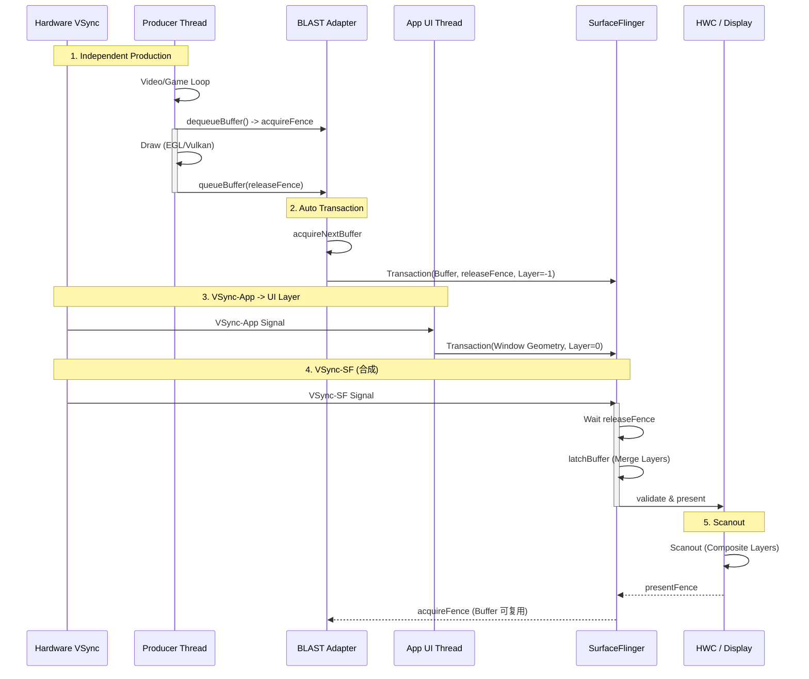
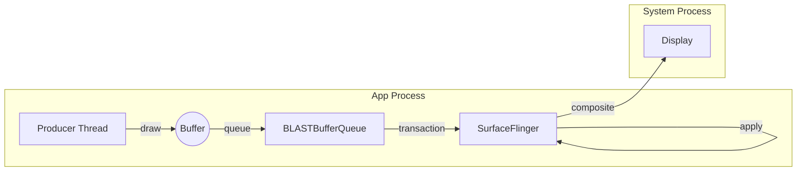

# SurfaceView Rendering Pipeline (Direct Producer via BLAST)

`SurfaceView` 是 Android 历史上最高效的视图组件。在 Android 10+ 之后，它底层已全面迁移到 **BLAST** 架构，主要为了解决 historically 的“同步问题”（Sync Issue）。

## 1. 生产者-消费者流程详解 (Deep Execution Flow)

SurfaceView 的核心在于“去耦”：它把绘图任务从 App 主线程剥离了出来。

### 第一阶段：Producer Thread (生产者)
这通常是视频解码线程 (MediaCodec) 或游戏逻辑线程：
1.  **dequeueBuffer**: 从 BufferQueue 拿一个空 Buffer。如果队列满了（Consumer 没来得及看），这里会阻塞。
2.  **Draw (绘制)**:
    *   **Canvas模式**: `lockCanvas()` -> 获得 Bitmap -> 涂鸦 -> `unlockCanvasAndPost()`。
    *   **GLES模式**: `eglMakeCurrent` -> `glDraw` -> `eglSwapBuffers`。
3.  **queueBuffer**: 绘制完成，把 Buffer 放回队列，并通知 Consumer。

### 第二阶段：Consumer (SurfaceFlinger)
注意，SurfaceView 的消费者**不是** App 进程，而是系统进程 SurfaceFlinger：
1.  **Acquire**: SF 收到 Buffer 可用的通知，拿走 Buffer。
2.  **Latch & Composite**: SF 在下一个 Vsync 到达时，把这个 Buffer 和 App 的主窗口（上面挖了个洞）叠在一起。
    *   *优势*: 这一步完全不经过 App 主线程，所以即使 App 主线程卡死（ANR），SurfaceView 里的视频依然能流畅播放。

---

## 2. 核心机制：挖洞 (Punch Through) & BLAST

SurfaceView 在 WMS 侧是一个独立的图层 (Layer)。
*   App 的主窗口 (DecorView) 在 SurfaceView 所在的坐标区域绘制透明像素（`#00000000`）。
*   SurfaceView 的 Surface 被放置在主窗口 Surface 的 **下方** (Z-Order -1)。
*   **BLAST 的改进**: App 的 UI 变化（比如 SurfaceView 的尺寸改变、位置移动）和 SurfaceView 本身的内容更新，可以通过同一个 Transaction ID 进行同步提交，即使它们在不同的线程。

### Z-Order 示意图

```mermaid
graph TD
    Display[Display Screen]
    Win[App Window (Z=0, Hole)]
    SV[SurfaceView Layer (Z=-1)]
    
    Display --> Win
    Display --> SV
    style Win fill:#00000000,stroke:#333,stroke-width:2px,stroke-dasharray: 5 5
    style SV fill:#f9f,stroke:#333,stroke-width:4px
```

---

## 2. 详细渲染时序图 (BLAST Sync)

这个图展示了 BLAST 如何让独立的 Producer 和 App 的 UI 变化保持同步。



1.  **queueBuffer**: 这里的 `queueBuffer` 不再直接唤醒 SurfaceFlinger，而是唤醒本地的 `BLASTBufferQueue` 适配器。
2.  **Transaction**: 所有的 buffer 提交最终都变成了一个 `SurfaceControl.Transaction`。
3.  **Sync**: 如果使用了 `SurfaceView.setFrameTimeline()` 等高级 API，App 甚至可以强制要求“这一帧视频”必须和“这一帧 UI 滚动”一起出现，从而消除黑边。

### 阶段二：Consumer (SurfaceFlinger)
注意：这里 **完全不经过** App 的 UI Thread 或 RenderThread。

4.  **onMessageReceived**: SF 收到 Buffer 产生的信号。
5.  **acquireBuffer**: SF 锁定该 Buffer。
6.  **Composition**: SF 将 Main Surface (有洞) 和 SV Surface (内容) 叠加。

---

## 3. Buffer 流转示意图



## 4. 优缺点与 Trace 特征

*   **优点**:
    *   **完美同步 (vs Legacy)**: 彻底解决了 SurfaceView 跟手性差、缩放闪烁的问题。
    *   **低功耗**: 保持了 Direct Composition 的优势。
*   **Trace 特征**:
    *   你会看到 `BLASTBufferQueue` 相关的 trace tag 频繁出现。
    *   SurfaceFlinger 的 `setTransactionState` 会非常繁忙。
    *   如果开启了 Sync，能在 trace 中看到 `TransactionReady` 等待信号。
