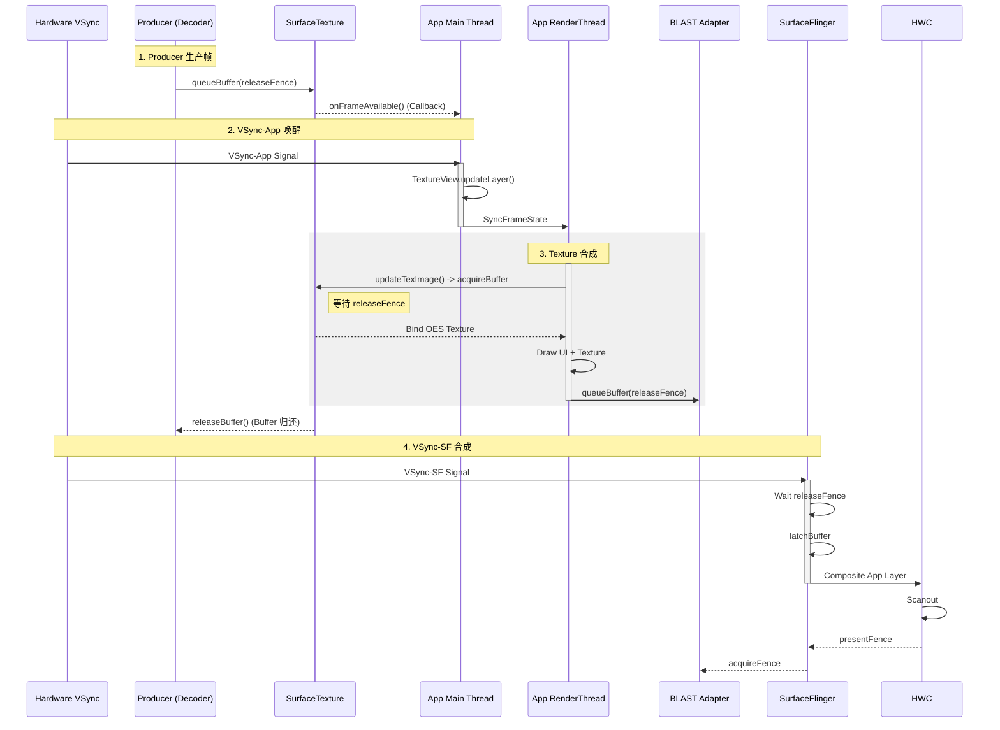
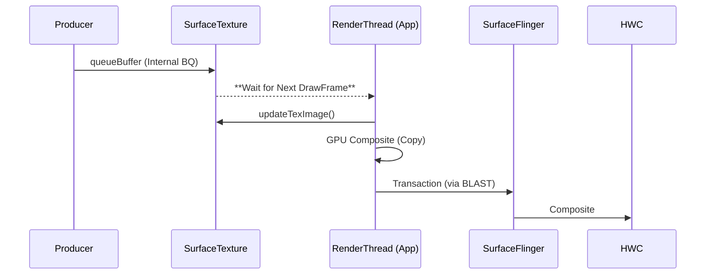

# TextureView Rendering Pipeline (App-side Composition)

`TextureView` 是 Android 4.0 引入的，尽管随着 `SurfaceView` 重回舞台（得益于 BLAST 同步），TextureView 的使用频率有所下降，但它仍是某些特效场景的唯一选择。

## 1. 纹理合成流程详解 (Deep Execution Flow)

TextureView 是一个“伪装者”，它表面上是 View，背后却走了一套复杂的“转手”流程。

### 第一阶段：Producer (生产者)
和 SurfaceView 一样，这里也有一个独立的线程在画图（视频/相机）：
1.  **Produce**: 解码器生成一帧图像。
2.  **queueBuffer**: 提交给 `SurfaceTexture` (这是 TextureView 的私有队列)。
3.  **Callback**: 触发 `onFrameAvailable` 回调，**通知 App 主线程**。

### 第二阶段：App Main Thread (中转站)
这是 TextureView 性能问题的根源 —— 它必须切回主线程：
1.  **Receive Callback**: 主线程收到“有新帧”的消息。
2.  **Invalidate**: 告诉 View 系统，“我（TextureView）脏了，下一帧重画我”。
3.  **Wait**: 等待 Choreographer 的 Vsync 信号。

### 第三阶段：RenderThread (最终上屏)
1.  **updateTexImage**: 在绘制 TextureView 时，RenderThread 会调用这个方法。
    *   它把 SurfaceTexture 里的最新 Buffer，**转录**成一个 OpenGL 纹理 (OES Texture)。
2.  **Draw**: 把它当做一张普通的贴图，画在 App 的主窗口上。
3.  **Composite**: 随 App 主窗口一起提交给 SurfaceFlinger。
    *   *代价*: 因为要在 App 渲染管线里走一遭，所以如果 App 主线程卡顿，视频也会跟着卡。

---

## 2. 核心机制：纹理合成 (Texture Upload)

TextureView 不再拥有独立的 Window/Layer。
*   它提供一个 `SurfaceTexture` 给 Producer。
*   Producer 生产的图像，被转化为 OpenGL 的 **OES 纹理**。
*   App 的 `RenderThread` 在绘制 View 树时，将被动地把这个纹理“画”在自己的 Buffer 上。

## 2. 详细渲染时序图

这条链路涉及 **跨线程同步**。注意：最终提交 App 窗口时，App 会使用 BLAST Transaction 提交。

1.  **Producer (e.g. Decoder)**:
    *   `queueBuffer` 到 SurfaceTexture。
    *   触发 `onFrameAvailable` 回调。
2.  **Main Thread (App)**:
    *   收到回调，执行 `Runnable`。
    *   调用 `invalidate()` 请求重绘。
3.  **Vsync-App**:
    *   RenderThread 开始 `DrawFrame`。
    *   **关键步骤**: 调用 `SurfaceTexture.updateTexImage()`。
        *   这会从 `BufferQueue` 中 `acquire` 最新的一帧。
        *   将 Buffer 绑定到 GLES 上下文。
4.  **GPU Draw**:
    *   RenderThread 使用 Shader 采样该 OES 纹理。
    *   合成到 App 的主 Framebuffer 中。
5.  **Release**:
    *   RenderThread 释放旧的 Buffer (`releaseBuffer`) 回给 Producer。

---

## 3. Buffer 流转示意图

## 4. 总结
*   **灵活性**: 极高，可以当做普通 View 处理。
*   **性能**: 较差。
    *   多一次 GPU Copy。
    *   受主线程卡顿影响。
    *   内存占用更高（App Buffer + Texture Buffer）。
