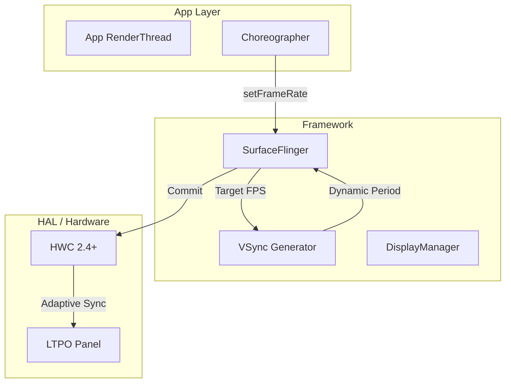
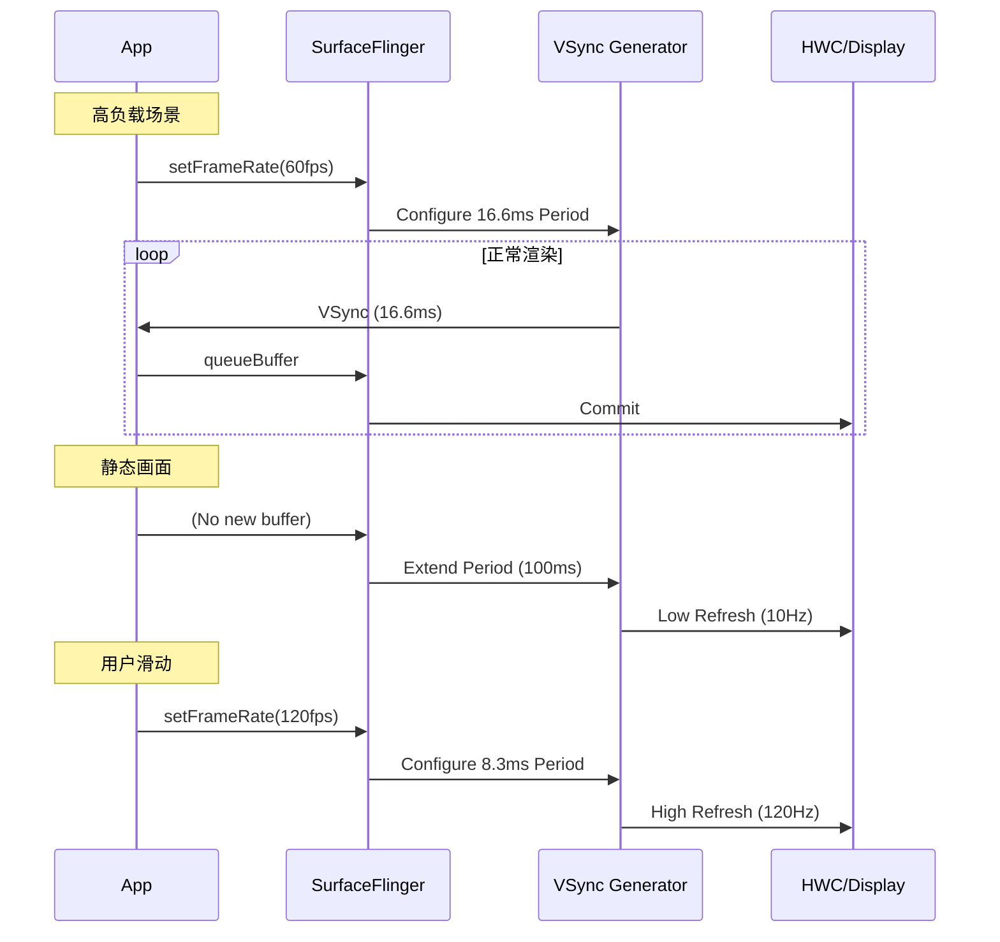

# Variable Refresh Rate (VRR) Pipeline

> [!NOTE]
> **Android 16 Enhanced ARR**: Android 16 引入了增强的 Adaptive Refresh Rate (ARR) API，简化了开发者控制帧率的方式，并提供更好的功耗优化。

**可变刷新率 (VRR)** 是 Android 11+ 引入的显示技术，允许屏幕刷新率动态变化 (如 1Hz ~ 120Hz)，对渲染管线和性能分析带来根本性影响。

## 1. 核心概念

### 1.1 传统固定刷新率 vs VRR

| 特性 | 固定刷新率 | VRR |
|:---|:---|:---|
| **VSync 周期** | 固定 (如 16.6ms @ 60Hz) | **动态** (1ms ~ 100ms) |
| **掉帧表现** | 跳到下一个 VSync (明显卡顿) | 延长当前帧 (平滑过渡) |
| **功耗** | 静态时仍 60Hz 刷新 | 静态时可降至 1Hz |
| **复杂度** | 简单 | App/SF/Display 三方协调 |

### 1.2 VRR 技术标准

*   **LTPO (Low-Temperature Polycrystalline Oxide)**: 三星/LG 的底层显示技术
*   **Adaptive Sync**: VESA 标准 (类似 PC 上的 G-Sync/FreeSync)
*   **Android VRR API**: Framework 层抽象

## 2. 系统架构



## 3. App 端 API

### 3.1 标准 API (Android 11+)

```java
// 请求 120fps (游戏场景)
surface.setFrameRate(120f, Surface.FRAME_RATE_COMPATIBILITY_DEFAULT);

// 请求精确帧率 (视频播放 24fps)
surface.setFrameRate(24f, Surface.FRAME_RATE_COMPATIBILITY_FIXED_SOURCE);

// 让系统决定 (省电)
surface.setFrameRate(0f, Surface.FRAME_RATE_COMPATIBILITY_DEFAULT);
```

### 3.2 Enhanced ARR API (Android 16+)

Android 16 引入了更简化的 API，让开发者只需声明**意图**，系统自动选择最佳帧率：

```java
// Android 16+ Enhanced ARR
// 声明场景类型，系统自动优化
surface.setFrameRateCategory(Surface.FRAME_RATE_CATEGORY_HIGH_HINT);  // 游戏/动画
surface.setFrameRateCategory(Surface.FRAME_RATE_CATEGORY_NORMAL);     // 普通滚动
surface.setFrameRateCategory(Surface.FRAME_RATE_CATEGORY_LOW);        // 静态/省电

// 投票机制：多个 Surface 投票，系统综合决策
window.setFrameRateVote(120, Window.FRAME_RATE_VOTE_TYPE_PREFERRED);
```

### 3.3 SurfaceControl API

```c
// NDK 层设置帧率
ASurfaceTransaction_setFrameRate(
    transaction, 
    surfaceControl,
    90.0f,  // 目标帧率
    ANATIVEWINDOW_FRAME_RATE_COMPATIBILITY_DEFAULT
);
```

## 4. VSync 调度变化

### 4.1 传统固定 VSync

```
VSync:  |----16.6ms----|----16.6ms----|----16.6ms----|
Frame:  |    F1       |    F2       |    F3       |
```

### 4.2 VRR 动态 VSync

```
VSync:  |--8.3ms--|--8.3ms--|------33ms------|--8.3ms--|
Frame:  |   F1   |   F2   |    F3 (慢)      |   F4   |
        ^120Hz   ^120Hz   ^30Hz (自动降频)  ^120Hz
```

## 5. 渲染时序图

展示 VRR 下 SurfaceFlinger 的动态调度。



## 6. 性能分析

### 6.1 Perfetto 关键 Track

| Track | 含义 |
|:---|:---|
| **VSYNC** | 显示实际 VSync 周期变化 |
| **HW_VSYNC** | 硬件 VSync 信号 |
| **FrameTimeline** | 每帧的预期/实际着陆时间 |
| **SurfaceFlinger** | `setFrameRate` 请求处理 |

### 6.2 VRR 下的"假掉帧"

在 VRR 模式下，传统的"超过 16.6ms = 掉帧"判断**不再适用**：

```sql
-- 错误的掉帧检测 (固定帧率思维)
SELECT * FROM slice 
WHERE name = 'DrawFrame' AND dur > 16666666;  -- ❌

-- 正确的掉帧检测 (VRR 感知)
SELECT * FROM slice s
JOIN frame_timeline ft ON s.frame_id = ft.id
WHERE ft.actual_present_time > ft.expected_present_time + 2000000;  -- ✅
```

## 7. 常见问题

### 7.1 帧率抖动

**现象**: 帧率在 60/90/120 之间频繁跳动  
**原因**: App 未明确请求帧率，系统自动判断  
**解决**: 使用 `setFrameRate()` 或 Android 16 的 `setFrameRateCategory()` 明确声明

### 7.2 功耗异常

**现象**: VRR 设备功耗反而更高  
**原因**: App 持续请求高帧率，即使静态画面  
**解决**: 静态场景显式请求低帧率或使用 `FRAME_RATE_CATEGORY_LOW`

### 7.3 视频播放抖动

**现象**: 24fps 视频在 120Hz 屏幕抖动  
**原因**: 未使用 `FRAME_RATE_COMPATIBILITY_FIXED_SOURCE`  
**解决**: 视频场景使用固定源帧率模式

## 8. 兼容性

| Android 版本 | VRR 支持 |
|:---|:---|
| **Android 16** (API 36) | **Enhanced ARR** + 投票机制 + 更智能功耗策略 |
| **Android 15** (API 35) | 改进 ARR API，更低延迟切换 |
| Android 14 (API 34) | 1Hz LTPO 完整支持 |
| Android 13 (API 33) | 改进省电策略 |
| Android 12 (API 31) | FrameTimeline 深度整合 |
| Android 11 (API 30) | 基础 VRR API |

## 9. 开发者建议

1.  **明确帧率意图**: 不要依赖系统猜测，主动调用 `setFrameRate()` 或 `setFrameRateCategory()`
2.  **静态检测**: 检测无动画时主动降频
3.  **视频锁帧**: 视频播放使用 `FIXED_SOURCE` 模式
4.  **测试覆盖**: 在 60Hz/90Hz/120Hz 设备上分别测试
5.  **升级到 Android 16 API**: 使用 Enhanced ARR 减少代码复杂度


