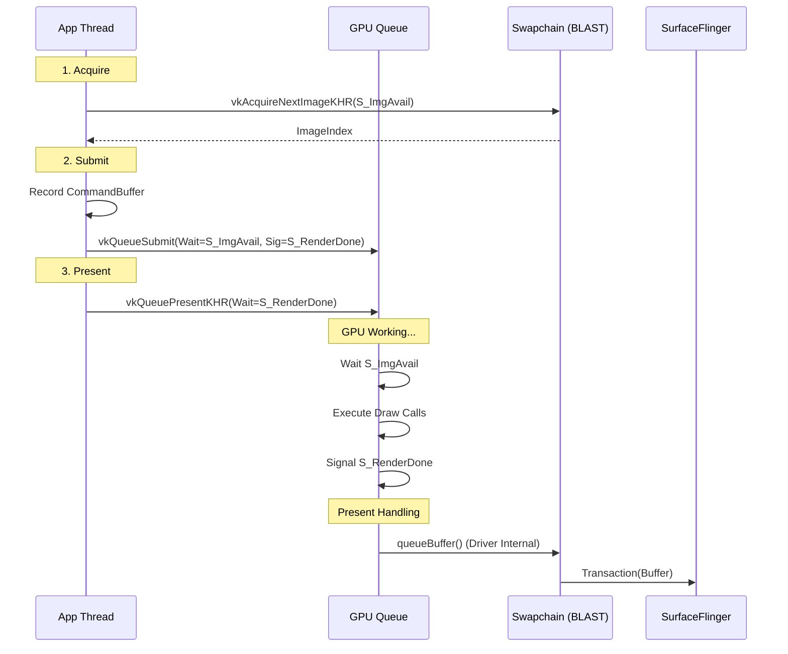
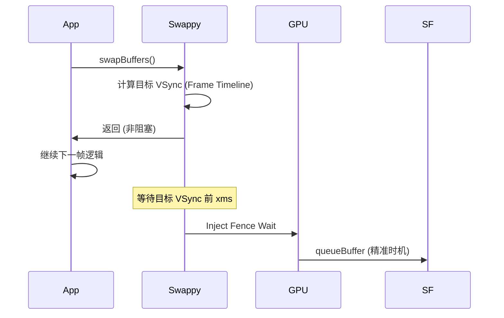

# Vulkan Native Rendering Pipeline

> [!NOTE]
> **Android 15+ 推荐路径**: Vulkan 已成为 Android 15+ 的默认图形 API。新设备将强制通过 **ANGLE** 处理 GLES 调用，并统一支持 **Vulkan Profiles for Android (VPA)**。

随着 Android 10+ 对 Vulkan 的支持日益成熟，越来越多的高性能应用（游戏、模拟器、UI 框架如 Impeller）开始直接使用 Vulkan API 进行渲染，绕过传统的 GLES 状态机。

## 0. Vulkan Profiles for Android (VPA) — Android 15+

**VPA** 是 Google 为解决 Vulkan 碎片化问题引入的标准化方案。

### 0.1 问题背景

| 问题 | 传统 Vulkan | VPA 解决方案 |
|:---|:---|:---|
| **特性碎片化** | 每个设备支持不同的 Extension | 定义标准 Profile (如 `VPA_android_baseline_2022`) |
| **能力查询成本** | 运行时逐一查询 | 声明式 Profile 匹配 |
| **开发复杂度** | 需要大量 fallback 代码 | 保证 Profile 内特性全支持 |

### 0.2 标准 Profile 层级

```
VPA_android_baseline_2021  ← 基础层
       ↓
VPA_android_baseline_2022  ← 推荐层 (Android 14+)
       ↓
VPA_android_baseline_2024  ← 最新层 (Android 16+)
```

### 0.3 使用方式

```c
// 检查设备是否支持目标 Profile
VpProfileProperties profileProps = { VPA_ANDROID_BASELINE_2022, 1 };
VkBool32 supported;
vpGetPhysicalDeviceProfileSupport(instance, physicalDevice, &profileProps, &supported);

if (supported) {
    // 可以安全使用 Profile 内所有特性
    vpCreateDevice(physicalDevice, &createInfo, &profileProps, &device);
}
```

---

## 1. 核心架构：显式控制 (Explicit Control)

Vulkan 的最大特征是**一切皆显式**。从内存分配到同步原语 (Fence/Semaphore)，都需要 App 自己管理。

### 关键组件

1.  **VkInstance / VkDevice**: Vulkan 上下文。
2.  **VkSurfaceKHR**: 对应 Android 的 `Surface` (ANativeWindow)。
3.  **VkSwapchainKHR**: 交换链，管理一组 Image (Back Buffers)。
4.  **VkQueue**: 提交命令的队列 (Graphics/Present)。

---

## 2. 渲染流程详解 (Deep Execution Flow)

### 第一阶段：Acquire (获取)
1.  **vkAcquireNextImageKHR**:
    *   App 向 Swapchain 请求一个可用的 Image Index。
    *   *同步*: 需要提供一个 `VkSemaphore` (ImageAvailable)，当 Image 真正可用时，这个信号量会被 Signal。
    *   *Trace*: 这一步通常非阻塞，但在双缓冲占满时会阻塞。

### 第二阶段：Record & Submit (录制与提交)
1.  **Command Buffer Recording**:
    *   `vkCmdBeginRenderPass` -> `vkCmdDraw` -> `vkCmdEndRenderPass`。
    *   这一步可以在任意线程并行进行（这是 Vulkan 重大优势）。
2.  **vkQueueSubmit**:
    *   将 Command Buffer 提交给 GPU 队列。
    *   *Wait*: 等待 `ImageAvailable` 信号量（确保 Image 已经准备好写了）。
    *   *Signal*: 渲染完成后 Signal 另一个 `VkSemaphore` (RenderFinished)。

### 第三阶段：Present (展示/BLAST)
这是与 Android 系统交互的边界：

1.  **vkQueuePresentKHR**:
    *   请求将渲染好的 Image 展示到屏幕。
    *   *Wait*: 等待 `RenderFinished` 信号量（确保 GPU 画完了）。
2.  **Android Integration (BLAST)**:
    *   在 Android 10+，Vulkan Driver 底层会将这个 Present 操作转换为 `queueBuffer`。
    *   BLAST Adapter 捕获 Buffer，封装为 Transaction 提交给 SF。

---

## 3. 渲染时序图

注意信号量 (Semaphore) 在 GPU 内部的同步作用，CPU 仅负责提交指令。



## 4. 性能特征

1.  **Cpu Overhead**: 极低。由于 Command Buffer 可以复用，且 Driver 开销小，CPU 占用远低于 GLES。
2.  **Pipeline Barriers**: 开发者必须精确控制 Image Layout Transition (e.g., `COLOR_ATTACHMENT_OPTIMAL` -> `PRESENT_SRC_KHR`)，否则会导致显存读写竞争或画面撕裂花屏。
3.  **Frame Pacing**: 结合 Swappy 库，Vulkan 可以实现微秒级的帧这一预测。

## 5. 调试工具

*   **RenderDoc**: 抓帧神器，查看具体 DrawCall 和资源。
*   **Gapid**: Google 官方图形调试工具。
*   **Validation Layers**: 开发阶段必须开启，Vulkan 出错通常直接 Crash 或黑屏，Layer 是唯一的报错来源。

## 6. Presentation Mode 详解 (帧率与延迟)

Vulkan Swapchain 支持多种 Presentation Mode，直接影响帧率稳定性和输入延迟。

| Mode | 行为 | 延迟 | 撕裂 | 适用场景 |
|:---|:---|:---|:---|:---|
| **FIFO** | 严格 VSync，帧队列先进先出 | 较高 (1-2帧) | ❌ 无 | 电影播放、省电 |
| **FIFO_RELAXED** | VSync，但允许迟到帧跳过等待 | 中等 | ⚠️ 可能 | 游戏 (偶尔掉帧可接受) |
| **MAILBOX** | 新帧覆盖旧帧，立即上屏 | 最低 | ❌ 无 | 竞技游戏、输入敏感 |
| **IMMEDIATE** | 无 VSync，立即 Present | 极低 | ⚠️ 常见 | 基准测试 |

### 6.1 检测支持的 Mode
```c
uint32_t count;
vkGetPhysicalDeviceSurfacePresentModesKHR(physicalDevice, surface, &count, NULL);
VkPresentModeKHR* modes = malloc(count * sizeof(VkPresentModeKHR));
vkGetPhysicalDeviceSurfacePresentModesKHR(physicalDevice, surface, &count, modes);
```

### 6.2 Android 特性
*   **默认 FIFO**: Android 为了省电，默认强制 FIFO。
*   **MAILBOX 支持**: 需要 Android 10+ 且部分厂商 Driver 支持。
*   **VRR (可变刷新率)**: 需要搭配 Display 的 VRR 能力，详见 [VRR 管线](variable_refresh_rate.md)。

## 7. Swappy Frame Pacing 机制

[Android Game SDK - Swappy](https://developer.android.com/games/sdk/frame-pacing) 是 Google 官方的帧节奏库，解决了 Vulkan 在移动设备上的三大问题：

### 7.1 解决的问题

1.  **帧节奏不稳定**: 不同厂商的 Vsync 实现差异巨大。
2.  **Input-to-Display 延迟**: 原生 Vulkan 无法预测帧着陆时间。
3.  **高刷适配**: 90Hz/120Hz/144Hz 屏幕需要动态调整。

### 7.2 核心原理



### 7.3 关键 API
```c
// 初始化
SwappyVk_initAndGetRefreshCycleDuration(env, activity, physicalDevice, device, 
                                         swapchain, &refreshDuration);

// 替代原生 vkQueuePresentKHR
SwappyVk_queuePresent(queue, presentInfo);

// 设置目标帧率 (如 60fps)
SwappyVk_setSwapIntervalNS(device, swapchain, 16666666);
```

### 7.4 Trace 特征
在 Perfetto 中：
*   **Swappy**: 独立 Track，显示帧提交时间。
*   **FrameTimeline**: Android 12+ 的原生帧时间线支持。
