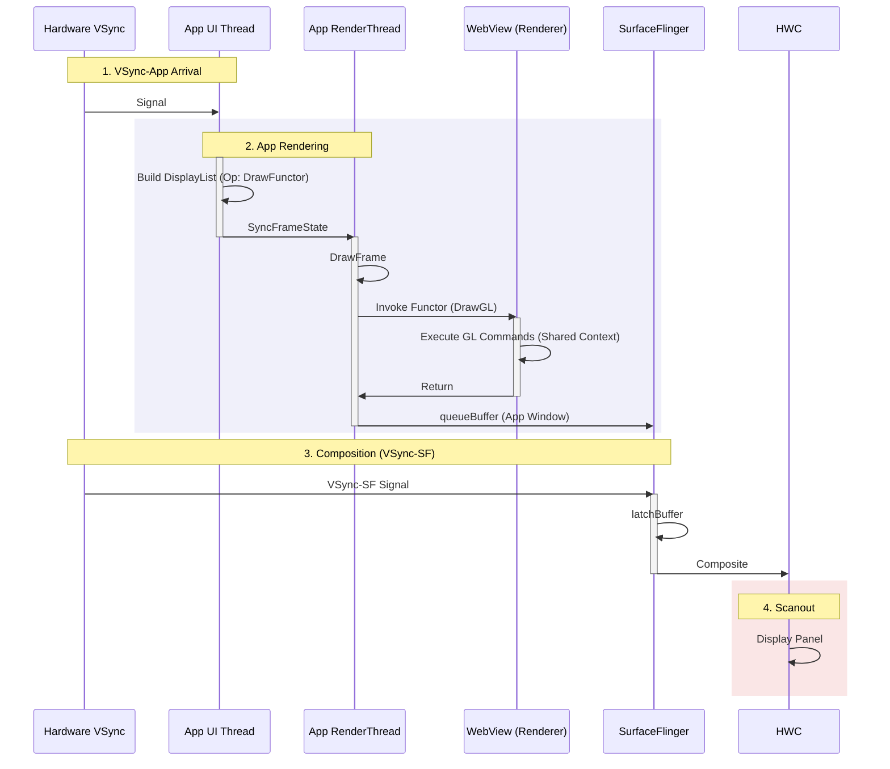

# WebView GL Functor Pipeline (Standard/Shared)

在普通的 App 页面中嵌入 WebView（如新闻详情页），默认使用的是 **GL Functor** 模式。

## 0. 初始化与桥接 (WebViewFactory)

在进入渲染流程前，理解 Android Framework 如何加载 WebView 内核至关重要。这解释了为什么 App process 里会有 Chromium 的代码。

### 核心工厂模式
Android 系统通过 `WebViewFactory` 类动态加载 WebView 实现（通常是 Google WebView 或 Chrome）。
1.  **WebViewFactory.getProvider()**:
    *   这是 Framework 的入口。
    *   它会 `dlopen` 系统 WebView 的 Native 库 (`libwebviewchromium.so`)。
    *   实例化 `WebViewChromiumFactoryProvider`。
2.  **AwContents**:
    *   这是 Chromium 侧与 Android `WebView` 类对应的一对一核心对象。
    *   所有的 `loadUrl`, `onDraw` 调用最终都会委托给 AwContents。
3.  **DrawGL Functor 注册**:
    *   在初始化时，AwContents 会通过 JNI 向 App 的 `RenderThread` 注册一个 Functor。
    *   这就是为什么 App 的 RenderThread 能够“认识”并回调 Chromium 的渲染代码。

---

## 1. 共享上下文流程详解 (Deep Execution Flow)

此模式的核心特点是：WebView **蹭车**。它没有独立的 Surface，而是把自己的绘制指令注入到 App 的 `RenderThread` 中执行。

### 第一阶段：Renderer Process (渲染器进程)
1.  **Parse/Style/Layout**: 解析 HTML/CSS，计算页面布局。
2.  **Paint**: 生成 DisplayItemList。
3.  **Commit**: 提交给 Compositor Thread。
4.  **Tiling/Raster**: 在渲染进程生成 DrawQuad 指令（注意，这里通常生成的是“元指令”，还不是最终像素）。
5.  **Invalidate**: 通过 IPC 通知 App 进程：“我准备好了，你重绘一下”。

### 第二阶段：App UI Thread (主线程)
1.  **onDraw**: View 树遍历到 WebView。
2.  **Record**: WebView 往 Canvas 里写一个特殊的 `DrawFunctorOp`。这是一个占位符，相当于告诉 RenderThread：“到这儿的时候，去调一下 WebView 的原生代码”。

### 第三阶段：App RenderThread (渲染线程)
1.  **Sync**: 获取 DrawFunctorOp。
2.  **Invoke Functor**: 执行到占位符时，调用 WebView 提供的 C++ 回调 (`DrawGL`)。
    *   **Context Switch**: 此时 OpenGL 上下文仍然是 App 的，但执行权交给了 Chromium 的代码。
3.  **Execute GL**: Chromium 用 App 的 EGLContext 执行它的 GL 指令（画网页内容）。
    *   *风险*: 如果网页太复杂，画得太慢，会直接拖慢 App 的 `DrawFrame` 总耗时，导致 App 掉帧。

---

## 2. 渲染时序图

注意 `Invoke Functor` 这一步，它是在 App 的渲染循环中同步执行的。



## 3. 线程角色详情 (Thread Roles)

| 线程名称 | 关键职责 | 常见 Trace 标签 |
|:---|:---|:---|
| **main** (App) | View 构建, WebView.onDraw 记录 DrawFunctor | `Choreographer#doFrame` |
| **RenderThread** (App) | GPU 渲染, **同步调用 WebView DrawGL** | `DrawFrame`, `DrawFunctor`, `invoke` |
| **CrRendererMain** | Blink 主线程, HTML/CSS 解析布局 | `ThreadControllerImpl::RunTask` |
| **Compositor** | CC 合成, 生成 DrawQuad | `Scheduler::BeginFrame` |
| **VizCompositorThread** | GPU 指令 (OOP-Raster 模式) | `Gpu::DrawQuads` |
| **SurfaceFlinger** | 合成最终画面 | `handleMessageRefresh` |

---

## 4. Hardware Draw Functor API (Android 10+)

从 Android Q 开始，Framework 引入了 **Hardware Draw Functor API**，作为传统 GL Functor 的演进版本。

### 3.1 与传统 GL Functor 的区别

| 特性 | Legacy GL Functor | Hardware Draw Functor |
|:---|:---|:---|
| **Fence 控制** | 隐式 | **显式** (App 可控制 acquireFence) |
| **同步模式** | 强制同步 | 支持异步 |
| **Vulkan 支持** | ❌ 仅 GLES | ✅ GLES + Vulkan |
| **线程安全** | 有限 | 完全线程安全 |

### 3.2 核心 API (Native)

```c
// 创建 Functor
typedef int (*AWDrawFn)(long functor, void* data, 
                         AWDrawFnCallbackInfo* callbackInfo);

// 注册回调
AHardwareBufferFunctorProvider_create(
    AWDrawFn drawFn,
    void* userData,
    int64_t* outFunctorId
);

// 提交给 RenderThread
AHardwareBufferFunctorProvider_apply(
    int64_t functorId,
    AHardwareBuffer* buffer,
    int acquireFenceFd  // 显式 Fence
);
```

### 3.3 性能优势

1.  **Fence Pipelining**: WebView 可以在 GPU 还没完成时就返回，RenderThread 不被阻塞。
2.  **Vulkan Path**: 现代浏览器内核 (Viz) 可以走 Vulkan 路径，Command Buffer 更高效。
3.  **Trace 可见性**: 在 Perfetto 中可以看到 `HardwareDrawFunctor` 独立 Slice，便于分析。

### 3.4 兼容性说明

*   **Android 10 (Q)**: 引入基础 API。
*   **Android 11 (R)**: 完善异步模式。
*   **Android 12 (S)**: 与 BLAST 深度整合。

