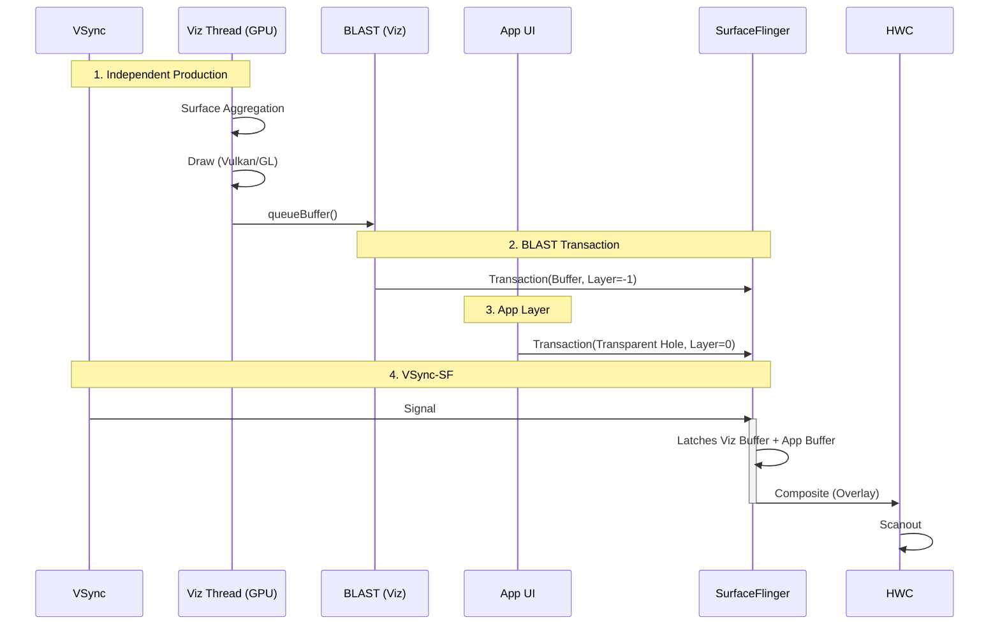

# WebView SurfaceControl Pipeline (Viz/OOP-R)

当系统启用了 `Vulkan` 后端，亦或是启用了 OOP-R (Out-of-Process Rasterization) 及其变体时，WebView 会切换到现代化的独立合成模式。

**注意**：此模式与 `SurfaceView` 包装模式不同，Buffer 并非由 App 进程生产，而是由 Chromium 的 GPU (Viz) 进程直接生产并提交给 SurfaceFlinger。

## 0. 初始化与模式切换

1.  **Factory Init**: 同样由 `WebViewChromiumFactoryProvider` 初始化。
2.  **Mode Switch (Vulkan/OOP-R)**:
    *   Chromium 内核决定开启独立合成。
    *   请求系统创建一个 `ASurfaceControl` (Child Layer)。
    *   这个 Layer 直接由 Viz 进程管理，App 进程通常只负责给它一个容器位置。
3.  **Hole Punching**:
    *   App 侧绘制背景色（透明）。
    *   Viz 进程直接填充像素。

---

## 1. 独立合成流程详解 (Deep Execution Flow)

此模式下，WebView 像 SurfaceView 一样工作，完全绕过 App 的 `RenderThread`。

### 第一阶段：Chromium GPU Process (Viz)
1.  **Receive Frame**: 接收来自 Renderer 进程的 CompositorFrame。
2.  **Surface Aggregation**: 聚合多个 Surface（如网页内容 + 视频图层）。
3.  **Draw**:
    *   在独立的 **Viz Thread** 中，使用 OpenGL 或 Vulkan 绘制合成结果。
    *   绘制目标是一个独立的 `GraphicBuffer`。

### 第二阶段：BLAST Submission (系统合成)
1.  **queueBuffer**: 绘制完成后，Buffer 被交给本地的 `BLASTBufferQueue` 适配器。
2.  **Transaction**: 封装为 SurfaceControl Transaction。
3.  **SurfaceFlinger**:
    *   SF 收到这个 Transaction，将其直接合成到屏幕上。
    *   App 的 Window 上对应位置通常是一个透明洞（Hole Punching）。

### 性能优势
*   **隔离性**: 网页就算卡死，也只是那个洞里卡，App 的按钮、滑动条依然流畅。
*   **视频性能**: 视频帧可以直接通过 Overlay (HWC) 播放，不需要经过 GPU 纹理采样，省电。

---

## 2. 渲染时序图

注意 App RenderThread 在此模式下的空闲状态。

