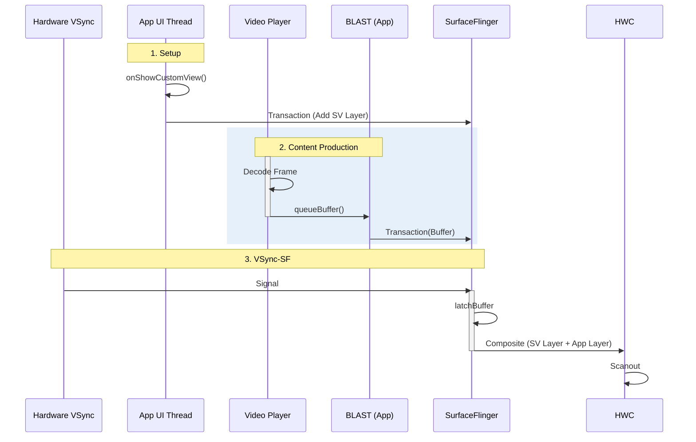

# WebView SurfaceView Wrapper Pipeline (App-Side / Video)

这是开发者最容易理解的 "SurfaceView" 模式。它主要出现在全屏视频播放场景，或者某些通过 `SurfaceView` 托管 WebView 内容的特殊实现中。

## 1. 核心流程：App 托管 (App Hosting)

与 `SurfaceControl` 模式不同，这里的 Buffer 生产和提交仍然由 **App 进程**（或其加载的媒体组件）控制。

### 第一阶段：WebChromeClient 回调
1.  **Trigger**: 用户点击网页上的全屏按钮。
2.  **onShowCustomView(View view, CustomViewCallback callback)**:
    *   WebView 回调 App 开发者实现的方法。
    *   参数 `view` 通常就是一个 `SurfaceView` 或包含 SurfaceView 的 `FrameLayout`。
    *   **关键点**: 这个 View 是在 App 进程中创建的。

### 第二阶段：Media Player Rendering
1.  **Set Surface**: 底层的 MediaPlayer (或 ExoPlayer) 获取这个 SurfaceView 的 `SurfaceHolder`。
2.  **Decode & Render**: 视频解码器直接向这个 Surface 生产 Buffer。
3.  **App Submission**:
    *   App 进程负责将这个 Surface 提交给 SurfaceFlinger。
    *   App 负责处理它的 Z-Order（通常覆盖在 WebView 之上）。

---

## 2. 渲染时序图

注意 Buffer 的生产者是 App 进程中的 Video Player，而不是 WebView 的渲染进程。

## 3. 总结
*   **Producer**: App Process (MediaPlayer/ExoPlayer)。
*   **Role**: WebView 只是充当了一个“信令通道”，告诉 App 何时把 SurfaceView 显示出来。
*   **Performance**: 等同于原生 SurfaceView 播放视频，性能极高。
