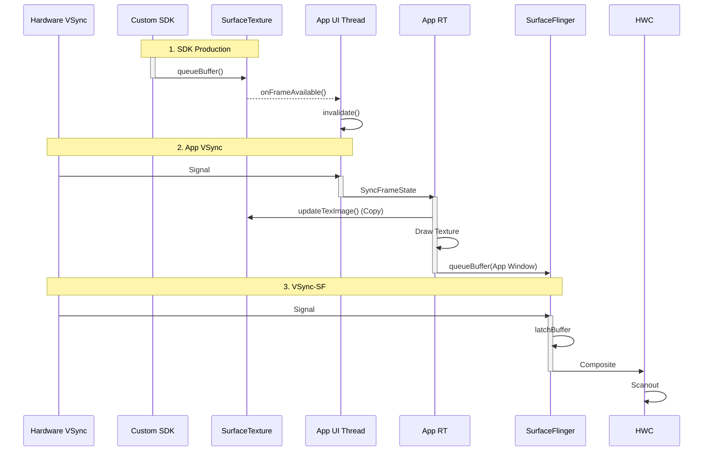

# WebView Custom TextureView Pipeline (Domestic/SDK)

这是一个在**国内互联网 App** 中非常常见的模式，常见于腾讯 X5 内核、UC 内核或某些应用深度定制的 Chromium 引擎。

## 0. 背景与差异

Android 原生 `WebView` 对 `TextureView` 的支持一直非常有限（且性能较差）。但国内的第三方 WebView SDK 为了解决以下问题，通常会自己实现一套渲染管线：
1.  **复杂层级嵌入**: 比如在 ListView/RecyclerView 中嵌入 WebView。
2.  **动画变换**: 需要对 WebView 做旋转、透明度、圆角等 View 动画。
3.  **视频层级修复**: 解决原生 WebView 在某些系统上视频全屏时的 Z-Order 问题。

## 1. 混合渲染流程详解 (Deep Execution Flow)

这个模式的架构几乎与 **[Flutter TextureView 模式](flutter_textureview.md)** 一模一样。

### 第一阶段：SDK Kernel (Producer)
1.  **Rasterize**: 定制的 Chromium 内核将网页内容光栅化。
2.  **SurfaceTexture**: 它不直接提交给 SF，而是渲染到一个由 App 提供的 `SurfaceTexture` 上。
3.  **Queue**: 调用 `queueBuffer`。

### 第二阶段：App Main Thread (Bridge)
1.  **Callback**: 触发 `onFrameAvailable`。
2.  **Invalidate**: 通知 App 的 View System 重绘。
    *   *性能瓶颈*: 这一步必须要切回主线程，可能会阻塞 UI。

### 第三阶段：App RenderThread (Consumer)
1.  **updateTexImage**: App 的渲染线程在绘制 `TextureView` 节点时，从 `SurfaceTexture` 中拉取最新的网页帧。
2.  **Draw as Texture**: 将网页帧作为一个普通的纹理绘制在 App 的 DisplayList 中。
3.  **Composite**: 最终随 App 的主窗口一起提交给 BLAST。

---

## 2. 渲染时序图

注意它与标准 GL Functor 模式的区别：GL Functor 是“代码注入”，而这个是“纹理搬运”。

## 3. 优缺点分析
*   **优点**: 兼容性极好，可以像普通 View 一样随意控制（加滤镜、做动画）。
*   **缺点**: 性能开销大（多一次 Copy，主线程回调），内存占用高（GraphicBuffer 不易回收）。
